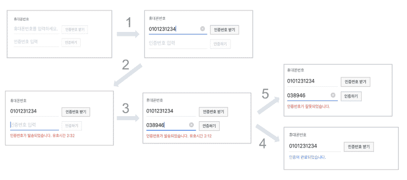

# 利用反应式编程的电话号码认证

> 原文：<https://www.freecodecamp.org/news/phone-number-authentication-with-reactive-programming-6e89a2a651d2/>

作者:崔镇宇

# 利用反应式编程的电话号码认证


### 电话号码认证

许多移动应用程序需要会员资格。大多数都提供用户认证。这是因为在防止重复订阅或更改密码时，您需要检查使用的用户是否与订阅者相同。

大多数移动应用程序使用电话号码来认证用户，因为它们运行在移动电话上。电话号码认证由几个步骤组成，这意味着需要状态管理。您还必须相应地更改用户界面。这也需要异步事件处理，例如请求验证码并将用户输入的代码传递给服务器。

因此，电话号码认证可以成为撰写开发技能的一个非常好的主题。在本文中，我将首先以通常的方式实现电话号码认证。然后我会介绍反应式编程。

### 电话号码认证 UI 流程



在身份验证过程中，您必须更改每个步骤的用户界面。例如，相关按钮应该根据输入值的存在而被激活。并且应该根据认证步骤显示或隐藏 UI 组件。此外，提示应该显示，以适应情况。本文重点介绍以下三种情况。

*   输入电话号码时，激活[请求验证码]按钮(步骤 1)
*   当认证成功时，隐藏[验证码]文本框和[认证]按钮(步骤 4)
*   认证完成或失败时显示相关消息(提示)(步骤 5)

### 基本结构

首先，我们将为每个身份验证步骤定义一个具有五种状态的 Enum，如下所示。我们将它声明为 Swift 类的属性，并且它有一个 didSet 观察器。我们将根据这里的身份验证步骤添加更改 UI 的代码。

```
enum PhoneNumberVerifyStep {    case inputPhoneNumber, inputVerifyNumber, verifying, succeed, failed}
```

UI 组件包括两个文本字段、两个按钮和一个标签，如下所示。都是通过 InterfaceBuilder 创建的，连接到 IBOutlet。如前所述，我们声明了一个类属性来存储名为 verifyStep 的身份验证步骤，并添加了一个 didSet 观察器来处理 UI 更改。

### 基于身份验证步骤更改用户界面

这是真正改变用户界面的部分。根据 **verifyStep** 的更改值设置【验证码】文本框和【验证】按钮的 isHidden 属性，并更改【提示】标签的文本。

从[Authentication]按钮的 action 方法调用 Restful API 后，根据响应为 **verifyStep** 设置适当的值。**因为我们使用了 didSet observer 来改变 UI，所以将 UI 代码和数据处理代码分开是有好处的。**

[请求验证码]按钮是否激活取决于[电话号码]文本框的实时输入值，而不是验证步骤。因此，我们给 **phoneNumberTextField** 添加一个动作处理程序，根据输入值设置**requestverifynumbutton**的 **isEnabled** 。

这样，我们已经按照通常的方式根据电话号码认证步骤实现了 UI 更改。现在，在查看了旧方法的一些缺点之后，我将修改这个示例，并以被动的方式来完成它，这就是本文的主题。

首先，**verify step 中的 didSet observer 内部实现可能过大**。并且在 Switch 语句中，设置一个视图的代码可以跨多种情况存在。需要修改许多零件来删除特定视图或添加新视图。最重要的是，如果代码变得更长，就很难阅读。

根据 TextField 的输入值改变按钮的 enable 属性可能会不方便:**如果需要类似处理的 TextField 和 Button 的数量增加，就要不断添加文本输入事件处理程序**。如果需要向文本字段中的输入值添加实时验证逻辑，事件处理程序的内部可能会很复杂。

现在，让我们通过应用反应式编程来改进这些缺点。这里我们用的是开源库 [**ReactiveCocoa**](https://github.com/ReactiveCocoa/ReactiveCocoa) 。

### 反应式编程

反应式编程是使用以时序方式响应数据流的函数来构造程序的过程。这个基本概念并不新，考虑下面的用例。比如按钮的 click 事件，基本就是观察异步事件，通过回调订阅。此外，Cocoa 已经提供了许多工具来实现数据和 UI 事件的观察者模式。

> [**反应式编程是用异步数据流编程。**](https://gist.github.com/staltz/868e7e9bc2a7b8c1f754#reactive-programming-is-programming-with-asynchronous-data-streams)

> 在某种程度上，这不是什么新鲜事。事件总线或您的典型点击事件实际上是一个异步事件流，您可以在其上观察和做一些副作用。反应是类固醇的概念。你可以创建任何东西的数据流，不仅仅是点击和悬停事件

然而，反应式编程不仅仅是使用上面提到的工具，而是将观察者模式作为编程的核心。

它将 UI 处理的所有类型的原始数据流——控制动作、通知、委托和 KVO(Cocoa 提供的基本工具)抽象为一个流。它还提供了处理和过滤流经它的数据的功能，可以很容易地用于各种领域。

换句话说，与传统方法相比，反应式编程是一种更集成、更容易处理由于状态变化引起的链式反应处理(以及基于链式反应的编程)的方法。

基本上，其面向函数的编码旨在执行连接到流的函数中的单个角色。这避免了复杂的有状态程序，如前一个示例的 verifyStep didSet observer，并使异步处理的错误处理和并发控制变得容易。更多信息见[react vex . io](http://reactivex.io/)。

### 实施反应式编程

好了，是时候停止解释冗长无聊的理论了。从现在开始，让我们使用开源库 ReactiveCocoa 来改进电话号码认证示例。

首先我们根据上例的认证步骤去掉了改变 UI 的代码，只留下了 ViewController 的基本骨架。我们还删除了 verifyStep 的 didSet 观察器、TextField 的编辑操作处理程序和[Authenticate]按钮的操作方法。

基于框架使用 ReactiveCocoa 实现以下代码。因为代码不长，所以附上了全部代码。我们先来看看 ReactiveSwift 的**属性**，再来看看通过将认证步骤过程分为三种类型的实现，如前面的例子所示。

### 反应 Swift 的(可变)性质

Property 是 ReactiveSwift 提供的类，是 ReactiveCocoa 的基础。它提供了将数据作为流来处理的能力。例如，在示例代码中， **verifyStep** 是 PhoneNumberVerifyStep 类型数据的持有者。它可以在更改值时生成信号，或者更改值以响应其他数据更改。

```
var verifyStep = MutableProperty<PhoneNumberVerifyStep(...)
```

也就是说，当属性(verifyStep)的值改变时，UI 可以改变。或者当 TextField 的输入值改变时，变量(verifyStep)的值可以随之改变。**Swift 类属性的 didSet 观察器提供了类似的功能。**然而，MutableProperty 的优点是能够**改变或过滤通过流**传递的值，如上所述，和**更简洁地与 UI 改变代码连接。**

### UI 绑定和 ReactiveCocoa 的< ~运算符

ReactiveCocoa 提供绑定来轻松处理由于属性更改而导致的 UI 更改。UI 组件可以为它的每个可配置属性创建一个 BindingTarget。这是一种命令模式。

例如，ReactiveCocoa 提供了 BindingTarget，这是更改 UILabel 文本的命令。当从流中生成信号时，将执行 BindingTarget，并将接收到的值设置为 UILabel 的文本。

提供< ~运算符是为了更容易地将信号连接到 BindingTarget。例如，下面的代码设置从信号(当 textField 的值改变时生成)传递到标签文本的值(输入值)。

```
label.reactive.text <~ textField.reactive.continuousTextValues
```

**label.reactive.text** 返回一个改变文本的 **BindingTarget** 实例，**textfield . reactive . continuous text values**返回一个在输入值改变时引发事件的**信号**实例。 **BindingTarget** 实例和**信号**实例通过**l**t 绑定；~，所以当 textField 的输入值改变时，标签的文本也随之改变。

ReactiveCocoa 的 UI 绑定也是一个重要的概念，在实现 MVVM 设计中起着关键作用。这是因为通过将视图模型的属性与视图中的 UI 组件绑定，可以将数据处理代码与 UI 处理代码分开。

### 反应链式反应

现在回到示例代码，看看属性和 UI 绑定是如何使用的。让我们从输入电话号码时激活[请求验证码]按钮的过程开始。按钮的 BindingTarget 订阅由上述 TextField 的 continuousTextValues 生成的输入值更改信号。

```
requestVerifyNumberButton.reactive.isEnabled &lt;~     phoneNumberTextField.reactive.continuousTextValues    .map { !($0?.isEmpty ?? true) }
```

requestVerifyNumberButton 的 isEnabled BindingTarget 被绑定到 phoneNumberTextField 的输入值更改信号，在该过程中使用了< ~运算符。

按钮的 isEnabled 属性是一个 Bool 类型属性。TextField 的输入值是字符串类型，因此不能直接赋值。

因此，当传递字符串值时，它会通过 Signal 的 map 方法转换为 Bool 类型。很明显，**流数据，**是反应式编程**的一个关键优势，易于处理，可以用简洁明了的方式表达。**

让我们看看按钮、文本字段和标签的状态变化，这取决于 verifyStep 的值，它占据了示例的大部分。

```
var verifyStep = MutableProperty<PhoneNumberVerifyStep>(...)
```

首先，verifyStep 被声明为一个可变属性。verifyStep 现在可以作为数据流，UI 组件可以订阅来自它的值更改信号。value 属性返回 verifyStep 的原始值。

下面是绑定到 verifyStep 信号的 UI 组件。类似地，< ~操作符将改变 UI 组件的 isHidden 和 text 属性的 BindingTarget 与来自 verifyStep 的信号连接起来。也就是说，如果 verifyStep 的值发生更改，则 isHidden 和 text 等 UI 属性也会相应地发生更改。

```
verifyNumberTextField.reactive.isHidden <~ verifyStep    .map { $0 == .succeed }
```

```
verifyButton.reactive.isHidden <~ verifyStep.map { $0 == .succeed }
```

```
statusLabel.reactive.isHidden <~ verifyStep.map { !$0.isVerifiedStep }
```

```
statusLabel.reactive.text <~ verifyStep.signal    .filter { $0.isVerifiedStep }.map { $0 == .succeed ? ... }
```

使用 **map** 方法将名为 PhoneNumberVerifyStep 的枚举类型值绑定到 Bool 类型属性。使用**过滤器**方法确保 statusLabel 中的文本仅在 verifyStep 为。成功或失败。

到目前为止，在电话号码认证的实现过程中，数据和 UI 之间的链式反应已经以反应的方式得到了改善。不需要更多的不确定观测器。复杂的 UI 更改方法也消失了。

反应式方法允许我们用简洁的表示来定义单个 UI 组件在未来将如何变化。它还提高了代码的可读性。此外，在添加或删除 UI 组件时，需要更改的内容更少。

最后，我们来看看如何通过 ReactiveCocoa 处理 UI 控件事件。

### 用 ReactiveCocoa 处理 UI 控件事件

ReactiveCocoa 还提供了一种将 UI 控件事件作为流来处理的方法。与我们之前看到的 TextField 的 continuousTextValues 一样，ReactiveCocoa 也添加了一个属性，为 UI 组件的控件事件返回一个信号实例。UI 事件的信号可以绑定到 BindingTarget，也可以直接有一个 observer。

```
verifyButton.reactive.controlEvents(.touchUpInside).observeValues {     self.api.getUsersVerify(...)        .on(value: { _ in            self.verifyStep.value = .succeed        })        .on(failed: { error in            self.verifyStep.value = .failed        })}
```

在这个例子中，我们将观察者直接添加到 UI 事件信号中。controlEvents 方法为 touchUpInside 事件返回一个信号，观察器处理程序是通过 observeValues 方法添加的。

通过< ~操作符绑定，可以实现在按钮被触摸时改变标签文本的简单过程。

```
label.reactive.text <~ button.reactive.controlEvents(.touchUpInside)    .map { _ in "hello" }
```

让我们回顾一下到目前为止的过程。如果订阅 UI 事件流时出现信号，它将调用远程 API。根据传递给异步调用的响应处理程序的值，更改 MutableProperty 的值。同时，从 MutableProperty 的流中生成一个值更改信号，绑定到该更改信号的 UI 被更改。

现在，我们已经更改了电话号码身份验证示例，以符合反应式编程的定义。大部分处理是通过流订阅和 UI 绑定完成的。

### 结论

我们已经改变了传统的电话号码认证，使用反应式编程。这不是一个新概念——Swift 和 Cocoa 已经为异步处理、UI 事件处理和观察者模式实现提供了许多工具。然而，使用反应式方法比经典方法更优雅、更简洁。此外，还有一个优点是，它可以用来设计像 MVVM 程序结构。

编程世界中的一切都与我们对代码的理解程度有关。重要的是易于维护。在这方面，采用被动的方法是一个非常明智的决定。确实第一次用起来比较吃力。然而，我确信，如果你习惯了，你可以比以前更简洁地编码，并轻松地实现 UI 和用户逻辑。

让我们再次看看反应式编程的优势:

*   响应特定数据或 UI 组件变化的代码得到了简化。
*   因为您不必创建一个巨大的改变 UI 的聚焦代码方法，所以处理新状态或者添加或删除 UI 组件变得更加容易。
*   函数式编码允许你编写专注于情境和角色的代码。
*   通过观察和绑定，您可以将 ViewController 分为 ViewModel 和 View，这是应用 MVVM 设计的一个关键因素。

希望很多开发者能够通过反应式编程更快乐地编码。谢谢你读了这个故事。

我在写关于使用 Swift 开发 iOS 应用程序的文章。如果您对以下文章感兴趣，我将不胜感激。

[**Promise 语法带 ReactiveSwift**](https://medium.com/@JinwooChoi/promise-syntax-with-reactiveswift-ae9b397a1bef)
[*用 reactive swift 在 JavaScript 中写类似 Promise 的代码。*medium.com](https://medium.com/@JinwooChoi/promise-syntax-with-reactiveswift-ae9b397a1bef)[**在 Swift 中使用枚举**](https://medium.com/@JinwooChoi/using-enums-in-swift-7d9cd7729758)
[*如何通过 Swift 处理一个枚举类型的常量、原始值和表达式。*medium.com](https://medium.com/@JinwooChoi/using-enums-in-swift-7d9cd7729758)