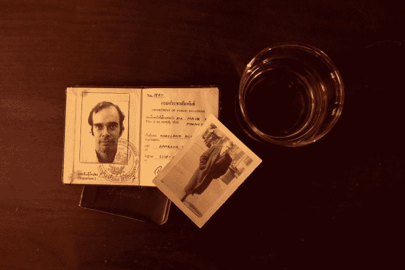
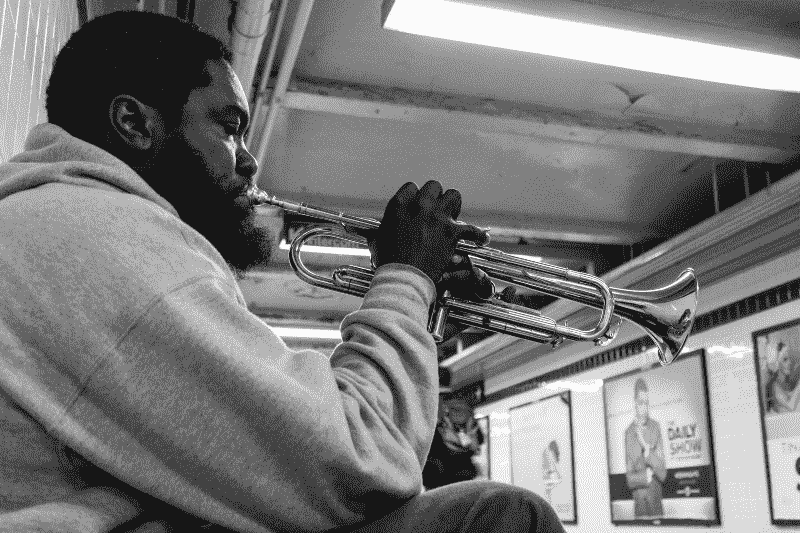

# 来自设计师的照片和故事

> 原文：<https://www.freecodecamp.org/news/photos-and-stories-from-a-designer-5ee97750ae5/>

一些最好的设计师也是一些最好的故事讲述者。我不认为这是巧合。

这是因为优秀的设计师从故事的角度来思考设计——一帧一帧的叙述说明了用户的产品之旅。

摄影教会了我如何成为一个更好的故事讲述者，以及无意中成为一个更具同情心的设计师。这是因为摄影有助于塑造你的思维。它让你从角色、场景和结果的角度思考互动，这些都是产品叙述中的关键组成部分。

在过去的一年里，我挑战自己尝试摄影。我了解到摄影可以提高机械技能，比如你构图和创造平衡的能力。它还教你如何使用图像作为捕捉和传达故事和经历的方式。

这是我收集的一些照片和故事。希望他们能鼓励你看看设计之外的其他媒介，以发展你作为设计师的独特风格和视角。

#### 新城市，新工作，新生活

这张照片拍摄于纽约。我在市中心闲逛，偶然发现两栋办公楼之间的一个公园被压扁了。我喜欢这里的灯光，所以我决定停下来拍些照片。

当时，我想把重点放在*人*身上作为我的拍摄对象。**这是因为给人拍照很难。你捕捉到了他们情感和性格，同时又与你自己的艺术眼光相协调。**

New city, new job, new life

我四处寻找候选人，注意到一个人坐在公园的长椅上。我走上前，问她是否可以给她附上一张照片。这部分总是让人伤脑筋。有些人会，很多人会说不会。就她的情况而言，她完全没意见。

我很高兴我问了。我记不起她的名字了，但她的背景故事一直让我难忘。

直到几周前，她和丈夫还在伦敦做全职工作。但是她的丈夫最近在纽约找到了一份新工作。所以他们决定搬家。这意味着他们不得不背井离乡，搬到一个全新的城市。

事实证明，照片中捕捉到的瞬间就发生在她第一次工作面试之后。新城市，新工作，新生活。

#### 在城市的屋顶上

这张照片是晚上在岩石顶部拍摄的。这是一个观景台，可以看到纽约令人惊叹的景色。这张照片背后的故事，和我在得到这张照片的过程中遇到的那个人有关。

On a roof in a city

这是黄金时间，一天中最后一小时的阳光。我正在拍天际线的照片，这时有人拍了拍我的肩膀。是个女孩。她看到了我的相机，她想让我给她拍一张以城市为背景的照片。

我问她这张照片是为了什么特别的事情。显然，每年圣诞节前后，她都会寄出一张圣诞卡。封面总是一张她举着写着“圣诞快乐”的牌子的照片

引起我注意的是她有多喜欢旅行。每一年，照片都在不同的国家。为了继续旅行，她决定成为德国汉莎航空公司的一名空姐。

那是她在纽约的最后一晚。第二天，她登上了飞往德国的飞机，开始了她的训练。

#### 从铁器时代的堡垒到强盗

当我在纽约的时候，我住在我爸爸的两个老朋友家里，他们是夫妻。

丈夫马克是我见过的最有趣的人之一。他年轻时，搭便车是他的爱好。早期，他在美国各地搭便车旅行，南至新奥尔良，北至阿拉斯加。

From iron age forts to bandits

1978 年至 1980 年间，马克搭便车周游了世界。他的经历塑造了他的性格，从在苏格兰的考古探险中发现铁器时代的堡垒，到在伊朗沙漠中被强盗劫持，还有整个难民营。

这张照片提醒了马克和他的故事。

#### 地铁里的善良

这张照片是我在地铁的最后一天拍的。我在去机场的路上，在地铁里遇到一个吹小号的。

有一个无家可归的人躺在小号手的对面。吹了一盘后，小号手休息了一下，从包里买好了一个用萨兰包装的三明治。

Kindness in the subway

小号手没有咬一口三明治，而是把它分成了两半。他把一半给了躺在大厅另一边的人，然后咬了另一半。

这种交流感觉如此真实。没有任何附加条件。在给两位先生捐了一小笔钱后，我问小号手我是否可以给他拍张照。

现在每次看这张照片都会想起这个故事。

你有什么故事？有哪些让你想起他们的最喜欢的照片？在这里给我留言或者在推特上给我发消息。

你可以在我每周发表文章的媒体上找到我。或者你可以在 Twitter 上关注我，在那里我会发布一些关于设计、前端开发和虚拟现实的无聊言论。

如果你喜欢这篇文章，如果你点击？并与朋友分享。

