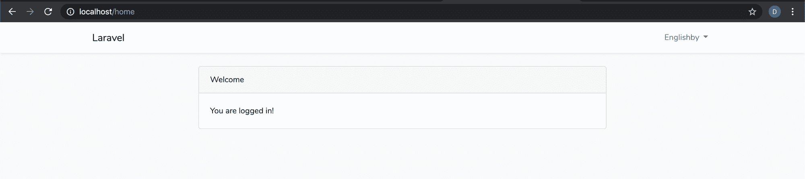
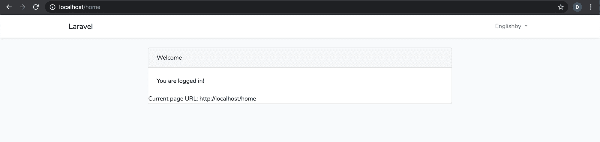

# PHP 获取 URL——如何获取当前页面的完整 URL

> 原文：<https://www.freecodecamp.org/news/php-get-url-how-to-get-the-full-url-of-the-current-page/>

在这篇以 PHP 为中心的文章中，我们将探索如何用 PHP 编程语言获取当前页面的 URL。

出于以下原因，您可能希望获取当前页面的 URL:

*   建立内部链接
*   对 GET 请求使用过滤器，例如，currentURL.com？myFilterParameter =食物

当用户浏览您的 web 应用程序时，PHP 实际上存储了大量有用的信息。其中之一当然是当前的 URL。

PHP 将这些有用的信息存储在它的超级全局变量数组中。

### 什么是超级全局变量？

> 超全局变量是 PHP 引擎已经定义好的变量，可以在任何范围内使用。它们在任何时候都是现成的。

有许多这样的超级全局，但是我们感兴趣的是$_SERVER 超级全局。

### $ _ 服务器超级全局

$_SERVER 超全局变量有许多可以通过关联样式索引访问的属性。

我们可以访问的一些值包括:

*   HTTP 用户代理
*   HTTP _ 主机
*   HTTP _ 接受 _ 编码
*   HTTP _ 接受

你可以在 PHP 文档[中看到更多这些标记。](https://www.php.net/manual/en/reserved.variables.server.php)

### 那么，我们如何获得完整的网址呢？

记住上面关于超级全局和**$ _ 服务器**超级全局的几点，我们可以继续前进并获得当前页面的 URL。

在下面的截图中，我在一个名为“home”的页面中呈现了一个本地环境中的 PHP 应用程序



网址是 **http://localhost/home** 。

在这个页面的代码库中，我将使用 **$_SERVER** 变量。

有了这个变量，我们将不得不使用 2 个独立的索引来获取当前页面 URL 的每个部分。第一部分是主机 localhost，第二部分是页面名称 home。

我们将使用的第一个索引是**HTTP _ HOST**——当前的 web 地址主机，例如 localhost 或 example.com

第二个是**请求 _URI** ，它会给我们在主机之后的 URL 部分，所以这是在本地主机或 example.com 之后的任何东西

让我们来看看实际情况:

```
$currentPageUrl = 'http://' . $_SERVER["HTTP_HOST"] . $_SERVER["REQUEST_URI"];

echo "Current page URL " . $currentPageUrl; 
```

### 输出



就是这样——非常简单！

## 摘要

**$_SERVER** 超全局变量存储了许多现代用例的重要信息。正如我们在这个例子中发现的，通过访问这个特定变量，获取当前页面的 URL 变得很简单。

不过，值得查看一下文档，看看还有什么其他可用的索引，因为最好记住这个变量有多有用。

我希望你喜欢这篇文章！如果你有，请随意看看我的博客，[https://www.codewall.co.uk/](https://www.codewall.co.uk/)