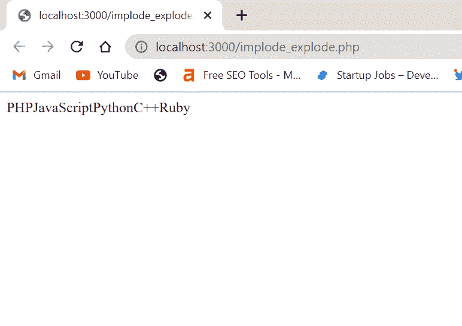
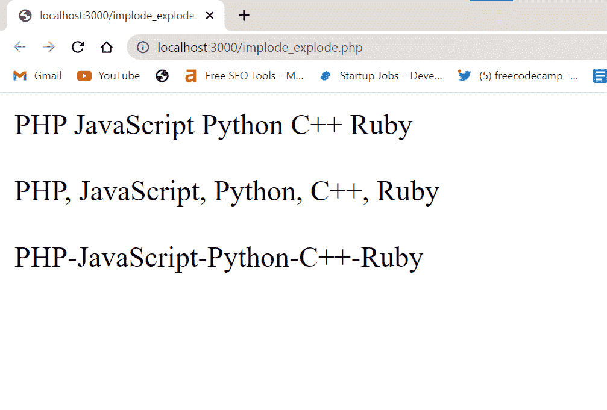
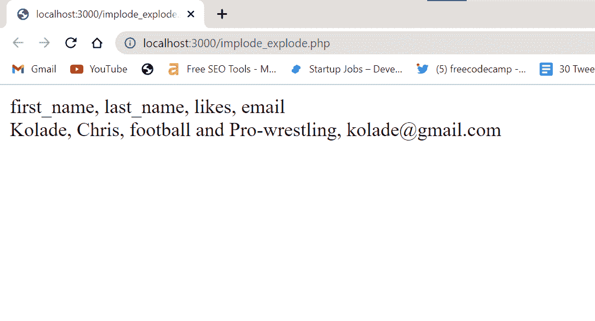
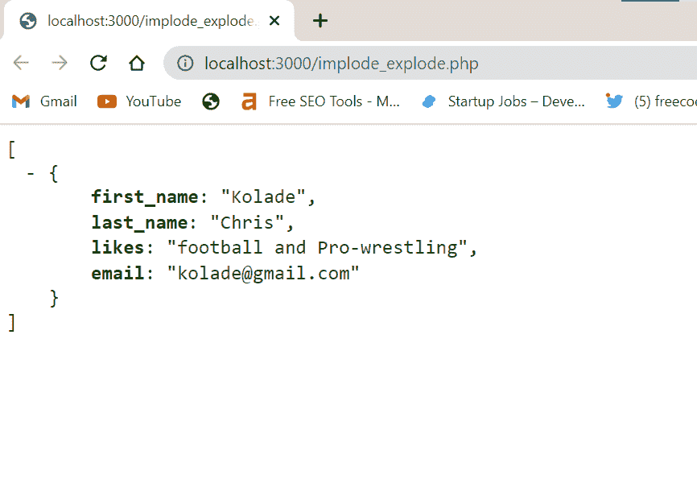
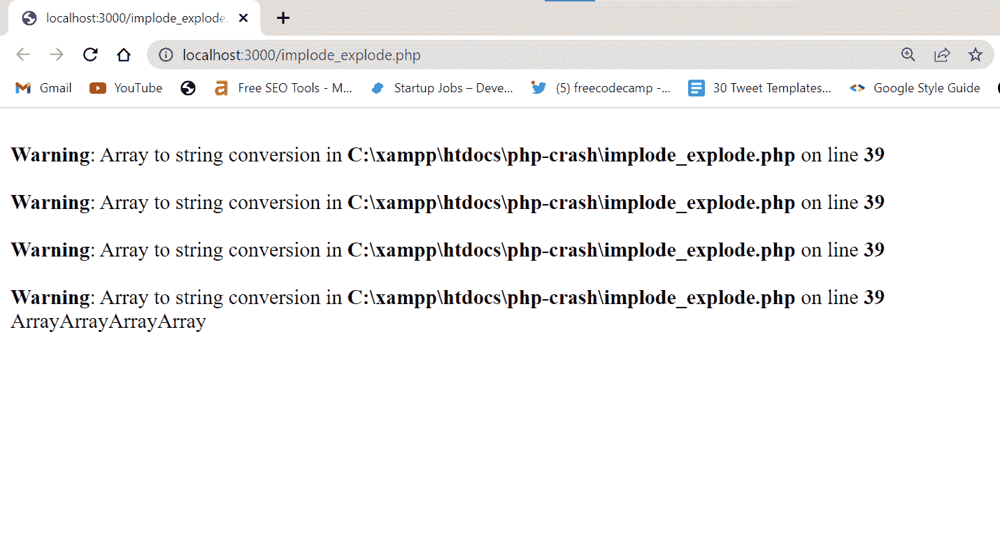

# PHP 内爆——用 Join 将数组转换成字符串

> 原文：<https://www.freecodecamp.org/news/php-implode-convert-array-to-string-with-join/>

在 PHP 中，`implode()`函数是一个内置函数，它接受一个数组并将其转换为一个字符串。`implode()`不修改原数组。

数组是索引数组还是关联数组并不重要。一旦将数组传递给`implode()`，它会将所有的值连接成一个字符串。

## PHP `implode()`语法

`implode()`接受两个值作为参数——分隔符和要转换成字符串的数组。

分隔符可以是任何字符或空字符串。只要在引号中指定它，它就是有效的。如果没有传入分隔符，`implode()`仍然有效。另一方面，数组可以是关联数组或索引数组。

注意:`implode()`不适用于嵌套数组。

`implode()`的完整语法如下所示:

```
implode(" ", $array); 
```

在上面的语法中，空格(" ")是分隔符，`$array`是数组。

## 带索引数组的内爆示例

在 PHP 中，索引数组就像它的名字一样——数组中的每个值都有一个自动分配给它的索引。如果需要，您也可以指定索引。

下面是一个关于`implode()`如何使用索引数组的例子:

```
<?php
$langs = array("PHP", "JavaScript", "Python", "C++", "Ruby"); 

$newLangs = implode($langs);
// Since we are printing a string, we can use echo to display the output in the browser
echo $newLangs;
?> 
```



请注意，我没有传入分隔符，`implode()`仍然工作正常。在下面的例子中，我用空格、逗号和连字符作为分隔符:

```
<?php
$langs = array("PHP", "JavaScript", "Python", "C++", "Ruby"); 

$newLangsSpace = implode(" ", $langs);
$newLangsComma = implode(", ", $langs);
$newLangsHyphen = implode("-", $langs);

// Since we are printing a string, we can use echo to display the output in the browser
echo $newLangsSpace."<br>"."<br>";
echo $newLangsComma."<br>"."<br>";
echo $newLangsHyphen ."<br>";
?> 
```



您可以看到，最好指定一个分隔符，以便更好地查看值。

## 带有关联数组的内爆示例

使用关联数组定义命名索引。让我们看看`implode()`如何处理关联数组。

```
<?php
$person = [
    'first_name' => "Kolade",
    'last_name' => "Chris",
    'likes' => "football and Pro-wrestling",
    'email' => "kolade@gmail.com",
];
//That's not my email. Don't bother sending me a message.

$newPerson = implode(" ", $person);
echo $newPerson."<br>";
?> 
```


你可以看到索引没有打印出来。为了打印索引，您需要在打印数组时将数组附加到`array_keys()`方法:

```
<?php
$person = [
    'first_name' => "Kolade",
    'last_name' => "Chris",
    'likes' => "football and Pro-wrestling",
    'email' => "kolade@gmail.com",
];
// That’s not my email. Don't bother sending me a message.

$newPersonValues = implode(", ", $person)."<br>";
$newPersonKeys = implode(", ", array_keys($person));

echo $newPersonKeys."<br>"; 
echo $newPersonValues;
?> 
```



为了证明原始数组从未被修改，我将把数组和内爆变量一起打印出来:

```
<?php
$person = [
    'first_name' => "Kolade",
    'last_name' => "Chris",
    'likes' => "football and Pro-wrestling",
    'email' => "kolade@gmail.com",
];
// That's not my email. Don't bother sending me a message.

$newPersonValues = implode(", ", $person)."<br>";
$newPersonKeys = implode(", ", array_keys($person));

echo $newPersonKeys."<br>"; 
echo $newPersonValues."<br>";

print_r($person);
?> 
```

您可以使用 PHP View Chrome 扩展来格式化打印的数组，以便它看起来更好:



## 最后的想法

在本文中，您了解了 PHP 中的`implode()`函数及其工作原理。我们还通过例子研究了`implode()`函数如何处理索引数组和关联数组。

别忘了`implode()`对嵌套数组(多维数组)不起作用。事实上，我可以证明这一点:

```
<?php
$persons = array (
  array("Kolade", 22, 03),
  array("Yemi", 15, 12),
  array("Cook", 07, 01),
  array("Oliver", 19, 01)
);

$newPersons = implode($persons);
print_r($newPersons);
?> 
```



它不是那样工作的，因为`implode()`只适用于平面数组(`[ ]`)，而不是多维数组(`[ [ ] ]`)。内爆查看第一个数组，一旦看到第一个数组中有很多数组，就会抛出错误。

感谢您的阅读。