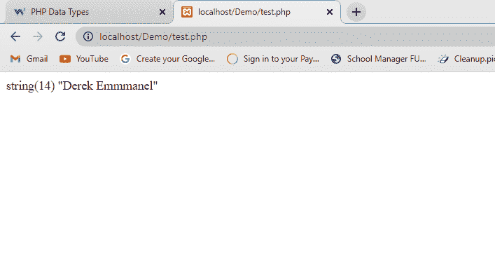
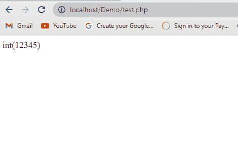

# 学习 PHP 语法、注释、变量和数据类型——包括例子

> 原文：<https://www.freecodecamp.org/news/php-syntax-comments-variables-data-types-with-examples/>

欢迎大家来到今天的教程。在我的上一篇文章中，我向你介绍了什么是 PHP，以及如何用 XAMPP 来设置它。

今天，我们将回顾这些 PHP 入门概念，然后更深入地探究这门语言。我们将看看 PHP 语法、注释、数据类型和变量等。

## PHP 设置

这里有一个如何让 PHP 在你的项目中运行的快速纲要。

进入 [PHP 网站](https://www.php.net/)，点击顶部导航栏中的下载，向下滚动到你看到 Windows 下载的地方，点击它。

当你点击 Windows 下载，一个新的页面应该会出现。只需向下滚动，直到看到 VS16 x64 线程安全(2022-Jun-07 22:31:20)，然后点击 zip 文件下载 PHP。

下载完成后，转到计算机中的下载文件夹，从 zip 文件中提取 PHP 文件夹，打开提取的 PHP 文件夹，右键单击 php.exe，然后选择以管理员身份运行。

你可以在这里阅读更多关于如何为你的代码设置 PHP 的详细描述。

## PHP 语法

您可以在文档的任何地方嵌入 PHP 代码。它以开始标签`<?php (the PHP code goes in here)`开始，以结束标签`?>`结束。

所有 PHP 语句都以分号`;`结尾。PHP 文件总是以文件扩展名`.php`命名，例如`index.php`或`home.php`。

PHP 代码中通常包含 HTML 代码，例如:

```
<?php
	echo “ <h1> GOOD BYE WORLD, SEE YOU NEXT TIME </h1>”;
	echo “<p> This is me leaving the website at this point in the day </p>”;
?>
```

从上面的代码中，我们可以看到我们的 PHP 代码包含两行 HTML 代码——标签`h1`和标签`p`。`h1`标签(标题 1)将以非常大且粗体的格式显示，而`p`标签(段落)将正常显示在浏览器中。注意，上面所有的代码都以分号`;`结束。

## PHP 中的注释

作为开发者，评论是至关重要的。向代码中添加注释会使代码更容易阅读和理解。

在某些情况下，你可能需要返回到你以前写的代码，但是如果你不解释你用注释做了什么，你将很难解决这个问题。

当您注释掉某个内容时，它不会显示在 web 浏览器中。在 PHP 中，你可以写单行注释和多行注释。

### 如何用 PHP 编写单行注释

顾名思义，单行注释就是注释掉一行中的所有内容。您可以在 PHP 中使用正斜杠(`/`)或散列符号(`#`)来表示单行注释。例如:

```
<?php
//This is a PHP Heading 1 
echo"<h1> PHP Heading 1</h1>";

#This is a PHP Heading 2
echo"<h1> PHP Heading 2</h1>";
?> 
```

上面的代码显示了在 PHP 中执行单行注释的两种方法。

### 如何用 PHP 编写多行注释

这将在多行中注释所有内容。您可以使用符号`/* (the comment goes in-between) */`来包含多行注释。

当您注释掉多行代码时，它不会显示在 web 浏览器中。例如:

```
<?php
	/*This is a PHP Heading
	the h1 tag displays text very bold and big, and the p tag below is the paragraph tag and will be displayed below the heading.
	*/
	echo"<h1> PHP Heading</h1>";
	echo "<p> This is the paragraph </p>";
?>
```

你在上面的代码中看到的多行注释可以说有两个标签:一个是开始标签`/*`，另一个是结束标签`*/`。您的注释文本/代码位于两个标签之间。

## PHP 中的变量

变量是存储或存放数据或值的容器。在 PHP 中，您创建一个变量，变量名称后面跟一个美元符号`$`。

对于要赋值的变量，我们使用`=`符号。以下是关于 PHP 变量的一些重要注意事项:

*   变量用美元符号`$`声明/执行，然后是变量名。
*   变量名区分大小写。例如`$Derek`与`$DEREK`非常不同。
*   变量名不应该也不能以数字开头，而应该以字母(Aa–Zz)或下划线(_)开头。

下面是一些在 PHP 中命名变量的例子:

```
<?php
	$color = "red";
	echo "$color"; //THIS CODE OUTPUTS THE COLOR RED TO THE WEB BROWSER
	echo "</br>";

	$COLOR = "Blue";
	echo "$COLOR"; //THIS CODE OUTPUTS THE COLOR BLUE TO THE WEB BROWSER
	echo "</br>";

	$_price = "1000";
	echo "$_price"; //THIS CODE OUTPUTS THE PRICE 1000 TO THE WEB BROWSER
	echo "</br>";

	$_PRICE = "900";
	echo "$_PRICE"; //THIS CODE OUTPUTS THE PRICE 900 TO THE WEB BROWSER
?>
```

上面的代码展示了 PHP 中命名变量的不同方式。

## PHP 中的数据类型

PHP 中的变量存储不同数据类型的值。现在让我们讨论一些适用于 PHP 的数据类型:

*   `String`
*   `Integer`
*   `Float`
*   `Boolean`

### 字符串数据类型

字符串是一种数据类型，用双引号`" "`内的一些文本来表示。字符串也可以包含数字和特殊字符，但是应该用引号括起来。例如:

```
<?php
	$name = "Derek Emmmanel";
	echo "$name";

    echo "<br>";

	$price = “1234567”;
	Echo “$price”;
?>
```

根据上面的代码，变量值`“Derek Emmanuel”;`和`"1234567"`属于`string`数据类型，因为它们被括在引号中。

我们可以使用另一种方法在 web 浏览器中运行上面的代码。例如:

```
<?php
$name = "Derek Emmmanel";
var_dump($name);
?>
```

在上面的代码中，我使用了`var_dump`关键字来执行我的 PHP 代码。`Var_dump`不仅将您的代码显示在您的 web 浏览器上，还可以帮助您识别您正在使用的数据类型以及它包含多少值。



var_dump keyword

### 整数数据类型

整数是没有小数点的整数。整数可以是负数(-34567)，也可以是正数(34567)。例如:

```
<?php
	$ad = 12345;
	var_dump($ad);
?>
```

上面的代码是整数数据类型的一个例子。



### 浮点数据类型

浮点数不是整数，而是带小数点的数字。浮点数也可以是负十进制数(-34.567)或正十进制数(34.567)。例如:

```
<?php
	$fl = 34.567;
	var_dump($fl);
?>
```

### 布尔数据类型

Boolean 是一种表示两种可能结果的数据类型，`true`或`false`。当我们处理像`if`、`else`、`elseif`和`swtich`这样的条件语句时，通常会用到布尔。例如:

```
$house = true;
$city = false;
```

## 结论

我希望你从今天的教程中学到了很多。请继续关注我们的下一个话题。

编码快乐！