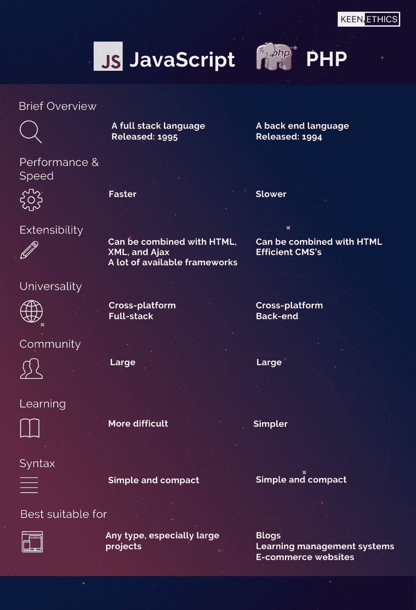

# PHP 与 JavaScript:如何为你的项目选择最好的语言

> 原文：<https://www.freecodecamp.org/news/php-vs-javascript-which-technology-will-suit-your-business-better/>

如果有人说“JavaScript 只做前端开发，PHP 做后端”——不要听。

在我断言一种语言比另一种语言更好之前，我需要澄清一些事情。我不想把 PHP 和 JavaScript 的讨论变成苹果和橘子的比较，所以我应该解释一下 JavaScript 和 PHP 的主要区别。

PHP 是一种仅用于后端开发的编程语言。反过来，JavaScript 最初被设计为前端开发语言。但是随着 2009 年 Node.js 的引入，JavaScript 变成了全栈。

经常被引用的“JavaScript 只用于前端开发，PHP 用于后端”的说法并不正确。今天，你可以用 JavaScript 开发整个应用，包括客户端和服务器端。问题是，哪种语言对您的特定项目更有效？

因此，如果您试图在 PHP 和 JavaScript 之间做出选择，那么讨论就变成了您希望使用哪种语言进行后端开发。为了帮助您做出明智的决定，我将根据以下标准对 PHP 和 JavaScript 进行比较:

1.  简要概述
2.  性能和速度
3.  展开性
4.  一般性
5.  社区
6.  学习曲线
7.  句法
8.  最适合的应用

## 简要概述

### **JavaScript**

JavaScript 是一种轻量级、多范式、高级、解释型或即时编译型的动态编程语言。由 Brendan Eich 于 1995 年引入的 JavaScript 的特点是花括号语法、一流的函数和基于原型的面向对象。

根据 [Statista](https://www.statista.com/statistics/869092/worldwide-software-developer-survey-languages-used/) 的数据，全球 69 %的开发者使用 JavaScript，还有 5 %的开发者计划采用这种语言。该报告显示，截至 2019 年底，它是世界上最受欢迎的编程语言。

### **PHP**

PHP 代表超文本预处理器，它是一种用于后端开发的开源脚本语言。这种语言由拉斯马斯·勒德尔夫于 1994 年发明，得到了全球的认可。根据 W3Tech 的调查 ，79%的网站使用 PHP。其中最受欢迎的有脸书、维基百科，当然还有 WordPress。

**PHP vs JavaScript:0–0**

## 性能和速度

### **JavaScript**

JavaScript 的特点是事件驱动、单线程、非阻塞的 I/O 执行模型。这种模型由事件循环和节点聚类来保证。

Node.js 的异步特性使它能够同时运行整个代码，而无需等待某些函数被执行。因此，JavaScript 是低延迟应用程序(如流媒体平台)的最佳解决方案。V8 引擎、持续的服务器连接和回调函数进一步加速了 Node.js。

### **PHP**

PHP 的特点是多线程、阻塞 I/O 执行模型。与 JavaScript 不同，PHP 是同步的。PHP 中的第二行代码直到第一行代码执行后才能执行，这使得它比 JavaScript 慢得多。

虽然 PHP 无疑在速度上输了，但有人说它比 JavaScript 更稳定。然而，这种优势是相当模糊的，并没有百分之百的证明。

PHP 和 JavaScript 的可靠性和稳定性都有待解释。但是由于其出色的速度，JavaScript 赢得了一分。

**PHP vs JavaScript:0–1**

## 展开性

### **JavaScript**

JavaScript 可以与 HTML、XML 和 Ajax 结合使用。

有许多优秀的 JavaScript 框架，人们甚至无法数清它们，因为新的框架经常出现。

最受欢迎的前端 JS 技术是 Vue 、 Angular 和 React ，但是在 KeenEthics 我们也看到了苗条的光明未来。

最常见的服务器端框架是 [Node.js](https://keenethics.com/services-web-development-node) 。你选择什么样的框架可能会决定你未来应用的开发速度和成本、性能以及其他技术质量。

至于包管理器，Node.js 预装了 NPM(节点包管理器)。NPM 极大地方便了开发者的生活，它是世界上最大的软件注册中心。

### **PHP**

PHP 只能和 HTML 结合使用。

PHP 最大的优势可能是像 WordPress 或 Drupal 这样的 CMS 的可用性。这些解决方案可以极大地促进甚至降低 web 开发的成本。PHP 也可以用任何 LAMP 栈技术和诸如 MySQL 或 PostgreSQL 之类的服务器解决方案来扩展。

PHP 有两个包管理器——PEAR 和 Composer。PEAR (PHP 扩展和应用程序库)是一个开源 PHP 代码的结构化库。Composer 是 PHP 的依赖管理工具。

*总的来说，JavaScript 提供了更多可扩展性的机会，所以它赢得了点*。

**PHP vs JavaScript:0–2**

## 一般性

JavaScript 是跨平台的，PHP 也是。PHP 和 JavaScript 的主要目标都是开发 web 应用程序，尽管它们都可以用于移动应用程序开发。

### **JavaScript**

JavaScript 相对于 PHP 最大的优势在于 JavaScript 是一种全栈开发语言。大多数 JS 和 PHP 的比较都强调 JavaScript 只是前端，但事实并非如此。除了 JavaScript，你不需要任何其他技术就可以开发一个完整的 web 或移动应用程序。

KeenEthics 的经验证明了这一点:作为一家面向 JS 的公司，我们只使用 JavaScript 从头开始开发定制的 web 和移动解决方案。

### **PHP**

PHP 只是一种后端开发语言。PHP 属于 LAMP 栈，代表 Linux、Apache、MySQL 和 PHP/Perl/Python。

要用这种技术栈开发 web 应用，软件工程师需要知道四种不同的语法系统，以及 HTML 和 CSS。在各种语言之间切换既不方便也不高效，而且会使学习曲线变得非常复杂。

*JavaScript 开发是全栈开发，这是它最大的优势*。

**PHP vs JavaScript:0–3**

## 社区

### **JavaScript**

根据 [stackshare.io](https://stackshare.io/stackups/javascript-vs-php) 的说法，开发人员喜欢使用 JavaScript 的主要原因是它的通用性(“可以在前端和后端使用”)、流行性(“它无处不在”)和可扩展性(“有很多很棒的框架”)。

JavaScript 被网飞、LinkedIn、Trello、优步、Airbnb、Instagram、易贝、NASA 和 Medium 使用。

大多数 JS 框架都是开源的，但 JavaScript 本身不是。

JavaScript 是 [GitHub](https://madnight.github.io/githut/#/pull_requests/2019/4) 上最受欢迎的语言，占拉取请求的 20%以上。

### **PHP**

[Stackshare.io](https://stackshare.io/stackups/javascript-vs-php) 表明 PHP 最受人喜爱的优点是大型社区、开源和简单部署。

PHP 被脸书、Lyft、维基百科、Slack、Tumblr 和 9 GAG 等公司使用。

PHP 代码是开源的，这使得它更加灵活和可定制。

在 [GitHub](https://madnight.github.io/githut/#/pull_requests/2019/4) 上，PHP 以约 5 %的拉请求仅占第八位。

两种语言都有巨大的支持社区，并受到大型科技巨头的青睐 PHP 和 JavaScript 都获得了一分。

**PHP vs JavaScript:1–4**

## 学习曲线

### **PHP**

PHP 比 JavaScript 更容易开始学习。设置服务器就像创建单个。php 文件，编写几行用`<?php?>`标记括起来的代码，然后在浏览器选项卡中输入 URL。

此外，PHP 的特性，比如不一致的函数或返回值，比 JavaScript 和某些 JS 框架的特性更容易理解和掌握。

### **JavaScript**

为服务器端设置 JavaScript，即 Node.js，并不复杂。但是比 PHP 难。一个初级的 JS 开发人员需要比初级的 PHP 开发人员拥有更多的知识。

然而，你为学习 JavaScript 付出的努力完全有回报。因为 JavaScript 比 PHP 更通用，所以学习的努力带来了更多的价值。

PHP 在学习简单性上赢得了一分，初学者肯定会喜欢它。

**PHP vs JavaScript:2–4**

## 句法

编程语言的语法，在大多数情况下，只是个人喜好的问题。因此，这两种语言都没有得分。

然而，我将提供 JS 和 PHP 语法规则的并排比较，以防您在这里考虑学习哪种语言。也许某种语言的某些特性会更适合你，这就是你将如何做出选择。

*   PHP 和 JavaScript 都使用不同类型的括号，包括圆括号、圆括号和方括号。
*   在 PHP 和 JavaScript 中，变量可以是任何类型，它们可以改变类型，并且可以通过调用特定于语言的操作符来检查类型——JS 中的 *typeof* 和 PHP 中的 *gettype* 。
*   在这两种语言中，数组都以“0”开头。
*   *for()* 循环在 PHP 和 JavaScript 中的作用是相同的，不同之处仅在于 for 括号内变量的声明方式。 *foreach()* 循环，这是 PHP 独有的，可以很容易地转化为 JS *for()* 循环。
*   在 JS 中，默认情况下变量是全局的，除非用 *var* 声明为局部的。局部变量可用于该函数或其子函数中的所有内容。
*   在 JS 中，加法和连接都是用“+”完成的。
*   JS 在变量和函数中区分大小写。
*   JS 中没有关联数组(键值对)，您应该使用 JSON 字符串。
*   在 JS 中，数组和对象非常相似，并且经常可以互换。对象项也可以作为数组项引用。
*   在 JS 中，对象中的项是用句号“.”引用的。
*   PHP 使用美元符号“$”来表示变量，而 JS 没有这样的符号。默认情况下，所有变量都是局部变量，除非用 *global* 声明为全局变量。局部变量在子函数中不可用，除非您在参数中传递它。
*   在 PHP 中，加法用“+”完成，串联用“.”完成。
*   PHP 只在变量中区分大小写。
*   PHP 允许数字数组和关联数组。
*   在 PHP 中，数组和对象是完全不同的东西，有不同的语法。
*   在 PHP 中，对象中的项用一个箭头“-->”来引用。

这些是你应该知道的关于这些语言的一些最基本的区别。查看 [此表](https://pixelloom.com/resources/syntax-table.php) 和 [本文](https://engineering.carsguide.com.au/php-vs-javascript-syntax-5e11303239b8) 了解 PHP 和 JavaScript 之间更多的语法差异。

正如我所说的，这两种语言都没有优势，因为语法是个人喜好的问题。

**PHP vs JavaScript:2–4**

## 最适合的应用

### **JavaScript**

JavaScript 有专门的服务器托管，这使得它非常适合大型项目。它可以用于开发几乎任何软件应用类型的前端和后端，包括 3D 游戏、AR/VR 解决方案、物联网产品等。

### **PHP**

虽然 PHP 是一种通用编程语言，但它主要用于开发动态网页。考虑到基于 PHP 的内容管理系统如 Moodle 和 WordPress 的可用性，PHP 是博客、学习管理系统和电子商务网站的最佳解决方案。

再一次，就最适合的应用程序而言，每种语言都是不同的，但并不比竞争对手更好或更差。PHP 和 JavaScript 都相当通用，所以都得了一分。

**PHP vs JavaScript:3–5**

## 总结

PHP 和 JavaScript 之间的比较以 3 比 5 的比分结束——JavaScript 击败了 PHP。

这两种语言在社区支持、可扩展性和它们适用的应用程序方面都相当不错。JavaScript 在速度和通用性方面肯定更高效。同时，就学习曲线而言，它输给了 PHP，尽管语法，正如我们得出的结论，只是个人偏好的问题。

请记住——这并不意味着 JavaScript 和 Node.js 总是最好的选择——这取决于您和您的项目。

**选择 Node.js:**

*   如果你计划开发一个单页应用程序，
*   如果您计划构建一个实时应用程序，比如流媒体服务或 messenger，
*   如果您计划构建一个具有大量数据负载的大型项目，
*   如果您使用 JavaScript 进行前端开发。

**选择 PHP:**

*   如果你计划开发一个博客或电子商务网站，
*   如果你已经在使用一些 LAMP 技术。

## 你对一个项目有想法吗？

我的公司 KeenEthics 不能在 PHP 方面帮助你，但是我们是一家经验丰富的 JavaScript 公司，愿意接受挑战。如果你准备好改变游戏，开始你的项目，请随时[联系](https://keenethics.com/contacts)********。********

如果你喜欢这篇文章，你一定会读到另一个精彩的对比: [Angular vs React:为你的 App 选择什么？](https://keenethics.com/blog/angular-vs-react-what-to-choose-for-your-app)或者 [NodeJS vs Python:如何选择最好的技术来开发你的 Web App 后端](https://keenethics.com/blog/nodejs-vs-python)。

## 附言

我还想感谢 Yaryna Korduba，KeenEthics 最出色的网站开发人员之一，感谢她激发了我的灵感并为这篇文章做出了贡献。

KeenEthics 博客上发布的原文可以在这里找到: [PHP vs JavaScript:哪种技术会更适合你的业务？](https://keenethics.com/blog/php-vs-javascript)