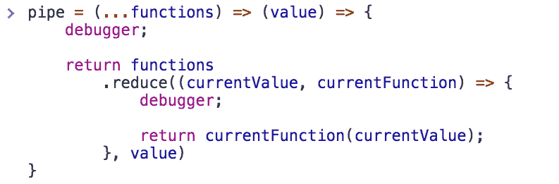
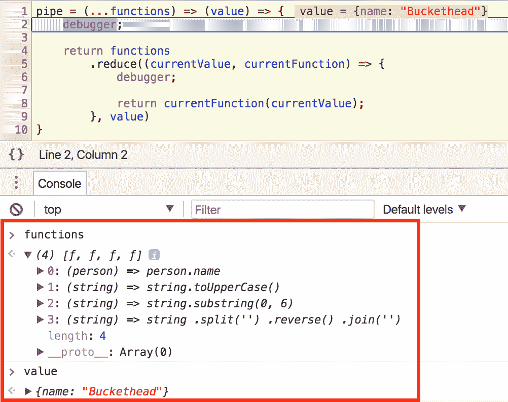
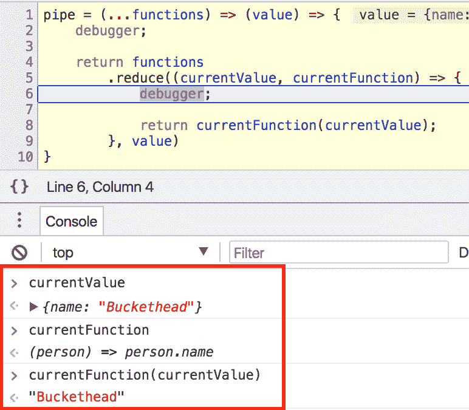
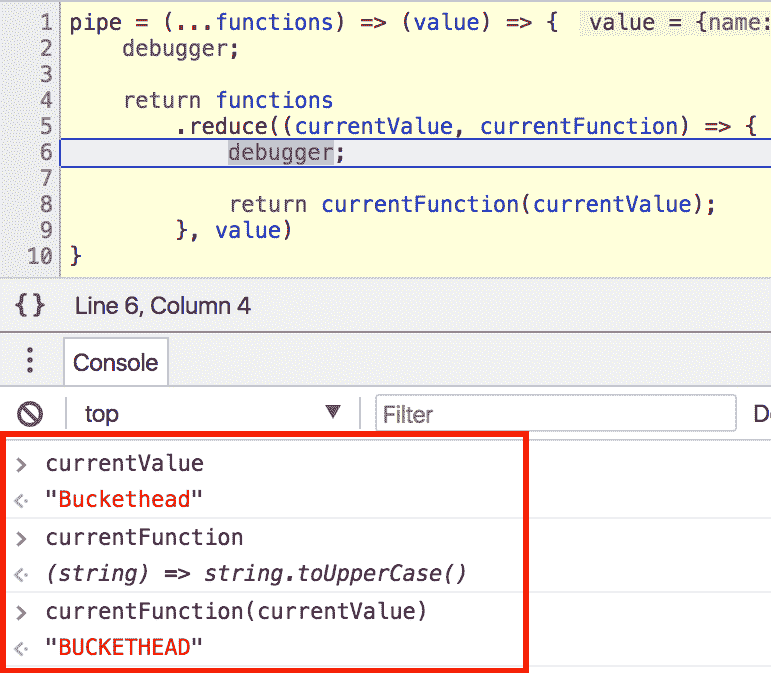
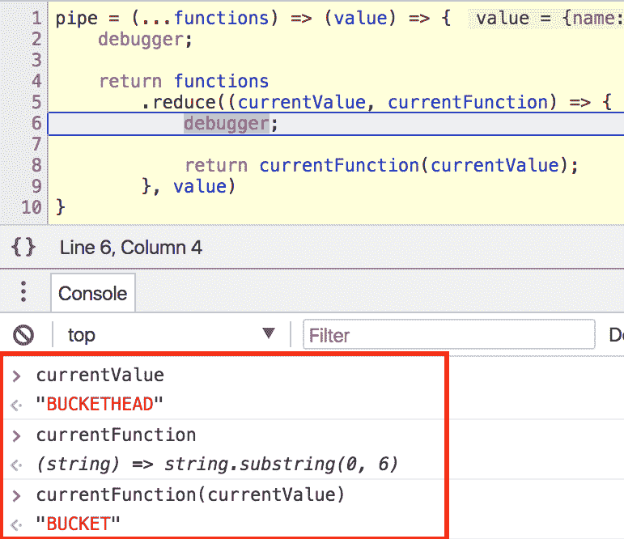
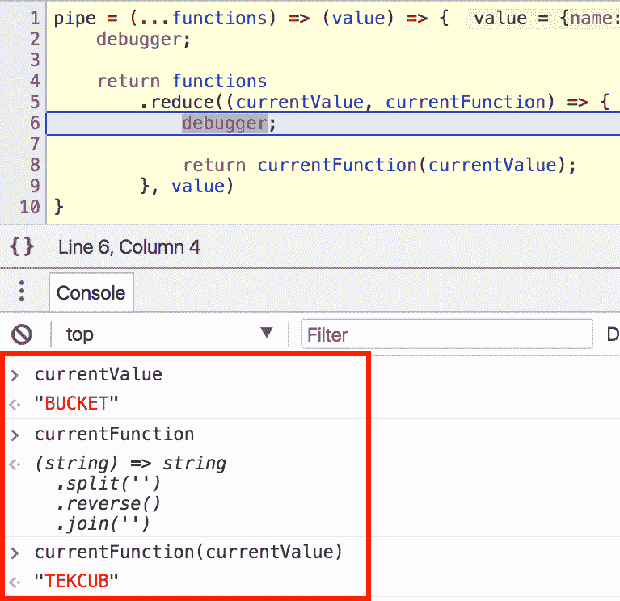
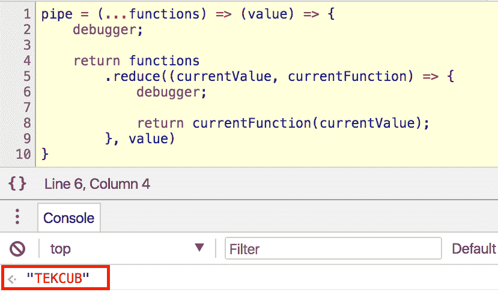

# JavaScript 中 pipe()和 compose()的快速介绍

> 原文：<https://www.freecodecamp.org/news/pipe-and-compose-in-javascript-5b04004ac937/>

函数式编程对我来说是一次大开眼界的旅程。这篇文章，以及类似的文章，试图分享我在探索新的函数式编程领域时的见解和观点。

Ramda 的一直是我的首选 FP 库，因为它让 JavaScript 中的函数式编程变得简单多了。我强烈推荐。

### 管

`pipe`的概念很简单——它结合了`n`的功能。这是一个从左向右流动的管道，用最后一个函数的输出调用每个函数。

让我们写一个函数，返回某人的`name`。

```
getName = (person) => person.name;

getName({ name: 'Buckethead' });
// 'Buckethead' 
```

让我们写一个大写字符串的函数。

```
uppercase = (string) => string.toUpperCase();

uppercase('Buckethead');
// 'BUCKETHEAD' 
```

因此，如果我们想获得并利用`person`的名字，我们可以这样做:

```
name = getName({ name: 'Buckethead' });
uppercase(name);

// 'BUCKETHEAD' 
```

这很好，但是让我们去掉中间变量`name`。

```
uppercase(getName({ name: 'Buckethead' })); 
```

好多了，但是我不喜欢筑巢。它会变得太拥挤。如果我们想添加一个函数来获取一个字符串的前 6 个字符呢？

```
get6Characters = (string) => string.substring(0, 6);

get6Characters('Buckethead');
// 'Bucket' 
```

导致:

```
get6Characters(uppercase(getName({ name: 'Buckethead' })));

// 'BUCKET'; 
```

让我们疯狂一下，添加一个函数来反转字符串。

```
reverse = (string) =>
  string
    .split('')
    .reverse()
    .join('');

reverse('Buckethead');
// 'daehtekcuB' 
```

现在我们有:

```
reverse(get6Characters(uppercase(getName({ name: 'Buckethead' }))));
// 'TEKCUB' 
```

它可以变得有点…多。

### 管道救援！

与其在函数中插入函数或创建一堆中间变量，不如让我们`pipe`所有的事情！

```
pipe(
  getName,
  uppercase,
  get6Characters,
  reverse
)({ name: 'Buckethead' });
// 'TEKCUB' 
```

纯艺术。就像待办事项！

让我们一步一步来。

出于演示的目的，我将使用来自 [Eric Elliott](https://medium.com/@_ericelliott) 的[函数式编程文章](https://medium.com/javascript-scene/reduce-composing-software-fe22f0c39a1d)之一的`pipe`实现。

```
pipe = (...fns) => (x) => fns.reduce((v, f) => f(v), x); 
```

我喜欢这个小俏皮话。

使用 *rest* 参数，[参见我关于](https://medium.com/@yazeedb/how-do-javascript-rest-parameters-actually-work-227726e16cc8)的文章，我们可以管`n`函数。每个函数都接受前一个函数的输出，并且都是*减少的*？转换成一个值。

你可以像上面那样使用它。

```
pipe(
  getName,
  uppercase,
  get6Characters,
  reverse
)({ name: 'Buckethead' });
// 'TEKCUB' 
```

我将展开`pipe`并添加一些调试器语句，我们将逐行进行。

```
pipe = (...functions) => (value) => {
  debugger;

  return functions.reduce((currentValue, currentFunction) => {
    debugger;

    return currentFunction(currentValue);
  }, value);
}; 
```



用我们的例子呼唤`pipe`,让奇迹展现。



检查局部变量。`functions`是 4 个函数的数组，`value`是`{ name: 'Buckethead' }`。

因为我们使用了 *rest* 参数，`pipe`允许使用任意数量的函数。它会循环调用每一个。



在下一个调试器中，我们在`reduce`中。这是`currentValue`被传递给`currentFunction`并返回的地方。

我们看到结果是`'Buckethead'`，因为`currentFunction`返回任何对象的`.name`属性。那将在`reduce`中返回，意味着下次它将成为新的`currentValue`。让我们点击下一个调试器看看。



现在`currentValue`是`‘Buckethead’`,因为那是上次返回的。`currentFunction`是`uppercase`，那么`'BUCKETHEAD'`将是下一个`currentValue`。



同样的想法，取出`‘BUCKETHEAD’`的前 6 个字符，交给下一个函数。



`reverse(‘.aedi emaS’)`



你完了！

### compose()呢？

只是另一个方向的`pipe`。

所以，如果你想要和我们上面的`pipe`一样的结果，你应该反其道而行之。

```
compose(
  reverse,
  get6Characters,
  uppercase,
  getName
)({ name: 'Buckethead' }); 
```

注意到`getName`在链中是最后一个而`reverse`是第一个吗？

这里有一个`compose`的快速实现，再次感谢神奇的[埃里克·艾略特](https://medium.com/@_ericelliott)，来自[同一篇文章](https://medium.com/javascript-scene/reduce-composing-software-fe22f0c39a1d)。

```
compose = (...fns) => (x) => fns.reduceRight((v, f) => f(v), x); 
```

我将把使用`debugger` s 扩展这个函数作为一个练习留给您。玩弄它，使用它，欣赏它。最重要的是，玩得开心！