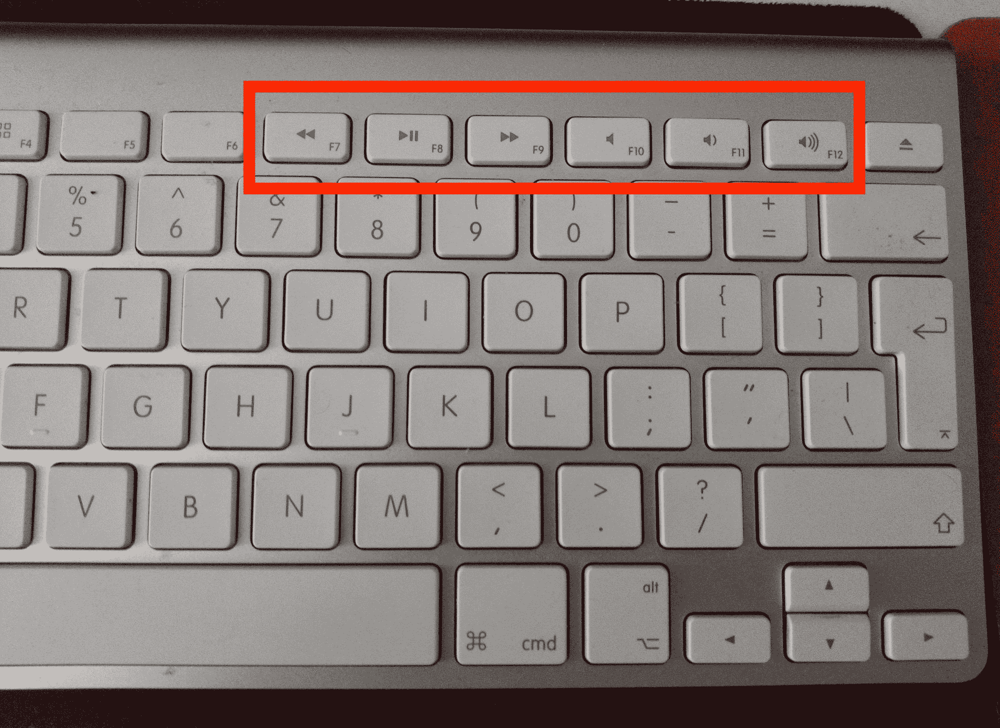
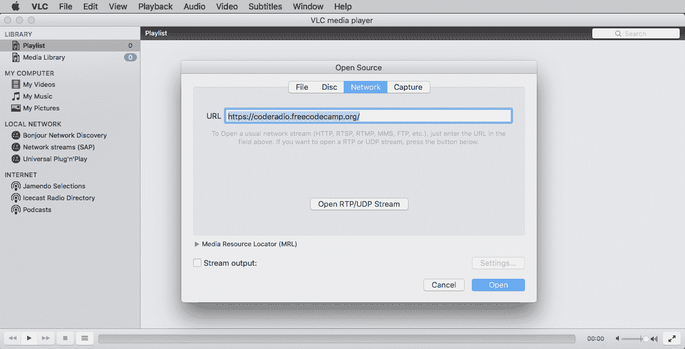
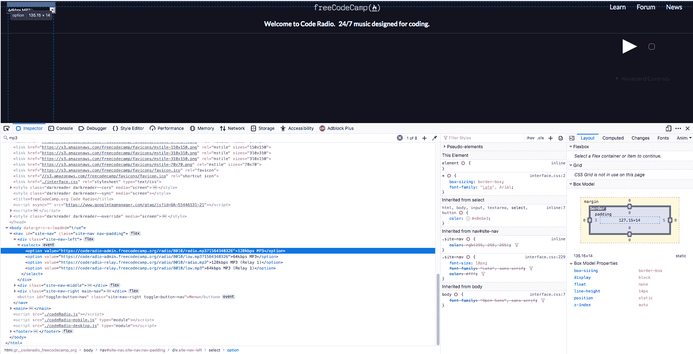
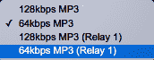
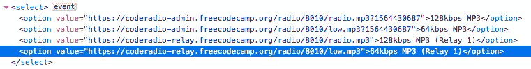
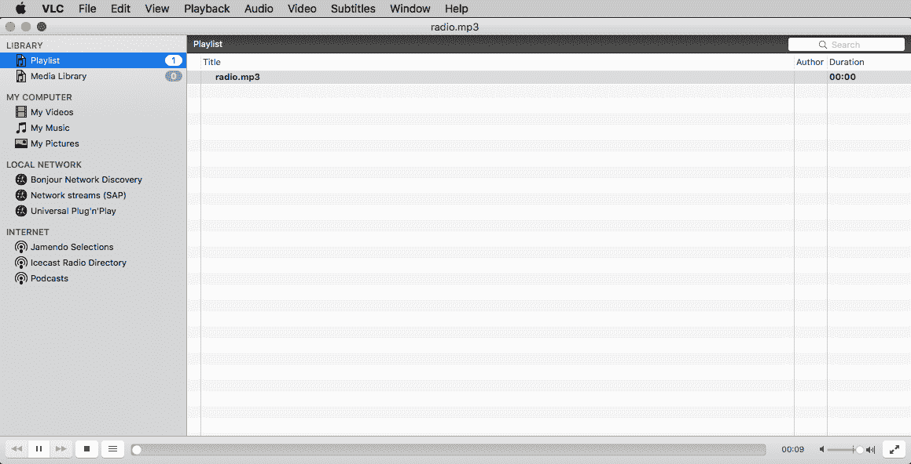
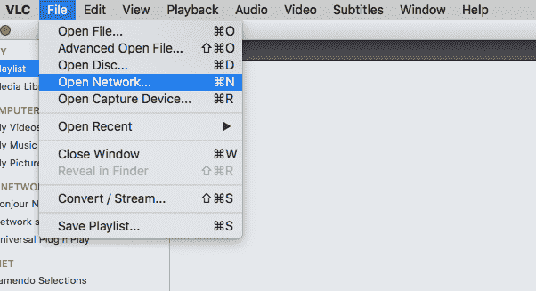
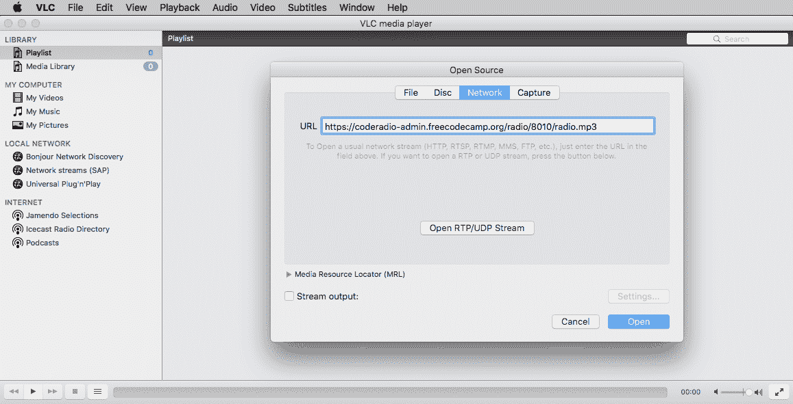

# 如何在 VLC 媒体播放器中收听 Code Radio，只需简单的两步

> 原文：<https://www.freecodecamp.org/news/play-code-radio-on-vlc/>

我喜欢在工作的时候听代码广播。音乐帮助我集中注意力，屏蔽周围办公室的噪音。

但是当我的一个同事打断我的流程问问题时，我不得不关闭代码无线电。

切换到 Code Radio 网站来暂停音乐有点费时间。你必须弄清楚电台播放的是哪个标签代码，这样你才能暂停它。

为了克服这种情况，我开始打开一个单独的浏览器，我只用于播放代码电台。这对我来说更容易，因为我可以按 alt+tab 回到浏览器图标，然后按 Code Radio 的空格键暂停音乐。

但是运行一个单独的浏览器来播放音乐感觉像是在消耗我的电脑资源。我以为会有一个更好的解决方案，不那么费力。

自从我开始听 [Code Radio](https://coderadio.freecodecamp.org/) 以来，我已经基本上放弃了 Spotify，卸载了这个应用。但我记得以前用 Spotify 时，我可以用键盘上的媒体控制键暂停和播放音乐。这让我开始思考。

# 更优雅的解决方案

如果您可以用键盘上的一个热键来播放和暂停 Code Radio 即使您是在终端或代码编辑器中——会怎么样？

你不能用浏览器应用程序做到这一点。但是你可以在你的电脑上运行一个本地应用程序。而且你的电脑上可能已经安装了这个应用。它叫 VLC，是最常见的媒体播放器之一。

media player buttons on my keyboard

在我的午休时间，我一直在思考如何让自己听音乐变得简单，并且能够通过单击一个按钮(即播放/暂停按钮)从键盘上播放/暂停音乐。所以，我在互联网上搜索，发现媒体播放器可以从任何网络上播放内容。

[这篇文章](https://www.vlchelp.com/access-media-upnp-dlna/)帮助我了解了如何从 VLC 的任何网络中获取内容。

为了能够灵活地使用键盘上的播放/暂停按钮，我不得不使用媒体播放器。我发现 [VLC 媒体播放器](https://www.videolan.org/vlc/index.html)是一个可靠的媒体播放器，可以在所有平台上使用，它是开源的，可以免费下载。

在我的第一次尝试中，我试图在 VLC 媒体播放器中打开代码电台网站页面 URL:*[【https://radio.freecodecamp.org】](https://radio.freecodecamp.org)*。

trying to open code radio from VLC media player.

VLC 媒体播放器无法播放它。我试着按下播放按钮多次，但它没有任何作用。

unable to play on VLC media player

经过多次尝试，我发现 VLC 媒体播放器需要一个音乐格式文件(如 mp3)，无法解析 html 网址:/。URL 需要是音乐格式文件的位置。

于是我回到[码电台](https://coderadio.freecodecamp.org/)音乐网站页面，考察了网站页面。我搜索了“ *mp3* 关键词，什么也没找到。

然后我注意到我没有点击网站的播放按钮来请求播放 mp3 文件。我刚刚试了一下(在火狐上)，不用点击回车就能找到那些 MP3 的网址。

mp3 file location via inspecting the Code Radio music website page

在 [Code Radio](https://coderadio.freecodecamp.org/) 音乐网站页面上有两个[码率](https://en.wikipedia.org/wiki/MP3#Bit_rate)选项。

several mp3 bitrate options

我在 inspect 里看到的 mp3 文件对应的是[码率](https://www.freecodecamp.org/news/play-code-radio-on-vlc/Code%20Radio%20music%20website%20page)选项按钮。

mp3 file locations with their bit rate

两种比特率及其文件名:

1.  64kbps - low.mp3
2.  128kbps - radio.mp3

我第二次尝试用的是 mp3 文件位置 URL:[https://code radio-admin . freecodecamp . org/radio/8010/radio . MP3？1564340326](https://coderadio-admin.freecodecamp.org/radio/8010/radio.mp3?1564340326) 是我在 VLC 媒体播放器的 Code Radio 音乐页面找到的。它开始播放音乐:)。

VLC media player playing the mp3 file

我注意到 mp3 文件末尾的唯一数字“[？1564340326](https://coderadio-admin.freecodecamp.org/radio/8010/radio.mp3?1564340326) ”。这似乎是后端服务器创造的独特价值。当我第二天打开 VLC 媒体播放器时。它无法播放代码广播音乐。我试图删除 mp3 文件末尾的最后一个值，但它又开始播放了:)。

## 从 [VLC 媒体播放器](https://www.videolan.org/vlc/index.html)播放 [Code Radio](https://coderadio.freecodecamp.org/) 音乐的步骤

**第一步。**打开 VLC 媒体播放器。然后，点击**文件**->-**打开网络**

Open Network in VLC media player

**第二步。**在**网址**字段，**粘贴这个网址:[https://code radio-admin . freecodecamp . org/radio/8010/radio . MP3](https://coderadio-admin.freecodecamp.org/radio/8010/radio.mp3)。然后点击**打开**按钮。**

openning the URL from the Network in VLC media player

然后， [VLC 媒体播放器](https://www.videolan.org/vlc/index.html)将打开代码无线电网络并开始播放音乐。

注意:您可以在任何支持网络流媒体的媒体播放器中使用 URL:[https://code radio-admin . freecodecamp . org/radio/8010/radio . MP3](https://coderadio-admin.freecodecamp.org/radio/8010/radio.mp3)。我试着在快速时间播放器上玩，它工作了！

### 其他选项:通过播放列表文件播放，

Code radio 由 AzuraCast 提供支持，其公共播放器有一个“下载 PLS”链接，该链接将生成一个 PLS 播放列表文件，它包含所有不同的比特率。播放列表文件可以在 VLC 媒体播放器和其他播放器中播放。

您可以在 VLC media player 中打开播放列表文件-[https://code radio-admin . freecodecamp . org/public/code radio/playlist/pls](https://coderadio-admin.freecodecamp.org/public/coderadio/playlist/pls)并选择码率，开始播放音乐。

喜欢听 [Code Radio](https://coderadio.freecodecamp.org/) 音乐。

致谢:感谢昆西·拉森、T2、巴斯特·尼斯和 T4·路易·蔡对本文的评论。