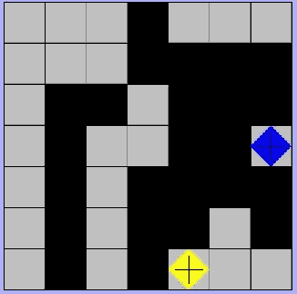
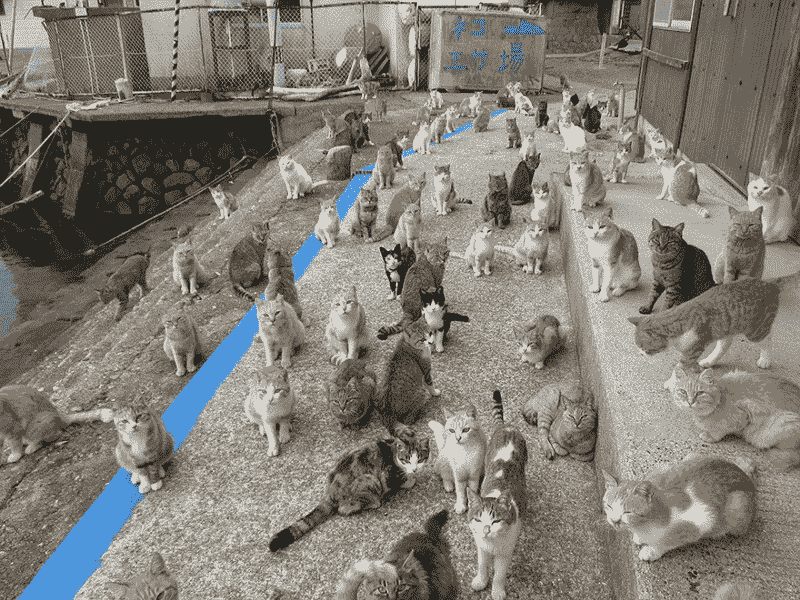
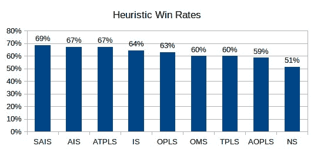
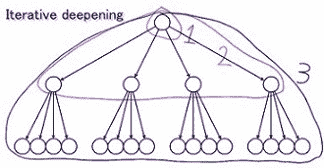
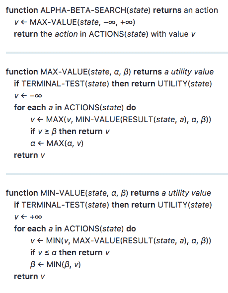

# 用极大极小算法玩策略游戏

> 原文：<https://www.freecodecamp.org/news/playing-strategy-games-with-minimax-4ecb83b39b4b/>

在这节课中，我们将探索一种叫做 **minimax** 的流行算法。我们还将了解它的一些友好的邻居附加功能，如**启发式得分**、**迭代深化**和**阿尔法-贝塔修剪**。使用这些技术，我们可以创建一个更加灵活和强大的游戏代理。它将能够在许多挑战中竞争，包括战略游戏隔离。

在我之前的帖子[如何赢得数独](https://towardsdatascience.com/how-to-win-sudoku-3a82d05a57d)中，我们学习了如何教计算机解决数独难题。如果你还没有读过，那就去快速阅读一下吧。但这只是一种尝试的方式，在进入更复杂的游戏代理方法之前。尤其是那些可以对一个对手做出策略性举动的方法！

[https://boardgamegeek.com/image/784001/isolation](https://boardgamegeek.com/image/784001/isolation)

### 不要被困住了

隔离(或 Isola)是一种回合制战略棋盘游戏，两名玩家试图将他们的对手限制在一个 7x7 的棋盘上。最终，他们无法再采取行动(从而孤立了他们)。

每个玩家都有一个棋子，他们可以像国际象棋中的皇后一样四处移动——上下、左右和对角。有三种情况下棋子可以移动—

1.  他们不能将自己的棋子放在已经被访问过的方格上。
2.  他们不能穿过已经走过的方格(对角挤过它们是可以的)。
3.  他们不能越过对方的棋子。

[https://www.cs.umb.edu/~yunxu/isola/final.jpg](https://www.cs.umb.edu/~yunxu/isola/final.jpg)

在上图中，您可以从黑色方块中看到，两位玩家都将自己的棋子放在了棋盘的各个部分。但是随着游戏的进行，显示黄棋手还有三种可能的走法。向右上方，右边一个方块，右边两个方块。但是蓝色玩家别无选择。因此，黄色玩家是赢家。

现在这看起来像是一个简单的游戏——老实说，的确如此。这并不像我们在玩[扑克](http://www.sciencemag.org/news/2017/03/artificial-intelligence-goes-deep-beat-humans-poker)或[星际争霸](https://www.wired.com/story/googles-ai-declares-galactic-war-on-starcraft-/)。然而，在游戏过程中的任何时候，双方都有大量可能的行动。

在像数独这样的谜题中，有一个我们想要解决的“答案”。但是说到策略游戏就没有答案了。

我们在和另一个对手比赛——比如一个人、一台电脑或者一只猫[侦探](http://theoatmeal.com/comics/scrambles)。这需要策略和对游戏结果的思考。

这种游戏可以进化并产生大量荒谬的可能结果。所以我们需要考虑如何选择最好的行动，而不是像猫在地球上一样花费大量的时间。

好了，别再养猫了！

### 强大的极小极大和朋友

既然你知道了如何玩隔离，那我们就来看看如何使用 **minimax** 算法；人工智能社区的一个主要部分。我们还会看到**启发式得分**、**迭代深化**，以及**阿尔法-贝塔剪枝**。有了这些，我们就可以构建一个有竞争力的 AI 智能体。

#### 极大极小

[minimax](https://en.wikipedia.org/wiki/Minimax) 算法在教 AI 代理如何玩回合制策略游戏方面非常流行。原因是它考虑了玩家在游戏中任何时候可能采取的所有行动。有了这些信息，它就试图在 AI 智能体开始玩的每一个回合中最小化对手的优势，同时最大化智能体的优势。

现在，这个看起来怎么样？

嗯，就像人工智能代理玩数独游戏一样，我们可以通过**搜索树**来模拟玩家下一步可能采取的行动。然而，我们需要使用一个宽度可变的搜索树——换句话说，一个树级别的宽度。原因在于，在游戏中，每个玩家在任何给定的时间都可以进行不同数量的移动。

Udacity AI Nanodegree Program

上面显示的树代表了孤立游戏中的下一步棋。它有一个 2x3 的网格，右下角的正方形是不可及的。你可以看到，这两个玩家是一个蓝圈和一个红叉。

树的顶部(根节点)说明了红色玩家的移动。中间一层说明蓝色玩家下一步可能的行动。第三层示出了红色玩家可能的移动，给定蓝色玩家先前的移动。

> 树中的每个游戏状态或节点都有关于哪个玩家从任何潜在的移动中获益最多的信息。

现在你可能想知道，每一步棋下面的三角形到底是什么？

向下的三角形代表树中的一个位置，在这个位置上，minimax 将**最小化**对手的优势。然而，向上的三角形是 minimax **最大化**代理人优势的位置。

但是极小极大只有在它知道树中通向任何一个玩家胜利的路径时，才能知道任何一个玩家的优势。这意味着极小极大必须遍历到树的最底部，以进行每一系列可能的移动。接下来，它必须分配一些分数(例如，赢了+1，输了-1)，并通过树向上传播这些数字。这样，树中的每个游戏状态或节点都有关于哪个玩家从任何潜在的移动中获益最多的信息。

Udacity AI Nanodegree Program

在这幅图中，我们可以观察到一些现象。首先，minimax 在**叶节点**为最终游戏结果分配一个数字。然后，它通过树向上传播它们，在途中执行最小化和最大化。一旦 minimax 完成了树的填充，每当轮到 AI 智能体时，它就会知道哪一步可能会导致胜利或失败。

根节点之后的第二层显示了蓝色玩家(我们的 AI 代理)的下一步可能的移动。我们的代理希望在其回合中最大化可用分数。所以它会选择根节点之后最右边的节点中表示的移动。超级爽！

但是简单地给游戏结果分配一个+1 或-1 有意义吗？这个分数难道不应该考虑到游戏是如何输赢的吗？

剧透提醒:答案是肯定的！

#### 启发式得分

在策略游戏的世界里，启发式分数本质上是我们分配给某个游戏状态的主观值。这个价值是基于我们对游戏输赢的理解。通过选择一个深思熟虑的启发式分数，我们能够教会我们的 AI 代理如何在玩游戏隔离时最好地选择它的下一步行动。

现在我们可能有无限数量的启发式得分。但是这里我们只看其中的几个，除了+1 和-1 的**天真分数(NS)** 。

一个想法是计算每个玩家在任何给定时间的所有可能的下一步棋，因为更多的可能棋意味着更少的被孤立的机会。我们称之为**开局得分(OMS)** 。

另一个想法是使用从 OMS 得到的值减去对手下一步可能的移动次数。原因是每个玩家都想增加自己的移动量，同时减少对手的移动量。我们把这个叫做**提高分数(IS)** 。

上图显示了人工智能代理之间使用不同启发式分数进行的许多模拟隔离游戏的胜率。现在你可以看到我们的分数在实际游戏中有多么不同。但是有一些启发性的分数超过了我们提出的分数

有趣的是，前两者几乎完全相同的提高分数。我们将称它们为**积极改进分数(AIS)** 和**超级积极改进分数(SAIS)** 。但是这些分数和原来的有一点点不同。在计算提高分数时，前两个分数会将你减去的值(对手可用的移动次数)乘以 2 和 3。

在计算这个分数时，你可以找到一个最佳的“积极因素”来应用！

另一个剧透警告——存在更好的价值。

但是，如果我们想出一个启发式得分，需要花很多时间来计算呢？如果树很大呢？我们的人工智能代理会有足够的时间找到下一步的最佳行动，同时在游戏过程中仍然有足够的响应能力吗？

#### 迭代深化

现在我们知道，我们的人工智能代理可以使用搜索树及其节点的相应启发式得分来模拟所有可能的移动。但不幸的是，在玩孤立时，我们的树会很大。搜索这棵树并计算这些值所花的时间比宇宙大爆炸以来的数年还要多！

进入 [**迭代深化**](http://www.geeksforgeeks.org/iterative-deepening-searchids-iterative-deepening-depth-first-searchiddfs/)——游戏代理人的去时间管理策略。通过使用这种方法，我们可以将计算和搜索时间减少到我们选择的最大时间。这样，我们的人工智能代理至少可以像人类一样快速响应。

但是迭代深化是如何工作的呢？

它允许 minimax 逐层移动，并计算启发式得分，直到某个时间限制。一旦达到这个时间限制，人工智能代理被迫使用它发现的最好的移动，同时沿着树越走越深。

[https://chessprogramming.wikispaces.com/Iterative+Deepening/](https://chessprogramming.wikispaces.com/Iterative+Deepening/)

现在，这让我们对这有多难有了一些了解。创造一个对策略游戏足够聪明和反应灵敏的人工智能代理，即使对人工智能奇才来说也是相当棘手的。尤其是如果这样的游戏包含了一个充满可能性的世界。

不幸的是，人工智能代理可以“想象”的移动次数是有限的。所以它可能会做出导致死亡的决定。这是一个众所周知的现象，叫做**。但是我们仍然需要看看在搜索树时使用的最有效的时间削减算法。**

#### **阿尔法-贝塔剪枝**

**

[http://desperateexes.com/wp-content/uploads/2016/09/the-california-raisins.jpg](http://desperateexes.com/wp-content/uploads/2016/09/the-california-raisins.jpg)** 

**好吧，这些是葡萄干，不是西梅干，但是——这是怎么一回事？我是说，说真的，葡萄干布鲁斯乐队？**

**你可能已经猜到 [alpha-beta 修剪](https://en.wikipedia.org/wiki/Alpha%E2%80%93beta_pruning)与修剪无关，更多的是关于减少我们搜索树的大小(修剪)。当我们有一个非常大的搜索树时，使用极大极小并不总是需要遍历每个节点。**

**我们需要给 minimax 一种能力，当它找到特定层的保证最小值或最大值时，就停止搜索树的特定区域。**

**如果我们能做到这一点，这可以大大减少我们的人工智能代理的响应时间，提高性能。**

**【alpha-beta 修剪是如何工作的？**

**minimax 算法使用[深度优先搜索](https://en.wikipedia.org/wiki/Depth-first_search)在树中移动。这意味着它从左到右遍历树，并且总是到达它能到达的最深处。然后，它会发现必须直接分配给它上面的节点的值，而不会查看树的其他分支。**

**Alpha-beta 剪枝允许 minimax 做出与 minimax 单独决策一样好的决策，但性能更高。**

**考虑下面的图像，其中我们有一个树，每个节点分配有不同的分数。一些节点用红色阴影表示，表示没有必要查看它们。**

**

[https://en.wikipedia.org/wiki/Alpha-beta_pruning](https://en.wikipedia.org/wiki/Alpha-beta_pruning)** 

**在树的左下方，minimax 查看底部 max 级别上的值 5 和 6。它确定必须将 5 分配给其正上方的最小级别。有道理。**

**但是，在查看了右最大级别分支的 7 和 4 之后，它意识到上面的最小级别节点必须被分配最大值 4。因为正好在第一个最小级别之上的第二个最大级别将取 5 到最多 4 之间的最大值，很明显它会选择 5。接下来，它将继续遍历树，在树的其他分支中执行完全相同的一组操作。**

**下面是带有 alpha-beta 修剪的极小极大的算法表示。**

**

Udacity AI Nanadegree Program** 

**使用这种方法提供了一种简单的方法来减少我们的人工智能代理的搜索空间。通过这种方式，alpha-beta 修剪允许 minimax 做出 minimax 可以单独做出的好决策，但具有更高的性能水平。**

### **伊索塔**

**我们已经探索了如何建立我们自己的人工智能代理，可以在一个相当有竞争力的水平上玩游戏隔离。通过使用最小最大算法，我们看到了人工智能代理如何模拟游戏，并根据启发式得分做出决策。我们还学习了如何为给定的任务(隔离)确定一个定义良好的启发式方法。**

**但我们也发现，让极大极小值不受约束，计算量太大了。所以我们不得不使用像迭代深化和阿尔法-贝塔剪枝这样的技术。这将迫使我们的人工智能代理在合理的时间内提出下一步行动。但是，如果我们希望我们的人工智能代理有更高的胜率，同时至少像人类一样响应迅速，那该怎么办呢？**

**嗯，我们可以探索其他方法来提高代理的成功率和响应时间。我们提到了调整启发式评分参数的想法(还记得“攻击性因素”吗？).我们甚至可以想出一个更适合玩孤立游戏的启发式分数。**

**还存在与隔离板上的可能移动相关的反射属性。当我们分析完全填充的搜索树时，这些变得很明显，这将允许我们潜在地从搜索树中削减许多分支。此外，如果我们升级我们的硬件，我们的人工智能代理将会更快，从而能够探索更多的可能性。**

**如果你想深入了解如何自己实现它的本质细节，看看我为我的 [Udacity 人工智能 Nanodegree 编写的解决这个问题的代码。](https://www.udacity.com/course/artificial-intelligence-nanodegree--nd889)你可以在[我的 GitHub 回购](https://github.com/grantathon/AIND-Isolation)上找到。**

* * *

**嗨，我是格兰特！我是一名自由开发者和定量分析师。在 https://freelancequant.com 查看我的网站。干杯！**