# 如何在 Figma 中使用插件

> 原文：<https://www.freecodecamp.org/news/plugins-in-figma/>

在本文中，您将学习如何在 Figma 中安装插件。您还将了解一些非常酷的 Figma 插件，每个设计师和开发人员都应该使用它们。

插件有助于让你的设计过程更加简单和流畅。从图像资产到将地图嵌入到设计中，插件易于使用，它们可以帮助您在更短的时间内创建漂亮、复杂的设计。

## 如何在 Figma 上安装插件

Figma 让你很容易安装插件，这对你的设计是非常重要的。你可以从不同的地方安装插件。

### 如何从你的帐户安装插件

要从您的帐户安装插件，您只需:

1.  登录您的 Figma 帐户
2.  点击屏幕左上角的**探索社区**:

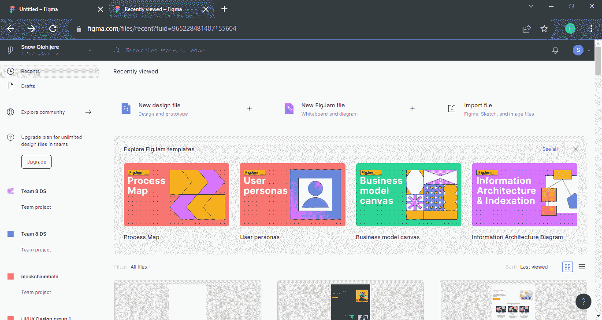

3.从顶部的选项中选择**插件**:

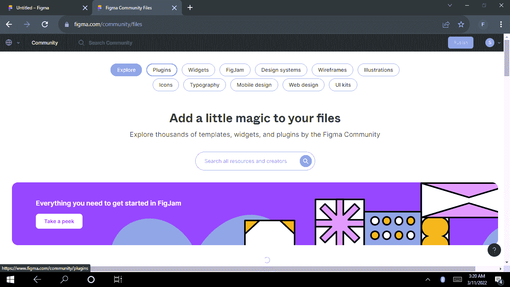

4.搜索您喜欢的插件并安装它:

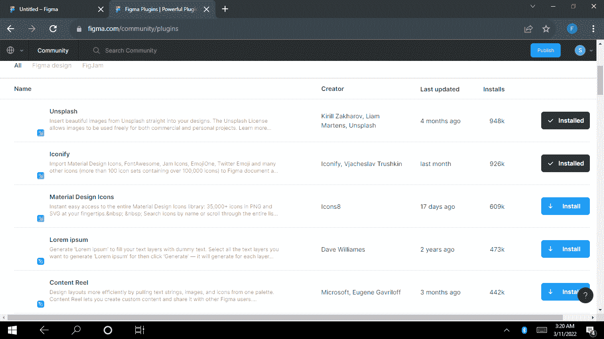

点击插件名称打开插件页面并了解更多信息。

你也可以看到你的 Figma 账户上已经安装的插件。

### ‌‌How 在文件中安装了一个插件

1.  右键单击画布–光标可以放在任何地方。

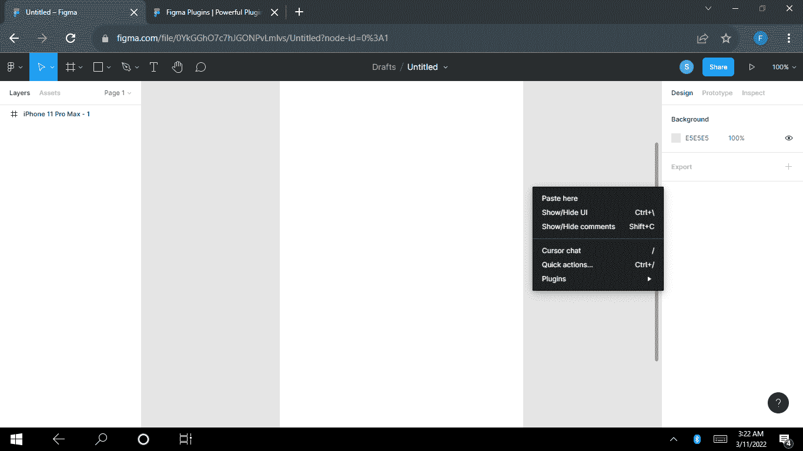

2.将光标悬停在**插件上，**将显示所有已安装的插件。

3.向下滚动到**浏览社区**中的插件并点击它。这将在一个单独的选项卡中打开 Figma 社区。

## ‌‌‌‌How 将在个人电脑上添加插件

‌‌There 有相当多的方法可以给你的设计添加插件。‌‌

### 从文件菜单添加插件

在 Figma 中访问屏幕左上角的文件菜单。文件菜单包含编辑、查看和文本等功能。你也可以从菜单中运行你的插件。

1.  点击**文件菜单**

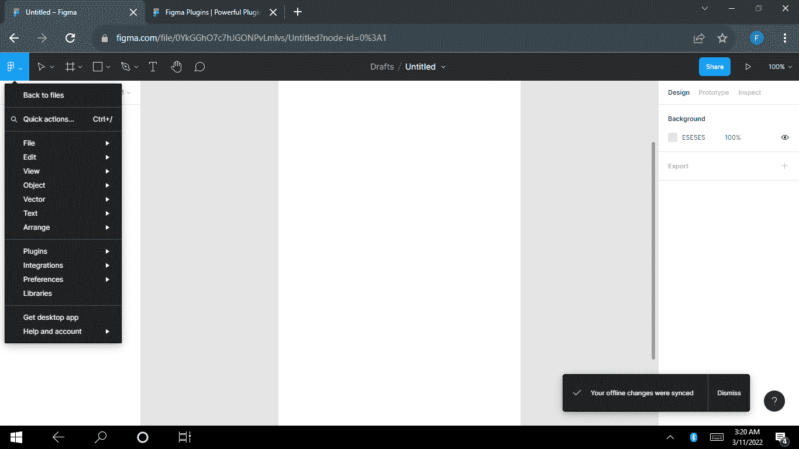

2.将光标悬停在**插件上，**将显示所有已安装的插件。

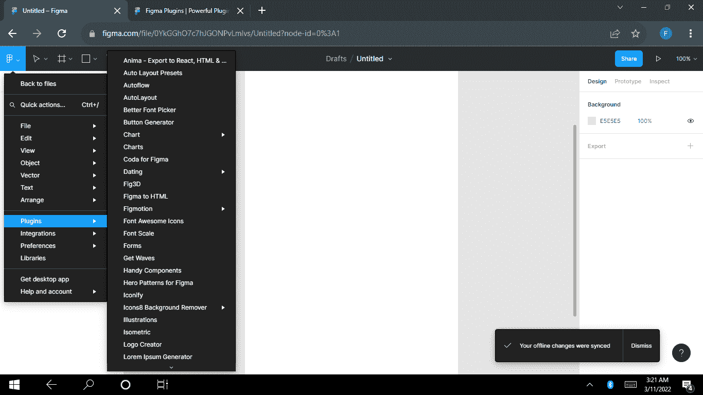

3.点击你喜欢的插件并将其应用到你的设计中。

### 如何用 Ctrl+/添加插件

这是一个**快速动作**，帮助你定位项目，包括 Figma 文件上的插件。

1.  按键盘上的 Ctrl +/键。此操作将导致弹出一个窗口。

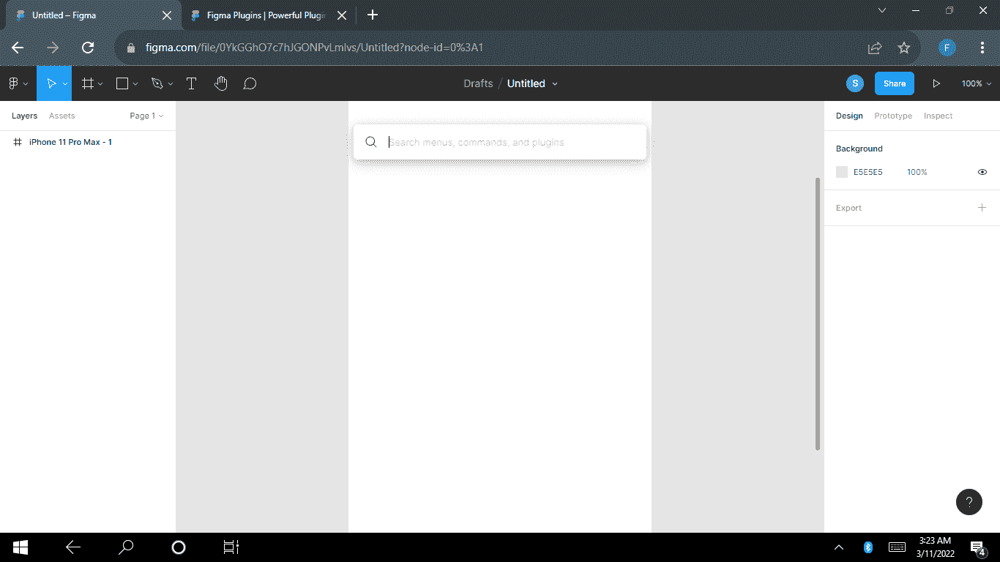

2.在弹出窗口中输入插件的名称。可能有名称相似的不同插件。在这种情况下，Figma 显示所有相关的插件，因此您可以选择您想要的插件。

3.按**键输入**或**点击**插件，一旦找到它，就开始在文件中使用它。

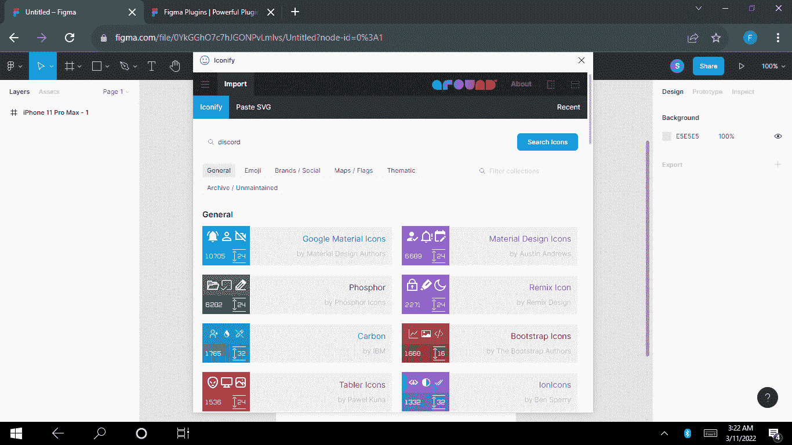

## 每个设计师都应该知道的 8 个 Figma 插件

有很多非常有用的 Figma 插件。这里有 8 个非常酷的。

### ‌‌Iconify

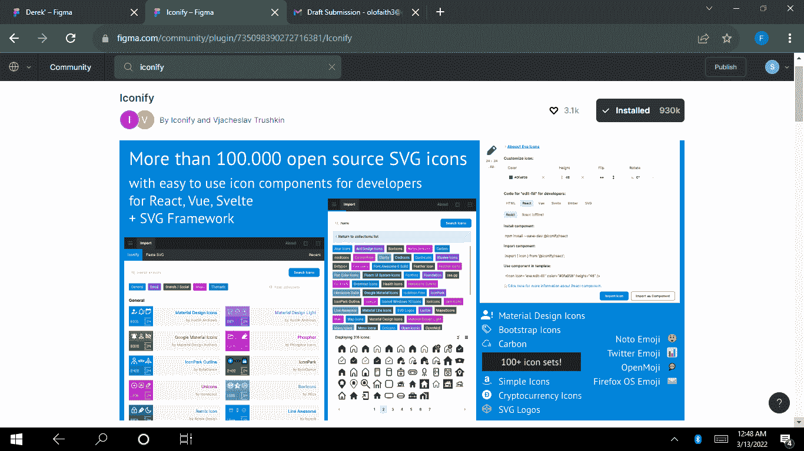

没有图标的设计可能看起来不完整。从 Google Material 图标到 Carbon 图标，这个 Figma 插件收集了大量的图标，许多开发人员用它们来创建漂亮、现代的用户界面。‌‌

你可以得到你喜欢的颜色、宽度、高度和大小的图标。你也可以用这个插件生成你的 SVG 图标。

### ‌‌Pattern 英雄

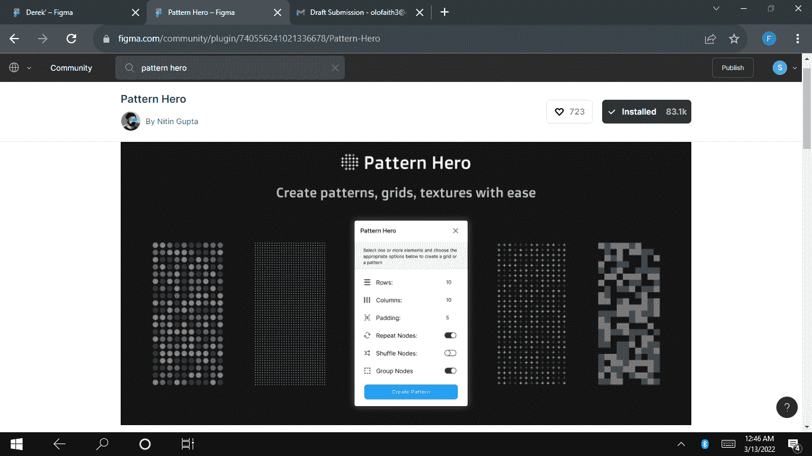

这个插件帮助你设计不同的漂亮图案。你可以改变模式，使用不同的模板。‌‌你也可以创建网格和纹理。

### 不溅

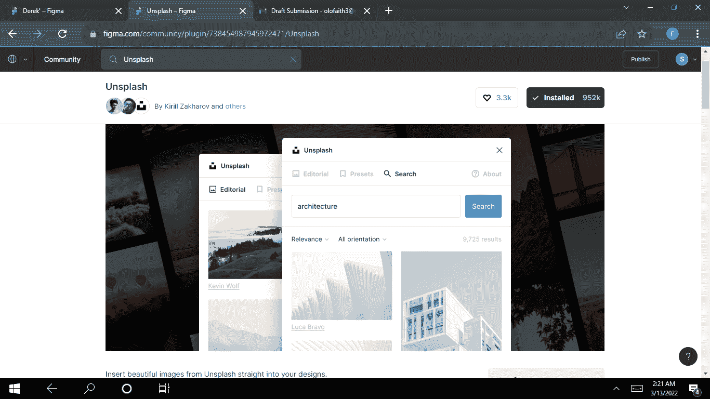

你需要美丽的图片来创造美丽的设计。这个神奇的插件可以帮助你点击一下就可以导入你设计的图片。

使用 Unsplash，你将不再需要浪费时间在各种门户网站上搜索图片——你可以直接下载免费图片到 Figma。你不需要担心照片的质量，因为未曝光的图像通常质量很高。

### 移除背景

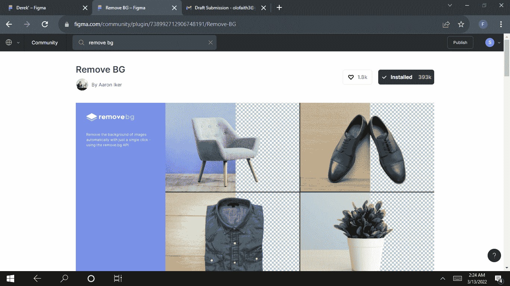

有时我们为自己的设计下载了漂亮的图片，却发现图片的背景与设计不符。

顾名思义，移除背景插件允许你移除图片的背景。请记住，在使用这个插件之前，你必须创建一个 [remove.bg](https://www.freecodecamp.org/news/p/b26f9177-65fe-46df-87cf-c21b8eb903e1/remove.bg.) 帐户。

### 地图

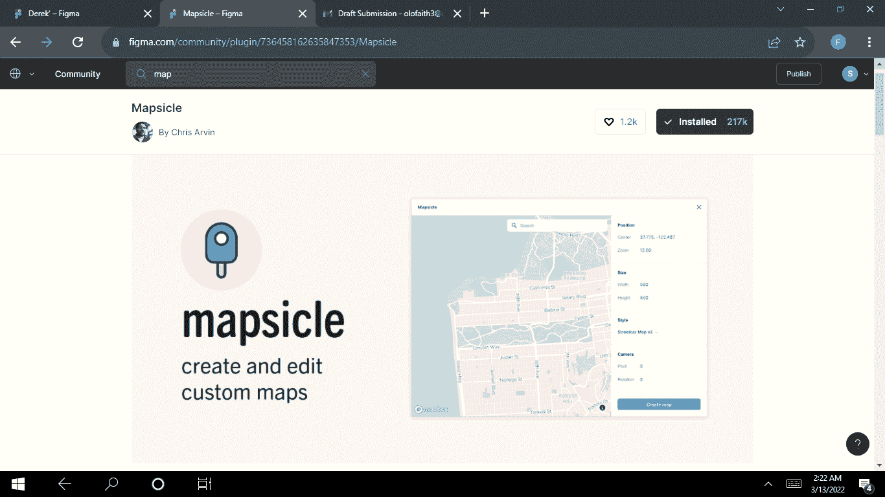

你再也不需要为地图使用截图了。Mapsicle 插件可以帮助你轻松地将地图放到你的设计中。

有了这个插件，你可以搜索世界上的任何地方，并在你的设计中嵌入地图。您还可以调整地图的样式。

### 用户界面渐变

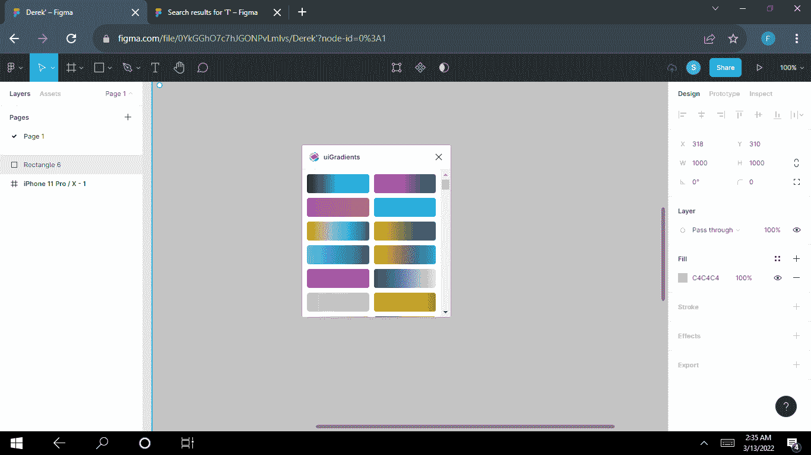

渐变让设计看起来独一无二。uiGradients 是一个很棒的渐变调色板，为您的下一个惊人的设计提供了大量现成的渐变。

有了这个插件，你就不用担心哪个色调最适合你的设计了。只需通过梯度，找到适合你的组合。

### ‌‌Table 发电机

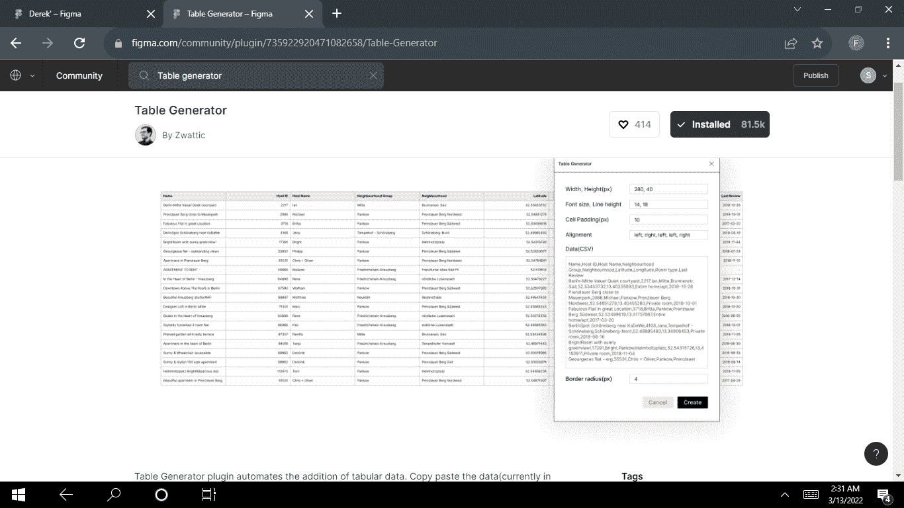

表格生成器节省你的时间，当你的数据表。你只需复制并粘贴你的数据，瞧！您的表已生成。

这个插件可以让你对齐文本，给你的单元格框架添加约束，等等。

### ‌‌StorySet

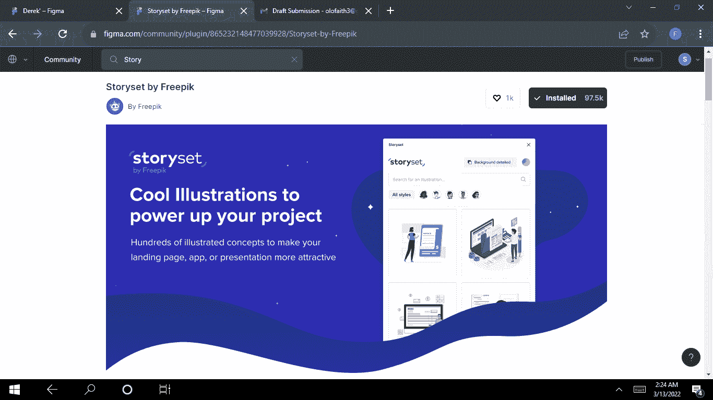

这是一个插图插件，可以让你在作品中添加插图。StorySet 包含数百个美丽的插图，您可以将其用于您的设计。此外，您可以编辑插图的颜色、样式和背景。你也可以制作动画。

## 结论

当你创建复杂的设计时，插件是必不可少的。只要找到对你有用的，并学习如何将它们添加到你的设计中。