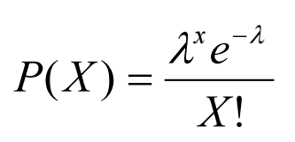
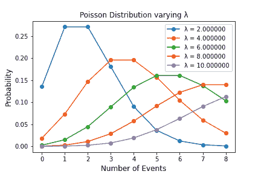

# 泊松分布–计算概率分布的公式

> 原文：<https://www.freecodecamp.org/news/poisson-distribution-a-formula-to-calculate-probability-distribution/>

概率分布在我们的日常生活中起着重要的作用。当我们试图从不同形式的数据中总结和获得洞察力时，我们通常会使用它们。

正因为如此，它们在数学、计算机科学、统计学和数据科学等领域是一个非常重要的话题。

数据主要有两种类型:**(例如整数和浮点数)，以及**(例如文本字符串)。****

****数字数据也可以有两种形式:****

*   ******离散:**这种形式的数据只能取有限数量的值(比如我们拥有的衣服数量)。我们可以从离散数据中推断出概率密度函数。****
*   ******连续:**另一方面，连续数据用于描述更抽象的概念，如权重/距离，可以采用任何分数或实数值。从连续的数据中，我们可以推断概率密度函数。****

****概率质量函数可以给我们一个变量等于某个值的概率。另一方面，概率密度函数值本身并不代表概率，而是首先需要积分(在考虑的范围内)。****

## ****什么是泊松分布？****

****泊松分布通常用于两个主要目的:****

*   ****预测一个事件在选定的时间段内会发生多少次。这种技术可以用于不同的风险分析应用，如房屋保险价格估计。****
*   ****根据事件在过去发生的频率，估计事件发生的概率(例如，未来两个月内断电的可能性有多大)。****

****泊松分布让我们对不同事件发生之间的平均时间有信心。然而，它们不能告诉我们事件可能发生的精确时刻(因为过程通常具有随机行为)。****

### ****线性与非线性系统****

****事实上，自然系统可以分为两大类:**线性**和**非线性(随机)**。****

****在线性系统中，原因总是先于结果，这产生了强烈的时间优先效应。****

****但是，当谈到非线性系统时，这并不成立，因为系统初始条件的微小变化会导致不可预测的结果。****

****考虑到我们的现实世界是多么复杂和混乱，大多数过程用非线性系统来描述更好，尽管线性近似有时是可能的。****

****泊松分布可以使用下图中的表达式建模，其中**用于表示在考虑的时间跨度内可能发生的事件的预期数量。******

********

 ****描述泊松过程的主要特征是:****

1.  ****两件事不能同时发生。****
2.  ****事件发生之间平均速率总体上是恒定的。****
3.  ****事件是相互独立的(如果一个事件发生，这对另一个事件可能发生的概率没有任何影响)。****
4.  ****事件可以发生任意次数(在考虑的时间跨度内)。****

## ****泊松分布的一个例子****

****在下图中，您可以看到改变一段时间内可能发生的事件的预期数量(λ)会如何改变泊松分布。下图是使用 Python 代码模拟的:****

```
**`import numpy as np
import matplotlib.pyplot as plt
import scipy.stats as stats

# n = number of events, lambd = expected number of events 
# which can take place in a period
for lambd in range(2, 12, 2):
    n = np.arange(0, 9)
    poisson = stats.poisson.pmf(n, lambd)
    plt.plot(n, poisson, '-o', label="λ = {:f}".format(lambd))
    plt.xlabel('Number of Events', fontsize=12)
    plt.ylabel('Probability', fontsize=12)
    plt.title("Poisson Distribution varying λ")
    plt.legend()
    plt.savefig('name.png')`**
```

****仔细观察这一模拟，我们可以发现以下模式:****

*   ****在每一种不同的情况下，分配给λ的数字对应于分布的峰值，然后逐渐远离峰值。****
*   ****在模拟过程中预期发生的事件越多，分布曲线下的预期面积就越大。****

********

****例如，这种类型的模拟可以用来减少去超市购物时的排队时间。****

****店主可以创建一个记录，记录有多少顾客在一周的不同时间和不同日子访问商店，以便将该数据拟合到泊松分布。****

****通过这种方式，可以更容易地确定有多少收银员应该在一天/一周的不同时间工作，以增强客户体验。****

## ****包扎****

****如果你有兴趣了解更多关于分布在随机环境中的应用，更多信息请点击[这里](https://towardsdatascience.com/stochastic-processes-analysis-f0a116999e4)。****

******希望您喜欢这篇文章，感谢您的阅读！******

### ****联系我****

****如果你想了解我最新的文章和项目[，请通过媒体](https://medium.com/@pierpaoloippolito28?source=post_page---------------------------)关注我，并订阅我的[邮件列表](http://eepurl.com/gwO-Dr?source=post_page---------------------------)。以下是我的一些联系人详细信息:****

*   ****[Linkedin](https://uk.linkedin.com/in/pier-paolo-ippolito-202917146?source=post_page---------------------------)****
*   ****[个人博客](https://pierpaolo28.github.io/blog/?source=post_page---------------------------)****
*   ****[个人网站](https://pierpaolo28.github.io/?source=post_page---------------------------)****
*   ****[帕特里翁](https://www.patreon.com/user?u=32155890)****
*   ****[中等轮廓](https://towardsdatascience.com/@pierpaoloippolito28?source=post_page---------------------------)****
*   ****[GitHub](https://github.com/pierpaolo28?source=post_page---------------------------)****
*   ****[卡格尔](https://www.kaggle.com/pierpaolo28?source=post_page---------------------------)****