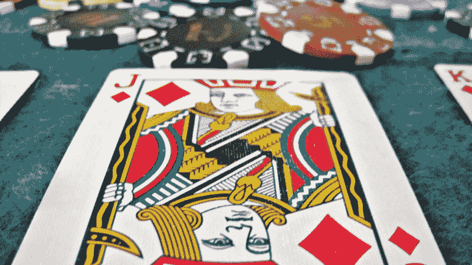
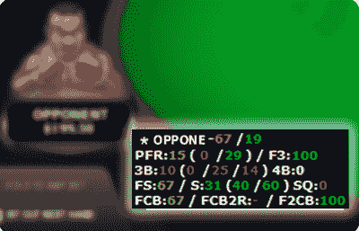
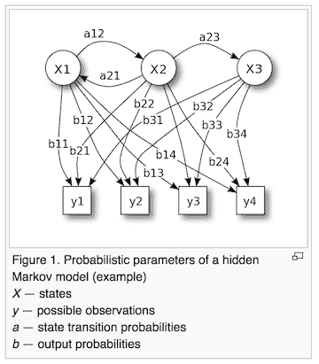
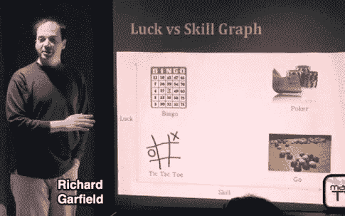
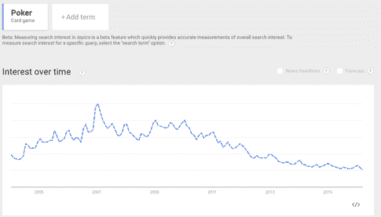
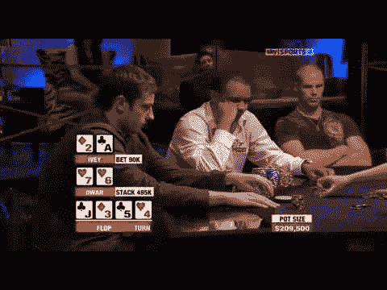
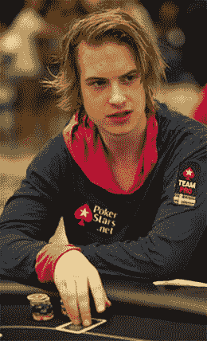
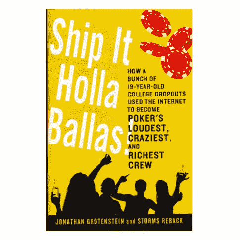
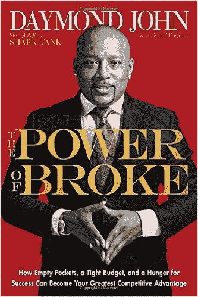
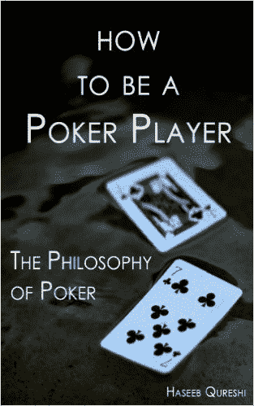

# 扑克和软件工程

> 原文：<https://www.freecodecamp.org/news/poker-and-software-engineering-e77963d5177c/>

杰夫·梅尔森

# 扑克和软件工程

随着一名扑克玩家成为软件工程师，人机交互的某些趋势变得显而易见:

*   人类扑克玩家在不久的将来会输给电脑
*   每个领域都被疯狂的人群所困扰
*   情绪劳动是一种竞争优势
*   创造力和自主性是成功的必要条件

这篇文章探讨了这些趋势，解释了为什么这些趋势对扑克玩家、软件工程师和其他人很重要。

**自动化游戏**

2008 年，扑克是人机共生的完美运动。【Tyler Cowen 所说的关于[自由式国际象棋](https://en.wikipedia.org/wiki/Advanced_Chess)也适用于扑克:

> 即使是非常强大的计算机也没有那种元理性意识来判断事物的模糊性。今天，人加机器的团队比机器本身更好。它展示了为什么总会有人的因素存在。

在扑克游戏中，拥有统计“平视”显示器的人可以做出比没有这种工具的人更具数学合理性的决定。

平视显示器创造了扑克版的“人机团队”。

[*平均水平超过*](https://www.google.com/url?sa=t&rct=j&q=&esrc=s&source=web&cd=1&cad=rja&uact=8&ved=0ahUKEwiNzZmw68zLAhVW22MKHdV2CoUQFggdMAA&url=http%3A%2F%2Fwww.amazon.com%2FAverage-Is-Over-Powering-Stagnation%2Fdp%2F0525953736&usg=AFQjCNGMtd-c5RSRlSTubgz-uug-WZVEaA&sig2=2l0CeC5zCxIc5wBxIef-5w) 的一个论点是，人类只有在找到一份人类推理为计算机解决问题的过程提供辩护价值的职业后，才能在未来就业。

如果人的责任是不可辩护的，人就会被排除。

在[随后的博客文章](http://marginalrevolution.com/marginalrevolution/2013/11/what-are-humans-still-good-for-the-turning-point-in-freestyle-chess-may-be-approaching.html)中，考恩提到了当计算问题不再需要人类帮助时可能发生的“翻转”:

> 很快，计算机程序可能足够好，以至于把人类加入计算机不会带来任何优势。(这种情况在跳棋中已经存在一段时间了，因为这个游戏已经完全解决了。)

> 想一想为什么这样的翻转可能正在进行中，尽管国际象棋还远未完全解决。

在过去的 10 年里，扑克玩家越来越多地被[机器](http://www.pokernews.com/news/2015/06/suspected-bots-on-pokerstars-under-investigation-21860.htm)击败。毫不奇怪，谷歌的 AlphaGo 打败了人类冠军 Lee Sedol。

如果谷歌决定在扑克上击败人类，对研究人员来说，这将是一个微不足道的练习。

扑克似乎不同于围棋或象棋，因为有不确定性。你从两张牌开始，但你不知道棋盘会如何发展。这似乎是命运在控制，不像围棋和象棋，没有随机因素。

只有 4 种花色和 13 个级别，扑克游戏有一个微不足道的分支因素。对于计算机来说，这种不确定性是如此之小，以至于它实际上是确定性的。

想象一下，如果 AlphaGo 必须学会按照以下规则玩一个版本的围棋:在每一回合开始时，掷一枚硬币。如果你输了，你就不能动了。适应这条规则是微不足道的。这就是扑克中不确定性的程度。

扑克、象棋和围棋的决策空间很小。规则永远不会改变，游戏规则永远不会改变，只有极小的不确定性。

计算机可以像评估隐马尔可夫模型一样评估一手扑克，但要训练计算机准确地建立模型，需要与 AlphaGo 团队同等的工作。

十多年来，职业扑克玩家的工作一直是人类追求的糟糕的长期选择，因为它容易受到自动化的影响。

像围棋、扑克和象棋这样的游戏可以通过我们今天所理解的机器学习技术实现自动化。规则、游戏棋子模式和目标都很容易定义，所以这些游戏适合进行*监督学习*和*强化学习*。

[Yann LeCun](https://en.wikipedia.org/wiki/Yann_LeCun) 抗议围绕 AlphaGo 胜利的炒作:

> 正如我在前面的陈述中所说的:大多数人类和动物的学习都是无监督的学习。如果智能是一块蛋糕，无监督学习就是蛋糕，监督学习就是蛋糕上的糖衣，强化学习就是蛋糕上的樱桃。我们知道如何做糖霜和樱桃，但是我们不知道如何做蛋糕。

> 在我们想到真正的人工智能之前，我们需要解决无监督学习的问题。这只是我们知道的一个障碍。那些我们不知道的呢？

扑克容易受到监督学习和强化学习技术的攻击，这些技术使 AlphaGo 在围棋中击败了 Lee Sedol。

[*监督学习*](https://en.wikipedia.org/wiki/Supervised_learning) *是从已标注的训练数据中推断出一个函数的机器学习任务。*数十亿手牌历史可供扑克机器人训练。这些手牌历史简短而有条理，非常适合自动机使用。

[*强化学习*](http://www.scholarpedia.org/article/Reinforcement_learning) *是通过与一个环境互动来学习。*扑克机器人可以在互联网上数以千计的免费或廉价扑克游戏中测试和并行化它们的策略。策略的[回报信号](http://www.scholarpedia.org/article/Reward_signals)可以定义为给定时间范围内的利润。

今天，幸存的人类专业人员互相残杀。不久，即使是最优秀的玩家也会因为机器人而输掉他们的钱。

用简单的监督学习和强化学习无法轻易解决的游戏，在不久的将来也不会实现自动化。例如《魔法:聚会》、《模拟城市》、《《我的世界》》和《龙与地下城》。

这些游戏的特点包括:

*   不确定点处的大分支因子
*   具有难以标准化的游戏人物模式的大型游戏人物语料库
*   非负和性质
*   主观玩家目标
*   变化很大的游戏结束状态和获胜条件

在围棋、国际象棋和扑克中，规则、成功和失败很容易定义。

相比之下，很难解释是什么造就了一名理想的《我的世界》球员。不同的《我的世界》球员有不同的目标和获胜条件。我们没有办法监督一台计算机在《我的世界》取得成功，或者奖励一台计算机令人满意的《我的世界》行为。

扑克有 52 种棋子类型，象棋有 6 种，围棋有 1 种。魔术:聚会有 16，000+独特的卡片。我们不知道如何教计算机理解这 16000 种不同卡类型之间复杂的战略关系。

龙与地下城是合作的，正和的，高度随机的，以主观玩家目标为导向的。电脑不会很快与天才地下城主的创造性和功利主义相匹敌，因为我们没有一个好方法来编纂一个成功的龙与地下城游戏的特征。

作为人类，这些是我们应该学习和庆祝的游戏。

在过去 30 年游戏复兴之前，围棋、象棋和扑克是很好的消遣方式。今天，有更好的游戏。

AlphaGo 证明了围棋只是另一个可以自动化的例程，就像快餐准备或卡车驾驶一样。

与其把时间花在国际象棋、围棋或扑克上，不如把人类的时间花在模拟计算机难以应对的活动的游戏上。

今天选择职业扑克玩家就像选择成为优步司机或亚马逊仓库工人:你正等着被自动化带走。

**疯狂的人群**

在扑克和软件中，市场参与者混淆了技术分析和基本面分析。

> 技术分析*是一种[证券分析](https://en.wikipedia.org/wiki/Security_analysis)方法，通过研究过去的市场数据，主要是价格和交易量，预测[价格](https://en.wikipedia.org/wiki/Prices)的方向。*

> *与技术分析相对照的是* [基本面分析](https://en.wikipedia.org/wiki/Fundamental_analysis) *，研究影响投资者对金融市场定价方式的[经济](https://en.wikipedia.org/wiki/Economic)因素。技术分析认为，价格已经反映了所有潜在的基本面因素。*

纯技术分析师教条地相信大众的智慧。

技术分析师认为没有秘密，人类对未来的所有知识都被纳入了大众对现在的评价。

使用第一原则对市场进行推理会导致与大众智慧不同的决策。这是*基本面*分析的一种形式。

2003 年，一位名叫 Chris Moneymaker 的会计师成为业余扑克玩家，赢得了世界扑克锦标赛。与此同时，ESPN 增加了对该事件的视频报道。人们开始去餐馆看扑克，就像看超级碗一样。

随着扑克风靡全球，许多不熟练的玩家开始玩这种游戏。

在 2004 年，任何一个精通电脑的青少年都可以学习玩扑克，从那些试图成为下一个 Chris Moneymaker 的众多没有技能的美国人那里拿钱。

有大量关于如何在网上扑克中获胜的信息，学习这些信息并不需要太多努力就能成功。

对于擅长网络游戏的青少年来说，这是一场淘金热。从《星际争霸》和《在线魔术》等游戏中获得技能的青少年很快学会了扑克，并开始淘汰不熟练的业余玩家。

2006 年，随着 UIGEA 的[通过，在线扑克泡沫出现了漏洞。2006 年的《非法网络赌博强制法》使得业余玩家很难用信用卡为他们的在线扑克账户提供资金。](https://en.wikipedia.org/wiki/Unlawful_Internet_Gambling_Enforcement_Act_of_2006)

2008 年，全球经济崩溃，进一步减少了网上休闲赌徒的数量。

2011 年[黑色星期五](https://en.wikipedia.org/wiki/United_States_v._Scheinberg)发生，人们发现 Full Tilt Poker 是一个庞氏骗局。

自 2006 年以来，在线扑克变得越来越难，越来越多的扑克玩家抱怨扑克的宏观环境。

Google Trends 称，在 2006 年末通过 UIGEA 之后，扑克的受欢迎程度下降了 80%。

自 2006 年以来，扑克玩家一直在说:“没有更弱的业余选手了。我们都在互相争斗，因为我们都有相同的策略，所以我们本质上是在互相投掷硬币。扑克已经成为一种完全不同的游戏。”

这些对丹·凯茨、T2、迈克·麦克唐纳和 T4 来说都无关紧要。他们的策略比他们的对手好得多，因此他们有一个基本的机会。尽管竞争激烈，他们还是不断获胜。

普通扑克玩家既不创新也不适应，他们认为 2006 年至 2011 年的事件对他们作为职业扑克玩家的生存能力构成了根本威胁，而事实上这些问题本质上是*技术*。

市场的细节发生了变化，但*基本面*机会依然存在:最好的玩家仍然拥有足够的优势，可以通过玩扑克大赚一笔。

当投资者和企业家谈论硅谷的“泡沫”时，他们谈论的是技术泡沫。不是*根本不是*泡沫。

廉价的云计算、手机、中国和印度的新兴市场、社交网络、Docker、比特币、供应链经济学、无人机、金融科技、虚拟现实:这些都是具有巨大增长潜力的*基本面*机会。

当投资者和企业家谈论“冬天如何到来”时，他们恐慌的理由是什么？

*技术*与驱动增长的突破性技术的可行性关系不大的分析。

机构投资者退出私募市场？中国是纸牌屋？石油？希腊？1999 年的技术图表模式反映了现代私人市场的上涨？送餐创业公司被其他创业公司扶持？

当投资者试图揣测私人市场的真实本质时，没有什么比看着彼此而不是基本面更能说明大众的疯狂了。

声称以长期思维为傲的投资者往往忘记了决定公司长期生存能力的技术基本面。

从 2006 年到 2011 年，成千上万的职业扑克玩家退出了游戏，他们相信某个流行的说法是正确的:扑克最终成为了一种运气游戏。

> 当你把它想象成一张彩票时，当你说‘这可能行得通，这可能行不通，我不知道’时，你已经让自己做好了失败的心理准备。你说服自己不要做那么多工作。这些年来我们做得最好的地方是我们有很多信念的地方，是我们愿意投入大量资金的地方。”

> [*——彼得·泰尔*](http://www.inc.com/jeff-bercovici/peter-thiel-startup-red-flags.html)

当泡沫破裂时，弱牌玩家退出，因为他们确信扑克变得如此竞争激烈，以至于不可能有有效的差异化策略。

相信自己创造力的扑克玩家继续通过努力工作和学习来谋生。

在不久的将来，从众心理技术投资者的[反投资组合](https://www.bvp.com/portfolio/anti-portfolio)将以前所未有的速度膨胀，因为投资者错误地互相寻找指导，而不是看我们当前的技术繁荣所提供的根本机会。

**情绪劳动**

2004 年和 2005 年，大学生和受过良好教育的雅皮士开始玩扑克，因为这是一种低风险、容易赚钱的方式。富裕的业余美国扑克玩家输给了这些大学生和雅皮士。

这两个级别的运动员在技术上有很大的差异。

大学生和雅皮士阅读有关统计学、心理学和复杂扑克策略的书籍。富裕的业余美国人在电视上看扑克，并试图模仿他们在屏幕上看到的专业人士的做法。

对于受过良好教育的大学生和雅皮士来说，在高赌注扑克游戏中取得成功的唯一要求就是耐心。

耐心很重要，因为富有的业余美国人玩得太差了，以至于一个大学生可以坐在那里等待机会，以 10:1 的优势将钱投入底池。

从 2006 年到 2011 年，立法和经济环境将许多美国业余选手挤出了这项运动。随着富有的业余玩家从扑克中消失，高赌注领域成为 95%的专业人士。

在 2005 年，平均 6 人在线扑克桌上有 3 名职业玩家和 3 名业余玩家。2006 年，平均每张牌桌上有 4 名专业人士、1 名熟练的业余爱好者和 1 名不熟练的业余爱好者。到 2008 年，大多数赌桌都坐满了专业人士和熟练的业余玩家。

弱小的对手无处可寻。

在这个几乎全是职业扑克玩家的新世界里，情绪弹性比耐心更重要。

职业选手再也不能等待 10:1 或 5:1 的优势了。胆小的大学生和雅皮士保持着耐心的、缺乏创造性的策略，他们开始亏损。

混乱、极度好斗的玩家开始迫使游戏朝着方差增加的方向发展，让他们的对手质疑他们假定的毁灭风险。这方面最极端的例子是 Viktor Blom，他是一个高注额玩家，他破产的意愿似乎超过了他的恐惧，这导致了他经常对底池下超注的风格。

与 Viktor Blom 比赛的职业选手知道，在短时间内，与其他人比赛相比，他们会输掉更多的钱，或者赢得更多的钱。

对于 Viktor Blom 来说，使用这种策略的主要成本是，当你比你的对手更频繁地赢得和输掉数百万美元时，情绪控制更难维持。

这个交易是值得的。Viktor Blom 的聪明策略给他带来了数学优势和 T2 声誉优势。

为什么这与软件工程相关？

> 我们每个人都有情绪劳动，但它很少被用作竞争优势。

> *——塞思·戈丁*

Viktor Blom 通过投入情感劳动获得了巨大的竞争优势。

他故意以一种让桌上每个人都不舒服的方式玩扑克，因为他认为自己比其他人更有能力应对这种不舒服。

大多数软件工程师都避免情绪劳动。

当软件工程师选择在大公司工作，因为它看起来豪华和安全，他们犯了一个错误。对于工程师来说，这是他们在职业生涯中冒极大风险的最佳时机。

软件工程师享有难以置信的特权。我们的朝九晚五的工作是令人愉快和富有创造性的，我们中的许多人有大量的空闲时间做我们想做的任何事情。在空闲时间，软件工程师应该伸展自己，发挥情绪劳动，看看他们有什么能力。

2005 年，职业扑克玩家可以选择无忧无虑的生活方式。我们认为在线扑克的淘金热永远不会结束。我们中的许多人对待金钱都很不负责任，就好像我们能够在余生中每月赚到 30，000 美元。

当扑克经济崩溃时，许多职业扑克玩家的生活也随之崩溃。我们已经习惯了美好的生活，但我们还没有努力工作来充分利用眼前的机会。

在 2003 年至 2007 年的繁荣时期努力工作和聪明工作的扑克玩家能够从萧条中幸存下来。

大多数扑克玩家在繁荣时期并不努力和聪明。

在 2005 年，当游戏很容易的时候，大多数扑克玩家都不练习*情绪劳动*。当 2008 年扑克变得困难时，这些玩家很脆弱。大多数职业扑克玩家无法适应新的竞争环境。

相比之下， [Viktor Blom 在 2005 年左右开始玩扑克后不久就习惯了高风险活动:](https://en.wikipedia.org/wiki/Viktor_Blom)

> *玩了几个星期后，Blom90 的坐满即玩奖金通常为 530 美元。又玩了几个月之后，15 岁的 Viktor Blom 在不同的网站总共赚了 275，000 美元。然后，他把所有的钱都集中到一个网站上，开始玩买入费较高的现金游戏和坐满即玩锦标赛。这导致他损失了所有的钱。然后，他积累了一笔资金，在同一个网站上存入了$3，000，他加入了买入费很高的坐满即玩锦标赛，开始赢得越来越多的钱。在他的资金回升到$50，000 后，他参加了$310 的坐满即玩常规游戏，但又一次输得精光。*

维克多·布鲁姆十几岁的时候破产过两次。

破产并不总是好事。对于一些扑克玩家来说，破产是一种瘾。他们将从积累大量金钱、最终却失去所有的狂躁抑郁循环中走出来。

维克多·布鲁姆从他早期破产的经历中变得反脆弱。

这远在他 2009 年连胜之前。当扑克经济崩溃时，它并没有严重影响 Viktor Blom，因为他多年来一直在努力挑战自己。

在他职业生涯的早期，维克多坚持不懈地冒险。2005 年扑克经济的强势让他每次破产时都能重建资金。

今天的软件工程师应该像 2005 年的 Viktor Blom 一样。

Viktor Blom understood the power of broke

在 2005 年，Viktor 在玩高注额游戏时可能会输掉他的全部资金，但在中等注额游戏中很容易就能赢回。通过增加短期破产风险，他降低了长期破产风险。

2016 年，一个软件工程师可以辞掉一份企业工作，做 6 个月的副业项目。如果没有一个副业项目变成适销对路的产品，那位工程师总是可以回到公司，并且由于从副业项目中学到的新技能，他可能会要求更高的薪水。

冒险是一种情绪劳动的行为。

软件工程师可以打造一个产品，创业，编写算法，发射火箭，或者编写自动驾驶汽车的程序。所有这些活动都需要风险。但是许多软件工程师利用业余时间从事风险很低的活动。

如果你致力于做一个愿意承担风险、致力于情感劳动的软件工程师，你很容易就能脱颖而出。

建造自己的船

我十几岁的时候玩扑克，直到二十出头才写了一行代码。我认识的大多数成功的工程师都是在十几岁的时候编写代码的。

为了赶上进度，我不得不利用我在玩扑克时学到的技巧。

今天许多新工程师面临着同样的问题。

你正在把学习编程作为第二职业，这可能会感觉非常困难，因为这感觉就像你正在抛弃过去的一切，从头开始。

无论你是被培养成一名咖啡师、销售人员还是生物学家，你都必须从过去的经历中找到可以带入你的软件工程师职业生涯的技能。

咖啡师非常擅长排序操作，这些操作并不像看起来那么琐碎。销售人员知道如何在高风险项目中与客户合作并满足他们的需求。生物学家理解抽象概念，以及如何孤立地思考系统的各个部分。

作为一个局外人起初是一个劣势，但随着时间的推移，它有着巨大的价值。

你过去做过的每一份工作都有可以应用于软件工程的可转移技能。从过去的经历中找出你的优势可以帮助你更加自信。

当你开始成为一名软件工程师时，许多开发人员会告诉你该做什么，以及你应该如何行动。

这些人说:学 JavaScript。去一个编码训练营。为所有代码编写测试。学习制作手机应用。使用 StackOverflow。学习函数式编程。成为命令行高手。

每个人学习软件工程的方式不同。

软件工程是一门艺术。作为艺术家，要取得成功，我们必须决定我们想要使用什么工具和方法。我们必须自己决定。

扑克也是一门艺术，没有客观的“最佳”玩法。扑克玩家通过多年的主观经验发展他们的艺术形式。

Haseeb Qureshi 在“扑克如造船”中描述了这一点，这是他的杰作[扑克哲学](http://www.amazon.com/How-Be-Poker-Player-Philosophy-ebook/dp/B00HFDJU6A/ref=sr_1_1?ie=UTF8&qid=1458343923&sr=8-1&keywords=philosophy+of+poker)中的一部分:

> *想象你的扑克游戏是一艘船，而你，扑克玩家，是造船者。*

> 你的船不是你的延伸。它不是存在于你头脑中的内在的东西。相反，我们希望把扑克游戏想象成一个外在的物体——你的物体，当然，是你的工艺和努力工作的产物，但仍然是“在那里”存在的东西，随时可以被分析、被拆开、又被组装起来。作为一名造船者，你有很多选择来制造你的船。

> 你想建立什么样的扑克游戏？

> 你远眺扑克之海，看到成千上万艘船，它们的构造都各不相同，在它们的构造背后似乎有着不同的想法和意图。很自然，你只想选择最好的船来模仿。因此，你观看伟大玩家的视频，在高风险游戏中挥汗如雨，阅读写得很好的文章——并试图按照他们的样子打造你的船。

> 但是这个过程中有一个致命的谬误:不管你看多少艘船，不管是几百艘还是几千艘，即使是质量最好的船，再多的研究也无法让你为自己建造一艘。因为观察*船只和*实际建造*船只是完全不同的过程。即使你看到一百艘船已经解决了如何建造一艘船，如何保持它直立，如何平衡船体和桅杆的问题——你仍然必须通过建造*来解决这些问题。你必须学会如何建造一艘船，不仅在你的头脑中，而且在你的手中。**

作为一名扑克玩家，我失败了，因为我复制了我看到的其他人的做法，而没有理解其背后的推理。作为一名扑克玩家，我没有建造自己的船。

如果你的战略是模仿他人，你就无法在全球人才库中脱颖而出。你无法将自己与每天变得越来越聪明的机器区分开来。

作为一名软件工程师，我尽量不去犯盲目抄袭流行事物的错误。十年前，我损失了大部分的钱，因为我只是简单地跟着别人做。

有这样一个与复制他人相关的痛苦史是有用的。

对大多数人来说，盲目抄袭他人减轻了痛苦。当我觉得自己在抄袭别人却不知道为什么时，我的本能反应是对自己的抄袭倾向感到羞愧和恐惧。

如果你不模仿其他工程师的行为，你的经理就不能把你当作一个高度可预测的商品。你不能被旋转起来，分配给一个像 EC2 集群这样的任务。

如果你不是一个高度可预测的商品，你可能会被解雇或提升。

不幸的是，大多数公司并不是为了支持或鼓励企业家行为而成立的。

许多软件工程师最终陷入了让他们不开心的工作，因为他们只是接受命令，而不是自己考虑事情，考虑所有的选择，并看到更大的图景。

软件工程师需要建造自己的船。

如果你作为软件工程师的策略是只复制你已经看到的东西，你将会跟随人们进入旧技术。你将在拥挤的市场中开办公司。你会发现你周围都是害怕创造自己的战略、技术和产品的人。

如果你建造自己的船，这个世界充满了机会。