# Java 教程中的多态性——带有面向对象编程示例代码

> 原文：<https://www.freecodecamp.org/news/polymorphism-in-java-tutorial-with-object-oriented-programming-example-code/>

多态允许以可替换的方式对待对象。当您希望对不同类型的对象执行相同的操作时，这可以减少代码的重复。多态性字面意思是“*多种形式*”。

让我们解释一下这到底是什么意思。

## 用类比法解释多态性

如果你有过国际旅行，你的打包清单上的一项很可能是电插头适配器。否则，您可能无法为手机和其他设备充电。

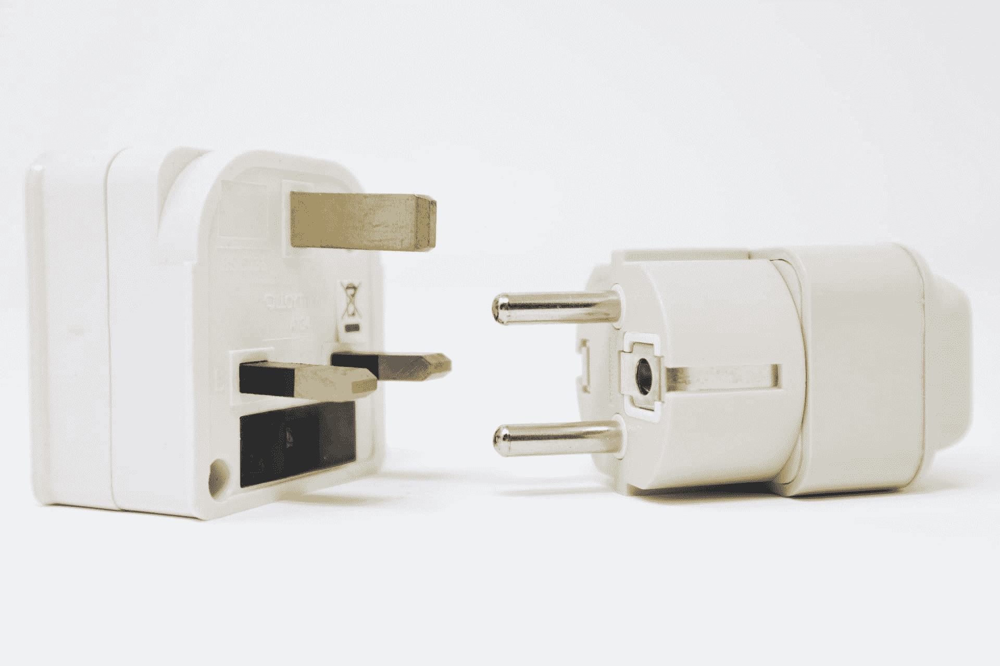

Photo by [Call Me Fred](https://unsplash.com/@callmefred?utm_source=unsplash&utm_medium=referral&utm_content=creditCopyText)

奇怪的是，全世界大约有 16 种不同类型的电源插座。有些有 2 个引脚，有些有 3 个引脚，有些引脚是圆形的，有些引脚是矩形的，引脚的配置各不相同。

大多数人采取的解决方案是购买通用插头适配器。

从另一个角度来看这个问题，通常问题是我们有一个套接字接口，它只接受一种类型的插头对象！套接字不是多态的。

如果我们有能接受许多不同类型插头的插座，生活对每个人来说都会容易得多。我们可以通过创建不同形状的缝隙来使套接字接口多态。你可以在下图中看到这是如何做到的。


多态性帮助我们创建更多的通用接口。

## 代码解释

任何具有 IS-A 关系的对象都被认为是多态的。通过继承(在类签名中使用*扩展*关键字)，或者通过接口(在类签名中使用*实现*关键字)，你有一个 IS-A 关系。

要完全理解多态性，您还应该理解继承和接口。

```
class Dog extends Animal implements Canine{
 // ... some code here
} 
```

基于上面的片段，a `Dog`有以下 IS-A 关系:`Animal`、`Canine`、`Object`(每个类都隐式继承自[对象类](https://docs.oracle.com/javase/7/docs/api/java/lang/Object.html)，听起来有点可笑！).

让我们举一个简单(愚蠢)的例子来说明如何使用多态性来简化我们的代码。我们想创建一个带有询问器的应用程序，可以说服任何动物说话。

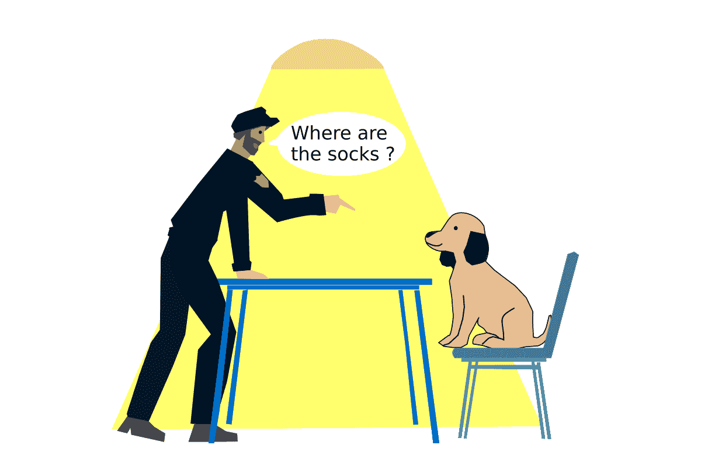

我们将创建一个负责说服动物说话的`Interrogator`类。我们不想为每种动物写一个方法:`convinceDogToTalk(Dog dog)`、`convinceCatToTalk(Cat cat)`等等。

我们更喜欢一种通用的方法，可以接受任何动物。我们如何做到这一点？

```
class Interrogator{
    public static void convinceToTalk(Animal subject) {
        subject.talk();
    }
}

// We don't want anyone creating an animal object!
abstract class Animal {
    public abstract void talk();
}

class Dog extends Animal {
    public void talk() {
        System.out.println("Woof!");
    }
}

class Cat extends Animal {
    public void talk() {
        System.out.println("Meow!");
    }
}

public class App {
    public static void main(String[] args){
        Dog dog = new Dog();
        Cat cat = new Cat();
        Animal animal = new Dog();

        Interrogator.convinceToTalk(dog); //prints "Woof!"
        Interrogator.convinceToTalk(cat); //prints "Meow!"
        Interrogator.convinceToTalk(animal); //prints "Woof!"
    }
} 
```

我们创建了`convinceToTalk`方法来接受一个`Animal`对象作为参数。在这个方法中，我们称这个对象为`talk`方法。只要对象类型是一个`Animal`或者是`Animal`的子类，编译器就会很高兴。

Java 虚拟机(JVM)在运行时根据对象的类决定调用哪个方法。如果对象的类型是`Dog`，JVM 会调用“Woof！”。

这有两种回报方式:

1.  我们只需要写一个通用方法。我们不需要做任何类型检查。
2.  将来，如果我们创建一个新的动物类型，我们不需要修改`Interrogator`类。

这种类型的多态性被称为重写。

## 最重要的

我们讨论的例子已经涵盖了覆盖的广泛概念。让我们给出一个正式的定义和更多的细节。

当你在一个相关的类中创建一个**完全相同的实例方法**(相同的方法签名)的不同实现时，你就可以重写。

在运行时，选择**对象类型**的方法。这就是重写也被称为运行时多态性的原因。

重写是通过在子类(子类)中提供一个方法的不同实现来实现的，这个方法是在其父类(超类)中定义的。

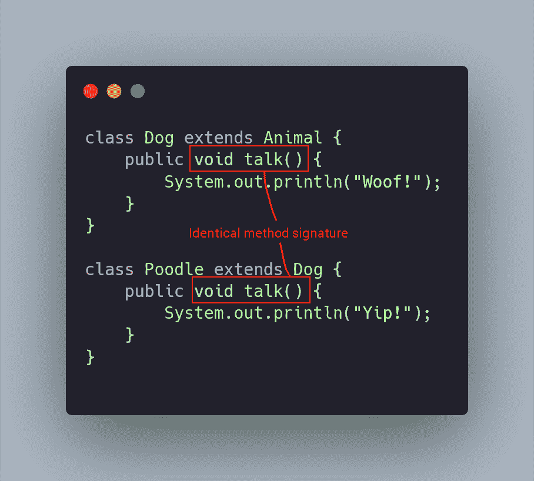

还可以通过提供接口中定义的方法的不同实现来实现重写。

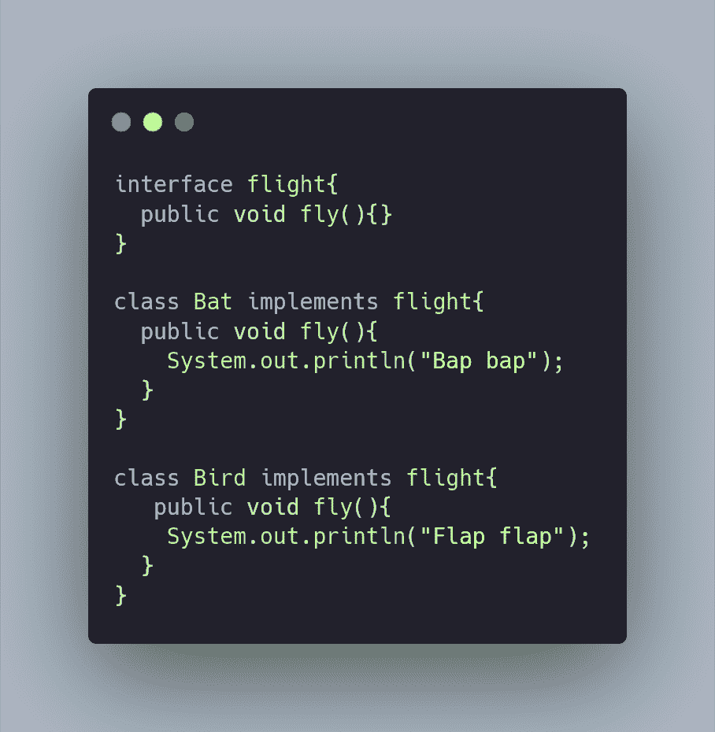

重写方法的规则:

1.  必须是通过 IS-A 关系定义的方法(通过`extends`或者`implements`)。这就是为什么你会发现它被称为子类型多态性。
2.  它必须具有与原始方法定义相同的参数列表。
3.  它必须具有相同的返回类型，或者是原始方法定义的返回类型的子类。
4.  它不能有更严格的访问修饰符。
5.  它可能有一个限制较少的访问修饰符。
6.  它必须*而不是*抛出一个新的或更广泛的检查异常。
7.  它可能抛出更窄、更少或没有检查的异常，例如声明 *IOException* 的方法可以被声明 *FileNotFoundException* 的方法覆盖(因为它是 *IOException* 的子类)。
8.  重写方法可以引发任何未检查的异常，不管重写方法是否声明了该异常。

> 建议:在重写方法时使用 *@override* 注释。它提供了对方法签名的编译时错误检查。这将帮助你避免违反上面列出的规则。

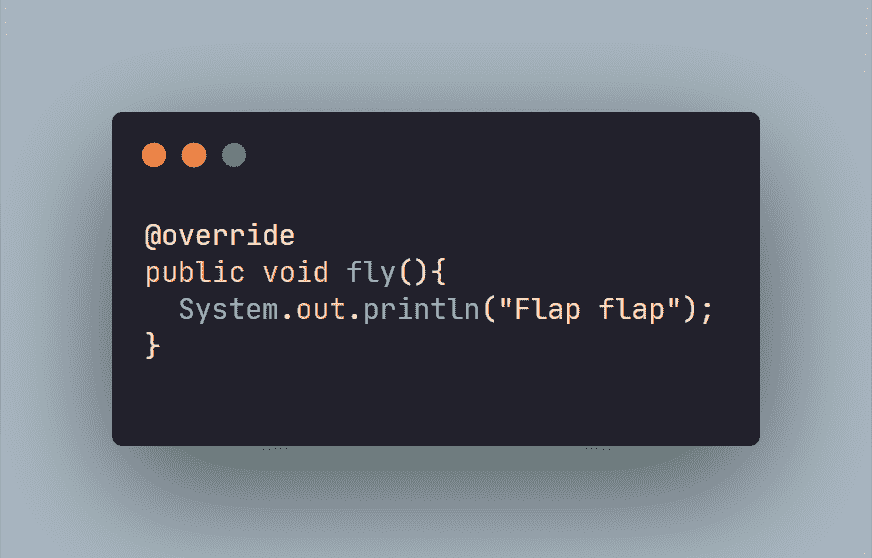

### 禁止覆盖

如果你不想让一个方法被重写，就把它声明为 final。

```
class Account {
    public final void withdraw(double amount) {
        double newBalance = balance - amount;

        if(newBalance > 0){
        	balance = newBalance;
        }
    }
} 
```

### 静态方法

**您不能覆盖静态方法**。您实际上是在相关类中创建一个*独立的*方法定义。

```
class A {
    public static void print() {
        System.out.println("in A");
    }
}

class B extends A {
    public static void print() {
        System.out.println("in B");
    }
}

class Test {
    public static void main(String[] args) {
        A myObject = new B();
        myObject.print(); // prints “in A”
    }
} 
```

运行上面例子中的`Test`类将打印“in A”。这表明这里没有发生重写。

如果您通过从方法签名中删除`static`将类`A`和`B`中的`print`方法更改为实例方法，并再次运行`Test`类，它将改为打印“in B ”!超越现在正在发生。

记住，覆盖是基于对象类型而不是变量类型来选择方法的。 🧐

## 重载(函数多态性)

重载是指创建同一方法的不同版本。

方法的名字必须相同，但是我们可以改变参数
和返回类型。

在 Java 的[数学类](https://docs.oracle.com/javase/8/docs/api/java/lang/Math.html)中，你会发现很多重载方法的例子。对于不同的类型，`max`方法被重载。在所有情况下，它都从提供的 2 个值中返回具有最高值的数字，但它是针对不同的(不相关的)数字类型。

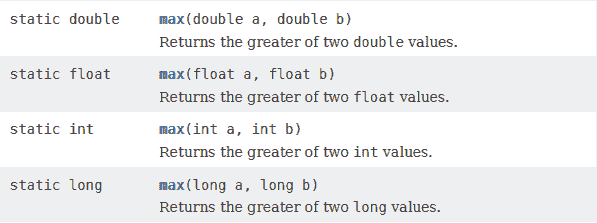

(引用)变量类型决定了选择哪个重载方法。重载是在编译时完成的。

重载方法为使用你的类的人提供了更多的灵活性。使用您的类的人可能有不同格式的数据，或者可能有不同的数据可供他们使用，这取决于他们应用程序中的不同情况。

例如，[列表](https://docs.oracle.com/javase/8/docs/api/java/util/List.html)类重载了`remove`方法。列表是对象的有序集合。因此，您可能希望删除列表中特定位置(索引)的对象。或者你可能不知道位置，只想把物体无论在哪里都移走。这就是为什么它有两个版本。

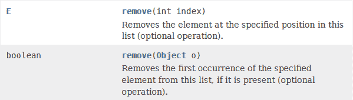

构造函数也可以重载。

例如， [Scanner](https://docs.oracle.com/javase/8/docs/api/java/util/Scanner.html) 类有许多不同的输入，可以用来创建一个对象。下面是满足这种需求的构造函数的一个小快照。

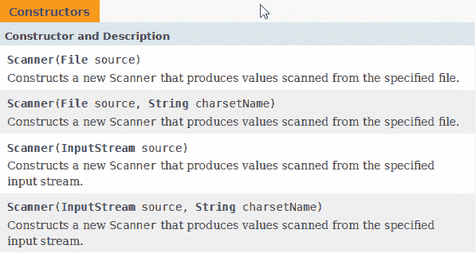

重载方法的规则:

1.  它必须有不同的参数列表。
2.  它可能有不同的返回类型。
3.  它可能有不同的访问修饰符。
4.  它可能抛出不同的异常。
5.  超类的方法可以在子类中重载。

## 重写和重载之间的区别

1.  重写必须基于 IS-A 关系中的方法，重载不必如此。重载可以发生在单个类中。
2.  基于对象类型选择重写方法，而基于(引用)变量类型选择重载方法。
3.  重写发生在运行时，重载发生在编译时。

## 参数多态性

参数多态是通过 Java 中的[泛型](https://docs.oracle.com/javase/tutorial/extra/generics/index.html)实现的。

泛型是在 5.0 版本中添加到语言中的。它们旨在扩展 Java 的类型系统，以允许“一个类型或方法在提供编译时类型安全的同时对各种类型的对象进行操作”。

基本上，类或方法的一般形式可以替换它的所有类型。

一个简单的例子是[数组列表](https://docs.oracle.com/javase/8/docs/api/java/util/ArrayList.html)。类定义中有一个泛型，用`<E>`表示。一些实例方法如`add`在它们的签名中使用这种通用类型。

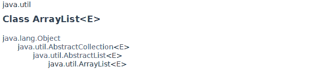

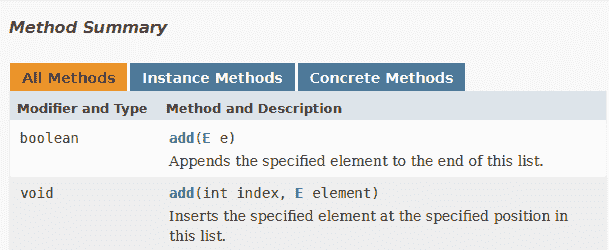

当我们创建一个`ArrayList`对象时，通过在尖括号中提供一个类型，我们填充了整个类中定义的通用引用。所以，如果我们用`Dog`泛型类型创建一个`ArrayList`，那么`add`方法将只接受一个`Dog`对象作为参数。

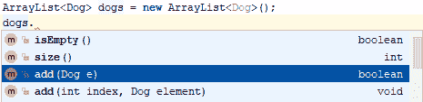

如果您试图添加除了`Dog`之外的任何东西，就会出现编译时错误！如果你使用像 IntelliJ 这样的代码编辑器，你会得到红色的曲线来突出你的错误(如下)。

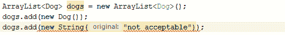

## 最后的话

多态是一个很难掌握的话题，尤其是当你是编程新手的时候。识别在代码中使用它的正确情况需要一些时间。

但是一旦你熟悉了它，你会发现它极大地改进了你的代码。

## 照片归属

由 [Markus Spiske](https://unsplash.com/@markusspiske?utm_source=unsplash&utm_medium=referral&utm_content=creditCopyText) 在 Unsplash 上拍摄的横幅照片。