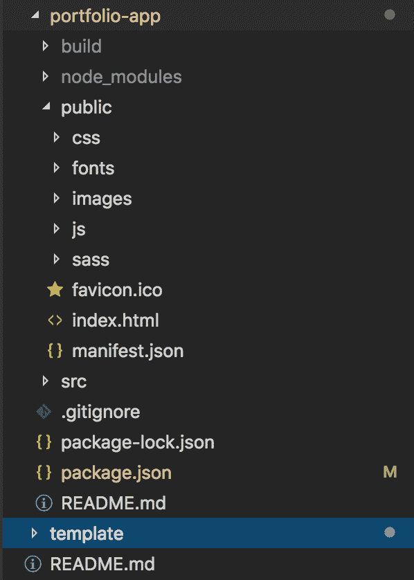

# 如何使用 React.js 创建你的作品集网站

> 原文：<https://www.freecodecamp.org/news/portfolio-app-using-react-618814e35843/>

在我的朋友们取消了我们的周末计划后，我想找点什么来消磨时间。在完成了我长长的待办事项清单后，我最终有了一个创建作品集网站的计划。

在花了很多时间搜索技术和模板之后，我最终使用 React.js 创建了这个网站，并使用 Github pages 部署它。你可以在这里找到网站[的代码](https://github.com/Dhruv34788/me)(从技术上来说，它被称为一个“**网络应用**”，但在这篇文章中，我将把它称为一个“网站”……我希望这没问题)。

## 你将学到什么

*   React.js 的一些基本概念
*   如何从 HTML 网站使用 create-react-app
*   如何使用“Github 页面”部署您的作品集网站

## 在我们开始之前，你需要知道一些概念..

> *注意——如果您已经熟悉 React.js 和 React 组件的基本概念，可以跳过这一部分。*
> 
> T *这些点将提供 React 世界的一个非常基本的概念。我强烈建议您从[文档](https://reactjs.org/docs/getting-started.html)中学习更多关于 React 的知识，并在 [freeCodeCamp](https://www.freecodecamp.org/) 的帮助下亲自动手。*

### 什么是 React.js >

现在，知道 React.js 是用于构建 UI 组件的 JavaScript 库就足够了。它是由脸书的工程师创造的，现在，它正在震撼 JavaScript 世界..

### 什么是反应组件>

React 允许您将组件定义为一个类或一个函数。您可以向名为' **props** '的组件提供可选输入。

组件允许你将用户界面分割成独立的部分，如页眉、页脚和主体。每个组件都将独立工作，因此任何单独的组件都可以独立地呈现到 [ReactDOM](https://reactjs.org/docs/react-dom.html) 中，而不会影响整个页面。

它还附带了**‘生命周期方法**’，允许您根据组件的状态(如安装、渲染、更新和卸载)定义想要执行的代码片段。

React 组件有自己的权衡。例如，我们可以通过将一个组件导出到其他组件来重用它，但有时处理多个组件相互交谈和触发呈现会令人困惑。

这就是一个组件的样子！

```
import React, { Component } from 'react'

export default class Component-name extends Component {
  render() {
    return (
      <div>
        {these code will be rendered into the DOM}
      </div>
    )
  }
}
```

### 什么是 [GitHub 页面](https://pages.github.com/) >

有了 GitHub Pages，你可以轻松地使用 GitHub 免费部署你的站点，不需要设置任何基础设施。他们已经提供了模块，这样你就不用担心很多事情了。如果你坚持到最后，你会看到它像魔法一样起作用！

## 继续之前，请确保..

### 决定你想在你的网站上放什么内容

浏览一遍你的最新简历(如果你还没有，那么[现在就创建一份](https://resumegenius.com/resume-templates)然后把这个项目推迟到下周末？).这将有助于你清楚地知道你想把什么样的信息放在你的作品集网站上。

### 寻找灵感

浏览网上数百个免费的作品集网站模板，看看你可以如何使用它们，用它们做什么——拿出纸和笔，画一个草图，了解你的网站会是什么样子。我将使用[这个](https://colorlib.com/preview/#jackson)模板来演示。

### 收集一些你自己的精彩照片

你当然不想在自己的投资组合网站上显得很糟糕。因此，挖掘你的照片档案，为你的网站找到最完美的照片。

### 收听您最喜爱的播放列表

传说**美好的事物伴随着美妙的音乐而来……***和*你肯定不想错过任何美好的事物。


[a glimpse of my portfolio website](https://dbarochiya.github.io/me/)

## 让我们跳到建筑部分

在接下来的部分中，我将描述构建 portfolio 应用程序的步骤，但您不必遵循我使用的相同代码。集中精力学习概念，展示一些创造力！进一步阅读分为三个部分。

1.  设置 React-app
2.  将 HTML 页面分解成 React 组件
3.  将您的应用部署到 Github 页面

### 设置 React-app

我们将使用`[create-react-app](https://facebook.github.io/create-react-app/docs/getting-started)`——脸书提供的一个模块——它帮助我们轻松创建 React.js 应用程序，无需担心构建工具。

*   转到控制台并运行`npm install create-react-app`以通过 npm 安装该模块(确保在使用之前您已经安装了`npm`——点击[此](https://www.rosehosting.com/blog/install-npm-on-ubuntu-16-04/)链接了解更多信息)。
*   现在运行`npm create-react-app ${project-name}`，它将获取构建脚本并创建一个文件结构，如下所示。

```
my-portfolio-app
├── README.md (description of the project for GitHUb)
├── node_modules (stores all dependent modules for the project)
├── package.json (stores all meta information of the prokect like dependencies,version,revisions etc.)
├── .gitignore (files declared here will be ignored while uploading to GitHub like node_modules 
├── public (here you will store all images,JS,CSS files) 
│   ├── favicon.ico
│   ├── index.html
│   └── manifest.json 
└── src (our main code for app lies here)
    ├── {create component folder here}
    ├── App.css
    ├── App.js
    ├── App.test.js
    ├── index.css
    ├── index.js
    ├── logo.svg
    └── serviceWorker.js
```

在`src`目录下创建一个`components`文件夹。这是我们将来存储组件的地方。

*   将您决定使用的 HTML `template`中的所有图像、字体、HTML 和 CSS 文件复制到`public`文件夹中。

现在，您的项目目录应该如下所示。



file-structure

*   运行`npm install`命令，在`node_module`目录下安装相关模块。
*   如果到目前为止你已经得到了它，那么运行`npm start`命令将在`localhost`上启动 React 应用程序。转到`[https://localhost:3000](https://localhost:3000)`，你应该能看到 React-app 的启动页面。

### 将 HTML 页面分解成 React 组件..

记住我们在上一步中在`src`目录下创建的`component`文件夹，现在我们将 HTML 模板页面分解成组件，并将这些组件组合成我们的 React-app。

*   首先，您需要确定哪些组件可以从单一的 HTML 文件中创建——如页眉、页脚和联系我。你需要有点创造力！！
*   寻找像 *section/div* 这样没有嵌套到其他 *section/div* 中的标签。这些应该包含独立于其他部分的关于页面特定部分的代码。试着看看我的 [*GitHub 回购*](https://github.com/Dhruv34788/me) 来更好地了解这个。
    *提示:使用“ **inspect element** ”工具来修改代码，并注意浏览器中的变化效果。*
*   这些 HTML 代码将在组件的`render()`方法中使用。每当一个组件被呈现到 ReactDOM 中时,`render()`方法将返回这个代码。看看下面给出的代码块作为参考。

```
<section id="colorlib-hero" class="js-fullheight" data-section="home">
    <div class="flexslider js-fullheight">
        <ul class="slides">
        <li style="background-image: url(images/img_bg_1.jpg);">
            <div class="overlay"></div>
            <div class="container-fluid">
                <div class="row">
                    <div class="col-md-6 col-md-offset-3 col-md-pull-3 col-sm-12 col-xs-12 js-fullheight slider-text">
                        <div class="slider-text-inner js-fullheight">
                            <div class="desc">
                                <h1>Hi! <br>I'm Jackson</h1>
                                <h2>100% html5 bootstrap templates Made by <a href="https://colorlib.com/" target="_blank">colorlib.com</a></h2>
                                    <p><a class="btn btn-primary btn-learn">Download CV <em class="icon-download4"></em></a></p>
                                </div>
                        </div>
                    </div>
                </div>
            </div>
        </li>
        <li style="background-image: url(images/img_bg_2.jpg);">
            <div class="overlay"></div>
            <div class="container-fluid">
                <div class="row">
                    <div class="col-md-6 col-md-offset-3 col-md-pull-3 col-sm-12 col-xs-12 js-fullheight slider-text">
                        <div class="slider-text-inner">
                            <div class="desc">
                                <h1>I am <br>a Designer</h1>
                                    <h2>100% html5 bootstrap templates Made by <a href="https://colorlib.com/" target="_blank">colorlib.com</a></h2>
                                    <p><a class="btn btn-primary btn-learn">View Portfolio <em class="icon-briefcase3"></em></a></p>
                                </div>
                        </div>
                    </div>
                </div>
            </div>
        </li>
        </ul>
    </div>
</section>
```

‘home’ section of the HTML file

```
import React, { Component } from 'react'

export default class Home extends Component {
  render() {
    return (
      <div>
        <section id="colorlib-hero" className="js-fullheight" data-section="home">
            <div className="flexslider js-fullheight">
                <ul className="slides">
                <li style={{backgroundImage: 'url(images/img_bg_1.jpg)'}}>
                    <div className="overlay" />
                    <div className="container-fluid">
                    <div className="row">
                        <div className="col-md-6 col-md-offset-3 col-md-pull-3 col-sm-12 col-xs-12 js-fullheight slider-text">
                        <div className="slider-text-inner js-fullheight">
                            <div className="desc">
                            <h1>Hi! <br />I'm Jackson</h1>
                            <h2>100% html5 bootstrap templates Made by <a href="https://colorlib.com/" target="_blank">colorlib.com</a></h2>
                            <p><a className="btn btn-primary btn-learn">Download CV <em className="icon-download4" /></a></p>
                            </div>
                        </div>
                        </div>
                    </div>
                    </div>
                </li>
                <li style={{backgroundImage: 'url(images/img_bg_2.jpg)'}}>
                    <div className="overlay" />
                    <div className="container-fluid">
                    <div className="row">
                        <div className="col-md-6 col-md-offset-3 col-md-pull-3 col-sm-12 col-xs-12 js-fullheight slider-text">
                        <div className="slider-text-inner">
                            <div className="desc">
                            <h1>I am <br />a Designer</h1>
                            <h2>100% html5 bootstrap templates Made by <a href="https://colorlib.com/" target="_blank">colorlib.com</a></h2>
                            <p><a className="btn btn-primary btn-learn">View Portfolio <em className="icon-briefcase3" /></a></p>
                            </div>
                        </div>
                        </div>
                    </div>
                    </div>
                </li>
                </ul>
            </div>
        </section>
      </div>
    )
  }
}
```

React component created from the ‘home’ HTML section

提示:如果 react 方面的事情变得令人困惑——试着关注“如何从 HTML 代码库中识别 wanna be 组件”的概念。在熟悉 React 之后，实现将是小菜一碟。

你注意到 HTML 代码有一些变化吗？`class`变成了`className`。这些改变是必须的，因为 React 不支持 HTML？—他们提出了自己的类似 HTML 的 JS 语法，叫做 [JSX](https://reactjs.org/docs/introducing-jsx.html) 。因此，我们需要改变 HTML 代码的某些部分，使其成为 JSX。

在这个项目中，我碰到了这个 [HTML 到 JSX 转换器](https://magic.reactjs.net/htmltojsx.htm)，它能为你将 HTML 代码转换成 JSX？。我强烈建议使用这种方法，而不是手动更改代码。

过一段时间后，你应该会想出一些不同的组件。现在`EndGame`近了！！将这些不同的组件组合在一个`App.js`组件下(是的！！您可以从一个组件渲染另一个组件！)你的作品集 app 就好了。

```
import React, { Component } from 'react';
import './App.css';
import Sidebar from './components/sidebar'
import Introduction from './components/introduction'
import About from './components/about'
import Projects from './components/projects'
import Blog from './components/blog'
import Timeline from './components/timeline'

class App extends Component {
  render() {
    return (
      <div id="colorlib-page">
        <div id="container-wrap">
		<Sidebar></Sidebar>
		<div id="colorlib-main">
			<Introduction></Introduction>
			<About></About>
			<Projects></Projects>
			<Blog></Blog>
			<Timeline></Timeline>
          	</div>
      	</div>
      </div>
    );
  }
}

export default App;
```

combined all components under app.js

注意，在上面的代码中，我们需要首先`import`组件，以便在`render()`部分使用它们。我们可以通过在渲染方法中添加`<component-name></component-name>`或`<component-name/>`标签来使用组件。

*   从您的终端运行`npm start`,您应该能够看到网站中反映的变化。如果您在代码中做了更多的更改，您不需要再次运行该命令，当您保存这些更改时，它会自动反映出来。多亏了`[hot reload](https://facebook.github.io/react-native/blog/2016/03/24/introducing-hot-reloading)` [特性](https://facebook.github.io/react-native/blog/2016/03/24/introducing-hot-reloading)，你可以进行一些闪电般的快速开发。
*   摆弄 HTML 和 CSS 来根据你的简历改变内容，通过改变内容，尝试不同的字体，改变颜色和添加你选择的照片来使你的文件夹更酷。

## 将 React-app 部署到 Github 页面

好吧，所以你熬到了这一步…花点时间感谢你的努力。但是你仍然需要完成你的部署，这样你就可以和那些放弃周末计划的朋友分享你的酷作品。

*   首先，你需要安装 Github 页面的 npm 库。要安装，在您的终端上运行这个命令`*npm install gh-pages*`。

现在，您需要在您的`*manifest.json*`文件中进行以下更改:

*   添加`*homepage*`字段—值将采用以下格式— `[https://{github_id}.github.io/{github_repo}](https://{github_id}.github.io/{github_repo})`
*   在`*scripts*`下增加`*predeploy*`和`*deploy*`字段

现在，您的 manifest.json 应该如下所示:

```
{
	"name": "portfolio-app",
	"version": "0.1.0",
	"private": true,
	"homepage": "https://Dhruv34788.github.io/me",
	"dependencies": {
		"gh-pages": "^2.0.1",
		"react": "^16.8.3",
		"react-dom": "^16.8.3",
		"react-scripts": "2.1.5",
		"yarn": "^1.13.0"},
	"scripts": {
		"start": "react-scripts start",
		"build": "react-scripts build",
		"predeploy": "yarn run build",
		"deploy": "gh-pages -d build",
		"test": "react-scripts test",
		"eject": "react-scripts eject"},
	"eslintConfig": {
		"extends": "react-app"},
	"browserslist": [
		">0.2%",
		"not dead",
		"not ie <= 11",
		"not op_mini all"
	]
}
```

manifest.json after adding gh-pages link

现在去终端，运行`npm run deploy`等待神奇！！部署脚本成功执行后，将部署您的应用程序。通过访问您在`homepage`字段中提供的链接，验证您的应用是否已部署。

***注意:*** 在 web 上部署任何东西时请小心。执行安全检查，比如删除内部链接、密码或任何你不想让聪明人知道的东西。

## 如果你打算经常改变...

> *注意——每次你改变一些东西时，你都需要执行部署阶段，如果你正在代码库中进行改变——猜猜谁会很快感到厌烦！！(别担心，我会支持你的:P)*
> 
> 您可以使用 Travis-CI(自动化工具)自动化部署过程，这样，如果您向主分支提交任何内容，部署步骤将被触发，新站点将自动可用。请阅读这篇文章。
> 
> [https://www . freecodecamp . org/news/learn-how-to-automate-deployment-on-github-pages-with-Travis-ci/](https://www.freecodecamp.org/news/learn-how-to-automate-deployment-on-github-pages-with-travis-ci/)

## 给你的作业..

恭喜你！您最终创建并部署了您的投资组合应用程序。如果你感兴趣，那么你可以在你的网站上添加这些功能

*   **博客功能:**使用 Node.js 和 MongoDB 等 NoSQL 数据库创建自己的博客，并将其合并到这个组合网站中。
*   **Gallery:** 在页面上添加一个部分，您可以在其中显示来自社交媒体网站的最新照片的脚本。
*   **Twitter Feed:** 添加一个显示您最近发布的推文的部分。
*   **随机引用:**添加显示一些随机激励性引用的部分。

如果你实现了这些功能中的任何一个，请与我分享你的工作。我非常乐意帮忙？(如果可以的话？)

## 包扎..

我想花点时间感谢那些给我灵感和知识来完成这篇文章的人。

*   [***昆西***](https://www.freecodecamp.org/news/portfolio-app-using-react-618814e35843/undefined) ***拉尔森，[萨哈特·雅尔卡博夫](https://www.freecodecamp.org/news/portfolio-app-using-react-618814e35843/undefined) &社区:*** 用于创建***freeCodeCamp—***平台，在这里您可以学习和获得几乎所有与 web 技术相关的知识；免费使用实践教程*和*。？
*   ***Colorlib:*** 为我的投资组合网站提供了最先进的模板，这是一个巨大的灵感。？
*   [***丹尼尔罗尼格罗***](https://www.freecodecamp.org/news/portfolio-app-using-react-618814e35843/undefined) ***&社区:*** 用于创建 [***HTML 到 JSX***](https://magic.reactjs.net/htmltojsx.htm) ***编译器，*** 这在将 HTML 块转换成 JSX 代码时变得很方便。？
*   ***我最亲爱的朋友:*** 帮助我改正错误的人。
*   你:留下来，我希望你过得很愉快。不断探索和建造令人惊叹的东西！


Photo by [Ruediger Theiselmann](https://unsplash.com/@docrowdee?utm_source=medium&utm_medium=referral) on [Unsplash](https://unsplash.com?utm_source=medium&utm_medium=referral)