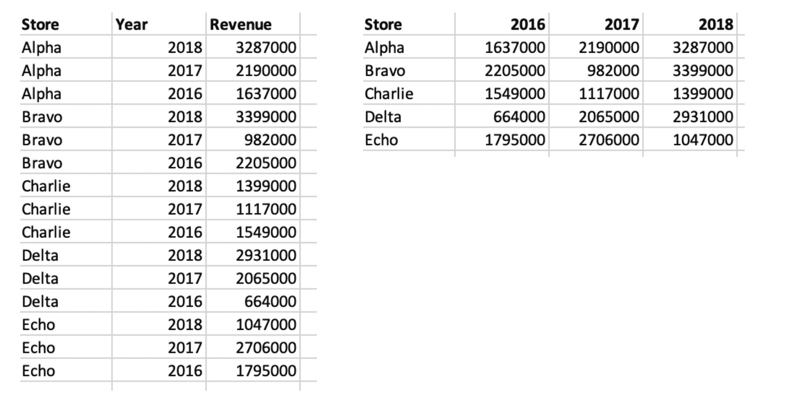
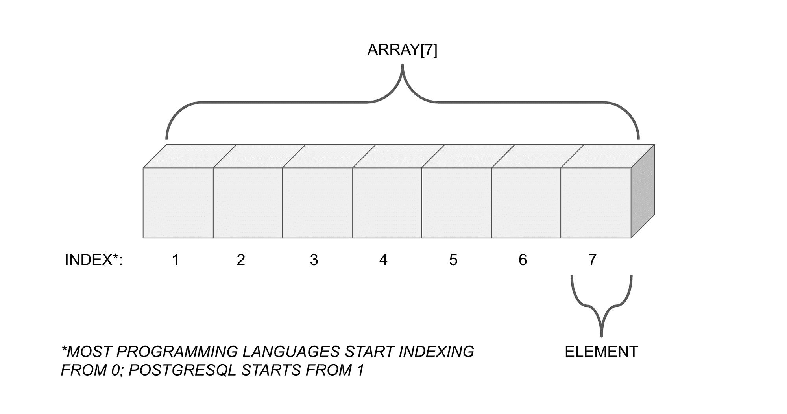
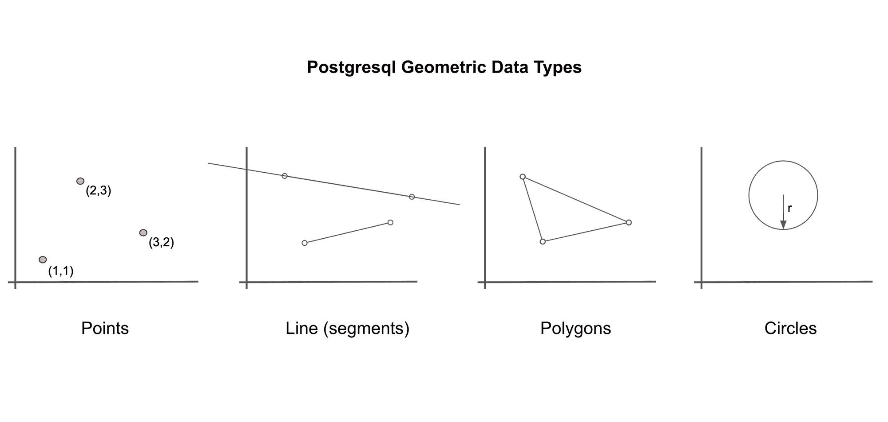

# 在 PostgreSQL 中学习这些快速技巧

> 原文：<https://www.freecodecamp.org/news/postgresql-tricks/>

[PostgreSQL](https://www.postgresql.org/about/) 是最流行的开源 SQL 方言之一。它的主要优势之一是能够用一些内置工具扩展其功能。

在这里，让我们来看看几个 PostgreSQL 技巧，你可以开始使用它们将你的 SQL 技能提升到一个新的水平。

您将了解如何:

*   快速将文件复制到数据库中
*   以交叉表格式汇总数据
*   利用 SQL 中的数组和 JSON 数据
*   使用几何数据
*   直接在数据库上运行统计分析
*   使用递归来解决问题

### 从文件中复制数据

从外部文件快速导入数据的一种简单方法是使用复制功能。只需创建想要使用的表，然后将数据集的文件路径传递给 COPY 命令。

下面的例子创建了一个名为 revenue 的表，并从一个随机生成的 CSV 文件中填充它。

您可以包含额外的参数，以指示文件类型(这里，文件是 CSV)以及是否将第一行作为列标题读取。

你可以在这里了解更多[。](https://www.postgresql.org/docs/12/sql-copy.html)

```
CREATE TABLE revenue (
  store VARCHAR,
  year INT,
  revenue INT,
  PRIMARY KEY (product, year)
);

COPY revenue FROM '~/Projects/datasets/revenue.csv' WITH HEADER CSV;
```

### 使用交叉表函数汇总数据

如果你认为自己是一个电子表格专家，你可能会熟悉从数据转储中创建数据透视表。您可以在 PostgreSQL 中用 crosstab 函数做同样的事情。

crosstab 函数可以在左边的表单中获取数据，并在右边的表单中进行汇总(这样更容易阅读)。这里的例子将继续前面的收入数据。



首先，用下面的命令启用 [tablefunc 扩展](https://www.postgresql.org/docs/12/tablefunc.html):

```
CREATE EXTENSION tablefunc;
```

接下来，使用交叉表函数编写一个查询:

```
SELECT * FROM CROSSTAB(
  'SELECT
  		*
	FROM revenue
	ORDER BY 1,2'
  ) 
AS summary(
	store VARCHAR, 
    "2016" INT, 
    "2017" INT, 
    "2018" INT
    );
```

使用该函数时，需要考虑两件事。

*   首先，传递一个从底层表中选择数据的查询。您可以简单地按原样选择表格(如此处所示)。但是，如果需要，您可能希望进行筛选、连接或聚合。确保数据顺序正确。
*   然后，定义输出(在示例中，输出被称为‘summary’，但是您可以将其称为任何名称)。列出要使用的列标题以及它们将包含的数据类型。

输出如下所示:

```
 store  |  2016   |  2017   |  2018   
---------+---------+---------+---------
 Alpha   | 1637000 | 2190000 | 3287000
 Bravo   | 2205000 |  982000 | 3399000
 Charlie | 1549000 | 1117000 | 1399000
 Delta   |  664000 | 2065000 | 2931000
 Echo    | 1795000 | 2706000 | 1047000
(5 rows)
```

### 使用数组和 JSON

PostgreSQL 支持多维数组数据类型。这些可以与许多其他语言中的类似数据类型相媲美，包括 Python 和 JavaScript。



您可能希望在有助于处理更动态、更少结构化的数据的情况下使用它们。

例如，设想一个描述已发表文章和主题标签的表格。一篇文章可以没有标签，也可以有很多标签。试图以结构化的表格式存储这些数据会变得不必要的复杂。

您可以使用数据类型定义数组，后跟方括号。您可以选择指定它们的尺寸(但是，这不是强制的)。

例如，要创建任意数量文本元素的一维数组，可以使用`text[]`。要创建一个由整数元素组成的 3 乘 3 的二维数组，可以使用`int[3][3]`。

看看下面的例子:

```
CREATE TABLE articles (
  title VARCHAR PRIMARY KEY,
  tags TEXT[]
);
```

要将数组作为记录插入，请使用语法`'{"first","second","third"}'`。

```
INSERT INTO articles (title, tags)
  VALUES 
  ('Lorem ipsum', '{"random"}'),
  ('Placeholder here', '{"motivation","random"}'),
  ('Postgresql tricks', '{"data","self-reference"}');
```

在 PostgreSQL 中，可以用数组做很多[的事情。](https://www.postgresql.org/docs/12/functions-array.html)

首先，您可以检查数组是否包含给定的元素。这对过滤很有用。您可以使用“包含”操作符`@>`来实现这一点。下面的查询查找所有带有标签“random”的文章。

```
SELECT
  *
FROM articles
WHERE tags @> '{"random"}';
```

您还可以使用`||`操作符连接数组，或者使用`&&`操作符检查重叠的元素。

您可以通过索引搜索数组(与许多语言不同，PostgreSQL 数组从 1 开始计数，而不是从 0 开始计数)。

```
SELECT
	tags[1]
FROM articles;
```

除了数组，PostgreSQL 还允许使用 [JSON](https://www.w3schools.com/whatis/whatis_json.asp) 作为数据类型。同样，这也提供了处理非结构化数据的优势。您还可以通过元素的键名来访问元素。

```
CREATE TABLE sessions (
	session_id SERIAL PRIMARY KEY,
    session_info JSON
);

INSERT INTO sessions (session_info)
VALUES
('{"app_version": 1.0, "device_type": "Android"}'),
('{"app_version": 1.2, "device_type": "iOS"}'),
('{"app_version": 1.4, "device_type": "iOS", "mode":"default"}');
```

同样，在 PostgreSQL 中，您可以用 JSON 数据做许多[的事情。您可以使用`->`和`->>`操作符来“解包”要在查询中使用的 JSON 对象。](https://www.postgresql.org/docs/12/datatype-json.html)

例如，此查询查找`device_type`键的值:

```
SELECT
  session_info -> 'device_type' AS devices
FROM sessions;
```

此查询统计了 1.0 或更早版本的应用程序上有多少会话:

```
SELECT
  COUNT(*)
FROM sessions
WHERE CAST(session_info ->> 'app_version' AS decimal) <= 1.0;
```

### 运行统计分析

通常，人们认为 SQL 适合存储数据和运行简单的查询，但不适合运行更深入的分析。为此，您应该使用其他工具，如 Python 或 R 或您最喜欢的电子表格软件。

然而，PostgreSQL 带来了足够的统计功能，可以帮助您入门。

例如，它可以计算汇总统计，相关性，回归和随机抽样。下表包含了一些简单的数据。

```
CREATE TABLE stats (
  sample_id SERIAL PRIMARY KEY,
  x INT,
  y INT
);

INSERT INTO stats (x,y)
  VALUES 
  (1,2), (3,4), (6,5), (7,8), (9,10);
```

您可以使用以下函数计算平均值、方差和标准差:

```
SELECT
	AVG(x),
    VARIANCE(x),
    STDDEV(x)
FROM stats;
```

您也可以使用 percentile_cont 函数来寻找中间值(或任何其他百分比值):

```
-- median
SELECT
  PERCENTILE_CONT(0.5)
WITHIN GROUP (ORDER BY x) 
FROM stats;

-- 90th percentile
SELECT
  PERCENTILE_CONT(0.9)
WITHIN GROUP (ORDER BY x) 
FROM stats;
```

另一个技巧是让你计算不同列之间的相关系数。只需使用 corr 函数。

```
SELECT
	CORR(x,y)
FROM stats;
```

PostgreSQL 让你通过一组内置函数运行[线性回归](https://en.wikipedia.org/wiki/Linear_regression)(有时被称为最基本的机器学习形式)。

```
SELECT
	REGR_INTERCEPT(x,y),
    REGR_SLOP(x,y),
    REGR_R2(x,y)
FROM stats;
```

您甚至可以使用单个查询运行[蒙特卡洛模拟](https://www.freecodecamp.org/news/solve-the-unsolvable-with-monte-carlo-methods-294de03c80cd/)。下面的查询使用 generate_series 和 random number 函数，通过在单位圆内随机采样一百万个点来估计π的值。

```
SELECT 
	CAST(
		COUNT(*) * 4 AS FLOAT
		) / 1000000 AS pi 
FROM GENERATE_SERIES(1,1000000)
WHERE CIRCLE(POINT(0.5,0.5),0.5) @> POINT(RANDOM(), RANDOM());
```

### 使用形状数据

PostgreSQL 中另一种不常见的数据类型是几何数据。

没错，您可以在 SQL 中处理点、线、多边形和圆。



点是 PostgreSQL 中所有几何数据类型的基本构建块。它们被表示为(x，y)坐标。

```
SELECT
	POINT(0,0) AS "origin",
    POINT(1,1) AS "point";
```

您也可以定义线条。这些可以是无限长的线(通过给定线上的任意两点来指定)。或者，它们可以是线段(通过给出线的“起点”和“终点”来指定)。

```
SELECT
	LINE '((0,0),(1,1))' AS "line",
    LSEG '((2,2),(3,3))' AS "line_segment";
```

多边形是由一系列较长的点定义的。

```
SELECT
	POLYGON '((0,0),(1,1),(0,2))' AS "triangle",
	POLYGON '((0,0),(0,1),(1,1),(1,0))' AS "square",
    POLYGON '((0,0),(0,1),(2,1),(2,0))' AS "rectangle";
```

圆由一个中心点和一个半径定义。

```
SELECT
	CIRCLE '((0,0),1)' as "small_circle",
    CIRCLE '(0,0),5)' as "big_circle";
```

PostgreSQL 中有[许多函数和运算符](https://www.postgresql.org/docs/12/functions-geometry.html)可以应用于几何数据。

您可以:

*   用`?||`操作器检查两条线是否平行:

```
SELECT
	LINE '((0,0),(1,1))' ?|| LINE '((2,3),(3,4))';
```

*   用`<->`运算符计算两个物体之间的距离:

```
SELECT 
	POINT(0,0) <-> POINT(1,1);
```

*   用`&&`操作符检查两个图形是否在任何点重叠:

```
SELECT
	CIRCLE '((0,0),1)' &&  CIRCLE '((1,1),1)';
```

*   使用`+`操作符平移(移动位置)一个形状:

```
SELECT
	POLYGON '((0,0),(1,2),(1,1))' + POINT(0,3);
```

除此之外还有更多——查看文档了解更多细节！

### 使用递归查询

[递归](https://www.freecodecamp.org/news/how-recursion-works-explained-with-flowcharts-and-a-video-de61f40cb7f9/)是一种编程技术，可用于使用调用自身的函数来解决问题。您知道可以用 PostgreSQL 编写递归查询吗？

为此需要三个部分:

*   首先，定义一个起始表达式。
*   然后，定义一个将被重复计算的递归表达式
*   最后，定义一个“终止标准”——一个告诉函数停止调用自身并返回输出的条件。

下面的查询返回斐波纳契数列中的前一百个数字:

```
WITH RECURSIVE fibonacci(n,x,y) AS (
	SELECT
    	1 AS n ,
  		0 :: NUMERIC AS x,
    	1 :: NUMERIC AS y
  	UNION ALL
  	SELECT
    	n + 1 AS n,
  		y AS x,
    	x + y AS y 
  	FROM fibonacci 
  	WHERE n < 100
	)
SELECT
	x 
FROM fibonacci;
```

我们来分析一下。

首先，它使用 WITH 子句定义一个名为`fibonacci`的(递归)[公共表表达式](https://www.postgresql.org/docs/12/queries-with.html#QUERIES-WITH-SELECT)。然后，它定义一个初始表达式:

```
WITH RECURSIVE fibonacci(n,x,y) AS (
	SELECT
    	1 AS n ,
  		0 :: NUMERIC AS x,
    	1 :: NUMERIC AS y...
```

接下来，它定义了查询`fibonacci`的递归表达式:

```
 ...UNION ALL
  	SELECT
    	n + 1 AS n,
  		y AS x,
    	x + y AS y 
  	FROM fibonacci...
```

最后，它使用 WHERE 子句定义终止条件，然后选择 x 列给出输出序列:

```
...WHERE n < 100
		)
	SELECT
		x 
	FROM fibonacci;
```

也许您可以想出另一个可以在 PostgreSQL 中实现的递归示例？

### 结束语

所以，现在你有了它——快速浏览一下你可能知道或不知道 PostgreSQL 可以提供的一些很棒的特性。毫无疑问，还有更多值得介绍的特性没有出现在这个列表中。

PostgreSQL 本身就是一种丰富而强大的编程语言。所以，下一次当你陷入如何解决数据相关问题的困境时，看看 PostgreSQL 是否能解决你的问题。你可能会惊讶它经常发生！

感谢阅读！