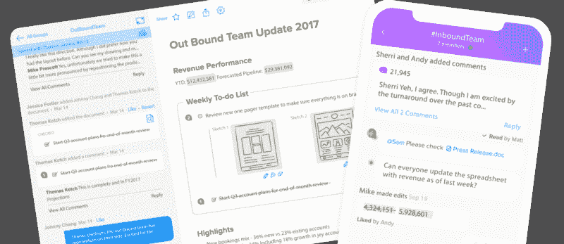
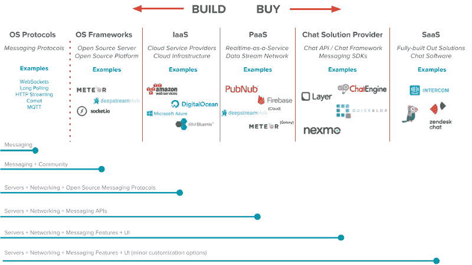
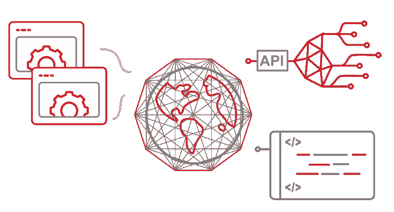
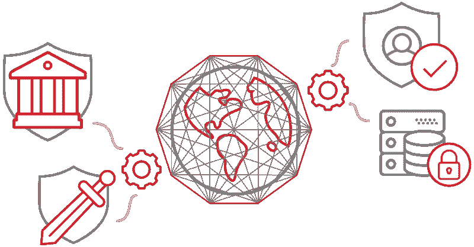

# 构建多少和购买多少:为聊天和消息应用提供动力

> 原文：<https://www.freecodecamp.org/news/powering-chat-and-messaging-apps-the-current-landscape-ad0657140b94/>

乔·汉森

# 构建多少和购买多少:为聊天和消息应用提供动力

当您构建任何类型的聊天应用程序时——从移动群发消息和多人游戏聊天，到客户支持和聊天机器人——选择正确的平台、框架和协议可以决定您业务的成败。

这是因为决定是建立还是购买一个聊天应用程序不是二元的。决定自己动手还是从供应商那里购买的日子已经一去不复返了。

现在的问题是**我想造多少，我想买多少？**

在开源、IaaS、PaaS、SaaS、SDK、API 和微服务之间，企业从未有过更多选择来选择如何构建他们的聊天产品。选择的范围只会继续扩大。

随着云计算变得越来越容易获得和负担得起，创新的新公司解决具体的问题。设备变得更加强大。如果企业想要跟上，他们必须了解供应商的情况以及每个选项的优势和挑战。

因此，开发人员和组织在为他们的应用程序选择聊天或消息平台时会犯很多错误。

在本帖中，我们将讨论许多不同的聊天应用类型，并了解支持和交付消息应用的不同平台选项。我们还将讨论在整个开发周期中做出某些决策可能带来的挑战，如可伸缩性、上市时间和其他优势。

### 选择聊天服务提供商:当前形势

在构建和购买范围内有各种各样的选择。一端是开源(构建)，另一端是完全构建的(SaaS)解决方案(购买)。在数百种选择之间，每种选择都有不同的利弊，我们将通过一个简单的图表让您对前景有所了解:

#### 开源协议

构建方面最远的是开源协议，如 [WebSockets](https://www.pubnub.com/learn/glossary/what-is-websocket/) 和 [HTTP Long Polling](https://www.pubnub.com/blog/2014-12-01-http-long-polling/) 。这些只是简单的协议，这意味着你管理一切使它们工作。这包括启动您的后端基础架构，维护它，构建新的 SDK 以支持新的设备和语言，以及其他一切。

这些非常适合原型开发、构建小型应用程序或接触完整的堆栈。但是大多数实时消息服务都提供免费版本，包括所有的后端基础设施。到了扩展的时候，您需要做好准备应对一些严重的问题。

#### 开源框架

开源框架比纯粹的构建稍微差了一点，但是仍然需要你自己维护基础设施。对于聊天用例，开源框架倾向于依赖开发人员社区来更新框架和维护客户端 SDK。

#### 基础设施即服务(IaaS)

这些是大狗——云基础设施服务提供商，如 AWS、Digital Ocean、Azure、Bluemix 和 Google Cloud。实际上，它们最终会为许多 PaaS、消息传递解决方案提供商和 SaaS 产品提供支持，我们将在接下来讨论这些产品。

简而言之，你可以使用开源协议和 IaaS 来发布你的应用。基础设施已经处理好了，但是你自己还有很多工作要做。

#### 平台即服务(PaaS)

像 [PubNub](https://www.pubnub.com/?utm_source=Syndication&utm_medium=Medium&utm_campaign=SYN-CY17-Q4-Medium-November-13) 和 [Firebase](http://firebase.com) 这样的 PaaS 提供商提供构建聊天应用的托管解决方案。它们不仅包括基础设施，还包括用于构建聊天功能的 API。构建和定制应用程序需要工程资源，因为他们的 SDK 是开放的。但是服务的安全性和维护(后端和客户端 SDK)由 PaaS 处理。

#### 聊天框架

这些框架提供商几乎是你能买到的最接近购买的了，但是仍然需要相当数量的工程。这些提供商和 PaaS 之间的最大区别在于，它们提供了更多的黑盒方法——您在定制 API 和基础设施方面的自由度更小。通常他们也会提供用户界面。

例如，PubNub [ChatEngine](https://www.pubnub.com/products/chatengine/?utm_source=Syndication&utm_medium=Medium&utm_campaign=SYN-CY17-Q4-Medium-November-13) 提供了一个更加开放和可扩展的框架。[层](http://layer.com)更接近黑盒 SaaS 聊天解决方案，但仍然提供了相当数量的定制选项。

#### SaaS

最后，在购买方面，SaaS 公司提供了一个完全构建的解决方案，只需要少量的工程。UI、集成和基础设施都由 SaaS 提供商处理。空间中的领导者包括[对讲机](http://intercom.com)和 [Zendesk 聊天](https://www.zendesk.com/chat/)。

### 选择聊天服务提供商时要问自己的问题

与关键基础架构的所有其他部分一样，关键问题仍然是一样的:

*   您是运行自己的服务，还是利用托管服务？
*   前期费用是多少？最终规模成本是多少？
*   托管服务可靠、安全且可扩展吗？
*   聊天对您的应用程序有多重要？
*   你的团队中谁来维护它？他们是否拥有使其可扩展且安全的技能？
*   服务将数据存储在哪里，谁可以访问这些数据？

### 选择你的聊天服务提供商:开源还是托管

说到软件开发，每个人都知道在实验室里有效的东西在野外不一定有效。这是因为野外呈现出所有你可能没有想到，甚至可能还不知道的挑战。

当谈到选择合适的技术来支持您的聊天时，有许多构建和购买方面的考虑要考虑。我们将从安全性、可扩展性、可靠性、定制和业务原因等方面来对比在实验室和现实世界中选择您的堆栈。

#### 基础设施

在您走开源路线的过程中，您将选择您的工具，安装它，并编排该工具的操作。

从那里，您将开始考虑基础设施方面的事情，比如负载平衡和冗余节点。这些是大规模发布应用程序的要求。这时，您可以利用 IaaS 提供商来处理后端。即便如此，仍需要大量工程，包括:

*   启动多个测试、试运行和生产环境
*   十二因子
*   协调多个环境的资源调配(就像 Kubernetes 一样)
*   将应用程序代码部署到环境中
*   设置服务管理、系统监控和运营警报
*   创建负载平衡方案(如 Nginx 或 HAProxy)
*   弄清楚如何通过渠道或主题对数据进行分类(比如 Redis[pub/sub](https://www.pubnub.com/learn/glossary/what-is-publish-subscribe/)with[socket . io](https://www.pubnub.com/learn/glossary/what-is-socketio/)
*   寻找信号恢复的存储转发解决方案，如内存缓存
*   实施一种方法来检测哪个客户端连接到哪个数据中心和端口
*   为给定客户确定发送/接收哪些频道/主题
*   决定您将支持哪些平台和语言
*   创建通用数据序列化(JSON)
*   定制代码以检测跨设备类型工作的数据上行链路
*   确定服务质量和丢失级别，并制定数据恢复方案(或者满足于“一劳永逸”)
*   决定您需要哪些 API 和功能，然后构建它们(存在检测)

这是一系列的考虑。但是如果你选择开源路线，一旦你离开实验室，扩展你的应用程序，这些是你必须考虑的事情。

#### 安全性

对于聊天来说，安全性是最重要的。我们越来越多地通过聊天应用程序发送更多机密和关键任务信息，从财务细节到聊天机器人命令。确保您对访问和加密有完全的控制权是非常必要的。

每个成功的聊天服务提供商都提供不同级别的安全性。以下是任何托管服务提供商都必须具备的最重要功能:

*   端到端加密，TLS 用于入站/出站数据包，AES 用于数据包
*   支持细粒度的基于令牌的访问控制。基于令牌的访问控制允许您授予和撤销对任何消息传递通道的访问权限。
*   合规是关键，尤其是对于垂直化的聊天应用。托管服务提供商应通过 HIPAA(医疗保健)、SOC 2、GDPR(欧盟)、Data Shield 和 SafeHarbor(欧盟/美国)认证。

对于那些选择不利用托管服务提供商的人来说，以下是您必须自己处理的其他安全考虑事项:

*   购买 TLS 证书，然后安全地分发和管理该证书
*   弄清楚如何保护渠道和主题(TLS 未涉及)
*   为用户建立授权系统
*   考虑对有效负载进行 AES 和/或 RSA 加密(不在 TLS 范围内)
*   遵守法律安全政策(如 SafeHarbor 或 HIPAA)

#### 可量测性

对于成千上万的活跃用户同时聊天的聊天应用程序，以及那些继续增长的应用程序，大规模的专业知识是一个重大挑战。开源和一些托管服务提供商都在处理这个问题。但是当谈到规模时，托管解决方案比开源选项更能减轻应用程序崩溃的可扩展性问题的风险。

对于托管解决方案，有几个指标表明您选择的服务将随着应用的增长而扩展。

**多个全球存在点:**聊天消息应该被全球复制，以便如果消息被丢弃，将会传送备份消息。这也提高了应用程序的性能，因为每个聊天用户不必连接到同一个数据中心(尤其是那些位于地球另一端的用户)。

正常运行时间服务水平协议:正常运行时间服务水平协议让托管服务提供商负责，如果根据条款这些服务水平协议没有得到满足，他们应该给你信用。

对于自己动手的人，你需要考虑:

*   可以模拟真实观众的自定义负载测试服务
*   创建更新协议&不断修改您的网络以支持新产品/服务
*   支付套接字服务器成本、QA 系统和热故障转移
*   持续的运营监控和额外的人力需求

#### 可靠性

消息应用的竞争非常激烈。只需点击一下 app store，用户遇到的任何问题都可以引导他们找到替代方案。可靠性是让你的应用有粘性的关键因素。在审查托管服务提供商时，以下是几个关键的可靠性指标:

*   针对多个存在点的数据复制和自动故障转移，以确保消息 100%的时间都能够送达(实际上是实时送达)
*   在连接丢失的情况下显示“追赶”消息(例如，如果用户在隧道中，当他们从另一端出来时会收到消息)

如果使用开源解决方案，您还必须处理:

*   构建负荷分配系统
*   识别错误消息
*   构建日志系统
*   知道故障何时发生，并制定应对策略
*   建筑服务管理(如传呼机职责)
*   开发多数据中心部署

### 开源与托管

当您查看主要考虑事项时，您会发现独自构建一个实时消息传递系统会带来很多风险。对于较小的聊天应用程序来说，这是一个很好的选择。但是，一旦您开始成长，安全性、可靠性和可扩展性挑战就会越来越多。

大多数托管解决方案提供商也允许永久免费的沙盒定价层。这让你可以免费开发你的应用，一旦你发展到一定规模，你就可以按需付费。对于那些希望快速发展并且不想担心所有复杂的网络和基础设施的公司来说，托管解决方案是一个不错的选择。

如果你喜欢这篇文章，请为它鼓掌，让更多的人看到它。谢谢！

[Download eBook here!](https://www.pubnub.com/learn/ebooks/chat-is-more-than-hot-air/?utm_source=Syndication&utm_medium=Medium&utm_campaign=SYN-CY18-Q2-Medium-June-7&utm_content=bvb-freecodecamp)

如果你想深入了解聊天，看看我们的新电子书就知道了: [**聊天不仅仅是空话——如何构建数字未来**](https://www.pubnub.com/learn/ebooks/chat-is-more-than-hot-air/?utm_source=Syndication&utm_medium=Medium&utm_campaign=SYN-CY18-Q2-Medium-June-7&utm_content=bvb-freecodecamp) **。**在其中，我们介绍了:

*   **聊天技术的现状:**聊天的不同风格，从当今市场上可用的技术中选择合适的技术，以及构建与购买、托管与开源的比较。
*   **聊天是如何发展的:**让我们看看聊天应用是如何从简单的消息传递转变为行业和用户交流方式的。
*   如何确保自己站在创新的最前沿:看看有哪些功能和体验可以让你脱颖而出。

*最初发表于[www.pubnub.com](https://www.pubnub.com/blog/building-chat-the-current-landscape/)。*