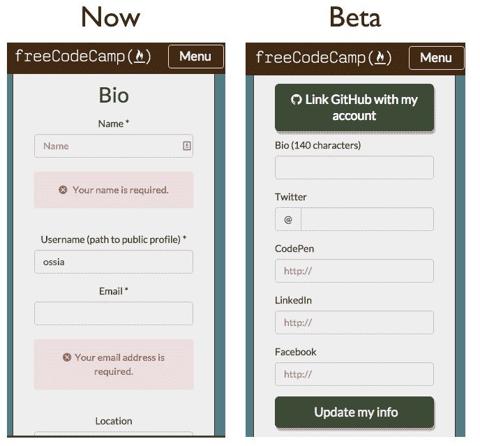

# 使用 GitHub 启动

> 原文：<https://www.freecodecamp.org/news/powering-up-with-github-9d524ae8cb63/>

由免费代码营

# 使用 GitHub 启动

*最初发表于 2015 年 8 月 5 日我们现已停刊的博客上。*

随着我们与 Gitter 的集成越来越紧密，我们也应该更好地利用 GitHub。

我们抛弃了旧的领域指南文章，转而支持基于 GitHub 的新维基，这使得文章的创作和修改更加容易。多亏了我们新的露营机器人，这些维基文章现在可以从 Gitter 上检索到了。

CamperBot 在这里提供帮助，并且已经开始回答露营者的问题，并在我们的一些聊天室中检索资源。很快，我们将把露营机器人引入我们所有的聊天室。

从本周晚些时候开始，您的免费代码营用户名将与您的 GitHub 用户名绑定。我们还会将其他可选字段绑定到 GitHub，比如您的姓名和位置。这将使你更容易了解你的聊天对象。这也将使你有可能在我们的帮助聊天室里给其他帮助你的营员加分。

另一个好处是，自由代码营的公共投资组合将更容易管理，并在 GitHub、Gitter 和自由代码营中给你一个一致的个人品牌。

Our new GitHub integration will be much simpler.

根据大众的要求，我们也从你的公共投资组合中隐藏了篝火解决方案，一旦我们推出了改进的公共投资组合，我们将在以后以更好的方式重新引入它们。