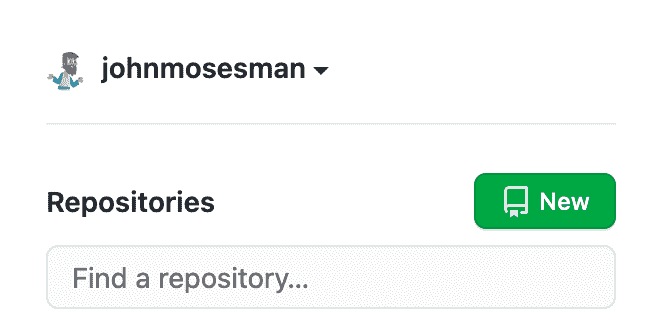
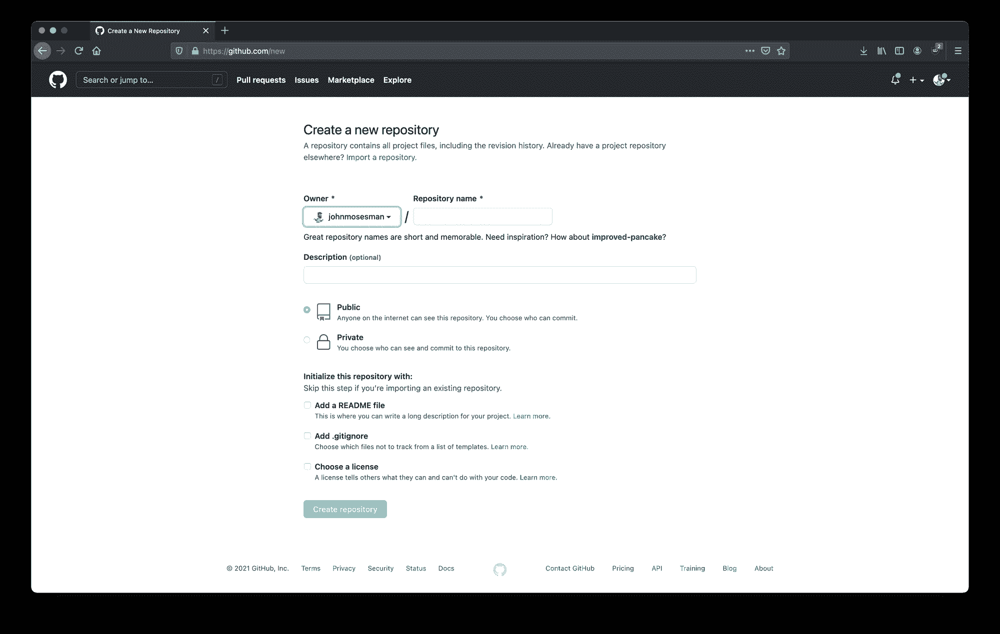
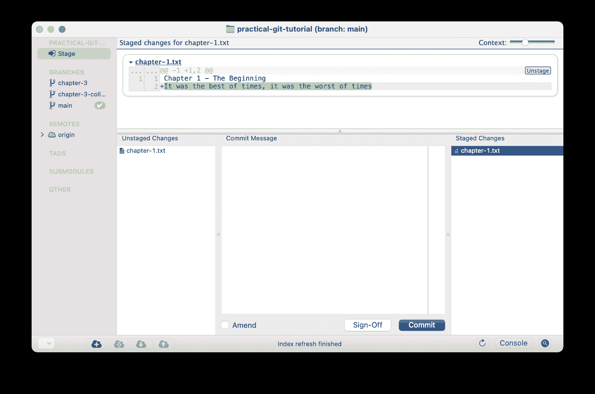
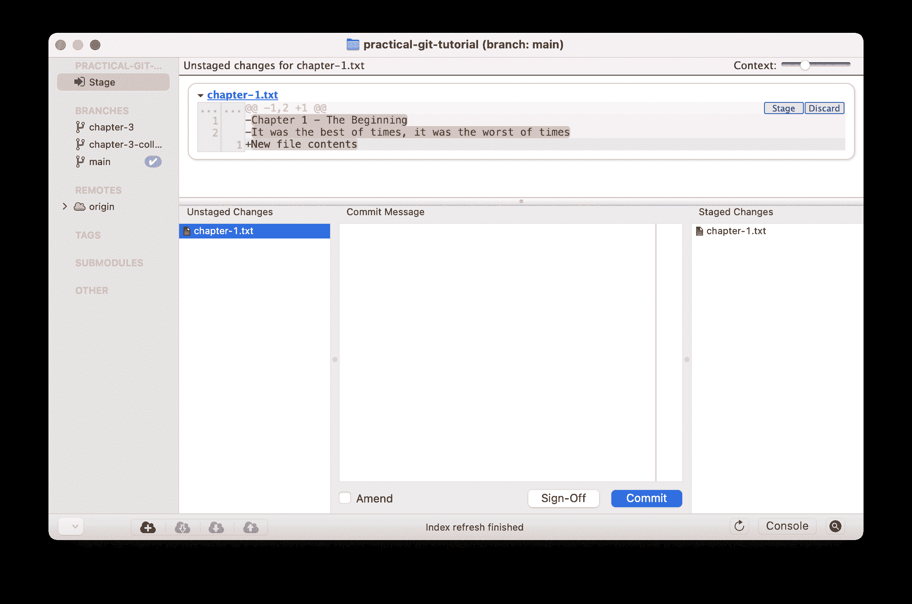
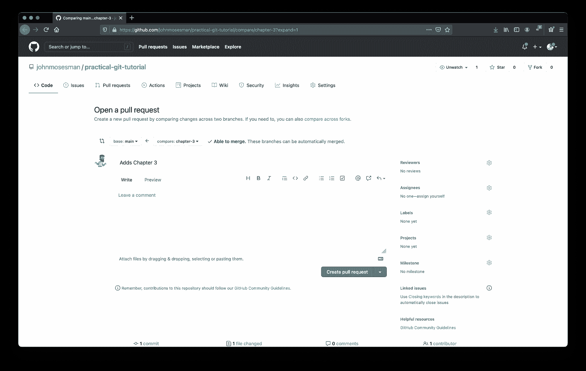
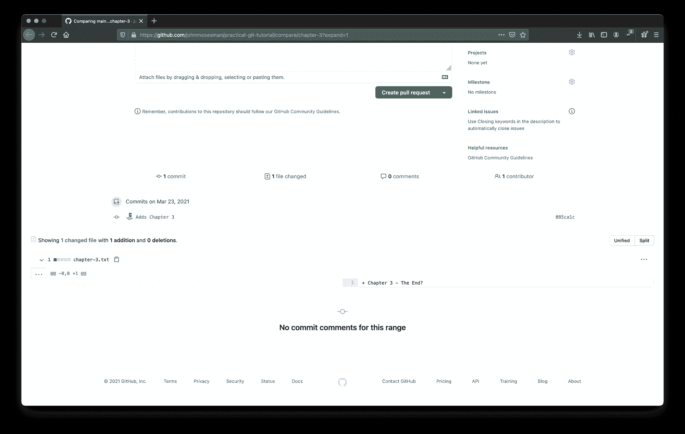
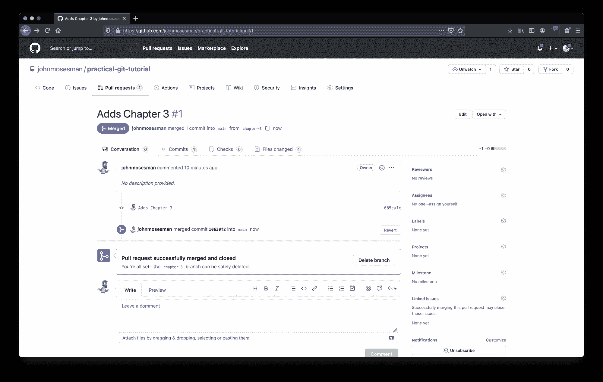
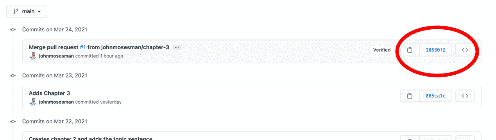

# 如何使用 Git 和 Git 工作流——实用指南

> 原文：<https://www.freecodecamp.org/news/practical-git-and-git-workflows/>

每个人都说你应该学习 Git——你也应该——但是说实话:Git 有点难。

即使我的软件开发生涯已经过去了将近十年，我仍然在学习 Git 的基础知识以及如何更有效地使用 Git。

不久前，我意识到[我对一个我使用了无数次的键盘命令有一个根本性的误解](https://twitter.com/johnmosesman/status/1306255666718310401)。

像编程中的许多其他领域一样，我相信最好的学习方法就是开始*做。*

只要开始使用这个工具就可以了——随着时间的推移，基本原理和边缘情况会得到解决。

所以在本教程中，这正是我们要做的。我们将通过一系列例子来从头开始理解如何使用 Git，并最终与您的队友协作。

这样做时，我们将使用简单的命令并解释有用的基本概念——但仅限于有助于理解的程度。

Git 的内容肯定比这里介绍的要多得多，但是随着时间的推移，您将会学到这些东西。

我也不会使用任何树形图(如下图所示),因为它们只会让我感到困惑，而且作为一名软件开发人员，我从来没有这样想过 Git。


https://www.atlassian.com/git/tutorials/using-branches/git-checkout

这是我们要讲的内容。不要让这个列表吓倒你，我们会一步一步来。

*   [安装 git 并设置 GitHub 账户](#how-to-install-git-and-set-up-a-github-account)
*   [如何在 GitHub 中创建新库](#how-to-create-a-new-repository-in-github)
*   [克隆存储库](#how-to-clone-a-git-repository)
*   [Git 分支](#git-branches)
*   [如何检查 Git 项目的状态](#how-to-check-the-status-of-a-git-project)
*   [如何进行第一次提交](#how-to-make-our-first-commit)
*   [如何推进我们对 GitHub 的首次提交](#how-to-push-up-our-first-commit-to-github)
*   [如何在 Git 中添加另一个提交](#how-to-add-another-commit-in-git)
*   [如何在 Git 中进行变更](#how-to-stage-changes-in-git)
*   [如何查看 Git 差异](#how-to-view-the-git-diff)
*   [如何在 Git 中与其他人协作](#how-to-collaborate-with-others-in-git)
*   [特性 Git 中的分支](#feature-branches-in-git)
*   [Git 协作工作流](#git-workflows-for-collaboration)
*   [如何在 Git 中合并分支](#how-to-merge-a-branch-in-git)
*   [拉取请求工作流程](#pull-request-workflow)
*   [如何使我们的本地保持最新](#how-to-bring-our-local-up-to-date)
*   [如何检索远程数据](#how-to-retrieve-remote-data)
*   [如何修复 Git 中的合并冲突](#how-to-fix-merge-conflicts-in-git)
*   [回顾:如何启动新功能工作流程](#review-how-to-start-a-new-feature-workflow)
*   [结论](#conclusion)

所以说了这么多，我鼓励你在你自己的机器上遵循这些例子——让我们开始吧！

## 如何安装 Git 并设置 GitHub 帐户

首先，我们需要做一些无聊的事情来启动和运行。

如果您已经安装了 Git，创建了 GitHub 帐户(或使用任何其他提供者，如 GitLab 或 Bitbucket)，并且设置了 SSH 密钥，那么您可以跳过这一节。

如果没有，你首先需要安装 Git。

其次，我们将在本教程中使用 GitHub，所以在这里注册一个 GitHub 账户。

拥有 GitHub 帐户后，您需要创建一个 SSH 密钥来将您的代码从本地机器推送到 GitHub(当您推代码时，这个密钥向 GitHub 证明您是“您”)。

这并不难——只要按照这里的步骤做就行了。

## 如何在 GitHub 中创建新的资源库

接下来我们要做的是在 Github 中创建新的存储库。

很简单。只需点击主页上的“新建”存储库按钮:



Creating a new repository

接下来，为存储库选择一个名称，以及您希望存储库是公共的还是私有的。如果愿意，您可以选择添加一个自述文件，然后单击“创建存储库”



Configuring the new repo

我将我的存储库命名为[实用 git 教程](https://github.com/johnmosesman/practical-git-tutorial)。这个 repo 中已经包含了本教程中所有完成的步骤，所以如果你想的话，你可以随时使用它作为参考。

## 如何克隆 Git 存储库

首先，我们将“克隆”回购。克隆一个 repo 意味着从源代码下载项目的所有代码和元数据——在本例中是 GitHub。

为了克隆一个回购，我们使用`git clone <URL>`。

我使用了我刚刚创建的 repo 的 URL，但是您应该使用您自己的存储库的 URL:

```
$ git clone git@github.com:johnmosesman/practical-git-tutorial.git
Cloning into 'practical-git-tutorial'...
remote: Enumerating objects: 6, done.
remote: Counting objects: 100% (6/6), done.
remote: Compressing objects: 100% (3/3), done.
remote: Total 6 (delta 0), reused 0 (delta 0), pack-reused 0
Receiving objects: 100% (6/6), done. 
```

> **注意:**要在你的终端上运行的命令将带有前缀`$`。

我们将更详细地讨论`git clone`很快会做什么，但是现在只知道它下载项目并把它放在你当前工作目录的一个文件夹中。

接下来，让我们使用`cd`切换到新目录:

```
$ cd practical-git-tutorial/
/practical-git-tutorial (main)$ 
```

我们已经进入了这个文件夹(就像其他文件夹一样)，你的终端可能会在目录名旁边显示一些东西:`(main)`。

## Git 分支

这个`(main)`意味着我们目前在一个叫做`main`的**分支**上。你可以把一个 Git 分支想象成项目*在特定时间点*的副本，它可以独立于其他分支被改变。

例如，如果我们使用 Git 来跟踪一本书的写作，我们可能会有这样的分支:

*   `main`分支
*   `table-of-contents`分支
*   `chapter-1`分支
*   `chapter-2`分支
*   等等。

分支是“主要”分支——在这里我们将把这本书的所有内容合并成一本最终完成的书。

我们可以创建其他分支来分离和跟踪特定的工作。

如果我在写第一章，你在写第二章，我们可以创建两个不同的分支，`chapter-1`和`chapter-2`——实际上是这本书当前状态的两个不同副本。

然后，我们可以在各自的章节上工作，而不会踩到对方的脚趾或改变对方的内容——我们都有自己的工作副本，彼此独立。

当我们中的任何一个完成我们的章节时，我们可以将章节分支的内容添加回`main`分支。当我们都完成时，`main`分支将包含第 1 章和第 2 章。

然而，有些时候你会和其他人一样覆盖或改变相同的内容，我们必须找出解决这些差异的方法——我们很快就会看到这一点。

> **注意:**根据项目[的不同，你可能会看到一个名为`master`的](https://github.com/github/renaming)分支，而不是`main`。它没有任何功能上的区别，只是根据你的项目输入`master`和`main`。

## 如何检查 Git 项目的状态

我们经常做的一件事是检查我们项目的状态。发生了什么变化，我们想用这些变化做什么？

为了查看我们项目的状态，我们使用`git status`:

```
(main)$ git status
On branch main
Your branch is up to date with 'origin/main'.

nothing to commit, working tree clean 
```

这个命令的结果中有一些东西，所以让我们把它们分解一下。

`git status`告诉我们的第一件事是我们在`main`分支上:

```
 On branch main
```

第二句话更有趣一点:

```
Your branch is up to date with 'origin/main'. 
```

Git 告诉我们，我们的分支是“最新”的，有一个叫做`origin/main`的东西。

`origin`是一个被称为**遥控器**的新概念。远程是不同于本地机器的“远程源”。

在这个项目中，我们有项目的本地副本，但我们也可以添加我们可以合作的远程资源。毕竟，这是 Git 最大的好处之一:与他人的受控协作。

继续我们写书的例子，如果我在我的机器上写第一章，而你在你的机器上写第二章，我们都可以将对方的计算机添加为“远程设备”,并相互发送和接收修改。

实际上，编程社区普遍认为最好有一个**单一的代码来源**。一个关于代码库当前状态总是“正确”的地方。按照惯例，我们把这个地方叫做**原产地**。

在这种情况下，GitHub 就是我们的“原点”。

事实上，我们可以通过运行命令`git remote -v` ( `-v`表示“详细”)来看到这一点:

```
(main)$ git remote -v
origin  git@github.com:johnmosesman/practical-git-tutorial.git (fetch)
origin  git@github.com:johnmosesman/practical-git-tutorial.git (push) 
```

这个命令列出了我们所有的遥控器。从结果中我们可以看到，我们有一个名为`origin`的远程，这个远程的 Git URL 指向我们在 Github.com 的 repo。这个遥控器是在我们运行`git clone`时自动为我们设置的。

回到`git status`结果中的陈述:

`Your branch is up to date with 'origin/main'.`

当我们询问我们项目的状态时，Git 告诉我们，我们本地的`main`分支与我们原始的`main`分支是最新的——也就是 GitHub。

事实上，`git clone`自动在本地为我们创建了一个`main`分支，因为它看到我们克隆的源有一个名为`main`的分支作为它的主分支。

基本上，我们的本地机器和 GitHub 没有什么不同，反之亦然——我们的本地`main`分支和 GitHub `main`分支是相同的。

随着我们的改变，我们将看到这条消息的改变，以反映我们的本地存储库和源(GitHub)存储库的不同。

来自`git status`的最后一条消息是关于本地项目的状态:

```
nothing to commit, working tree clean
```

我们将在这里进行更详细的更改，但这条消息基本上是说我们没有做任何事情，所以没有要报告的更改。

总结一下`git status`的结果:

*   我们在分支`main`
*   我们当地的`main`分公司和`origin`(GitHub 的)`main`分公司是一样的
*   我们还没有对这个项目做任何改动

## 如何做出我们的第一次承诺

现在我们已经了解了项目的初始状态，让我们做一些更改并看看结果。

继续我们书中的类比，让我们创建一个名为`chapter-1.txt`的新文件，并在其中插入一个句子。

(您可以使用下面的终端命令，或者在您选取的任何文本编辑器中创建和编辑文件，这都没关系。)

```
(main)$ touch chapter-1.txt
(main)$ echo "Chapter 1 - The Beginning" >> chapter-1.txt
(main)$ cat chapter-1.txt
Chapter 1 - The Beginning 
```

上面的命令使用`touch`创建一个名为`chapter-1.txt`的新文件，使用`echo`和`>>`操作符插入句子“第一章-开头”，并且，为了仔细检查我们的工作，使用`cat`显示文件的内容。

结果是一个包含一句话的简单文本文件。

让我们再次运行`git status`,看看它的输出有什么不同:

```
(main)$ git status
On branch main
Your branch is up to date with 'origin/main'.

Untracked files:
  (use "git add <file>..." to include in what will be committed)
        chapter-1.txt

nothing added to commit but untracked files present (use "git add" to track) 
```

这里我们看到了与之前不同的输出。我们看到一个描述“未跟踪文件”的部分，我们的新文件`chapter-1.txt`就列在那里。

在 Git 开始跟踪一个文件的变化之前，我们首先必须告诉 Git 跟踪它——正如消息的底部所说——我们可以使用`git add`来完成:

```
(main)$ git add chapter-1.txt 
```

(您可以使用句点(`.`)来添加目录中的所有更改，而不是为`git add`指定文件名。)

让我们再次检查状态:

```
(main)$ git status
On branch main
Your branch is up to date with 'origin/main'.

Changes to be committed:
  (use "git restore --staged <file>..." to unstage)
        new file:   chapter-1.txt

john:~/code/practical-git-tutorial (main)$ 
```

消息又变了。现在它说我们有一些准备好“提交”的变更。

Git 中的**提交**是一个保存的工作块，但它与您在文本编辑器中保存文本文件的相同保存略有不同。

您可以将提交视为一个完成的想法或工作单元。

例如，如果我们继续写本书第一章的内容，它可能看起来像这样:

*   写出这一章的标题。**在我们的编辑器中点击保存**
*   写出这一章的第一段。**在我们的编辑器中点击保存**
*   写出这一章的第二段。**再次点击保存**
*   写出这一章的最后一段。**再次点击保存**

在这里，我们已经“保存”了文档四次，但是在这四次保存的最后，我们现在有了本章的第一个草稿，这个草稿是一个“工作单元”

我们希望将这个文件保存在我们的计算机上，但是我们也希望表明这是一个已完成工作的单元——即使它只是一个草稿。这是一项值得坚持的工作。我们可能希望在未来回到它，回去编辑它，或者将这个草稿合并到整本书的当前草稿中。

为此，我们创建了一个新的提交来表示这个里程碑。每次提交都有自己的唯一标识符，并且提交的顺序保持不变。

要提交我们的更改，必须首先通过使用`git add`将它们添加到**临时区域**。

(我们很快会详细讨论集结地。)

接下来，我们需要使用`git commit`来完成提交。

最好的做法是提供一个详细的信息，说明*你做了什么变化*——更重要的是——*为什么*你要做这些变化。

一旦提交历史变成数百或数千个提交，就几乎不可能理解*为什么*在没有好的提交消息的情况下进行了更改。Git 将向我们显示哪些文件发生了更改，更改是什么，但是这些更改的*含义*由我们来提供。

让我们通过使用`-m`或“消息”标志来提交我们用提交消息创建的新文件:

```
(main)$ git commit -m "New chapter 1 file with chapter heading"
[main a8f8b95] New chapter 1 file with chapter heading
 1 file changed, 1 insertion(+)
 create mode 100644 chapter-1.txt 
```

我们现在已经提交了那部分工作，我们可以通过`git log`查看 Git 日志来看到这一点:

```
(main)$ git log
commit a8f8b95f19105fe10ed144fead9cab84520181e3 (HEAD -> main)
Author: John Mosesman <johnmosesman@gmail.com>
Date:   Fri Mar 19 12:27:35 2021 -0500

    New chapter 1 file with chapter heading

commit 2592324fae9c615a96f856a0d8b8fe1d2d8439f8 (origin/main, origin/HEAD)
Author: John Mosesman <johnmosesman@users.noreply.github.com>
Date:   Wed Mar 17 08:48:25 2021 -0500

    Update README.md

commit 024ea223ee4055ae82ee31fc605bbd8a5a3673a0
Author: John Mosesman <johnmosesman@users.noreply.github.com>
Date:   Wed Mar 17 08:48:10 2021 -0500

    Initial commit 
```

查看这个日志，我们看到在项目历史中有三个提交。

最近一次提交是我们刚刚提交的。我们可以看到刚才使用的相同的提交消息:*“新的第 1 章文件...”。*

还有两次之前的提交:一次是在我初始化项目时，另一次是在我更新 GitHub 上的`README.md`文件时。

请注意，每次提交都有一长串与之相关的数字和字符:

```
commit a8f8b95f19105fe10ed144fead9cab84520181e3 (HEAD -> main) 
```

这串字符和数字被称为[SHA](https://en.wikipedia.org/wiki/SHA-1)—它是由哈希算法为该提交生成的唯一 ID。暂时记下这些—我们很快会回来讨论这个问题。

在提交 SHAs 之后，我们还在日志中看到了另外两件有趣的事情:

*   `(HEAD -> main)`在我们最近一次提交之后
*   和上一个提交旁边的`(origin/main, origin/HEAD)`。

这些信息告诉我们分支和远程节点的当前状态(据我们所知，稍后会有更多的介绍)。

对于最近的提交，我们看到`HEAD`(在项目历史中也称为“我们现在所处的位置”)指向我们的*本地* `main`分支——由`HEAD -> main`表示。

这是有意义的，因为我们刚刚提交了该文件，并且我们没有做任何其他事情—我们仍然处于提交该文件的时间点。

如果我们查看从`25923`开始的前一次提交，我们会看到`(origin/main, origin/HEAD)`。这告诉我们，*在原点(又名 GitHub)* ，GitHub 的`HEAD`或者“当前位置”是在我们之前提交的。

基本上，我们的本地机器认为本地`main`分支的最新变化是我们添加第一章的提交，我们的本地机器也认为 GitHub 上的*的最新变化是我写这篇文章之前更新自述文件的提交。*

这是有意义的——我们还没有告诉 GitHub 我们所做的最新提交。GitHub 仍然认为回购是最新的。

现在让我们推进我们对 GitHub 的新承诺。

## 如何推进我们对 GitHub 的首次承诺

我们在本地机器上有一个新的提交，我们需要更新我们的“真实的来源”——远程的`origin`——也就是 GitHub。

我们目前在本地的`main`分支上，所以我们需要告诉 GitHub 用我们做出的新提交更新它自己的`main`。

为此，我们使用`git push`命令，我们可以指定*将*推送到哪里，以及*将哪个分支推送到*。

```
(main)$ git push origin main
Enumerating objects: 4, done.
Counting objects: 100% (4/4), done.
Delta compression using up to 16 threads
Compressing objects: 100% (2/2), done.
Writing objects: 100% (3/3), 326 bytes | 326.00 KiB/s, done.
Total 3 (delta 0), reused 0 (delta 0)
To github.com:johnmosesman/practical-git-tutorial.git
   2592324..a8f8b95  main -> main 
```

这里我们推送到`origin`遥控器(GitHub)和`main`分支。

输出告诉我们 Git 为此所做的一些文件操作，输出的最后一行告诉我们它推送了哪些提交以及推送到哪里:

```
To github.com:johnmosesman/practical-git-tutorial.git
   2592324..a8f8b95  main -> main 
```

这里显示我们将自己的`main`分支推到了 GitHub 的`main`分支。

如果我们回头看一下`git log`的输出，我们会注意到我们的 local 和`origin`现在都指向同一个提交:

```
(main)$ git log
commit f5b6e2f18f742e2b851e38f52a969dd921f72d2f (HEAD -> main, origin/main, origin/HEAD)
Author: John Mosesman <johnmosesman@gmail.com>
Date:   Mon Mar 22 10:07:35 2021 -0500

    Added the intro line to chapter 1 
```

简而言之，在`origin` (GitHub)上，`main`分支(也写为`origin/main`)现在已经将我们的新提交作为历史中的最新提交。

如果我们和其他合作者一起工作，他们现在可以从 GitHub 下载我们的最新变化，并开始编辑第一章。

## 如何在 Git 中添加另一个提交

在我们开始与他人协作之前，让我们再做一个小小的改变，看看当我们编辑一个现有文件时会发生什么。

让我们在第 1 章文件中添加另一行:

```
(main)$ echo "It was the best of times, it was the worst of times" >> chapter-1.txt
(main)$ cat chapter-1.txt
Chapter 1 - The Beginning
It was the best of times, it was the worst of times 
```

使用`cat`我们可以看到我们的文件现在包含两行。

让我们再次看看我们的 Git 回购的状态:

```
(main)$ git status
On branch main
Your branch is up to date with 'origin/main'.

Changes not staged for commit:
  (use "git add <file>..." to update what will be committed)
  (use "git restore <file>..." to discard changes in working directory)
        modified:   chapter-1.txt

no changes added to commit (use "git add" and/or "git commit -a") 
```

从顶部开始，我们会注意到输出显示为`Your branch is up to date with 'origin/main'.`

这对你来说可能有点奇怪，因为我们刚刚修改了一个文件，但是 Git 只是将我们已经提交的与`origin/main`中的提交进行比较。

输出的下一部分对此进行了更详细的解释:

```
Changes not staged for commit:
  (use "git add <file>..." to update what will be committed)
  (use "git restore <file>..." to discard changes in working directory)
        modified:   chapter-1.txt 
```

这里 Git 告诉我们，我们有“没有准备提交的更改”

在我们提交一组变更之前，我们首先必须**准备**它们。

### 如何在 Git 中进行变更

为了说明临时区域的有用性，让我们首先通过使用`git add`来临时化我们的更改:

```
(main)$ git add .
(main)$ git status
On branch main
Your branch is up to date with 'origin/main'.

Changes to be committed:
  (use "git restore --staged <file>..." to unstage)
        modified:   chapter-1.txt 
```

这些变更现在可以提交了，但是在提交之前，让我们将另一个变更添加到我们的`chapter-1.txt`文件中。

我将用新文本完全替换`chapter-1.txt`的内容:

> **注意:**我在这里使用的是`>`而不是`>>`，它将替换文件的内容而不是追加到文件中。

```
(main)$ echo "New file contents" > chapter-1.txt

(main)$ cat chapter-1.txt
New file contents

(main)$ git status
On branch main
Your branch is up to date with 'origin/main'.

Changes to be committed:
  (use "git restore --staged <file>..." to unstage)
        modified:   chapter-1.txt

Changes not staged for commit:
  (use "git add <file>..." to update what will be committed)
  (use "git restore <file>..." to discard changes in working directory)
        modified:   chapter-1.txt 
```

从输出中我们可以看到，我们现在有了*阶段化的*变更，而*没有阶段化的变更。*

虽然文件本身只能包含一个内容，但是 Git 为我们跟踪两个更改——即使它们是对同一行的更改！

然而，从上面的输出中，我们不能真正说出那些变化是什么——我们只知道它们存在。

为了查看这些变化，我们将首先查看命令行方式(我从未使用过)，然后查看使用 GUI 的方式(100%更好)。

### 如何查看 Git 差异

要查看这些变化，我们需要查看 Git **diff。**

A *diff* (差值的简称)是两组变化之间的差值。这些变更可以是从分阶段变更到非分阶段变更再到提交的任何变更。

命令行方法是使用`git diff`。

为了完整起见，我们将在这个简单的例子中查看这个输出。但是，正如我之前提到的，我们对有效的 Git 工作流感兴趣，一旦您对多个文件进行任何适当大小的更改，这个命令行输出就会变得无效。

但为了完整起见，这里是:

```
(main)$ git diff
diff --git a/chapter-1.txt b/chapter-1.txt
index 0450d87..4cbeaee 100644
--- a/chapter-1.txt
+++ b/chapter-1.txt
@@ -1,2 +1 @@
-Chapter 1 - The Beginning
-It was the best of times, it was the worst of times
+New file contents 
```

我的终端试图对这个输出进行着色，以帮助提高可读性，但是这里需要注意的重要部分是它告诉我们要区别的是什么文件，`chapter-1.txt`，在底部它向我们展示了实际的区别。让我们把重点放在这些行上:

```
-Chapter 1 - The Beginning
-It was the best of times, it was the worst of times
+New file contents 
```

以减号(`-`)开头的行是我们全部或部分删除的行，以`+`开头的行代表全部或部分添加的行。

现在，随着多个文件和许多行的改变，这个输出变得笨拙而快速。有一种更好的方法，甚至在我的编程生涯的近十年中，我仍然使用一个简单的 GUI 程序来帮助查看和管理差异。

我使用的程序叫做 [GitX](http://gitx.frim.nl/) ，这是一个陈旧过时的软件，甚至不再被维护。然而，我只是用它来查看和管理文件差异——所以它对我有用。

我不会特别推荐这一个，但是它是免费的。虽然我从来没用过，但是 [GitHub 桌面客户端](https://desktop.github.com/)可能是个不错的选择。

现在，撇开这一点不谈，下面是我的工具中的不同之处。

首先，右侧的阶段性变化显示了我们最初添加的第二句话:



Staged changes in GitX

在左侧未分级的更改中，我们看到完全删除了这两行并添加了一个新行:



Unstaged changes in GitX

这对应于我们运行的文件替换命令。

理解 GUI 程序中的差异要容易得多。这个程序还允许我通过拖动文件在升级和卸载文件之间快速切换。我甚至可以在文件中来回存放或取消存放单独的行。

与 GUI 程序相比，使用命令行没有额外的好处。使用任何能为你完成工作的东西。

既然我们已经看到了 staging area 和 Git diffs 是如何工作的，那么让我们放弃我们的非 staging 变更，这样我们就可以继续提交我们的第一个变更了。

在我的 GUI 程序中，我可以右键单击该文件并单击“放弃更改”，但我也会在这里显示命令行版本。

我们上一个`git status`的输出实际上向我们展示了如何通过使用`git restore`来做到这一点。我们可以传递文件路径或整个目录的一个`.`:

```
(main)$ git restore . 
```

如果我们再次检查状态，我们就回到了我们的阶段性变化，我们可以继续。

> **注意:** Git 只提交已暂存的变更，所以我们可以将那些未暂存的变更留在我们的工作目录中，这样就不会干扰提交过程。
> 
> 然而，这将使我们未来的变更处理起来更加麻烦——所以丢弃那些变更以保持我们的工作目录处于良好的状态是有意义的。

现在，让我们用一条关于我们所做的事情的消息来最终提交这些更改:

```
(main)$ git commit -m "Added the intro line to chapter 1"
[main f5b6e2f] Added the intro line to chapter 1
 1 file changed, 1 insertion(+) 
```

再次检查状态显示，我们的分支“领先‘origin/main’1 次提交”:

```
(main)$ git status
On branch main
Your branch is ahead of 'origin/main' by 1 commit.
  (use "git push" to publish your local commits)

nothing to commit, working tree clean 
```

最后，让我们推进我们的变革:

```
(main)$ git push origin main 
```

## 如何在 Git 中与其他人协作

到目前为止，我们一直在看最简单的用例:我们自己在一个分支上工作。

实际上，我们通常会与在多个不同分支工作的多人一起工作。这毕竟是 Git 的真正威力:一个在许多合作者中协作并跟踪随时间变化的系统。

现在，让我们继续工作，就像我们是项目中唯一的人一样，但是让我们稍微调整一下我们的工作流程，以便为不是这样的情况做准备。

一般来说，最好的做法是*而不是*直接在`main`分支上工作。

分支被认为是项目的“真理之源”——对它的改变应该被仔细地审查。`origin/main`中的任何变化都会成为项目中其他人的新的“真理来源”,所以我们不应该在没有其他人的思考和审查的情况下就改变它。

不要直接在`main`上工作，让*将`main`的*分支到我们自己的**特性分支**，然后**将那些变化**合并回`main`。

有很多新术语，所以我们一步一步来。

### Git 中的特性分支

首先，让我们从`main`中分支出来，创建我们自己的功能分支。

当您从另一个分支创建一个分支时，您在那个时间点创建了那个分支*的副本。*您现在可以独立于原始分支更改这个新分支。

为了验证这一点，让我们创建一个名为`chapter-2`的新分支。为此，我们使用带有`-b`标志的`git checkout`和我们希望新分支拥有的名称:

```
(main)$ git checkout -b chapter-2
Switched to a new branch 'chapter-2'
(chapter-2)$ 
```

注意，终端现在显示我们在`chapter-2`分支上。对`chapter-2`分支的更改不会对`main`分支产生任何影响。我们基本上有了一个新的游乐场，可以在不影响`main`的情况下做出任何我们想做的改变。

这里发生了一些有趣的事情，但是为了本教程的目的，我们只需要知道在 Git 中“签出”一些东西意味着“改变我的本地项目，使其看起来与项目在某个特定时间点的样子完全一样”。“你可以把一个分支想象成一个指向 Git 历史的特定时间线的指针。

这里发生了更多的事情，但是这个定义现在已经足够好了。

所以我们有了一个新的分支，现在这个新分支和`main`是一样的(我们还没有做任何改变)。

接下来，让我们重复之前已经完成的工作，创建一个名为`chapter-2.txt`的新文件，给它一些内容，然后提交它:

```
(chapter-2)$ touch chapter-2.txt
(chapter-2)$ echo "Chapter 2 - The next chapter" >> chapter-2.txt

(chapter-2)$ git status
On branch chapter-2
Untracked files:
  (use "git add <file>..." to include in what will be committed)
        chapter-2.txt

nothing added to commit but untracked files present (use "git add" to track)

(chapter-2)$ git add .

(chapter-2)$ git commit -m "Creates chapter 2 and adds the topic sentence"
[chapter-2 741822a] Creates chapter 2 and adds the topic sentence
 1 file changed, 1 insertion(+)
 create mode 100644 chapter-2.txt 
```

没有什么新东西——和我们在第一章做的一样。

现在我们在我们的`chapter-2`分支上有了一个新的提交，让我们查看 Git 日志并将这个新分支与`main`进行比较:

```
(chapter-2)$ git log
commit 741822a9fd7b15b6e3caf437dd0617fabf918449 (HEAD -> chapter-2)
Author: John Mosesman <johnmosesman@gmail.com>
Date:   Mon Mar 22 10:33:26 2021 -0500

    Creates chapter 2 and adds the topic sentence

commit f5b6e2f18f742e2b851e38f52a969dd921f72d2f (origin/main, origin/HEAD, main)
Author: John Mosesman <johnmosesman@gmail.com>
Date:   Mon Mar 22 10:07:35 2021 -0500

    Added the intro line to chapter 1

commit a8f8b95f19105fe10ed144fead9cab84520181e3
Author: John Mosesman <johnmosesman@gmail.com>
Date:   Fri Mar 19 12:27:35 2021 -0500

    New chapter 1 file with chapter heading
... 
```

我们会在日志中注意到，我们的最新提交显示在顶部，我们的`HEAD`也不同于我们的`origin`。这也是有意义的——我们在本地做了一些 GitHub 中没有的改动。

现在我们需要把我们的新变化放到`main`分支中。

## Git 协作工作流

有几种方法可以让我们新的第 2 章进入`main`分支和 GitHub，我们选择的方法取决于项目和我们用来与他人合作的工作流。

首先，让我们谈谈我们可以使用的几种不同的工作流程。

第一个是最简单的:

1.  将来自`chapter-2`的变更合并到我们本地的`main`分支中
2.  将本地`main`分支推至`origin/main`

第二种方式稍微复杂一点:

*   将我们的本地`chapter-2`分支推到原点(这将在`origin`上创建一个名为`origin/chapter-2`的新分支)
*   在 GitHub 上将`origin/chapter-2`合并到`origin/main`
*   将新的变更从`origin/main`下拉到我们的本地`main`

第一个工作流程肯定更容易，如果我独自完成这个项目，没有任何其他合作者，我会使用它。

但是，如果我有合作者，我不会想从我的本地直接推送到`main`分支。通过这样做，我将完全依靠自己的改变来改变和控制项目的历史——没有来自合作者的任何输入或审查。

出于这个原因，如果有多人在同一个项目上工作，我会使用第二个工作流，因为它对团队来说是一个更好的协作过程。

也就是说，我们将检查两个工作流，让我们从第一个不太复杂的工作流开始。

## 如何在 Git 中合并分支

当您想在 Git 中将两个分支的内容合并成一个时，有几种方法可以实现。第一种也可能是最简单的方法是进行**合并**。

顾名思义，合并试图获取一个分支的内容，并将这些更改应用(或“合并”)到另一个分支中。

在我们的场景中，我们希望将`chapter-2`分支和*的内容合并到* `main`中。换句话说，我们想要获取`main`的当前状态，并添加来自`chapter-2`分支的变更。

我们可以通过使用`git merge`来做到这一点，之后我们再来看看它的结果。

我们需要做的第一件事是在我们想要合并变更*的主分支上。*既然我们想要`main`吸收`chapter-2`的变化，我们首先需要在`main`分支上。

要切换回`main`分支，我们可以再次使用`git checkout`并指定分支名称`main`。这次我们不使用`-b`标志，因为我们想切换到一个现有的分支，而不是创建一个新的分支:

```
(chapter-2)$ git checkout main
Switched to branch 'main'
Your branch is up to date with 'origin/main'.
(main)$ 
```

我们现在回到了`main`分支，我们得到一个快速的状态消息，说我们已经更新了`origin/main`。

接下来，让我们将我们的`chapter-2`分支合并到`main`:

```
(main)$ git merge chapter-2
Updating f5b6e2f..741822a
Fast-forward
 chapter-2.txt | 1 +
 1 file changed, 1 insertion(+)
 create mode 100644 chapter-2.txt 
```

让我们再次查看 Git 日志来看看结果:

```
(main)$ git log
commit 741822a9fd7b15b6e3caf437dd0617fabf918449 (HEAD -> main, chapter-2)
Author: John Mosesman <johnmosesman@gmail.com>
Date:   Mon Mar 22 10:33:26 2021 -0500

    Creates chapter 2 and adds the topic sentence

commit f5b6e2f18f742e2b851e38f52a969dd921f72d2f (origin/main, origin/HEAD)
Author: John Mosesman <johnmosesman@gmail.com>
Date:   Mon Mar 22 10:07:35 2021 -0500

    Added the intro line to chapter 1

... 
```

我们可以看到我们的`main`分支现在包含了来自`chapter-2`的新提交，并且我们的`origin`仍然处于之前的提交(因为我们还没有更新`origin`)。

最后，让我们将我们的更改推进到`origin/main`:

```
(main)$ git push origin main
Total 0 (delta 0), reused 0 (delta 0)
To github.com:johnmosesman/practical-git-tutorial.git
   f5b6e2f..741822a  main -> main 
```

我们已经成功地合并了我们的`chapter-2`分支，并将这一变更推送到 GitHub！

作为最后的清理步骤，让我们删除`chapter-2`特征分支，因为它已经合并到`main`中:

```
(main)$ git branch -d chapter-2
Deleted branch chapter-2 (was 741822a). 
```

> **注意:**不带分支名称参数的`git branch`命令将列出您在本地拥有的所有分支。
> 
> 添加`-d`标志和分支名称会删除传入的分支。

## 拉式请求工作流

为了完成我们的协作工作流，让我们在一个名为`chapter-3`的新分支上重复我们在第 1 章和第 2 章中所做的事情:

(现在是你自己尝试一下的好时机！)

```
(main)$ git checkout -b chapter-3
(chapter-3)$ touch chapter-3.txt
(chapter-3)$ echo "Chapter 3 - The End?" >> chapter-3.txt
(chapter-3)$ git add .
(chapter-3)$ git commit -m "Adds Chapter 3" 
```

现在我们在一个名为`chapter-3`的新分支上有了一个新的提交。

让我们回顾一下，我们如何将这个新分支合并到`main` *中，而不直接作用于`main`自己:*

*   将我们的本地`chapter-3`分支推到原点(这将在`origin`上创建一个名为`origin/chapter-3`的新分支)
*   在 GitHub 上将`origin/chapter-3`合并到`origin/main`
*   将新的变更从`origin/main`下拉到我们的本地`main`

还有几个步骤——但没有太复杂的。

第一步是把我们的新分支推向 GitHub。由于这个分支在 GitHub 上还不存在，GitHub 将为我们创建一个新分支，它是我们推送的分支的副本:

```
(chapter-3)$ git push origin chapter-3
Enumerating objects: 4, done.
Counting objects: 100% (4/4), done.
Delta compression using up to 16 threads
Compressing objects: 100% (2/2), done.
Writing objects: 100% (3/3), 299 bytes | 299.00 KiB/s, done.
Total 3 (delta 1), reused 0 (delta 0)
remote: Resolving deltas: 100% (1/1), completed with 1 local object.
remote:
remote: Create a pull request for 'chapter-3' on GitHub by visiting:
remote:      https://github.com/johnmosesman/practical-git-tutorial/pull/new/chapter-3
remote:
To github.com:johnmosesman/practical-git-tutorial.git
 * [new branch]      chapter-3 -> chapter-3 
```

现在我们在 GitHub 上有了分支，我们可以创建一个 **pull 请求**供我们的队友审阅。

GitHub 甚至在上面的输出中为我们提供了访问的 URL:`https://github.com/johnmosesman/practical-git-tutorial/pull/new/chapter-3`

> **一些注意事项:**下一部分展示了 GitHub 的 UI 和 pull 请求的流程，但是这个流程应该与其他服务(如 GitLab、Bitbucket 等)非常相似。).
> 
> 还要记住，我用的是自己的回购，所以你在这里看到的一些网址会和你的不一样。

访问上面的 URL，我们到达一个打开新的拉取请求的页面。

我们看到了一些东西:

*   指定拉取请求名称的位置(一个主题句，便于理解该 PR 是关于什么的)
*   一个描述框，用于解释我们所做的更改和我们想要提供的任何其他上下文(您也可以在这里添加图像、gif 或视频)
*   所有这些下面是我们更改的文件列表和它们的更改(差异)。



Opening a new pull request

注意 UI 显示`base: main <- compare: chapter-3`。这是 GitHub 告诉我们，我们正在设置将`chapter-3` *合并到* `main`的拉请求。

拉取请求描述的下方是我们所做更改的差异:



The pull request diff

我们会注意到只显示了文件`chapter-3.txt`,这是因为它是我们唯一更改过的文件。

我们的项目中目前还有其他文件(`chapter-1.txt`、`chapter-2.txt`)，但是这些文件没有改变，所以没有必要显示它们。

我们看到插入到`chapter-3.txt`中的一行——由行首的`+`符号表示，绿色背景表示对文件的添加。

单击“创建拉动式请求”后，我们将转到刚刚创建的新 PR。

在这一点上，我们可以为 PR 分配一个评审员，并通过在 diff 中的特定行上留下评论来围绕代码进行反复讨论。在代码被审查并且我们做了任何需要做的改变之后，我们就准备好合并了。

出于本教程的原因，我们将跳过审查过程，只需单击绿色的大合并按钮:



Merged pull request

这样，我们的拉请求就合并到了`main`！

## 如何更新我们的本地

我们现在已经以一种安全、可控和同行评审的方式对`origin/main`进行了更改。

但是，我们当地对此变化一无所知。在本地，Git 仍然认为我们在没有合并到`main`的`chapter-3`分支上:

```
(chapter-3)$ git log
commit 085ca1ce2d0010fdaa1c0ffc23ff880091ce1692 (HEAD -> chapter-3, origin/chapter-3)
Author: John Mosesman <johnmosesman@gmail.com>
Date:   Tue Mar 23 09:19:14 2021 -0500

    Adds Chapter 3

commit 741822a9fd7b15b6e3caf437dd0617fabf918449 (origin/main, origin/HEAD, main)
Author: John Mosesman <johnmosesman@gmail.com>
Date:   Mon Mar 22 10:33:26 2021 -0500

    Creates chapter 2 and adds the topic sentence

... 
```

我们的本地显示了从`741822`开始的上一次提交的`origin/main`。我们需要从我们的`origin`获取新信息来更新我们的本地存储库。

### 如何检索远程数据

与 Git 的许多其他东西一样，有许多不同的方法来完成相同的任务。

出于我们的目的，我们将寻找一种在大多数情况下都有效的简单方法。

首先，让我们切换回本地的`main`分支:

```
(chapter-3)$ git checkout main
Switched to branch 'main'
Your branch is up to date with 'origin/main'. 
```

我们的本地认为我们对`origin/main`是最新的，因为自从我们在一开始使用`git clone`提取项目以来，我们还没有向远程存储库(`origin`)请求新的信息。

Git 存储库不是实时更新的——它们只是某个时间点的历史快照。为了接收关于存储库的任何新信息，我们必须再次请求它。

为了检索遥控器上已经更改的任何新信息，我们使用`git fetch`:

```
(main)$ git fetch
From github.com:johnmosesman/practical-git-tutorial
   741822a..10630f2  main       -> origin/main 
```

输出显示,`origin/main`现在指向一个从`10630f2`开始的提交。这个提交前缀与我们的拉请求的合并提交的 SHA 相匹配。

有几种方法可以将两个分支合并到一起，其中一种方法是创建一个**合并提交**。这就是这里发生的事情。



The merge commit of our PR

我们的本地存储库现在知道这些新提交的存在，但是我们还没有对它们做任何事情。

运行`git fetch`实际上不会改变我们的任何文件——它只是从遥控器下载关于回购状态的新信息。

现在我们的本地存储库知道了每个分支的状态(但是没有*改变或更新*任何分支)，让我们再次检查我们的状态:

```
(main)$ git status
Your branch is behind 'origin/main' by 2 commits, and can be fast-forwarded.
  (use "git pull" to update your local branch) 
```

我们的本地现在知道我们的本地`main`落后于`origin/main`两个提交(来自`chapter-3`分支的提交和 PR 合并提交)。

它还提示我们使用`git pull`来更新我们的本地分支:

```
john:~/code/practical-git-tutorial (main)$ git pull origin main
From github.com:johnmosesman/practical-git-tutorial
 * branch            main       -> FETCH_HEAD
Updating 741822a..10630f2
Fast-forward
 chapter-3.txt | 1 +
 1 file changed, 1 insertion(+)
 create mode 100644 chapter-3.txt 
```

`git pull`命令实际上是运行两个命令的简写:`git fetch`后跟一个`git merge`。

由于`git fetch`不在本地应用任何更改，所以使用`git fetch`来查看我们的分支是否与远程机器保持一致(也许我们还不想合并更改)，或者删除远程机器上而不是本地机器上的新分支会很有用。

从远程获取一个*新的*分支将会继续并下载该分支到你的本地机器——因为它是一个新的分支，所以它不会与你的本地设置冲突。

我们可以先做一个`git pull`，而不是先做一个`git fetch`，但是我想解释一下`git fetch`，因为它本身就很有用。

在运行`git pull`之后，如果我们再次运行`git status`，我们将看到一切都是最新的。

这样，我们就可以从遥控器中获取更改，并更新本地内容！

## 如何修复 Git 中的合并冲突

我们要讨论的最后一个话题是如何处理冲突。

到目前为止，Git 已经神奇地处理了所有的文件更新，而且大多数时候 Git 可以处理它。但是，有时 Git 不知道如何将更改组合在一起，这就产生了**冲突。**

当合并已更改文件中同一行的两个更改时，会发生冲突。如果两次提交更改了文件中的同一行，Git 不知道使用哪个提交的更改，它将要求您做出选择。

为了设置这个场景，我在 Github 上创建了另一个名为`chapter-3-collaboration`的分支。让我们假设一个队友已经开始处理这个分支，他们要求你与他们合作完成第三章。

由于这是一个本地没有的新分支，我们可以使用`git fetch`从远程检索新分支信息，然后使用`git checkout`切换到该分支:

```
(main)$ git fetch
From github.com:johnmosesman/practical-git-tutorial
 * [new branch]      chapter-3-collaboration -> origin/chapter-3-collaboration

(main)$ git checkout chapter-3-collaboration
Branch 'chapter-3-collaboration' set up to track remote branch 'chapter-3-collaboration' from 'origin'.
Switched to a new branch 'chapter-3-collaboration'
(chapter-3-collaboration)$ 
```

我们现在已经将新的分支下拉到我们的本地存储库中，并切换到它。这是目前这个新分支上`chapter-3.txt`的内容:

```
(chapter-3-collaboration)$ cat chapter-3.txt
Chapter 3 - The End?

This is a sentence. 
```

就是一个标题，一句话。让我们把标题改成新的，比如“第三章——结束只是开始。”

`chapter-3.txt`的内容现在看起来像这样:

```
(chapter-3-collaboration)$ cat chapter-3.txt
Chapter 3 - The End Is Only The Beginning

This is a sentence. 
```

提交更改后，如果我们尝试将其向上推，我们会得到以下消息:

```
(chapter-3-collaboration)$ git push origin chapter-3-collaboration
To github.com:johnmosesman/practical-git-tutorial.git
 ! [rejected]        chapter-3-collaboration -> chapter-3-collaboration (non-fast-forward)
error: failed to push some refs to 'git@github.com:johnmosesman/practical-git-tutorial.git'
hint: Updates were rejected because the tip of your current branch is behind
hint: its remote counterpart. Integrate the remote changes (e.g.
hint: 'git pull ...') before pushing again.
hint: See the 'Note about fast-forwards' in 'git push --help' for details. 
```

我们的队友已经在我们之前进行了一些提交，并将其推送到远程分支。我们的本地分支现在已经与遥控器过时了，GitHub 正在拒绝我们的推送，直到我们加入来自我们队友的更改:

```
... the tip of your current branch is behind its remote counterpart. Integrate the remote changes ... before pushing again. 
```

它也给了我们一个关于如何做的提示。

```
(chapter-3-collaboration)$ git pull origin chapter-3-collaboration
From github.com:johnmosesman/practical-git-tutorial
 * branch            chapter-3-collaboration -> FETCH_HEAD
Auto-merging chapter-3.txt
CONFLICT (content): Merge conflict in chapter-3.txt
Automatic merge failed; fix conflicts and then commit the result. 
```

在拉取之后——考虑到我们当前讨论的主题，我们可能已经预料到了——我们有一个合并冲突。

Git 试图把我们队友的修改自动合并到我们的里，但是文件里有个地方它不能自动合并——我们俩修改了同一行。

Git 停止了“中间合并”,并告诉我们需要在它完成合并之前修复合并冲突。让我们看看我们目前的`git status`:

```
(chapter-3-collaboration)$ git status
On branch chapter-3-collaboration
Your branch and 'origin/chapter-3-collaboration' have diverged,
and have 1 and 1 different commits each, respectively.
  (use "git pull" to merge the remote branch into yours)

You have unmerged paths.
  (fix conflicts and run "git commit")
  (use "git merge --abort" to abort the merge)

Unmerged paths:
  (use "git add <file>..." to mark resolution)
        both modified:   chapter-3.txt

no changes added to commit (use "git add" and/or "git commit -a") 
```

Git 告诉我们，我们的分支和远程分支有 1 个不同的提交。它还告诉我们，我们有一些“未合并的路径”——我们目前正在合并中，我们需要解决冲突。

它向我们显示了`chapter-3.txt`当前被修改，所以让我们看看`chapter-3.txt`的内容:

```
(chapter-3-collaboration)$ cat chapter-3.txt
<<<<<<< HEAD
Chapter 3 - The End Is Only The Beginning
=======
Chapter 3 - The End But Not The Ending
>>>>>>> 2f6874f650a6a9d2b7ccefa7c9618deb1d45541e

This is a sentence. 
```

Git 在文件中添加了一些标记，向我们显示冲突发生的位置。我们和我们的队友都改变了标题句，所以它被 Git 的冲突标记包围:`<<<`和`>>>`箭头被一行`===`隔开。

第一行由`<<<<<<< HEAD`表示，后面是*“第 3 章-结束只是开始”*，这是我们刚刚做的更改。Git 告诉我们这一行是我们当前的`HEAD`所在的位置——也就是说，这是我们当前提交时的更改。

它下面的一行，*“第三章-结束但不是结局”*后面跟着`>>>>>>> 2f6874f650a6a9d2b7ccefa7c9618deb1d45541e`，是我们队友的台词和提交。

基本上，Git 是在告诉我们，“您想要保留这些行中的哪一行(或者这些行的某种组合？”

请注意，文件底部的那一行没有被冲突包围——它没有被两次提交更改。

我们需要通过删除其中一行或者将两行合并成一行来解决冲突(记住还要删除 Git 放在那里的所有额外标记)。

我将这些行组合起来，这样最终的文件看起来就像这样:

```
(chapter-3-collaboration)$ cat chapter-3.txt
Chapter 3 - The End Is Not The Ending--But Only The Beginning

This is a sentence. 
```

为了完成合并，我们只需要提交我们的冲突解决方案:

```
(chapter-3-collaboration)$ git add .
(chapter-3-collaboration)$ git commit -m "Merge new title from teammate"
[chapter-3-collaboration bd621aa] Merge new title from teammate

(chapter-3-collaboration)$ git status
On branch chapter-3-collaboration
Your branch is ahead of 'origin/chapter-3-collaboration' by 2 commits.
  (use "git push" to publish your local commits)

nothing to commit, working tree clean 
```

`git status`的结果告诉我们，我们的本地分支是`is ahead of 'origin/chapter-3-collaboration' by 2 commits.`。

望着`git log`证实了这一点:

```
commit bd621aa0e491a291af409283f5fd1f68407b94e0 (HEAD -> chapter-3-collaboration)
Merge: 74ed9b0 2f6874f
Author: John Mosesman <johnmosesman@gmail.com>
Date:   Thu Mar 25 09:20:42 2021 -0500

    Merge new title from teammate

commit 74ed9b0d0d9154c912e1f194f04dbd6abea602e6
Author: John Mosesman <johnmosesman@gmail.com>
Date:   Thu Mar 25 09:02:03 2021 -0500

    New title

commit 2f6874f650a6a9d2b7ccefa7c9618deb1d45541e (origin/chapter-3-collaboration)
Author: John Mosesman <johnmosesman@gmail.com>
Date:   Thu Mar 25 08:58:58 2021 -0500

    Update title

... 
```

生成的提交历史记录包含分支上的提交和顶部的合并提交。

从这里开始，我们只需要将我们的更改推送到遥控器:

```
(chapter-3-collaboration)$ git push origin chapter-3-collaboration
Enumerating objects: 10, done.
Counting objects: 100% (10/10), done.
Delta compression using up to 16 threads
Compressing objects: 100% (6/6), done.
Writing objects: 100% (6/6), 647 bytes | 647.00 KiB/s, done.
Total 6 (delta 2), reused 0 (delta 0)
remote: Resolving deltas: 100% (2/2), completed with 1 local object.
To github.com:johnmosesman/practical-git-tutorial.git
   2f6874f..bd621aa  chapter-3-collaboration -> chapter-3-collaboration 
```

既然我们已经更改了远程分支，我们的队友将需要做一个`git pull`来合并我们新的合并更改。

而且，理想情况下，我们会告诉我们的队友，我们推出了一个新的更改，这样他们就可以在继续编辑之前将其删除——这也降低了他们在未来不得不修复合并冲突的可能性。

### 树枝上的分枝

我们也可以从`chapter-3-collaboration`分支中创建自己的分支。这将让我们在工作中不必担心合并冲突，直到最后。

一旦我们完成了自己单独分支的工作，我们就可以将*我们的*特色分支合并到我们的*队友的*特色分支中，然后合并到`main`。

> `chapter-3-collaboration-john`->-`chapter-3-collaboration`->-`main`

正如你所看到的，分支结构会变得非常复杂，因为越来越多的分支从彼此分支，并且变得在彼此之前和之后。

正因为如此，保持分支**小而孤立**并尝试**快速且经常地合并它们通常是个好主意。**

这有助于避免许多痛苦的合并冲突。

## 复习:如何启动新特征工作流

最后，我将快速回顾如何开始一个新任务，以及完成它的命令和流程。

假设你在一份新工作中收到了第一张罚单:一个可以塞进你团队产品的小虫子。

您需要做的第一件事是使用`git clone <URL>`下拉回购。

接下来，您可能想要使用`git checkout -b <BRANCH_NAME>`从`main`中分出一个特征。之后，您可以修复 bug 并使用`git add`和`git commit`提交变更。

也许解决这个问题需要多次提交——或者在你最终找到解决方案之前，你尝试着提交几次来解决它。那也可以。

提交后，您将新分支推送到`origin` ( `git push origin <BRANCH_NAME>`)并创建一个拉请求。在一次代码审查之后，您的分支被合并进来(耶！).

现在你已经完成了你的特性，是时候切换回`main`(使用`git checkout main`)，使用`git pull`来获得你最新的修改以及其他人已经做的任何修改，并重新开始一个新的分支。

## 结论

正如在开始提到的，有许多方法可以处理 Git 和 Git 工作流。

还有很多底层的 Git“魔法”(也就是说，正在运行的代码你还不理解)，但是随着时间的推移，你会学到更多。

我职业生涯的头几年只是使用记忆的命令和工作流程。成功了。随着我遇到问题或与队友合作，我学到了更多，最终我的 Git 技能得到了扩展。

在开始的时候，不要让事情变得太难！随着时间的推移，你会学会的。

如果你喜欢这篇文章，我会在我的网站上写一些类似的技术话题和非技术话题。

我也在推特上写类似的东西: [@johnmosesman](https://twitter.com/johnmosesman) 。

不管怎样，请随时给我发消息。

感谢阅读！

约翰