# 负载测试实用指南

> 原文：<https://www.freecodecamp.org/news/practical-guide-to-load-testing/>

如果你想确保你的网站不管有多少流量都能正常工作，那么你应该做负载测试。

简单地说，负载测试是性能测试的一个子集。它用于识别 web 应用程序的上限，并检查系统如何处理重负载。

如果你曾经问过自己:*如果有太多用户同时访问，这个网站在极端负载下的性能会如何？*然后继续读下去，因为这正是我们在本文中要回答的问题。

下面我们将向您展示三种不同的工具，通过它们可以进行这种类型的测试。

但是在我们开始使用这些工具之前，让我们先看看我们需要收集哪些数据。

谈到性能测试，这些指标最能描述我们的应用:

*   **响应时间** -请求和响应之间的时间。
*   **平均加载时间** -平均响应时间。
*   **峰值响应时间** -最长响应时间。
*   **吞吐量/每秒请求数(rps) -** 每秒处理的请求数
*   **内存/ CPU 利用率** -主机消耗的内存/CPU 数量。
*   **错误率-** 错误/请求比率。
*   **并发用户** -应用程序中活动用户/会话的数量。
*   **百分位数(50%和 95%)** -时间优于某个值的请求的百分比。

## LoadTest


loadtest

第一个工具是名为[负载测试](https://www.npmjs.com/package/loadtest)的 **npm** 包。

要使用这个工具，您需要在您的机器上安装 [NodeJS](https://nodejs.org/en/) ，然后您需要运行这个命令:

```
npm install -g loadtest
```

到目前为止，LoadTest 是这个列表中最简单、最容易设置和使用的工具。您只需打开命令行并运行:

```
loadtest [-n requests] [-c concurrency] URL
```

出于演示目的，我们将使用我最喜欢的网站[blank.org](https://blank.org)，这是一个空白网页，主要用于测试目的。

以下命令将从 30 个不同的并发客户端发送最多 60 个请求:

```
loadtest -n 60 -c 30 https://blank.org
```

！**注意:并发用户的数量并不意味着同时请求的数量。**

Concurrent users/sessions 表示连接到定期但同时发出请求的应用程序的用户数量。

前面命令的输出如下:

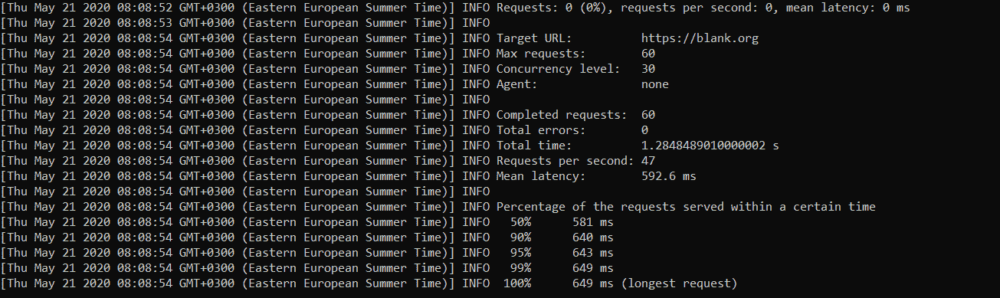

该工具为我们提供了以下信息:

*   **百分位数** (50，90，95，99 和 100%)
*   **平均潜伏期**
*   **错误率**

我们可以看到，对于 blank.org 来说，50%的请求(30 个请求)的响应时间(以毫秒计)不到 581 毫秒，而最长请求的响应时间为 649 毫秒


## 铅轧机


Loadmill

我们可以使用的另一个工具是 Loadmill，这是一个基于网络的免费测试工具。如果我们想自己编写代码，它还附带了一个 [npm](https://www.npmjs.com/package/loadmill) 包，但出于演示目的，我们将使用在线工具。

要使用 Loadmill 进行负载测试，我们需要做的就是在相应的面板中创建一个请求，并提供应用程序的 URL。

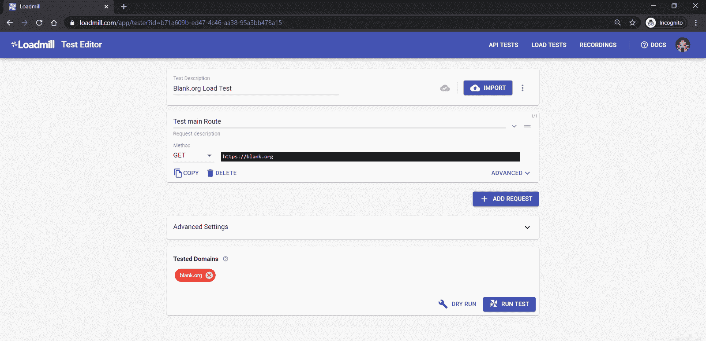

下一步是点击 ****运行测试**** 按钮，并配置并发会话的数量和测试持续时间。

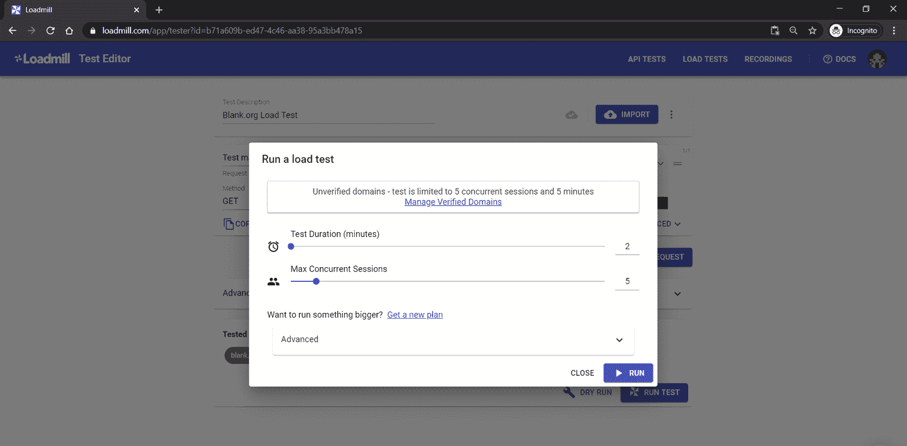

你会注意到**域名出现在一个红色按钮中。那是因为这是一个未经验证的域名。毕竟，我不拥有 blank.org 的**网站。因此，我们可以向该站点发送特定的最大负载阈值。****

****使用这种配置，我们将看到当 5 个并发会话在 2 分钟的时间内尝试使用该应用程序时，blank.org 会如何反应。​​****

****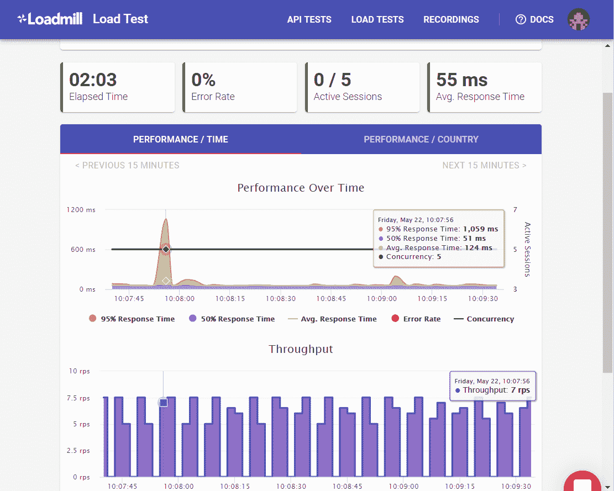****

****作为输出，我们可以看到一段时间内的性能:****

*   ****所有请求的平均响应时间为 55 毫秒，****
*   ****我们在开始时看到，95%的请求的响应时间低于 1，059 毫秒，50%的请求的响应时间低于 51 毫秒****

****这意味着响应的最长时间超过了 1 秒。****

****同时，我们可以在我们的 sessions 的****【RPS】****(每秒请求数)中看到**和吞吐量。这是我们的并发用户在 1 秒钟的时间范围内发送的请求数。​​******

**现在你可能会问自己，为什么第一个工具和这个工具的结果会有这么大的差异？**

**这里有一件非常重要的事情需要注意，即数据的相关性和正确性。**

**你需要现实一点，尽可能让你的测试反映现实。​​**

**当进行性能测试时，有不止一种策略。一些工具和提供商只使用本地环境，而其他工具和提供商为每个并发用户启动虚拟机。**

******Loadmill**** 不同于其他服务，因为它使用真实的 web 流量来生成测试服务器上的负载。换句话说，流向目标网站的流量来自*真正的浏览器*。**

******Loadtest**** 包与运行测试的本地机器密切相关，只要 CPU 允许，您就可以进行测试。**

**正如你看到的，我在我的机器上使用命令行使用 ****loadtest**** 运行测试。响应时间比使用 ****负荷机的响应时间大 10 倍。**** 让我们找出原因。

如果我们打开 blank.org 上的开发者工具就能找到它的 IP，那就是****18.217.80.105。**** 使用这个值，我们可以执行 IP 查找，并看到服务器位于美国俄亥俄州**？？ ****。********

**我们知道响应时间是指请求和响应之间的时间。因此，请求发送到服务器，然后从服务器返回到代理(浏览器)。**

**使用第一个工具，我们得到了大约 500 ms，因为我从我的机器上发送请求。因此这些请求必须来回传递近 11000 英里。**

**如果我们继续我们测试结果的第二个面板 ****性能/国家**** 。我们看到所有的请求都来自美国。这就是为什么显著缩短的响应时间？**

**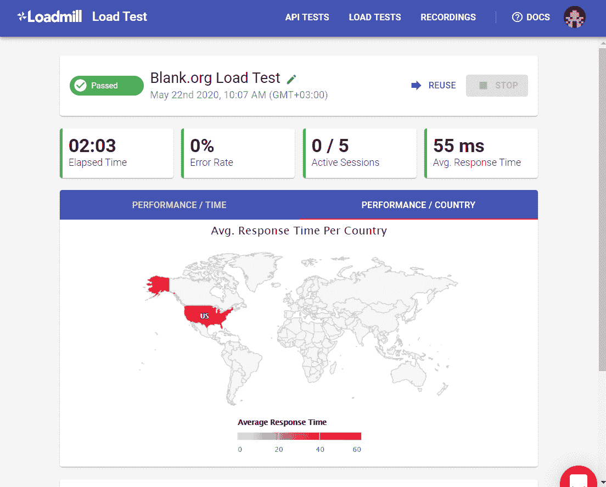**

**测试时请记住，最好尽可能模拟接近现实的条件，以便数据尽可能准确。**

**在我们使用下一个工具之前，我想再提一件关于 Loadmill 的事情，那就是它可以被配置为做更多的事情。**

**我们可以创建复杂的负载测试场景，其中包含多个包含参数和数据(包括基本身份验证和电子邮件通知)的请求。​​**

**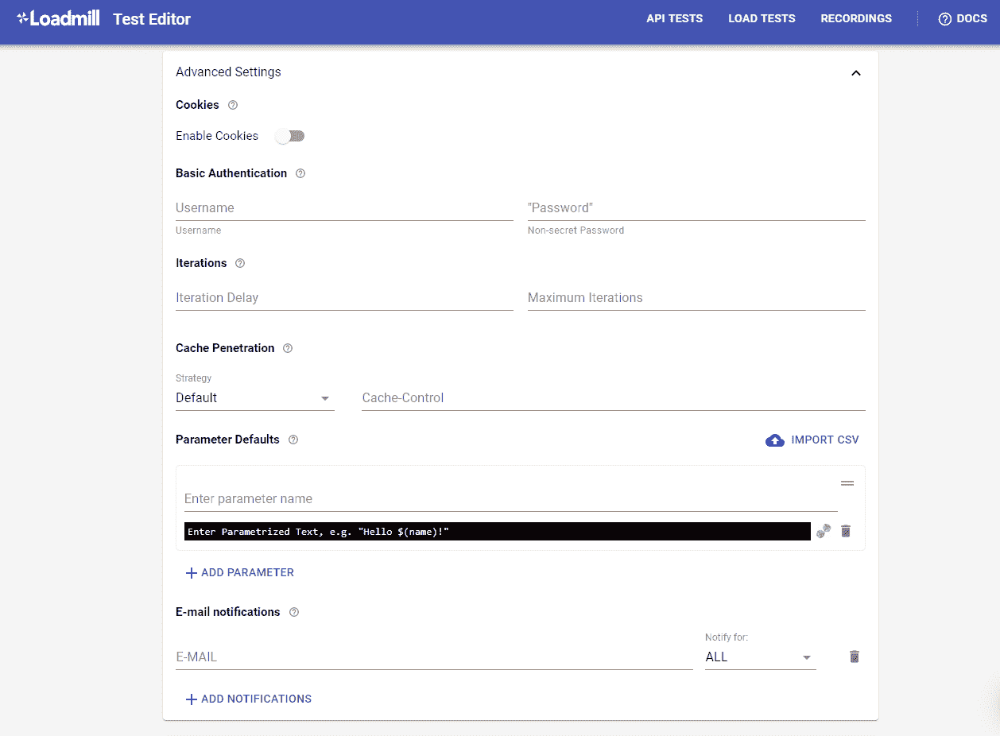**

## **阿帕奇 JMeter**

**

Apache JMeter** 

**我们列表中的最后一个工具是 [Apache JMeter](https://jmeter.apache.org/) ，这是一个用于性能测试的基于 Java 的开源应用程序。这个应用程序需要安装，配置起来有点困难。因此，以下信息被分成几个步骤。**

### **步骤 1 -下载并安装**

**[下载](https://jmeter.apache.org/download_jmeter.cgi)二进制文件并解压缩。**

**然后，进入 **bin** 文件夹，运行两次 **jmeter.bat** 文件。一次是配置工具，第二次是启动工具。**

### **步骤 2 -添加线程组**

**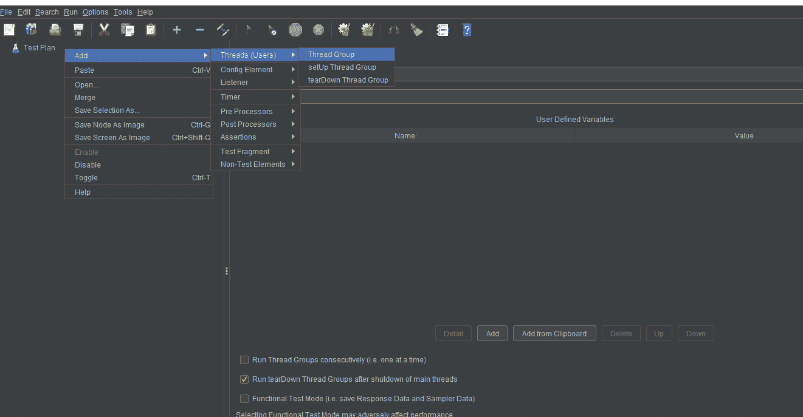**

****线程组**有三个影响负载测试的特别重要的属性:**

*   ****线程(用户)数量**:JMeter 将创建的并发会话数量。**
*   ****上升期(秒)**:测试的持续时间。**
*   ****循环计数**:执行测试的次数。**

**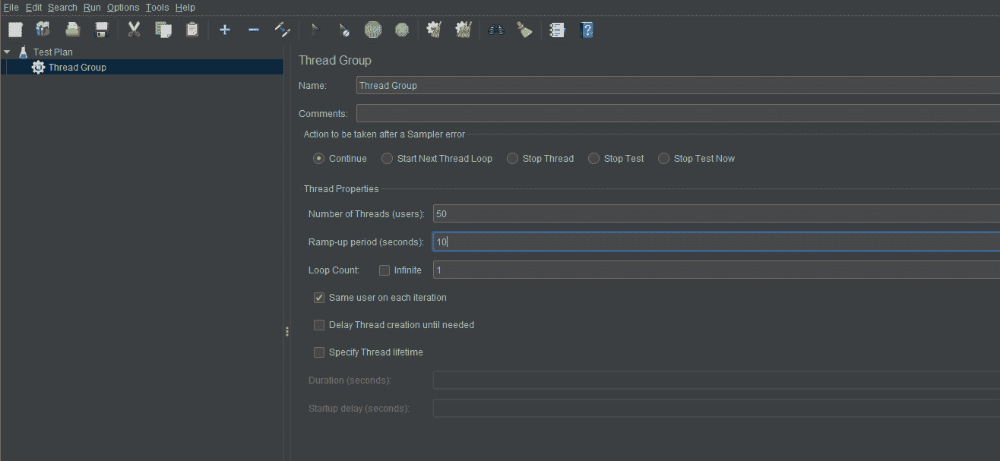**

### **步骤 3 -添加 HTTP 请求采样器**

**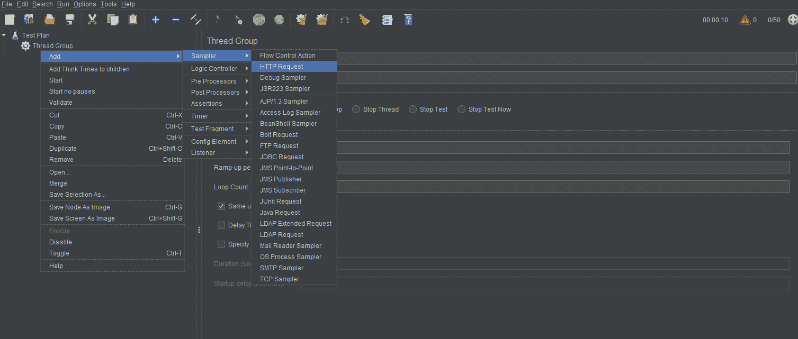**

**在 **HTTP 请求样本**中，在 HTTP 请求部分下，填写您想要测试的应用的**服务器名称、协议**和**路径**。**

**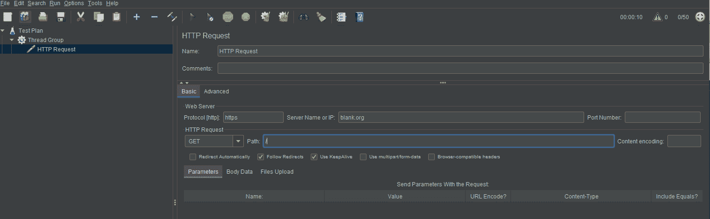**

### **步骤 4 -添加视图**

**在 JMeter 中，您将使用监听器来输出性能测试的结果。有各种各样的监听器可用，您可以通过安装插件来添加其他监听器。在这种情况下，让我们使用表格。**

**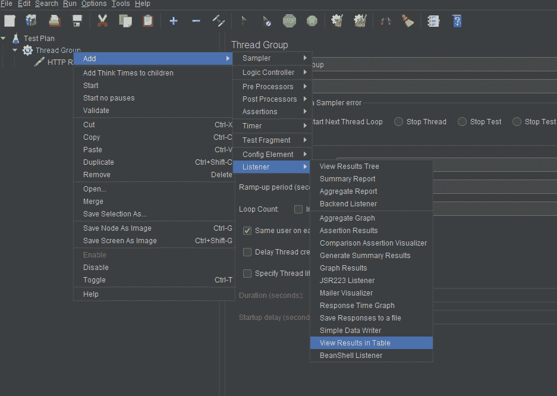**

### **步骤 5 -运行测试**

**单击绿色三角形运行测试。**

**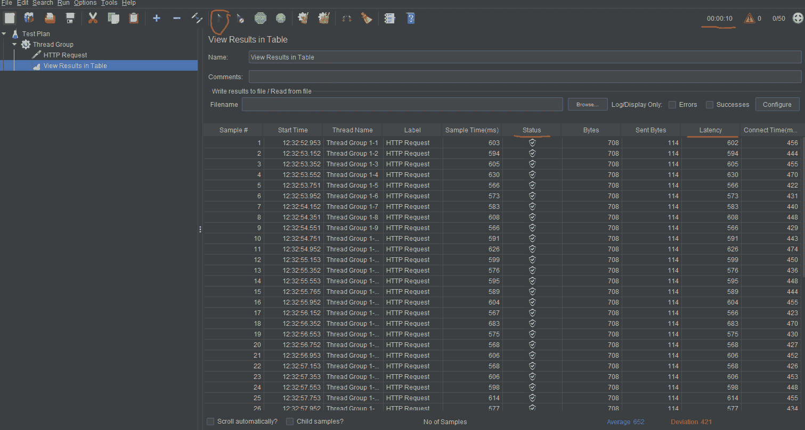**

**现在我们可以分析我们的测试了。**

**首先，我们可以在右上角看到，测试运行了 10 秒钟，正如我们之前在选项中指定的那样。**

**之后我们最感兴趣的栏目是 ****状态**** 和 ****潜伏期**** 。**

*   ******延迟**** :请求和收到初始响应之间经过的毫秒数。**
*   ******状态-**** 代表请求的状态，是否成功。这是用来计算错误率的。**

***顺便提一下，我们可以观察到这些值类似于使用* *****loadtest 得到的值。***** *那是因为它们的工作方式相同。***

## **剩余指标**

**通过这些工具，我们获得了关于我们在开始时谈到的大多数指标的信息。**

**最后，如果我们想获得关于******，**** 内存/ CPU 利用率的信息，那么我们需要连接到托管应用程序的机器并运行以下命令:****

```
`$ top`
```

**这个命令将显示 CPU 利用率的百分比和内存利用率。**

**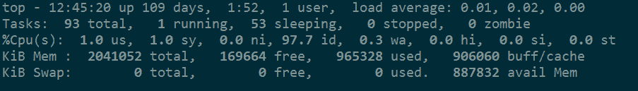**

**或者**

```
`$ free -h`
```

**这个命令只会显示内存数据，但是更容易阅读。**

****

## **结论**

**有很多工具可以用来执行性能测试。重要的是找到一个简单易用，但又能为您的案例提供最准确数据的工具。记住，一定要让你的测试尽可能模拟真实的环境。**