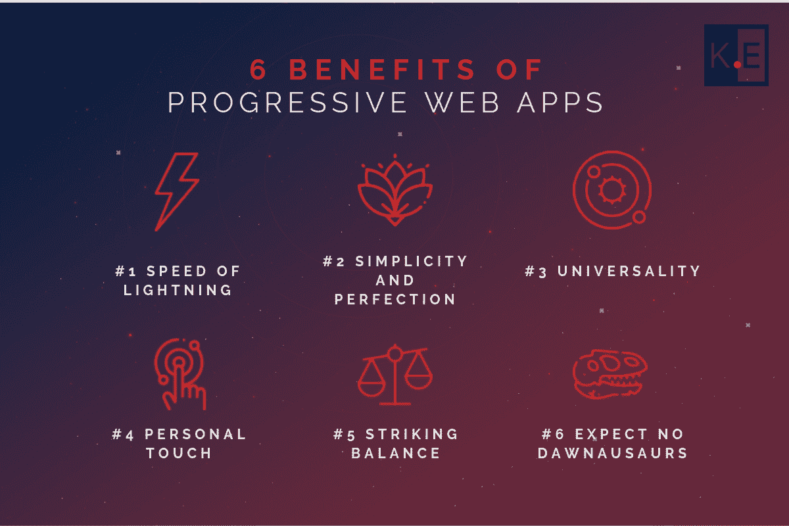

# 渐进式 Web 应用程序开发概述

> 原文：<https://www.freecodecamp.org/news/practical-tips-on-progressive-web-app-development/>

普通的移动应用程序似乎已经不起作用了。App Store 和 Play 市场中的应用数量极其庞大。对于希望自己的应用可见的企业和试图找到所需应用的客户来说，这都是一个挑战。

而且传统手机 app 的开发成本高，耗时长，而用户体验又慢又纠结。

为了解决这些问题，并提供最佳的商业机会和用户体验，渐进式网络应用进入了游戏。什么是 PWA 技术？为什么渐进式 web 应用程序开发构成了未来？一个进步的 web app 开发公司是做什么的？我们将在本文中回答所有这些问题。

## 什么是渐进式 Web 应用程序？

最简单地说，渐进式网络应用程序是一个类似于安装在智能手机、笔记本电脑、平板电脑或台式机上的应用程序的网站。

PWA 开发是一组优化的软件开发实践，旨在使 web 应用程序的功能类似于移动或桌面应用程序。与移动应用程序类似，PWAs 发送推送通知，并在主屏幕上显示一个图标。与此同时，渐进式网络应用程序比传统的移动应用程序更简单、更快，并且可以通过一个 URL 进行共享。

进步的 web 应用程序开发人员优化 web 应用程序，因为它们提供了类似应用程序的导航和出色的视觉内容。这是在 javascript 文件(称为服务工作器)的帮助下实现的，这些文件支持应用程序的离线执行和离线信息存储。

PWA 开发帮助开发人员和企业缩小 web 和本地体验之间的差距，这有时会导致耗时、令人沮丧或不可靠的用户体验。

一家进步的 web 应用程序开发公司明白，对于现代用户来说，在商店中寻找应用程序太费力了。人们努力节省时间和精力，同时寻找最有效的解决方案。因此，PWA 技术被应用来使用户能够通过一次点击来访问他们喜欢的网站的类似于本地的移动版本。

进步的 web 应用程序开发公司采用最新的 web 技术，旨在为用户提供最令人惊叹的 web 体验。通过提高性能、可访问性和用户参与度，进步的 web 应用程序开发人员确保这些应用程序快速、引人入胜且可靠。

## 渐进式网络应用的好处是什么？

1.  **闪电般的速度:**一家进步的 web 应用程序开发公司使应用程序的加载速度比普通网站更快，这对出色的用户体验至关重要。
2.  **简单和完美:**无需离开网页或打开商店，只需轻点几下鼠标，即可轻松快速地安装渐进式网络应用程序。
3.  **通用性:**渐进式 web apps 兼容所有设备和平台，即 Windows、MacOS、Linux、Chrome OS。
4.  **个人接触:** PWA 开发者确保他们的应用比常规移动应用更加个性化，这大大提高了客户参与度和忠诚度。
5.  **惊人的平衡:**pwa 有助于增加有机流量，降低跳出率。
6.  **不再停机:通过使用来自早期在线活动的缓存数据，progressive web 应用程序开发公司使他们的应用程序能够在不访问互联网的情况下完美地工作。**

> 渐进式网络应用的最大好处是能够离线工作，并且没有手机浏览器的所有工具条和按钮。

> 全栈开发人员 rgey Gornostaev

渐进式 web 应用程序不仅对用户来说更方便，而且对企业来说开发起来更便宜、更快。事实上，PWA 开发人员不需要为不同的平台编写单独的代码，这大大限制了最终产品的整体成本和开发时间。此外，由于 pwa 是从网站本身安装的，开发人员不需要将应用程序部署到应用程序商店，遵循应用程序设计或逻辑的所有要求，提高应用程序的可见性等。这样的应用程序只在网站上提供，这让用户感觉这是一个一次性的安装-点击-删除应用程序。

## 渐进式 Web 应用程序的缺点是什么？

1.  **分散搜索:**用户不能只是进入应用程序商店，找到需要的应用程序，或者偶然发现一个随机的应用程序。用户要么知道自己想要什么，要么不太可能找到。
2.  对苹果爱好者来说，坏消息是:虽然微软和谷歌致力于开发和鼓励 PWAs 的发展，但苹果似乎并不急于遵守他们的规则。尽管 Safari 已经支持 PWAs，但功能有限，用户无法体验这项技术的所有好处。
3.  **隔离:**不同的 pwa 之间不能共享资源或数据，因为它们是高度分离的。

## 为什么说 PWA 开发是未来？

谷歌公司强烈支持渐进式应用程序开发，认为 PWA 开发是软件的未来。根据谷歌的文章，通过渐进式网络应用， [【全球速卖通】](https://developers.google.com/web/showcase/2016/aliexpress) 将其新用户的转化率提高了 104%，每次会话的平均时间增加了约 74%。

PWA 开发人员帮助一家沙特电子零售商 [eXtra Electronics](https://developers.google.com/web/showcase/2016/extra) 增加了 100%的销售额，并通过网络推送通知吸引新用户，这也是渐进式网络应用的一部分。

同样，一家美国零售商 [5miles](https://developers.google.com/web/showcase/2016/5miles) 的转化率提高了 60%，跳出率降低了 50%。此外，在 PWA 开发公司的帮助下，尼日利亚电子商务平台 Konga 已经将数据使用量减少了约 92%。 [*《华盛顿邮报》*](https://developer.washingtonpost.com/pb/blog/post/2016/07/15/amp-up-with-progressive-web-apps/)*也在积极使用一种渐进式网络应用程序，它使他们的页面加载时间减少了十分之一。*

*如今，pwa 已经被 Twitter、 [、Instagram](https://appsco.pe/app/instagram) 、 [Telegram](https://appsco.pe/app/telegram) 、 [Pinterest](https://appsco.pe/app/pinterest) 、以及 [Tinder](https://appsco.pe/app/tinder) 等用户喜爱的社交网络平台积极使用。[three . js](https://threejs.org/editor/)——一个流行的 3D 模型编辑器——也可以作为 PWA 使用。出租车服务和 [Lyft](https://appsco.pe/app/lyft) 也为他们的顾客提供 PWAs。*

*渐进式网络应用程序也可以用来使游戏更有趣，如 [2048](https://appsco.pe/app/2048) 或 [暴锁](https://appsco.pe/app/breaklock) 。pwa 也受雇于 [9GAG](https://appsco.pe/app/9gag) ，咖啡零售商 [星巴克](https://appsco.pe/app/starbucks) ，或者热门服务 [谷歌地图](https://appsco.pe/app/googlemaps) 。*

*谷歌和微软同样喜欢 pwa，因为两家公司都认识到这项技术的巨大潜力。然而，有传言称，微软对渐进式网络应用抱有巨大的希望，因为它计划凭借其创新的 Andromeda 设备重新进入智能手机市场。虽然这款可折叠智能手机定于 2019 年底推出，但人们普遍认为，微软不仅将赌注压在革命性的硬件解决方案上，还将赌注压在更新的操作系统的全 PWA 软件上。*

*然而，这个领域仍然几乎是免费的，截至 2019 年 3 月，Windows 10 商店上发布的 pwa 只有 32 个。相比之下，在 2018 年底，这家商店有大约 70 万个常规应用程序。不仅如此，截至目前，智能电视或任何其他物联网设备都没有 pwa，而这些设备可能会从这种技术中受益匪浅。因此，对于那些想让自己的业务与众不同、想给客户留下深刻印象、想在这样一个充满希望的领域做先锋的人来说，渐进式网络应用是一个完美的选择。*

> *只要移动设备逐渐取代台式机，PWA 就是一个绝佳的机会，企业可以借此扩大自己的影响范围，在网上站稳脚跟。同时，可以大大节省应用程序的开发和维护成本。*

> *Anton Morya，全栈软件开发人员*

## *一个进步的 Web App 开发公司是做什么的？*

*与移动或网络软件的情况一样，进步的网络应用程序开发人员从发现阶段、原型、概念验证或 [MVP](https://keenethics.com/approach-minimum-viable-product) 开始。之后，PWA 团队应该创建一个响应式设计，它在任何平台和任何设备上都将看起来很完美。渐进式应用程序开发过程本身应该适合特定业务的需求，PWA 开发人员应该充分了解客户的需求和兴趣。该产品必须由一个进步的 web 应用程序开发公司不断测试，以修复错误并防止进一步的错误发生。*

*如果企业已经有了一个网站，并希望使其适应 PWA 技术，那么 progressive web app 开发公司应该提供一个详细且规划合理的迁移策略。*

*PWA 开发公司也可能提供 SEO 服务，以确保网站和 progressive web 应用程序可以轻松搜索。一个 SEO 友好的 PWA 可以大大提高网络流量和转化率。*

*在渐进式 web 应用程序开发结束并推出最终产品后，一家可靠的 PWA 开发公司会为其客户提供一个 PWA 开发人员团队，以提供持续的支持和维护。*

## *你对 PWA 有什么想法吗？*

*我的公司 KeenEthics 是一家经验丰富的[渐进式网络应用开发公司](https://keenethics.com/tech-apps-progressive-web-apps)。如果您需要以下服务，请随时联系**。***

*发布在 KeenEthics 博客上的原始文章可以在这里找到:[渐进式网络应用开发的实用技巧](https://keenethics.com/blog/practical-tips-on-progressive-web-app-development)。*

## *附言*

*我要感谢所有为本文做出贡献的人，包括全栈软件开发人员@ Keenethics 的 Sergey Gornostaev 和 Anton Moriia，以及内容经理@ KeenEthics 的 Tetiana Matviiok。*

*发布在 KeenEthics 博客上的原始文章可以在这里找到:[渐进式网络应用开发的实用技巧](https://keenethics.com/blog/practical-tips-on-progressive-web-app-development)。*