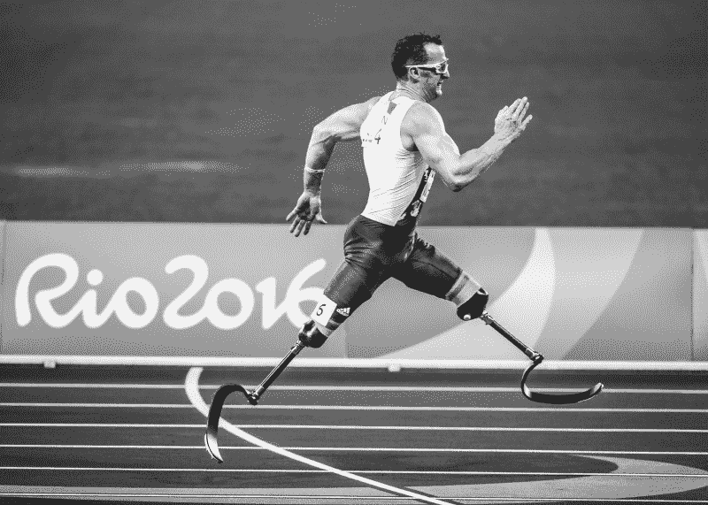
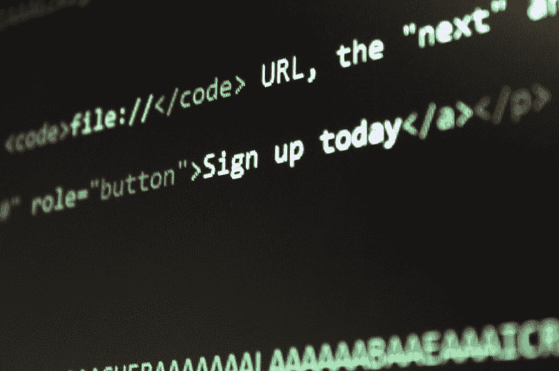
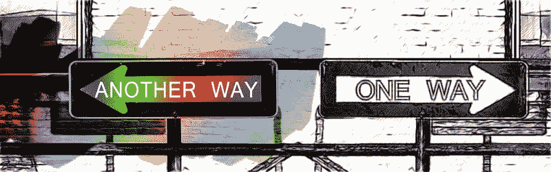

# 让你铭记在心的实用的网页可访问性规则

> 原文：<https://www.freecodecamp.org/news/pragmatic-rules-of-web-accessibility-that-will-stick-to-your-mind-9d3eb85a1a28/>

蒂亚戈·罗梅罗·加西亚

# 让你铭记在心的实用的网页可访问性规则

"The Paralympic Games is about transforming our perception of the world." — Stephen Hawking
The same could be thought for **web accessibility**.

早在 2015 年，我就开始在一家美国零售巨头公司从事网络无障碍工作。由于其网站未能遵守美国残疾人法案(ADA ),该公司刚刚遭到一场巨额诉讼。在那之后，我和我的团队在 ADA 遵从性方面做了大量的工作，我了解了许多 web 可访问性原则。

然而，在接下来的几年里，我发现自己不断违反这些原则，尽管我经常和他们一起工作。不知何故，在我编码的时候，我永远不会正确地记住它们。我不会承认这一点，但我肯定没有完全消化这些原则。

最终，我决定是时候把我的时间投入到把事情浓缩成简单、实用、易记的规则中了。我最终照做了，从那以后，它们一直为我工作得很好。

本文有两个部分:[什么是网页可访问性？](#138c)和 [3 网页可访问性的语用规则](#13e5)。在第一部分，我回顾了网页可访问性并分享了我的经验。但是如果你想切入正题，那就直接进入第二个环节:[网页可访问性的 3 条实用规则](#13e5)。

### 什么是网页可访问性？

正如我提到的，早在 2015 年，我的公司因不符合 ADA 而被起诉。

ADA 是一部民权法

> *“禁止在公共生活的所有领域歧视残疾人，包括工作、学校、交通以及向公众开放的所有公共和私人场所”*。

通过这种方式，ADA 要求**企业、州和地方政府以及非营利服务提供商**为残疾公众提供便利，使其能够获得与健全顾客相同的服务。同样，**联邦政府机构**被要求遵守一项名为 [Section 508](https://www.section508.gov) 的联邦法律。

在 web 环境中，美国任何不符合 ADA 或 Section 508 的公共网站实际上都排除了几个有不同程度障碍的用户组。

另一方面，让每个人都可以访问网站内容，任何人都可以操作网站功能的包容性做法被理解为[网页可访问性](http://en.wikipedia.org/wiki/Web_accessibility)，或者仅仅是 [a11y](https://a11yproject.com/posts/a11y-and-other-numeronyms/) 。

#### a11y 可以支持哪些人？

根据 2011 年由[世界卫生组织](http://www.who.int)(世卫组织)发布的[世界残疾报告](http://www.who.int/disabilities/world_report/2011/report/en/)，估计全球 15%的人口患有某种形式的残疾。其中，2%到 4%的人在功能上有明显的困难。

伟大的 [Addy Osmani](https://www.freecodecamp.org/news/pragmatic-rules-of-web-accessibility-that-will-stick-to-your-mind-9d3eb85a1a28/undefined) 、[的一篇优秀文章《网络无障碍 UI 组件](https://medium.com/@addyosmani/accessible-ui-components-for-the-web-39e727101a67)，阐述了在 a11y 背景下需要考虑的四个主要残疾领域:

**1。视觉问题:**从不能辨别颜色到完全没有视觉。

**2。听力问题:**表示用户可能在听到页面发出的声音时有问题。

**3。行动问题:**可能包括无法操作鼠标、键盘或触摸屏。

**4。认知问题:**意味着用户可能需要辅助技术来帮助他们阅读文本，因此确保文本替代物的存在很重要。

请记住，这些是非常广泛的损伤。这意味着一个人不需要有严重的损伤就需要 a11y 支持。

为了了解更多，我推荐参加由 Google 提供的 Udacity 网站上的[网页可访问性](https://www.udacity.com/course/web-accessibility--ud891)免费课程。这是本课程的一段视频，涵盖了这些残疾领域:

#### 好的，那么我们如何提供支持呢？

到 2015 年我们接到诉讼时，已经有一次审计发现了几个 a11y 问题。我们的团队参加了为期一天的可访问性培训会议，在会上我们了解了 [Web 内容可访问性指南](https://www.w3.org/TR/WCAG21/) (WCAG，目前版本为 2.1)，这是公认的 a11y 合规性标准。

WCAG 由[万维网联盟](https://www.w3.org) (W3C)的[网络无障碍倡议](https://www.w3.org/WAI/) (WAI)维护。同一个小组编写了[可访问的富互联网应用](https://www.w3.org/TR/wai-aria-1.1/) (WAI-ARIA 或简称 ARIA，目前版本为 1.1)，这是一个关于如何通过在 HTML 中添加角色和 ARIA 属性来增加网页 a11y 的规范。

这些准则分为三个合规级别:

*   答(必须支持)
*   AA(应该支持)和
*   AAA(可能支持)。

世界上许多可访问性法律都是基于 WCAG 级别的。例如，2017 年 1 月，508 条款采用了符合 WCAG 2.0 的 AA 级标准。

在 [WebAIM 的《新 WCGA 协议》清单](https://webaim.org/standards/wcag/checklist)中可以找到对指导方针的一个很好的总结，其中每个标准都指出了其相应的合规水平。

#### 学习 WCAG 和 WAI-ARIA 有多难？

我想花一点时间来分享我学习 a11y 的经验。

虽然我们的培训非常全面，而且是由知识非常渊博的人提供的，但我们只是坐在那里几个小时，一条一条地审阅整个 WCAG 规范。他们的滑梯甲板非常大，我们在滑梯间快速移动。老实说，这很麻烦，因为 WCAG 绝对不小。

长话短说，我们能够写下许多行动项目，并且我们立即开始致力于这些修复。然而，这很快变成了某种重复的、机械的对刺激的反应。故事进，代码出。我们被淹没在大海中。

每个人都知道我们在 a11y 变得多么精通，所以没有人会质疑我们的工作。所有的故事都停下来了，我们有不同的优先顺序。人们的期望是，我们会把我们所学的东西带过去，这实际上已经发生了很长一段时间。

随着时间的推移，有人离开，有人加入，新的管理层进来。市场变化很快。我们改变了我们的关注点和团队精神。不用说，我们变得如此沉迷于新事物，以至于我们对新事物的遵从远远地被抛在了脑后。

情况非常糟糕，六个月后我们又进行了一次审计，却发现我们仍然有一大堆违规行为！我们很快意识到，虽然我们修复了最初的审计问题，但我们编写的大多数新代码在 a11y 上同样糟糕。不仅如此，我们从未将 a11y 作为我们开发清单的一部分，新来者也从未接受过相关培训。

结论:我们只是让它发生——a11y 被忽视了，关键的想法没有在我们心中根深蒂固。

换句话说，我们在创造**排除**，根据[微软包容性设计](https://www.microsoft.com/design/inclusive/)的说法，这就是当我们用自己的偏见解决问题时会发生的事情。

#### 经历排斥

“Exclusion is never the way forward on our shared paths to freedom and justice.” — Desmond Tutu

有时候为了更好地理解事物，你需要亲自经历。这就是发生在我身上的快乐。

我定期捐献血小板，因为我的血型是 A+，所以我可以通过这种方式帮助更多的人。有一次，我的静脉被错误地穿孔了，我的左臂上有一个又大又疼的瘀伤。

通常，常规献血持续 10 分钟左右，但血小板捐献持续 90 分钟左右。大约过了 20 分钟，我们才注意到我的静脉破裂，因为我的胳膊上盖着毯子(因为血液回流会让你感到寒冷)。

到那时，损害已经造成，我们不得不中断捐赠。有几天，我的手臂变得非常肿胀和敏感。以至于我根本不想用我的左臂去工作。

现在，我试着用右手做任何事情。突然，我注意到不停地在键盘和鼠标之间切换效率很低，我宁愿只使用键盘或鼠标来完成手头的整个任务。

很快，我发现自己更喜欢完全使用键盘，然后我注意到许多网站根本没有键盘支持。然后我想到:我正在经历一种排斥，尽管这只是暂时的。

然后，就在那一刻，我想起了过去我和 a11y 一起工作，让这些排除通过。哦，天啊！

#### 排除的级别

根据[微软的包容性 101 工具包](https://www.microsoft.com/design/inclusive/)，有三个级别的排除:

1.  永久:丧失肢体、视力、听力或言语等残疾的人所经历的。
2.  **暂时性:**短期受伤或正在短期经历某些事件的人所经历的，例如看着明亮的灯光，戴着石膏，或在外国点晚餐。
3.  **情境:**那些能力在特定环境中会发生巨大变化的人所经历的，比如在嘈杂的人群中听不清楚，在汽车中视力受损，或者新父母单手完成任务。

暂时被排除在外对我来说是非常开放的，因为我以前从未在工作中面临过这样的挑战。

然而，我非常幸运，因为我的经历只有几天，而世界上数百万人却经历了终身的排斥。

#### 为改变而编码

最后，我想到:实施 a11y 意味着为一个更加包容的世界做出贡献！作为工程师，我们可以做以下几件事:

*   学习如何编写支持 a11y 的代码。
*   将 a11y 遵从性添加为开发清单的一部分(就像您处理单元测试和文档一样)。
*   与您的团队讨论 a11y，以提高意识。
*   评估您的团队是否正在生成可访问的代码，并将所有问题记录为团队要处理的缺陷。
*   质疑未涵盖所有内容的业务需求，并要求可访问的替代方案。
*   分享您的经验，并向您的同行展示如何以实用的方式采用 a11y，这正是我写这篇文章的原因。:)

### 3 网页可及性的实用规则

所以，我带着我的使命来到这里，把所有的一切提炼成 3 条实用的规则，牢牢记在你的脑海里。从这些规则中，您应该能够获得其余的知识，并找到在您的项目中实现 a11y 的指导。

**免责声明:**这些规则并不能代替学习 a11y 的需要。它们也不全面。它们只是为你提供一个基本而有效的基础，这样你就可以自己走完剩下的路了。

同样，为了学习 a11y，我全心全意地推荐参加由 Google 提供的 Udacity 网站上的[网页可访问性](https://www.udacity.com/course/web-accessibility--ud891)免费课程:

[**Web Accessibility | uda city**](https://www.udacity.com/course/web-accessibility--ud891)
[*获得使 Web 应用程序具有可访问性的实践经验。你会明白用户何时以及为何需要可访问性…*www.udacity.com](https://www.udacity.com/course/web-accessibility--ud891)

现在谈谈网页可访问性的 3 条实用规则。我希望你能把它们带在身边，每天在工作中应用:

#### 1)坚持语义 HTML 元素，或者 DIY

"The Semantic Web isn’t inherently complex. The Semantic Web language, at its heart, is very, very simple. It’s just about the relationships between things." — Tim Berners-Lee

对我来说，这是可及性的黄金法则。

**语义**元素是指那些随其所代表的内容一起传达某种意义的元素，如`>, &` lt `;in` pu `t>`上的`<butt`；、&l`t;a`T8、< h1 >和< p >。它们为用户代理提供了一些上下文(浏览器、设备或辅助技术，如屏幕阅读器)，因此它将知道如何与这些元素交互以及对这些元素有什么期望。

它们不同于**中性**元素，如`<d` iv > `; and` < s **pan >，或 pr**esentative El`ements l`ike&enter>和< big >，它们不向用户代理提供这样的上下文。

语义元素在很大程度上已经是可访问的(并且是 SEO 友好的)。这意味着它们已经涵盖了开箱即用的许多方面，例如:

*   通过 tab 键正确处理**焦点**。
*   响应**键盘事件**(如回车、Esc、空格、箭头键)。
*   表示语义信息(名称、角色、状态和值)，以便辅助技术能够理解。
*   符合**颜色对比**要求，默认样式。

然而，当不使用语义元素时，**你应该手动编码所有这些东西，以使其可访问**。

这意味着你需要做这样的事情:

*   添加`tabindex="0"`使组件成为自然 tab 键顺序的一部分，并使用`focus()`、`display: none`或`aria-hidden`来避免焦点陷阱。使用 tabindex 在[上了解 tabindex。](https://developers.google.com/web/fundamentals/accessibility/focus/using-tabindex)
*   为预期的**键盘事件**附加监听器。在 [WAI-ARIA 设计模式和部件](https://www.w3.org/TR/wai-aria-practices-1.1/#aria_ex)上检查你的组件的期望。
*   使用一个**角色**提供一些语义和 SEO 价值。了解 [WAI-ARIA 角色分类](https://www.w3.org/TR/wai-aria-1.1/#roles_categorization)中所有可能的角色。
*   提供 **ARIA 属性**来描述状态和值。在 [WAI-ARIA 的角色定义](https://www.w3.org/TR/wai-aria-1.1/#role_definitions)中找出每个角色适用的 ARIA 属性。
*   注意**颜色对比**和**对焦指示器**，尤其是使用`outline: 0`时(不推荐使用)。

还是关于语义元素，这里还有一些事情需要记住:

*   使用[分节标签](https://www.w3.org/TR/wai-aria-practices/examples/landmarks/HTML5.html)将你的页面组织成节，否则你需要提供地标角色。
*   使用[标题标签](https://developer.mozilla.org/en-US/docs/Web/HTML/Element/Heading_Elements)来组织你的文本内容，这样你就可以表达各部分之间的关系以及它们的重要性顺序。郑重声明:每页只能有一个`<` h1 >。
*   使用`<label for="..`。”>同 form fiel`ds as &`lt`;input&g`t；，&`lt;select&`gt；以及< textarea >。
*   为工作使用正确的工具，例如，如果是链接，使用`<a href=` "" >和`never ，如果是`button,` 就用<但是`ton> and never <a hr`ef = " # " onclick = "……">。

嗯，语义元素似乎更方便，你不觉得吗？

#### 2)提供图像、颜色、声音和动作的替代方案

"Painting is just another way of keeping a diary." — Pablo Picasso

辅助技术最适合处理文本。当使用任何其他内容时，请始终提供一个替代文本，例如:

*   对于图像，提供一个**文本选项**。您可以将`alt="description"`用于**信息图像**(那些有意义的图像，如图片或独立图标)，将`alt=""`用于**装饰图像**(那些没有意义的图像，如按钮内的图标，就在其文本旁边)。这对于图片链接尤其重要。
*   仍然在图像上，当依赖它们进行用户交互时，提供一个**音频替代方案**，或者探索如何停止依赖它们。例如，你可以查看[谷歌 reCaptcha](https://www.google.com/recaptcha/intro/v3beta.html) 。
*   对于颜色，当指示验证状态、指定区域或简单区分元素时，添加一个**二级指示符**，如信息文本、图标甚至工具提示。
*   还是在颜色上，找出文本的**对比度**，检查它是否符合你所遵循的标准。例如，WCAG 的 AA 级别要求常规文本的最小比例为 4.5:1，大文本的最小比例为 3:1。
*   对于音频和视频，提供文本字幕或**抄本**(如果有的话)。对于动作声音，提供一个**视觉替代**。
*   对于用户移动，任何时候我们希望用户执行特定的手势动作，让它们**可选**或者通过键盘提供**交互选择**。
*   对于自动移动，避免闪烁、闪烁、移动内容和新窗口。当不可避免时，添加**控件**调整时间，暂停或隐藏该内容。此外，使用 [aria-live](https://www.w3.org/TR/wai-aria-1.1/#aria-live) 以便屏幕阅读器可以在中断发生时通知用户。

#### 3)养成在日常工作中使用各种工具的习惯

"We shape our tools and then our tools shape us." — Marshall McLuhan

这可能是最有效的规则，所以当你让某样东西从上面两条规则中通过时，这条应该会接住它。

我在这里列出了几个 a11y 工具。给他们一个尝试，在你的网站上运行他们，看看你从他们那里学到了什么，试着和他们呆在一起。

基本上，我推荐你采用 3 种工具:

**a)针对您的发展清单**

*   aXe chrome 插件:一个易于使用的 a11y 检查器，可以发现问题并提供修复建议。
*   Wave:一个 a11y 评估工具，通过在你的页面中注入图标和指示器来提供关于你的网页内容可访问性的视觉反馈。
*   [DevTools(可访问性窗格、对比度和审计)](https://developers.google.com/web/updates/2018/01/devtools#a11y):这 3 个 DevTools 特性允许导航可访问性树，查看每个元素的 a11y 属性，验证文本元素的颜色对比度，并对可访问性(和其他指标)执行整页审计。
*   [NoCoffee chrome 插件](https://chrome.google.com/webstore/detail/nocoffee/jjeeggmbnhckmgdhmgdckeigabjfbddl):模拟有轻微到极度视力问题的人所面临的问题。
*   [高对比度 chrome 插件](https://chrome.google.com/webstore/detail/high-contrast/djcfdncoelnlbldjfhinnjlhdjlikmph):让你选择几个高对比度的颜色过滤器来浏览网页，这些过滤器旨在使文本更容易阅读，因此你可以检查你的网站对需要高对比度支持的用户来说如何。

**b)使用真实屏幕阅读器进行手动测试**

*   Mac [画外音](https://www.apple.com/voiceover/info/guide/_1124.html)(包含在 macOS 中)。
*   Windows [NVDA](https://www.nvaccess.org/download/) (免费)和[大白鲨](http://www.freedomscientific.com/Products/Blindness/JAWS?gclid=CjwKCAiA8vPUBRAyEiwA8F1oDDzHAjW9-GfooiNT3sCDcTg_7LNXvHz4XL7osONDyf3Y4k9KRbcuihoCKGMQAvD_BwE)(付费)。

**c)用于自动审计**

*   [Google Lighthouse](https://www.npmjs.com/package/lighthouse) :自动审计器，类似于 DevTools 审计。
*   aXe chrome 插件上相同 a11y 规则的自动检查器。
*   [Pa11y Dashboard](https://github.com/pa11y/pa11y-dashboard) :帮助您监控网站可访问性的网络界面。

#### 了解更多信息

*   [508、阿达、WCAG 有什么不同？](https://www.logicsolutions.com/508-ada-wcag-accessibility-difference/)
*   [世卫组织世界残疾报告](http://www.who.int/disabilities/world_report/2011/report/en/)
*   [网络的可访问用户界面组件](https://medium.com/@addyosmani/accessible-ui-components-for-the-web-39e727101a67)
*   [微软包容性设计](https://www.microsoft.com/design/inclusive/)
*   [由谷歌提供的 Udacity 网站无障碍免费课程](https://www.udacity.com/course/web-accessibility--ud891)
*   [WebAIM 的新 WCGA 协议清单](https://webaim.org/standards/wcag/checklist)
*   [使用 tabindex](https://developers.google.com/web/fundamentals/accessibility/focus/using-tabindex)
*   [WAI-ARIA 设计模式和部件](https://www.w3.org/TR/wai-aria-practices-1.1/#aria_ex)
*   [WAI-ARIA 的角色分类](https://www.w3.org/TR/wai-aria-1.1/#roles_categorization)
*   [HTML5 切片元素](https://www.w3.org/TR/wai-aria-practices/examples/landmarks/HTML5.html)