# 

```
 Tag in HTML – Example Code
```

> 原文：<https://www.freecodecamp.org/news/pre-tag-in-html-example-code/>

HTML `<pre>`标签定义了一个预格式化的文本块。当您想要显示排版格式影响内容含义的文本(如代码片段和诗歌)时，这很方便。

默认情况下，浏览器会忽略 HTML 中指定的任何类型的空白——额外的文本空间、换行符、制表符或任何其他格式字符。

但是有了`<pre>`标签，你可以保留所有你想要的空白。分配给`<pre>`中任何文本的默认字体系列是`monospace`，但是如果你愿意，你可以用 CSS 覆盖它。

在本教程中，我们将详细查看`<pre>`标签。我将使用一些“有和没有”的代码片段向您展示它是如何工作的，这样您就可以在编写 HTML 时获得更多的乐趣，因为 HTML 从来就不是为枯燥乏味而设计的。

### 基本语法

就像许多其他 HTML 元素一样，`<pre>`标签也带有一个结束标签(`</pre>`)。

```
<pre>
            Hello World, 
            this text is inside a pre tag, all white       spaces     are 

        preserved
</pre> 
```

请看下面的结果截图:
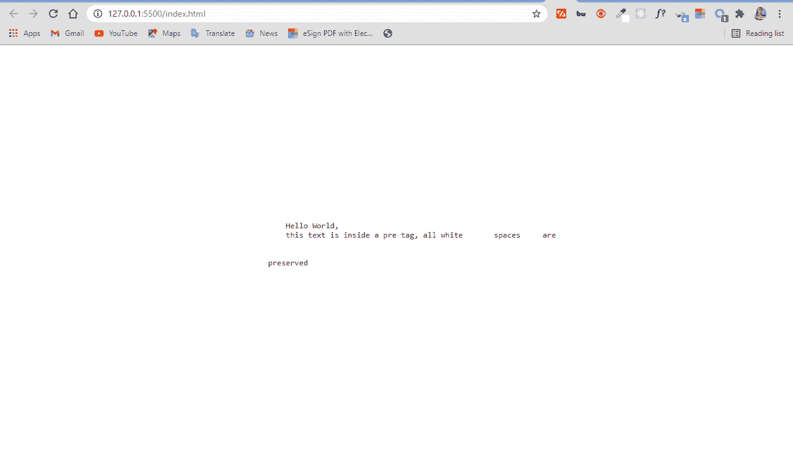

## HTML 中的`<pre>`标签示例

下面是一些代码片段和截图，展示了`<pre>`标签是如何工作的。

### 没有`<pre>`标签的 HTML 中的空白

```
<div>
     <p>There are extra white spaces in the next two words, but they are ignored        by the browser: Hello  
     World</p>
</div> 
```

```
body {
          display: flex;
          align-items: center;
          justify-content: center;
          height: 100vh;
      }

p, pre {
          font-size: 1.2rem;
      } 
```

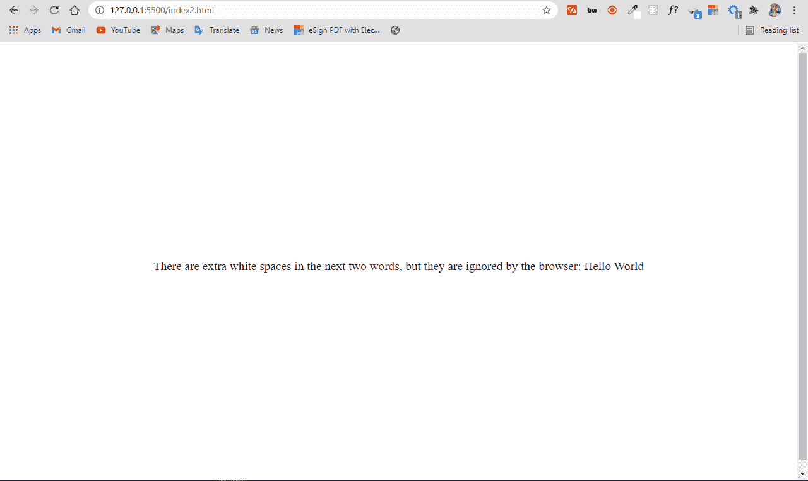

### 带有`pre`标签的 HTML 中的空白

```
<div>
     <p>There are extra white spaces in the next two words, made visible by the        <code>pre</code> 
     tag: <pre>Hello   World</pre> </p>
</div> 
```

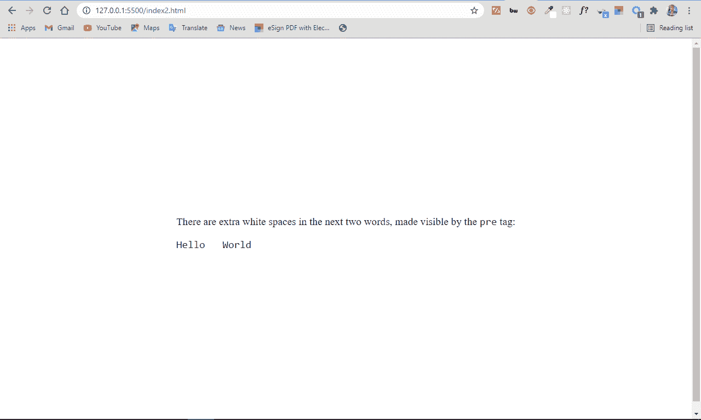

### HTML 中不带`pre`标签的制表符

```
<div>
     <p>There are tabs between the next words, but they're ignored by the browser:      I'm   a   camper</p>
</div> 
```

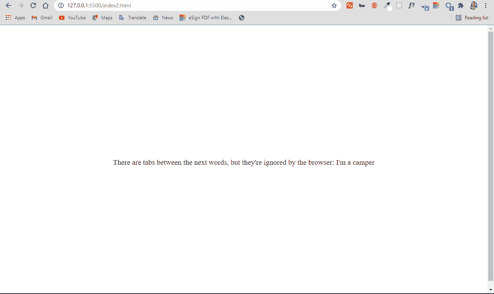

### HTML 中带有`pre`标签的制表符

```
<div>
     <p>There are tabs between the next words, made visible with the                    <code>pre</code> <pre>tag: I'm   
     a   camper</pre></p>
</div> 
```

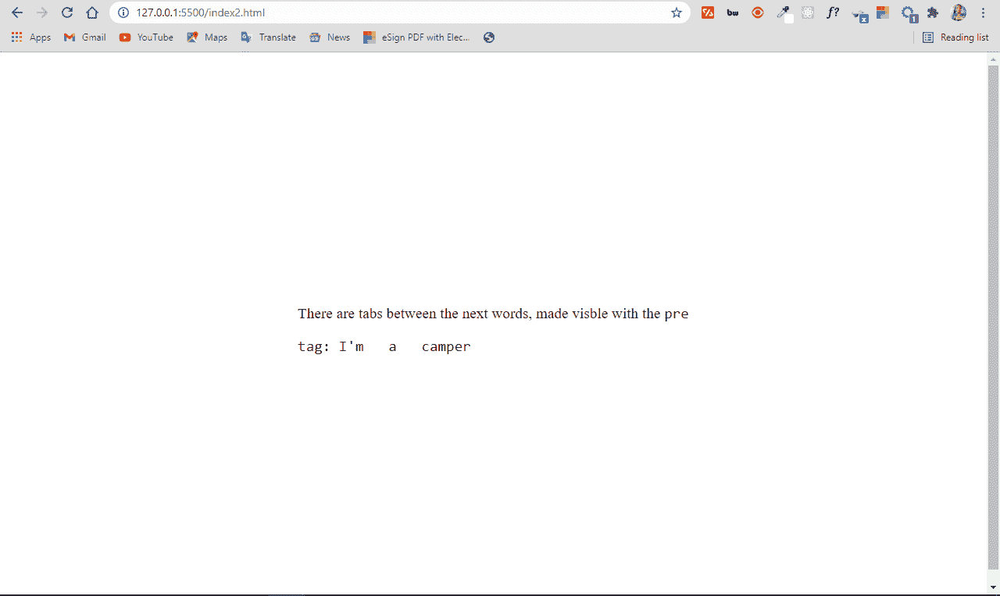

### HTML 中不带`<pre>`标签的换行符

```
<div>
<p>
        There are line breaks between the next words: 
        I'm

        a

        camper
    </p>
</div> 
```

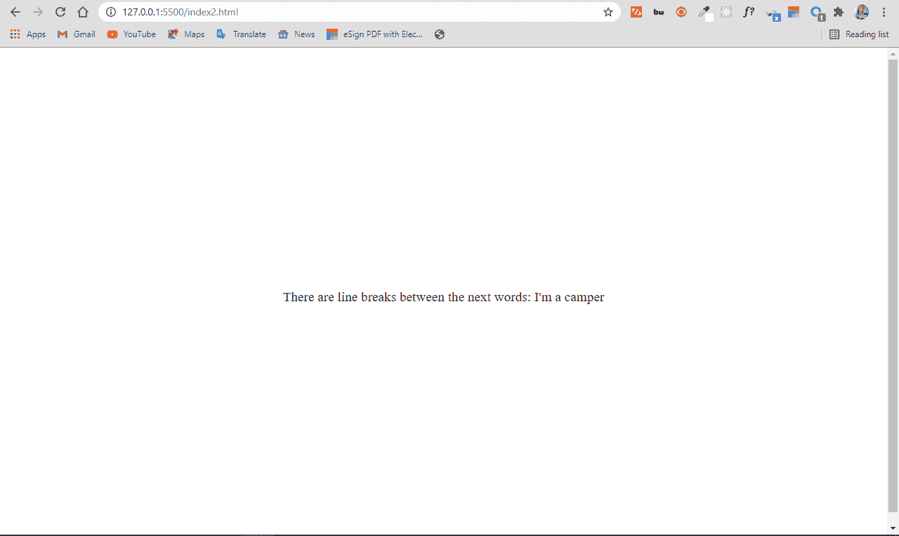

### HTML 中带有`<pre>`标签的换行符

```
<div>
    <p>
    There are line breaks between the next words: 
   <pre>
   I'm

   a

   camper
   </pre>
    </p>
</div> 
```

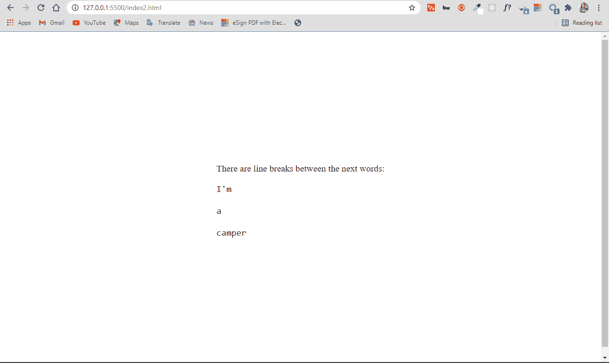

正如你现在可能想象的那样，`<pre>`标签在 CSS 艺术(也是 HTML 艺术)、插图、将代码片段插入 HTML 等等方面非常有用。

## 如何插入没有`<pre>`标签的代码片段

通常，出于学术目的，或者在编程语言或框架的文档中，您可能需要在网页上显示代码片段。这有助于您/维护人员正确地与学习者交流。

即使在使用了`<code>`标签之后，你也会想要保留空白，而这正是`<pre>`标签所做的。

```
<div> 
<h3>Some CSS Resets</h3>
      <p>
        Did you know you can remove the default padding and margin browsers
        insert onto web pages?
      </p>
      <code> * { padding: 0; margin: 0; box-sizing: border-box; }</code>
</div> 
```

```
 body {
      display: flex;
      align-items: center;
      justify-content: center;
      height: 100vh;
    } 
```

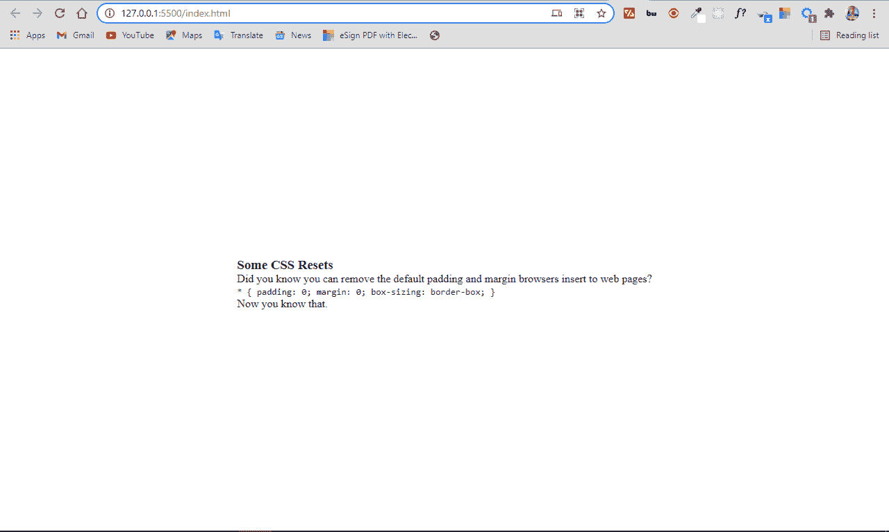

## 如何在 HTML 中插入带有`<pre>`标签的代码片段

```
<div>
<h3>Some CSS Resets</h3>
      <p>
        Did you know you can remove the default padding and margin browsers
        insert to web pages?
      </p>
      <pre>
    <code>
        * {
         padding: 0;
         margin: 0;
         box-sizing: border-box;
       }
    </code>
    </pre>
      <p>Now you know that.</p>
</div> 
```

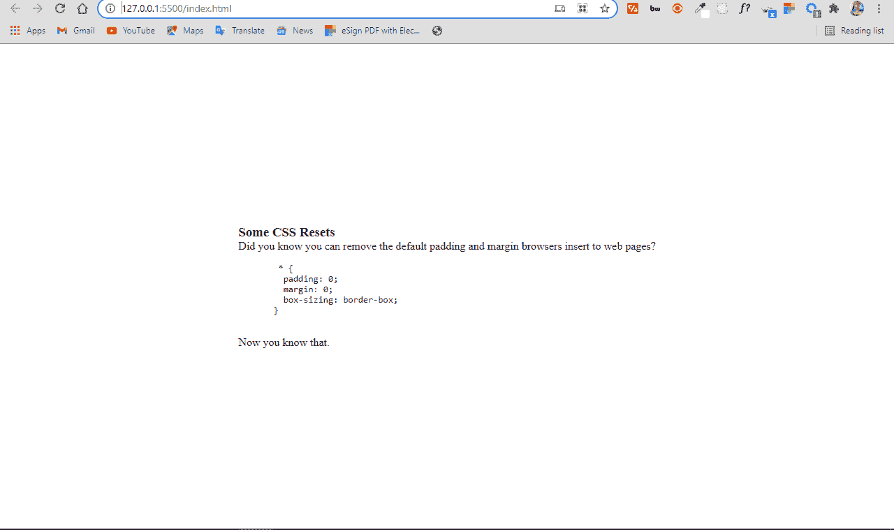

### 一点没有标签的艺术

```
 <div><p>                     ^^^^^^^^^^^^^^^^^^^^^
                <><><>       ^ I'm Kolade,        ^
               <>    <>     ^  Web developer from ^
                <><><>  ^^^^   Nigeria.           ^          
                  <>        ^  I'm proud to be a  ^
                  <>         ^ Camper.            ^  
               <> <> <>       ^^^^^^^^^^^^^^^^^^^^^  
             <>   <>   <>
            <>    <>     <>
                  <>    
                <>  <>  
               <>    <>
              <>      <>
             <>        <>
            <>          <>
           <>            <></p> </div> 
```

```
body {
        display: flex;
        align-items: center;
        justify-content: center;
        height: 100vh;
      } 
```

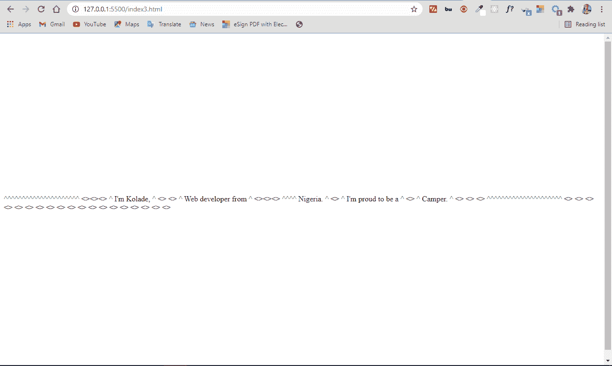

### 带有`<pre>`标签的一点艺术

```
<div>
      <pre>
                              ^^^^^^^^^^^^^^^^^^^^^
                <><><>       ^ I'm Kolade,        ^
               <>    <>     ^  Web developer from ^
                <><><>  ^^^^   Nigeria.           ^          
                  <>        ^  I'm proud to be a  ^
                  <>         ^ Camper.            ^  
               <> <> <>       ^^^^^^^^^^^^^^^^^^^^^  
             <>   <>   <>
            <>    <>     <>
                  <>    
                <>  <>  
               <>    <>
              <>      <>
             <>        <>
            <>          <>
           <>            <>
      </pre>
    </div> 
```

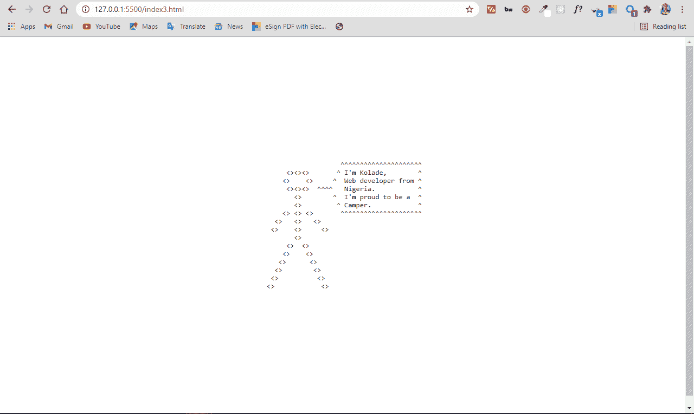

## 如何修复不必要的滚动条

因为`<pre>`标签中的文本在浏览器中的显示与在代码中的一样，所以文本块或文本行的宽度超过可用的屏幕宽度会导致水平滚动条。你有时也可以得到一个不必要的垂直滚动条。

```
 <div>
        <pre> These are some lorem texts: Lorem ipsum 

dolor sit                amet consectetur adipisicing elit. Amet rem nam ea nihil fuga doloribus voluptatem sed officiis iusto. Eveniet quaerat sit quisquam                consequatur necessitatibus 

totam placeat, ut unde                  nesciunt.
        </pre>
    </div> 
```

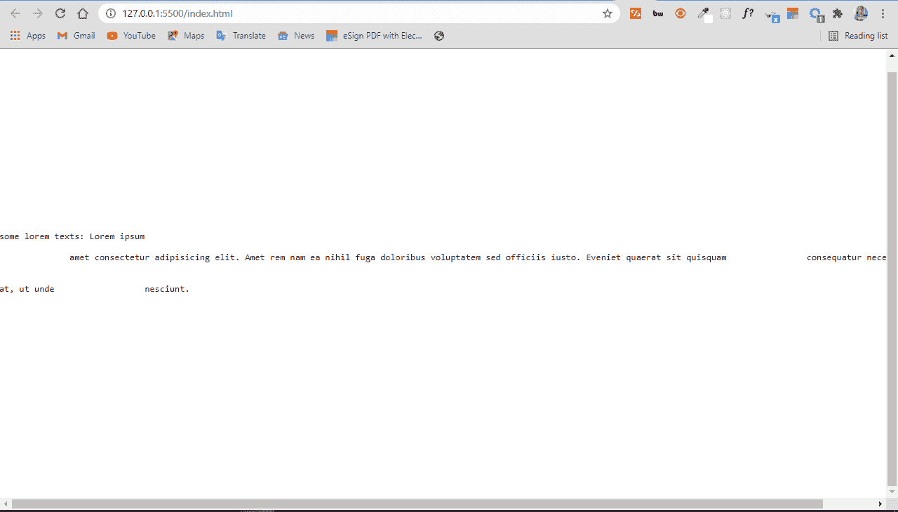

为了摆脱这种情况，CSS 提供了一个`white-space`属性。将其值设置为`wrap`可以消除滚动条。

```
pre {
      white-space: pre-wrap;
    } 
```

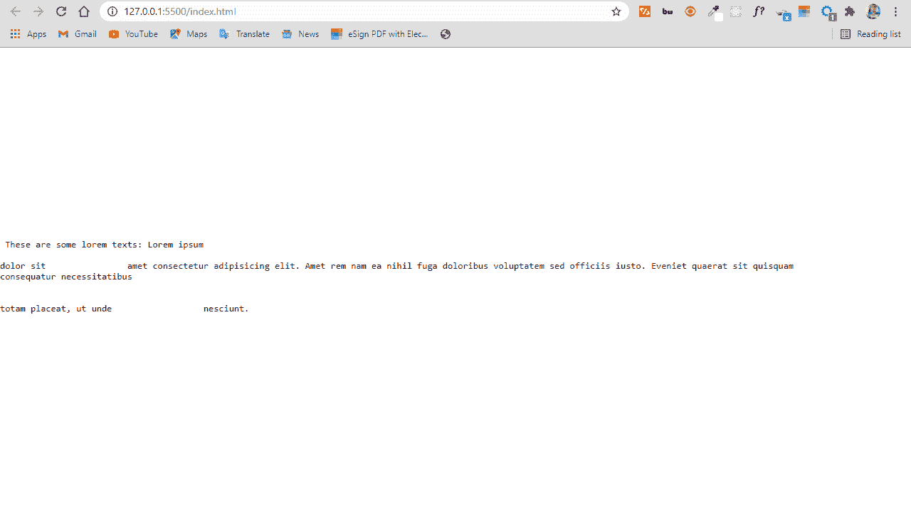

## 结论

在本教程中，您已经看到了`<pre>`标签在 HTML 中是如何工作的。现在，在你的下一个编码项目中享受一下吧。

感谢阅读，继续编码。