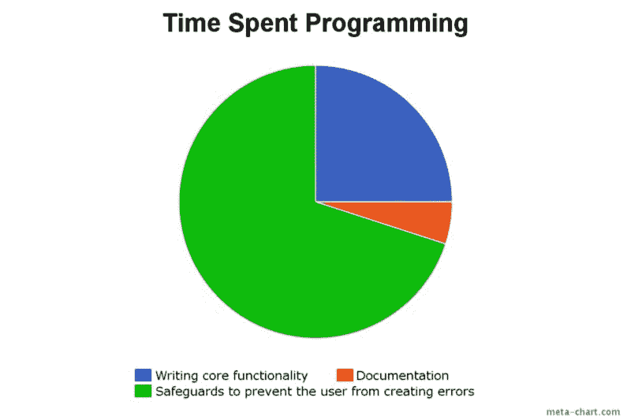

# 预防性编程——如何在错误发生前修复它们

> 原文：<https://www.freecodecamp.org/news/preventative-programming-how-fix-to-bugs-before-they-happen-9df82cf215c5/>

作者库尔特

# 夏洛克·福尔摩斯会成为一名出色的程序员


#### bug 在所难免。

花在调试上的时间比花在编写实际代码上的时间多是很正常的。如果你正在学习编程，并且非常讨厌调试自己的代码，那么**现在就停止**。

找一个你喜欢的新爱好或行业。否则，你很快就会发现疯狂的真正定义:调试另一个程序员的遗留代码，想知道他们到底在想什么。

或者，你可以简单地改变你的思维模式，不再讨厌虫子。

#### 以下是我喜欢调试的一些原因…

1.  这是一个挑战。对我来说，bug 是一个需要解决的难题。我喜欢解谜，所以这款应用给了我一个小时玩数独的时间。
2.  这让我成为一名更好的程序员。不可否认，调试代码是最好的学习方法之一。
3.  有时它让我发笑。要成为一名程序员，你需要有良好的幽默感。你还需要能够嘲笑自己的愚蠢，或者是当时的幽默。
4.  这是我能了解用户想法的最佳视角。除了你的初始测试，*你永远不应该测试你自己的应用程序—* 另一个程序员也不应该。这是因为你永远不会像你的用户那样破坏你的应用。我遇到过的最好的测试员是我老板 5 岁的儿子，他测试了我们所有的 iPad 应用程序。如果他不能使用这个应用，我们的用户也不能。调试时的问题不会止于*“用户是怎么做的？”*但也扩展到*“用户为什么这么做？”*

我在[节目幽默子栏目](https://www.reddit.com/r/ProgrammerHumor/)上发现了这个饼状图，它完美地总结了我的平均一天:



请注意，大部分时间都花在了实施安全措施上。这就是预防性规划的定义。

如果你的图表是一样的，很好。也许我们可以交换小费。但是如果你可能像我们大多数人一样，花大部分时间想知道你的用户到底做了什么来使一个固定变量[](https://developer.mozilla.org/en-US/docs/Glossary/Undefined)*未定义或将一个*字符串*变成一个*整数。**

*那么这个帖子可能对你特别有帮助。*

#### *为什么夏洛克·福尔摩斯会成为一名优秀的程序员*

*第一本夏洛克·福尔摩斯的书写于 1887 年，远在电脑发明之前。所有这些书都充满了你可以应用到编程中的经验。*

*如果这让你感到惊讶，请记住，只要有文字，数据就已经存在，发明计算机的原因就是为了处理数据。*

*夏洛克·福尔摩斯最著名的是使用他的*“演绎法”*:*

> *当你排除了不可能，剩下的，不管多么不可能，一定是事实。——福尔摩斯在*四个的标志**

*如果我必须将这种想法应用到一个函数中，它会是这样的…*

> *当你阻止了一个函数不应该做的一切，它只能做它应该做的。*

*让我们深入了解一些简单的习惯，通过应用这一理论，它们可以帮助您节省无数的调试时间。*

### *如何在错误发生前修复它们*

*看看下面的函数，它搜索一个数组，如果找到回调函数的结果*as*或 *as* *，则返回值:**

```
*`function arraySearch(value, array, callback) {  callback = callback || false;  for (var i = 0; i < array.length; i++) {    if (array[i] == value) {      if (callback) {        return callback(value);      } else {        return value;      }    }  }}var result = arraySearch(4,[1,2,3,4],function(val){return val+val;});`*
```

*乍一看，它似乎非常好。*

*但是让我们后退一步，使用一种*预防性方法*，而不是关注*该功能不应该做什么*。*

#### ***在本练习中，我们想要解决四个问题***

1.  *它应该不会轻易坏掉。如果可能的话，我们希望防止它因*错误*而停止。相反，它应该*返回*。*

*2.它应该永远不会返回[未定义的](https://developer.mozilla.org/en-US/docs/Glossary/Undefined)。我们希望它返回 *false* 来代替。*

*3.**它绝不能进行隐式或“松散”匹配**。*

*4.当我们必须[抛出](https://developer.mozilla.org/en-US/docs/Web/JavaScript/Reference/Statements/throw)一个错误时，它不应该是一般性错误。我们希望有些东西对我们自己和那些需要在我们之后处理这些代码的可怜的程序员来说都是可读的。*

#### *入门指南*

*点 1 似乎要求很多，但本质上我们只是希望它优雅地失败，*返回一个可预测的值*像 ***假*** 而不是停止总线。*

*首先，它必须有一个*输入值*和*数组*才能运行。所以让我们记住这一点来修改函数。*

```
*`function arraySearch(value, array, callback) {  if (value === undefined || array === undefined) {    return false;  }  callback = callback || false;  for (var i = 0; i < array.length; i++) {    if (array[i] == value) {      if (callback) {        return callback(value);      }      else {        return value;      }    }  }}`*
```

*太好了，就这么定了。通过检查参数是否为[](https://developer.mozilla.org/en-US/docs/Glossary/Undefined)**未定义，我们确保值已经传递给它们。***

***我们的回调已经有了一个默认的值，所以它已经被处理好了。但是如果我们的*数组不是数组呢？如果我们的*回调不是一个函数呢？*****

*让我们接下来处理这个…*

```
*`function arraySearch(value, array, callback) {  if (value === undefined || array === undefined || (array instanceof Array) === false) {    return false;  }  callback = callback || false;  if (callback !== false && typeof callback !== 'function') {    throw 'Callback to arraySearch is not a function';    return false;  }  for (var i = 0; i < array.length; i++) {    if (array[i] == value) {      if (callback) {        return callback(value);      }      else {        return value;      }    }  }}`*
```

*太棒了。现在通过检查 [***类型***T5*回调*我们确定回调是有效的*函数*并且通过检查数组是](https://developer.mozilla.org/en-US/docs/Glossary/Null)**数组对象*的 [***实例我们也确定数组是*数组*。***](https://developer.mozilla.org/en-US/docs/Web/JavaScript/Reference/Operators/instanceof)**

*所以让我们转到第 2 点— *“它永远不应该返回 undefined”*。*

*首先，当没有匹配时，我们的*函数*没有*默认返回值*。同样重要的是，我们无法知道回调函数将返回什么。*

*我们可以通过让函数*返回一个变量*来解决这个问题，这样我们只需要检查它是[](https://developer.mozilla.org/en-US/docs/Glossary/Undefined)*还是 [*null*](https://developer.mozilla.org/en-US/docs/Glossary/Null) 一次。**

```
**`function arraySearch(value, array, callback) {  if (value === undefined || array === undefined || (array instanceof Array) === false) {    return false;  }  callback = callback || false;  var result = null;  if (callback !== false && typeof callback !== 'function') {    throw 'Callback to arraySearch is not a function';    return false;  }  for (var i = 0; i < array.length; i++) {    if (array[i] == value) {      if (callback) {        result = callback(value);      }      else {        result = value;      }    }  }  return result || false;}`**
```

**已排序。将*结果*的值设置为*匹配*或*回调函数*的结果允许我们返回*结果*或 false，如果*结果*是 [*未定义*](https://developer.mozilla.org/en-US/docs/Glossary/Undefined) 或 [*空值*](https://developer.mozilla.org/en-US/docs/Glossary/Null) 。**

**第三点。一个*隐含的*或*松散的*匹配可以被描述为*相对相等的*，即假== 0 或‘4’= = 4 等等。**

**我们想避免这种情况。如果我们在一个包含零的数组中搜索 *false* 会怎么样？**

**我们可以通过更改下面一行来解决这个问题:**

```
 **`if (array[i] == value) {//must change to  if (array[i] === value) {`**
```

**[**= = =**](https://developer.mozilla.org/en-US/docs/Web/JavaScript/Reference/Operators/Comparison_Operators)表示 ***正好等于*** 。检查值时，始终进行显式匹配。从长远来看，这个习惯将会为你节省无数的时间，因为*你不会试图调试被评估为真的语句*。**

**现在是最后一点。**

**当抛出一个错误时，我们希望它是友好的。这个功能在传递一个*无效的回调函数*时已经演示过了，但是*如果一个有效的回调函数抛出一个错误*怎么办？**

**[匿名函数](https://developer.mozilla.org/en-US/docs/Glossary/Function)调试起来很痛苦，所以让我们试着让调试不那么痛苦:**

```
**`function arraySearch(value, array, callback) {  if (value === undefined || array === undefined || (array instanceof Array) === false) {    return false;  }  callback = callback || false;  var result = null;  if (callback !== false && typeof callback !== 'function') {    throw 'Callback to arraySearch is not a function';    return false;  }  for (var i = 0; i < array.length; i++) {    if (array[i] === value) {      if (callback) {        try{          result = callback(value);        }catch(e){          throw 'Callback function in arraySearch threw the error : '+e.message;        }      }      else {        result = value;      }    }  }  return result || false;}`**
```

**我们找到了。**

**为了解决这个问题，我们使用一个简单的[***try/catch***](https://developer.mozilla.org/en-US/docs/Web/JavaScript/Reference/Statements/try...catch)语句，然后 *[用一个*定制消息重新抛出*](https://developer.mozilla.org/en-US/docs/Web/JavaScript/Reference/Statements/throw)错误*。现在，如果回调函数失败，我们将立即知道失败的是*回调函数*，而不是我们的 *arraySearch* 函数。**

#### *摘要*

*总而言之，我们现在有了一个函数，它应该会在将来给我们带来最小的麻烦。如果它确实有问题，应该很快很容易纠正。*

*我的预防性编程技巧的基础可以总结为 6 点…*

1.  ***检查您的输入值是否存在**，并根据需要设置默认值。*
2.  *始终**确保您的输入与您正在寻找的**类型相同。永远不要假设一个*数组*会是一个*数组*或者一个*整数*会是一个*整数*。*
3.  ***在比较值时，总是进行显式匹配**(**= = =**)。*
4.  ***编写返回可预测值**的函数，即当失败时返回*假*或*假*或当*真*时返回预期结果。*
5.  ***尽量写纯函数**。纯函数是一个总是返回预期值的函数，不会以任何方式修改传递给它的原始变量。*
6.  *[**在需要的地方抛出**](https://developer.mozilla.org/en-US/docs/Web/JavaScript/Reference/Statements/throw) **自定义错误，尤其是在执行回调和匿名函数**的时候。在 8 个月的时间里，你不会确切地记得你的代码做了什么，所以当你仍然知道你的代码做了什么的时候，帮你自己一个忙，抛出一个清楚的错误消息。*

### *我将给你们留下一些夏洛克·福尔摩斯的名言*

#### *寓意:在收集数据之前不要做假设*

> *在掌握所有证据之前就进行推理是一个致命的错误。它会影响判断。—《血字的研究》*

> *在没有数据之前就进行理论化是一个严重的错误。不知不觉中，人们开始扭曲事实以适应理论，而不是让理论适应事实。-波希米亚的丑闻*

> *尽管如此，在你的数据面前争论是一个错误。你会发现自己不知不觉地扭曲它们来迎合你的理论。-紫藤小屋的冒险*

> *让我把主要步骤过一遍。你记得，我们是带着完全空白的头脑来处理这个案子的，这总是一个优势。我们没有形成任何理论。我们只是在那里观察，并从我们的观察中得出推论。-纸箱的冒险*

> *“数据！数据！数据！”他不耐烦地喊道。“没有粘土，我做不出砖。-铜山毛榉的冒险*

#### *寓意:不要让你的情绪凌驾于逻辑之上*

> *侦查是，或者应该是，一门精确的科学，应该以同样冷漠和不带感情的方式对待它。-四的符号*

> *情感品质与清晰的推理是对立的。-四的符号*

#### *寓意:关注核心特性和用例*

> *在侦查艺术中，最重要的是能够从大量事实中辨别出哪些是偶然的，哪些是至关重要的。否则你的精力和注意力一定会分散而不是集中。-瑞盖特难题*

#### *还有一些你可以从中吸取教训*

> *没有什么比向另一个人陈述更能澄清一个案件了。-银色火焰*

> *我已经向你解释过，与众不同的东西通常是一个向导，而不是“障碍”。-《红字》中的研究*

> *一个事件越是离奇古怪，就越值得仔细研究，而使一个案件看起来复杂的那一点，经过适当的考虑和科学的处理，也是最有可能阐明它的一点。-巴斯克维尔的猎犬*

> *任何真相都比不确定的怀疑好。-黄色的脸*

> *我从不猜测。这是一个令人震惊的习惯——对逻辑能力的破坏——四的标志*

*这就是我对这篇文章的全部看法。如果你喜欢阅读它，并且想阅读另一篇技术文章，请看:*

*[**如何用 71 行代码写出 jQuery like library 了解一下风靡一时的 DOM**](https://medium.com/p/e9fb99dbc8d2)
[*JavaScript 框架。你打开的任何与 JavaScript 相关的新闻提要都有可能被丢弃……*medium.com](https://medium.com/p/e9fb99dbc8d2)*

*或者，如果代码伤害了你的大脑，让你疲惫不堪，这里是我写的一些非技术性的帖子…*

*[**学习编程时要记住的 5 件事**](https://medium.com/p/1ed8e734b04f)
[*学习编程很有挑战性。除了选择一种语言或建立一个开发环境，你……*medium.com](https://medium.com/p/1ed8e734b04f)[**把代码变成现金——如何作为一个 Web 开发人员赚钱并活着讲述故事。**](https://medium.com/p/f5eedc557b3e)
[*所以你刚学会编码。你很渴望，任何不会编程的人都认为你是天才，消息传出去，所有的…*medium.com](https://medium.com/p/f5eedc557b3e)[**我是如何成为一名程序员的。当我开始称自己为“一个人”**](https://medium.com/p/54a0533c4335)
[*时，我已经想开始写关于编程的博客好几个月了，就像我之前的许多人一样，我开始写满了……*medium.com](https://medium.com/p/54a0533c4335)[**让它下雨代码——矩阵风格**](https://medium.com/p/ec6e1386084e)
[*HTML 5 画布动画简介*medium.com](https://medium.com/p/ec6e1386084e)*