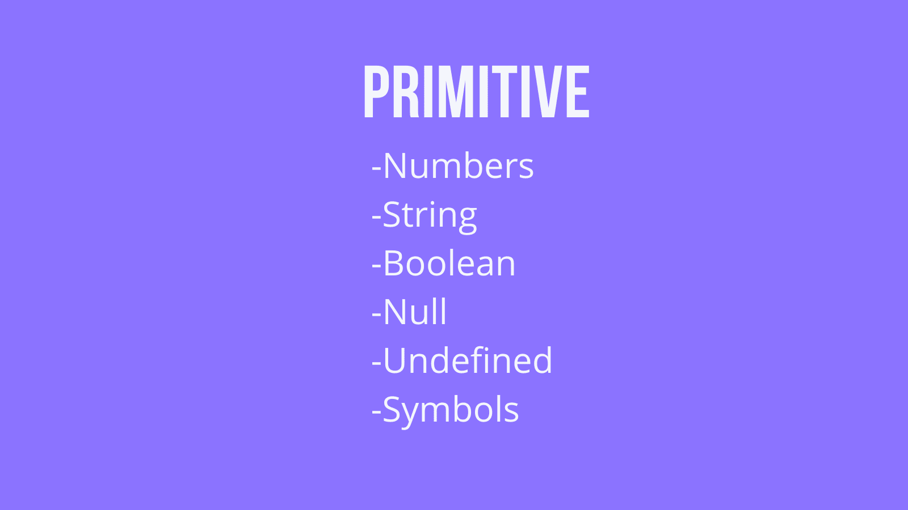
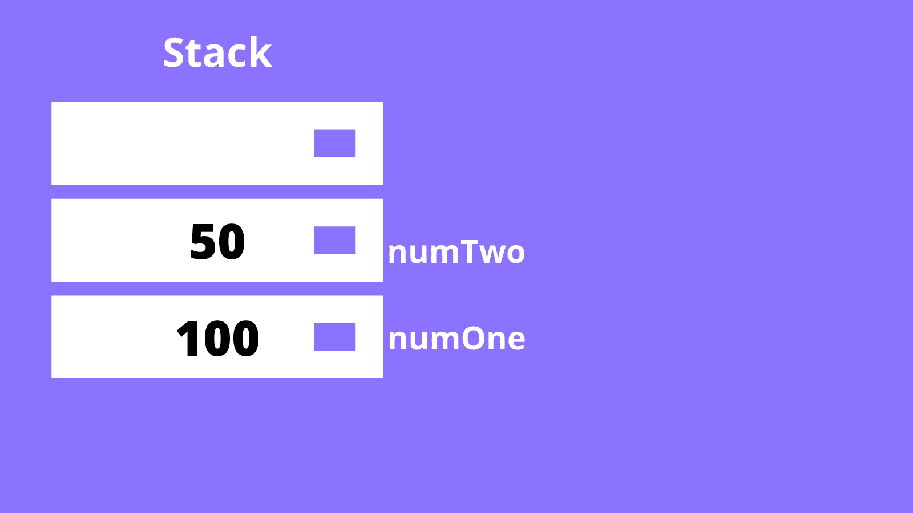
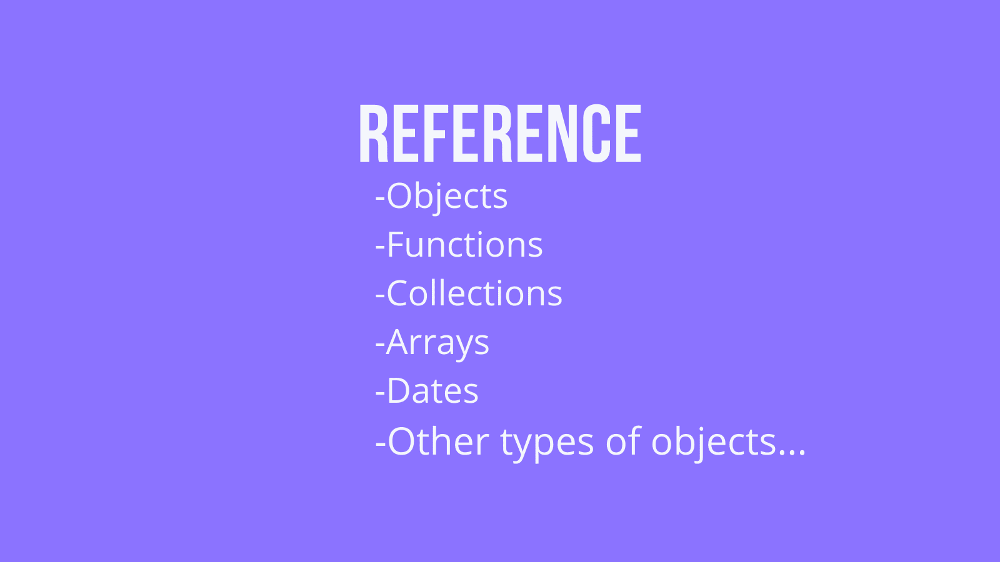
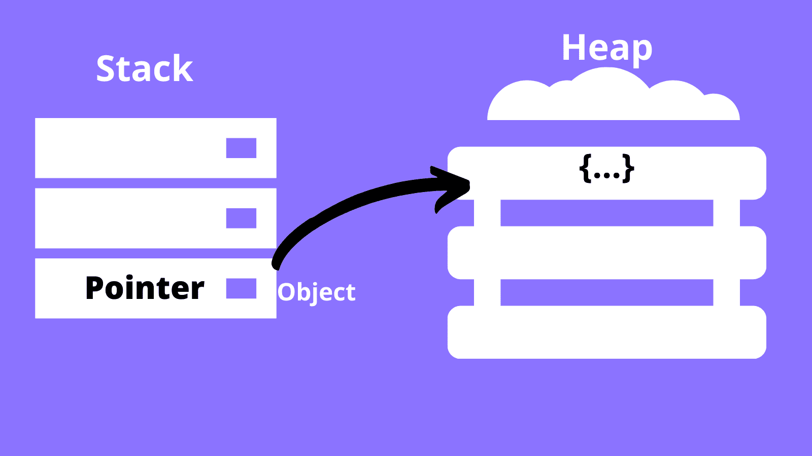
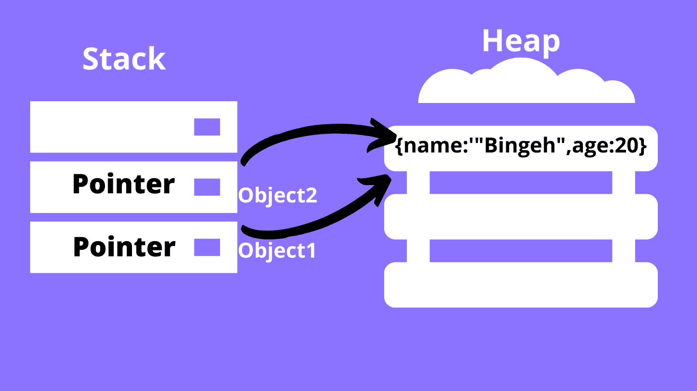

# JavaScript 中的原始数据类型与引用数据类型

> 原文：<https://www.freecodecamp.org/news/primitive-vs-reference-data-types-in-javascript/>

数据类型可能是一个令人难以置信的概念。但是作为程序员，我们每天都在使用数据类型——所以我们应该理解它们。

问题是，计算机如何存储这些数据类型？它不可能对每种数据类型都一视同仁。

在 JavaScript 中，数据类型分为两类，计算机对每一类都有不同的处理。我们有原始数据类型和引用数据类型。但是这些是什么？为什么知道两者的区别很重要？这就是我们将在本文中学习的内容。

# javascript 中的原始数据类型

这些数据类型非常简单，有时被视为编程语言实现的最底层。它们不是对象，也没有方法。

这种数据类型的例子有数字、字符串、布尔、空和未定义。



但是你可能想知道字符串，因为它们有方法。事实是，JavaSvript 将原始字符串转换为字符串对象，因此可以使用字符串对象方法。

# JavaScript 中如何处理原始数据类型？

当您在 JavaScript 中声明一个原始数据类型时，它被存储在一个堆栈中。堆栈是一种简单的数据结构，计算机使用它来快速存储和检索数据。

堆栈上的基本数据类型由程序中用于声明的变量名来标识。对于您创建的每个原始数据类型，数据都被添加到堆栈中。

为了实现这一点，假设我们声明了一个变量`numOne`，并给它赋值 50。我们继续创建另一个变量`numTwo`，并赋予它相同的值 50。所以两个变量有相同的值。

堆栈上发生的是，计算机为`numOne`创造空间，并在堆栈上存储它的赋值。当`numTwo`被创建时，计算机再次创建空间，并在堆栈上存储 50。两个变量被赋予相同的值并不重要。


如果在编码过程中，我们决定更新`numOne`的值，比如说，100，会怎么样？是不是意味着`numTwo`也会改变？答案是否定的。

由于`numOne`和`numTwo`在堆栈中的存储方式不同，更新其中一个不会影响另一个。我们可以在我们的代码编辑器中进行试验。

记录`numOne`到控制台将输出 100，记录`numTwo`将输出 50。因此，实际上，这两个变量彼此没有关系。

```
let numOne = 50;
let numTwo = numOne; //numTwo=numOne=50
numOne = 100;
console.log(numOne); //outputs 100
console.log(numTwo); //outputs 50
```



现在我们已经看到了处理原始数据类型是多么容易，让我们看看引用数据类型是如何类似地工作的。

# JavaScript 中的引用数据类型

与原始数据类型不同，引用数据类型本质上是动态的。也就是说，它们没有固定的大小。

它们大多被认为是对象，因此有方法。这种数据类型的例子包括数组、函数、集合和所有其他类型的对象。



# 原始数据类型和引用数据类型有什么区别？

当计算机必须存储引用数据类型时，差异就出现了。当您创建一个变量并为其分配一个引用数据类型的值时，计算机不会将该数据类型直接存储在该变量中(与基元类型的情况一样)。

你赋给那个变量的是一个指针，它指向内存中那个数据类型的位置。迷惑？我知道。



如上图所示，我们现在有两种数据结构。一堆和一堆。比如说我们声明了一个对象。对象本身存储在堆上，它的指针存储在堆栈上。指针由对象的变量名标识，并指向该对象。

现在，我们可以创建一个变量`object1`，并给它分配一个对象。如果像以前一样，我们创建另一个变量`object2`，并将其赋给`object1`。这是否意味着将在堆上创建另一个对象？答案是否定的。

由于对象已经存在于堆中，`object2`和`object1`都将指向同一个对象。

另一个不同是当我们更新`object1`时。如果我们将这两个变量都记录到控制台，我们会看到更改对它们都产生了影响。这是因为它们指向堆中的同一个对象——更新一个变量当然会影响另一个。

```
let object1 = {
name:'Bingeh',
age:18
};
let object2 = object1;

//updating object1,
object1.age = 20;

console.log(object2); //we see that object2 also updates the age attribute
```



# 包扎

现在您知道了原始数据类型和引用数据类型之间的区别。了解这些区别是很重要的——尤其是当你得到像“空指针引用”这样的错误时——这样你就能弄清楚为什么会发生这些错误。

Java 开发人员有时会遇到这种情况，所以我希望本文能帮助您消除任何疑虑。