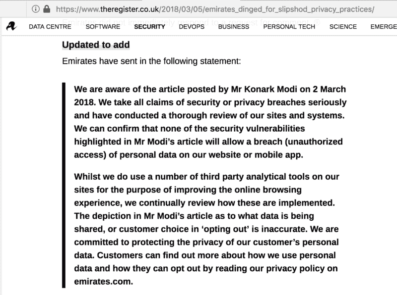
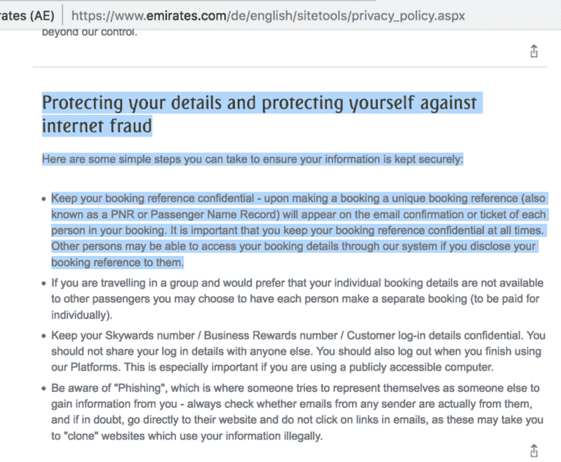
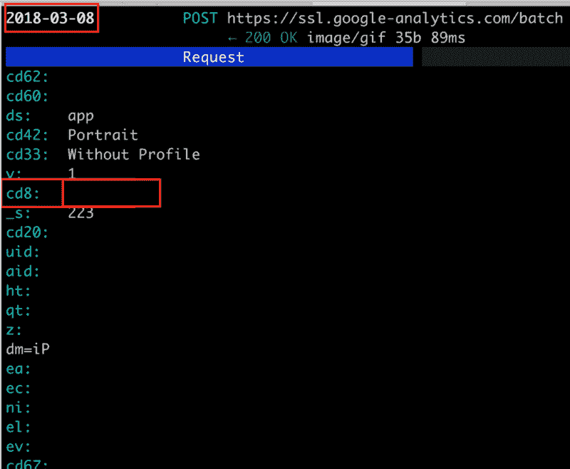
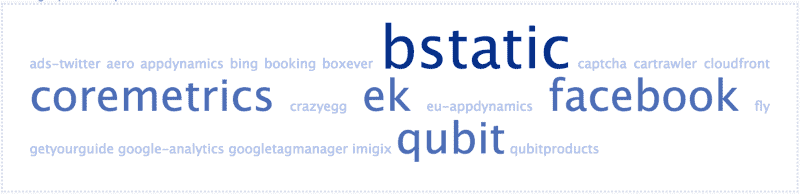
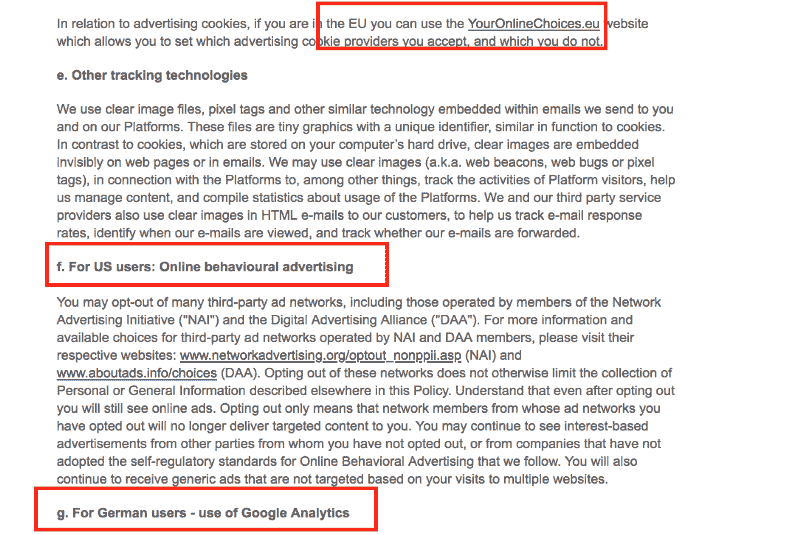

# 航空公司网站不关心你的隐私后续:阿联酋航空回应我的文章用…

> 原文：<https://www.freecodecamp.org/news/privacy-leaks-round-trip-emirates-com-in-denial-7f99950bcdd/>

作者科纳克·莫迪

昨天, [The Register](https://www.theregister.co.uk/2018/03/05/emirates_dinged_for_slipshod_privacy_practices/) 写了我在[上曝光的航空公司网站](https://medium.freecodecamp.org/how-airlines-dont-care-about-your-privacy-case-study-emirates-com-6271b3b8474b)的隐私漏洞。

当我上周五发表我的原创文章时，阿联酋航空没有回应我的置评请求。但阿联酋航空公司对登记册作出了回应，声明如下:

Comment from Emirates on theregister.co.uk

他们的陈述不仅含糊不清，事实上也不正确。我觉得这是我的职业责任。

### **对他们陈述的分解，以及当你真正思考时，他们的逻辑是如何分解的**

#### 问题#1

首先，阿联酋航空表示，“*我们可以确认，我们网站或移动应用程序上的个人数据不会被暴露(未经授权的访问)。”*

阿联酋航空如何定义违约？嗯，[剑桥词典](https://dictionary.cambridge.org/us/dictionary/english/data-breach)这样定义数据泄露:

> “不应该看到私人信息的人可以看到这些信息的场合。”

在其[隐私政策](https://www.emirates.com/english/sitetools/privacy_policy.aspx#)中，阿联酋航空强调了保护预订参考信息的重要性:

Privacy policy highlighting risks of sharing Booking reference number.

**2018 年 3 月 8 日更新:**另一个证据表明，阿联酋航空似乎忘记了听从自己的建议*“保管好您的预订参考资料”*，并且**仍在**通过**键将它从移动应用程序发送到谷歌分析:cd8** (未屏蔽)。我已经屏蔽了图片中的字段，以确保隐私。

Sending PNR via field cd8 to Google-Analytics.

对于现有预订的任何更改，只需一个**预订参考号**和**姓氏**即可。不要求验证最初是谁进行预订，以及进行更改的人是否被授权这样做。

Emirates.com 和阿联酋移动应用程序版本(6.1.0)都允许访问他们的管理预订部分，仅基于这两个数据点。这是所有航空公司的标准做法，这不是本文的争论点。

#### **但这正是令人担忧的时候**

截至 2018 年 3 月 6 日，预订参考号和姓氏以及许多其他数据点仍在发送给实施的第三方。Crazy Egg，Boxever，Coremetrics 显示页面热图需要预订参考号和姓氏吗？我不这么认为。

这就是问题所在——将用户的个人信息传递给第三方，这些第三方完全不需要这些信息来为阿联酋航空*提供服务，“目的是改善在线浏览体验。”*

使用 HTTPS 链接的重要性已经被技术领域的每一个人反复确认。HTTP 链接不仅易受中间人攻击，还可能遭受恶意数据的注入。

我不知道阿联酋航空是否有足够的信心*“确认(莫迪先生的)文章中强调的安全漏洞不会允许我们的网站或移动应用程序上的个人数据遭到破坏(未经授权的访问)”*当 track.emirates.email 仍然没有任何 SSL 时。他们计划如何避免中间人攻击？

#### 问题#2

阿联酋航空表示，*“虽然我们确实在我们的网站上使用了许多第三方分析工具，以改善在线浏览体验，但我们会不断审查这些工具是如何实施的。”*

我在文章中分享了护照信息和联系方式是如何在网站和手机应用程序上被模糊处理的。虽然我上次在 2018 年 2 月检查时，网站已经修复，但移动应用程序在这方面仍然存在问题。只有当网站和移动开发团队之间缺乏沟通，或者他们没有*“持续审查所有产品的实现”*时，这种情况才会发生。

另一个需要回答的问题是，审查第三方执行情况的参数是什么。除非严格要求不泄露任何类型的用户信息，否则审查可以是任何内容，不会对自由传递给第三方的用户信息的安全性和脆弱性产生丝毫影响。

上一次向阿联酋航空强调这个问题是在 2017 年 10 月。在此后的 5 个月中，审查小组没有发现这些问题。也许他们并不像阿联酋航空宣称的那样“持续不断”。

#### **第三期**

阿联酋航空表示，*“客户可以通过阅读我们在 emirates.com 上的隐私政策，了解我们如何使用个人数据以及他们如何选择退出的更多信息”*

Third-parties listed on Privacy Policy page.

Third-parties actually present.

在彻底审查了阿联酋航空的隐私& Cookie 政策后，以下是需要注意的几点:

1.它没有列出**所有**已实施的第三方以及与他们共享的信息。第三方，如 Boxever、ads-twitter.com、Coremetrics、Imigix、bing 和许多其他我从他们的网站上收集到的信息，甚至没有在他们的隐私政策中提及。

2.可用的选择退出选项仅提及使用关于 cookies、YourOnlineChoices 的方式。这意味着不仅隐私政策中提供的信息是不完整的，而且没有分享任何选择退出 CrazyEgg、BoxEver、Coremetrics 等服务的选项。这个过程冗长而麻烦。

3.基于用户居住的国家，选择退出的选项是有偏见的。如果你是欧盟的居民，你可以使用此链接选择退出。如果你是美国居民，这是选择退出的链接。但是如果你是任何其他地区的居民，我很抱歉地告诉你，你被少找了钱。

4.选择退出 cookies 不会对文章中强调的数据泄露产生任何影响，因为推荐人没有被清理。任何有基本技术知识的人都可以证实这一点。

### **简而言之**

即使用户设法使用列出和未列出的方法选择退出所有追踪器，阿联酋航空仍将泄露预订参考和姓氏，这足以访问所有其他敏感信息，因为 Emirates.com 上这些第三方服务的实施存在缺陷。

阿联酋航空需要明白，一旦信息与第三方共享，他们就很难控制信息的使用方式或未来可能的使用方式，正如他们自己在隐私政策中提到的那样。

阿联酋航空认为这些问题还不够严重，不足以让他们采取必要的措施来解决这些问题，这是一回事。说文章分享的信息是*“不真实”是完全不同的一回事。*

我希望他们尽快解决这些问题。

黑客快乐！

[- Konark Modi](https://twitter.com/konarkmodi)

感谢阅读和分享！:)

如果你喜欢这个故事，请随意？？？几次(最多 50 次。说真的)。

*鸣谢:特别感谢[雷米](https://twitter.com/Pythux)、[帕拉维](https://twitter.com/Pi_Modi)也审阅了这篇文章:*