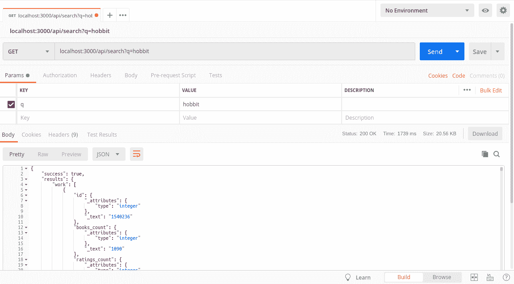

# 如何避免在你的公共前端应用中暴露你的 API 密匙

> 原文：<https://www.freecodecamp.org/news/private-api-keys/>

## 问题是

您想要做的只是从一个 API 端点获取一些 JSON，用于天气、一些书评或类似的简单内容。

前端的 fetch 查询非常简单，但是您必须将您的秘密 API 密匙粘贴到前端代码中，这样任何人都可以通过少量的挖掘工作找到它！

此外，将 API 密钥推送到 Github 存储库是一个主要问题: [Dev 将 AWS 密钥放在 GitHub 上。然后不好的事情发生了](https://www.theregister.co.uk/2015/01/06/dev_blunder_shows_github_crawling_with_keyslurping_bots/)。

> “为什么这么难？!"你，大概 15 分钟前

## 解决方案

您应该使用后端服务器作为中继来获取 API 结果，然后将它们传递到您的前端

## 新问题

你只是想为你的投资组合做一个前端演示！你还没有学到任何后端技术！为什么这么难？！

# 演示

我经常遇到这种问题，所以我决定不再想出愚蠢的方法，而是用最少的后端代码实现一个解决方案。

在这个演示中，我设置了一个后端来监听 POST 请求，并将它们发送给 [GoodReads API](https://www.goodreads.com/api) 。要使用它，你需要实现你自己的前端**，它可以向这个后端发送适当的 POST 请求。您的前端不会直接与 GoodReads 通信，因此不会暴露任何 API 密钥。**

## 你将需要

*   [节点](https://nodejs.org/en/download/)(这个已经在 v10.16.0 测试过了，以后的版本没问题，早期的可能会遇到问题)
*   [去](https://git-scm.com/downloads)
*   这个回购:https://github.com/JacksonBates/example-goodreads-api-relay

### 开始

`git clone https://github.com/JacksonBates/example-goodreads-api-relay.git`

README.md 包含您应该知道的一切，包括安装和设置。

为了方便起见，我在这里列出了要点:

### README.md

安装家属:

`npm i`

您需要为您的密钥创建自己的`.env`文件:

`cp .env.example .env`

然后打开新的`.env`文件，将你的密钥粘贴到正确的位置。

示例:

```
GOODREADS_API_KEY=AABBCCDDEEFF00112233445566778899 
```

现在运行服务器:

`node app.js`

在浏览器中，导航到 localhost:3000 以确认服务器正在运行。您应该会看到一个简单的`Hello World!`

### 接下来呢？

现在通读`app.js`文件。

如果你以前没怎么看过 node / express，我对代码做了大量注释，以帮助你理解发生了什么。

```
// app.js

// These import necessary modules and set some initial variables
require("dotenv").config();
const express = require("express");
const fetch = require("node-fetch");
const convert = require("xml-js");
const rateLimit = require("express-rate-limit");
const app = express();
const port = 3000;

// Rate limiting - Goodreads limits to 1/sec, so we should too

// Enable if you're behind a reverse proxy (Heroku, Bluemix, AWS ELB, Nginx, etc)
// see https://expressjs.com/en/guide/behind-proxies.html
// app.set('trust proxy', 1);

const limiter = rateLimit({
	windowMs: 1000, // 1 second
	max: 1, // limit each IP to 1 requests per windowMs
})

//  apply to all requests
app.use(limiter)

// Routes

// Test route, visit localhost:3000 to confirm it's working
// should show 'Hello World!' in the browser
app.get("/", (req, res) => res.send("Hello World!"));

// Our Goodreads relay route!
app.get("/api/search", async (req, res) => {
	try {
		// This uses string interpolation to make our search query string
		// it pulls the posted query param and reformats it for goodreads
		const searchString = `q=${req.query.q}`;

		// It uses node-fetch to call the goodreads api, and reads the key from .env
		const response = await fetch(`https://www.goodreads.com/search/index.xml?key=${process.env.GOODREADS_API_KEY}&${searchString}`);
		//more info here https://www.goodreads.com/api/index#search.books
		const xml = await response.text();

		// Goodreads API returns XML, so to use it easily on the front end, we can
		// convert that to JSON:
		const json = convert.xml2json(xml, { compact: true, spaces: 2 });

		// The API returns stuff we don't care about, so we may as well strip out
		// everything except the results:
		const results = JSON.parse(json).GoodreadsResponse.search.results;

		return res.json({
            success: true,
            results
        })
	} catch (err) {
		return res.status(500).json({
			success: false,
			message: err.message,
		})
	}
})

// This spins up our sever and generates logs for us to use.
// Any console.log statements you use in node for debugging will show up in your
// terminal, not in the browser console!
app.listen(port, () => console.log(`Example app listening on port ${port}!`)); 
```

**更新**:非常感谢 Gouri Shankar Kumawat 贡献了一个 PR 来改进这个代码！你可以在推特 [@dev_gskumawat](https://https://twitter.com/dev_gskumawat) 或 GitHub: [gskumawat0](https://github.com/gskumawat0) 上关注他

### 测试 API 继电器

使用 [Postman](https://www.getpostman.com/) 测试 API。

设置邮差获取并粘贴到 url: `localhost:3000/api/search?q=hobbit`

Postman 会在下面给你看 JSON 的回应。



Screenshot of Postman showing the returned JSON from our new back-end

### 你如何在你的前端使用这个？

这个简单的应用程序在`/api/search`监听 post 请求，所以在你的前端应用程序中与它交互，就像你以前使用原始 api 的方式一样。

这只是为了处理搜索查询而配置的——如果您想使用其他 Goodreads API 端点/方法，您需要考虑如何自己实现它们！

### 主办；主持

你不能在本地主机上部署你的前端，显然你也需要部署它。

我推荐 [Heroku](https://devcenter.heroku.com/articles/deploying-nodejs) 。

## 额外学分

如果您想扩展它，您可以考虑如何只从有限的 IP 地址范围内访问它，以增加安全性——这超出了本教程/演示的范围。

* * *

这是在[论坛](https://www.freecodecamp.org/forum)上的一次讨论中匆忙整理出来的。如果你在这篇文章或示例代码中发现任何问题，请不要犹豫，回复引发这一切的[论坛帖子](https://www.freecodecamp.org/forum/t/trying-to-fetch-response-from-goodreads-api/323312?u=jacksonbates)。我会保持文章和回购的最新改进。

如果您有宝贵的贡献，请随时提交 PRs:)

也可以通过 Twitter 联系我: [@JacksonBates](https://twitter.com/jacksonbates) 。