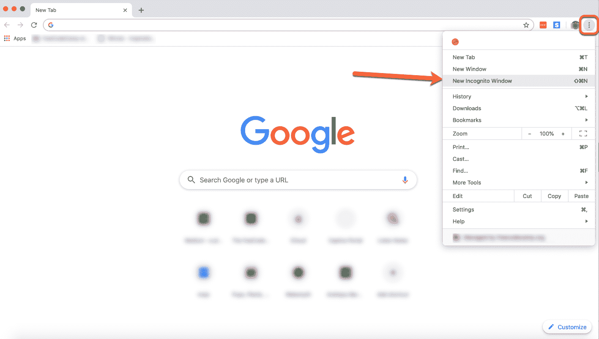
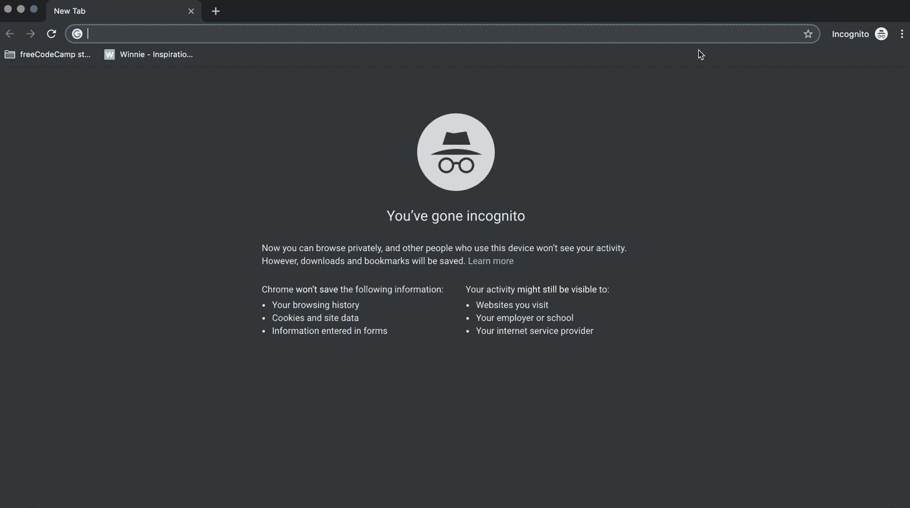
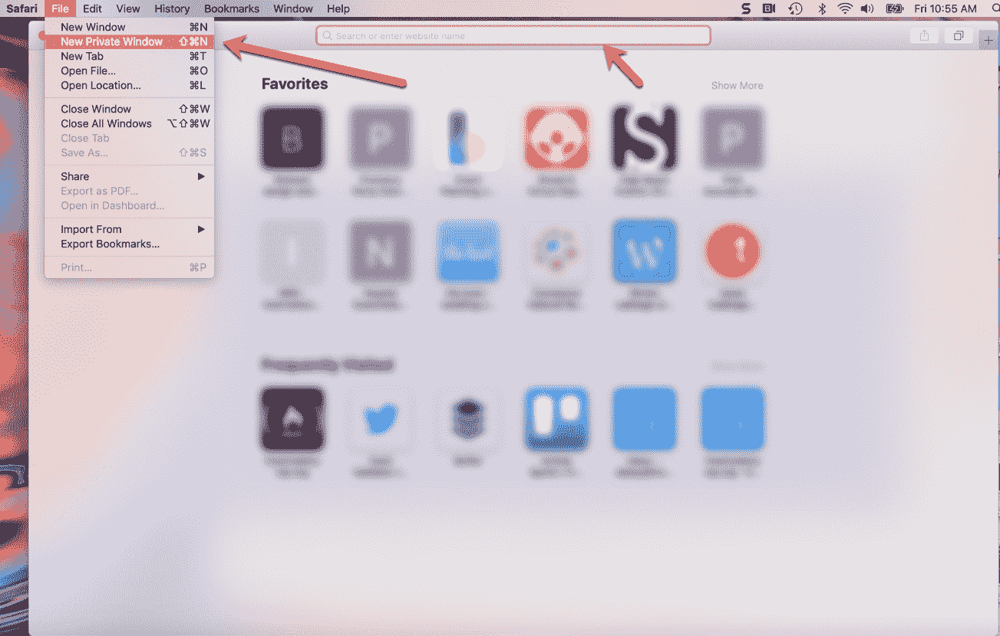
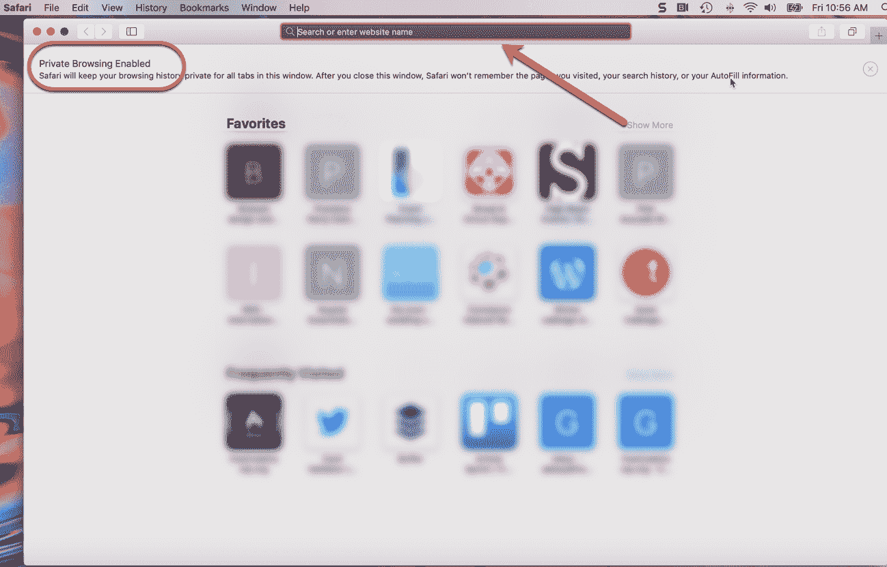

# 私人浏览器——如何在 Chrome 和 Safari 中使用匿名模式

> 原文：<https://www.freecodecamp.org/news/private-browser-how-to-use-incognito-mode-in-chrome-and-safari/>

隐私浏览，或“匿名模式”已经成为一种比较安静地上网冲浪的流行方式。但这到底意味着什么，你受到了怎样的保护？

让我们更深入地了解一下隐姓埋名模式是什么，它是如何工作的，以及它如何能帮助你(或不能)。

## 什么是隐私浏览？

当你在一个私人的浏览会话中，你的浏览器不会在它的历史中保留该网站的记录。此外，与该会话相关的数据(如 cookies)不会保存在您的本地计算机上。

例如，如果你想为你的另一半在网上购物，并且不想让他们发现，这是很有用的。有了隐私浏览功能，你可以在网上搜索他们一直觊觎的乐高歼星舰，订购它，他们也不会知道(除非他们跟踪到你家的货物。那你就有麻烦了。).

为什么你的惊喜不会被破坏？好吧，乐高网站将从浏览历史中抹去。而且，如果你的 S.O .决定使用你的笔记本电脑(或你订购礼物的家用台式机)，它们不会被可能泄露秘密的定向广告轰炸(或至少少得多)。所以，很有帮助。

如果你想绕过计量付费墙，测试网站的响应，当你登录时可能会保存你的信息，等等，私人浏览也是有用的。

## 如何在 Chrome 中启用它

既然我们已经确定了隐姓埋名模式的有用性，让我们弄清楚如何在几个流行的浏览器中使用它。我们先来看看 Chrome。

要开始匿名会话，请打开 Chrome 浏览器，找到右上角的三个垂直点。点击它们，然后从下拉选项中选择“新隐姓埋名窗口”。

Easy peasy.

一旦你点击它，一个新的黑暗窗口就会打开。就这样，你隐姓埋名。

Chrome gives a concise summary of what is and isn't saved/visible

**注**:你也可以用键盘快捷键打开私密浏览会话。

只需在 Mac 上点击/按住 Command+Shift+N(或者在 Windows 上按住 Ctrl+Shift+N)，那个黑色的小窗口就会弹出来，不需要点击鼠标。

## 如何在 Safari 中启用它

在 Safari 中打开私人浏览窗口与在 Chrome 中打开非常相似。

只需打开一个新的 Safari 窗口，点击文件标签，并从下拉选项中选择“新建私人窗口”:

Notice that the address bar is white with black text

单击该选项后，您将看到一个非常相似的浏览器窗口，但是带有一个黑色的地址栏(以及一个已启用隐私浏览的提示)。

Safari's more subtle incognito mode

这里也有同样的快捷方式:只需点击并按住 Command+Shift+N 就可以开始匿名会话。

现在，您可以在 Safari 中浏览，而不会在电脑上留下任何痕迹。更多关于它如何保护你和不保护你。

## 它是如何保护你的？

我们已经讨论了匿名模式的有用性，但是让我们来展示一下隐私浏览是如何帮助你的。

以下是它所做的事情，以及它如何保护您:

*   您访问的网站不会保存在您的浏览历史记录中，因此如果您一直使用匿名模式，您(或其他人)就无法在浏览器中回头查看您访问过的网站
*   在匿名模式下，Cookies 和其他缓存信息不会存储在本地设备上(它们会在每次匿名会话时重新创建)。
*   Google 不会保存您在在线表单中输入的信息(如您的电子邮件地址、实际地址等)。

这些功能确实超级方便。但是不要让他们给你一种虚假的安全感。现在我们来讨论一下隐私浏览不会做的事情。

## 它没有做什么

当你在进行私人浏览会话时，你仍然需要考虑以下事实:

*   虽然 cookies 和其他东西可能不会保存在您的机器上，但网站仍可能会在自己的服务器上收集您的一些信息。你用来到达你要去的地方的任何网络也可以收集信息。
*   如果您的公司或学校监控浏览器会话，他们仍然可以看到您访问的网站的 IP 地址。因此，如果你不想让你的雇主看到你访问了一个不合适的或 NSFW 的网站，就不要在上班时间用公司的 wifi/电脑访问那个网站。
*   隐私浏览也不能保护你免受恶意软件或病毒的侵害。因此，请确保您仍在采取所有您通常会采取的预防措施来确保您的浏览安全。

请记住:即使你使用匿名模式，你的浏览器仍然可以记录你的搜索历史，你的雇主仍然可以看到你去过哪里，网站仍然可以收集你的位置等信息。

私下浏览，但要安全浏览，朋友们。