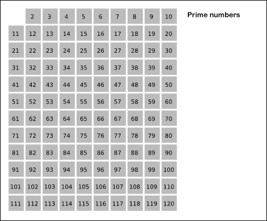

# 用诚实的亚伯解决问题:让我们把所有的质数加起来直到 n

> 原文：<https://www.freecodecamp.org/news/problem-solving-with-honest-abe-lets-sum-all-prime-numbers-up-to-n-4c140273b8dc/>

丹尼尔·韦纳

# 用诚实的亚伯解决问题:让我们把所有的质数加起来直到 n

#### 跟随 Honest Abe 使用基本软件开发原则解决一个中间算法挑战

Back in the day, we called it math [link](http://www.publicdomainpictures.net/pictures/80000/nahled/abraham-lincoln-clipart.jpg)

假设挑战是这样的:

将所有质数相加，直到并包括给定的数。

素数被定义为一个大于一并且只有两个约数的数，一个和它自己。例如，2 是一个质数，因为它只能被 1 和 2 整除。

提供的数字可能不是质数。

诚实的安倍会如何解决这个问题？

### 诚实的安倍考虑大局

Take time to understand the problem [link](https://upload.wikimedia.org/wikipedia/commons/thumb/1/19/SDLC_-_Software_Development_Life_Cycle.jpg/764px-SDLC_-_Software_Development_Life_Cycle.jpg)

> “给我六个小时砍树，我会用前四个小时磨利斧头。”—诚实的亚伯

在深入研究代码之前，诚实的 Abe 喜欢**制定需求**和**确定规格**。他尽可能多地了解问题，并准确地找出需要解决的问题。直到他完全理解这个问题，他才能开始解决它。

他还需要确定这个程序到底要完成什么。他关注的是***想要程序完成什么，而不是***它将如何工作。对于简单的程序，这包括描述输入和输出以及它们之间的关系。******

******对于这个问题，输入将是某个数字(n)，一个整数。输出将是从 2 到 n 的所有质数之和(没有小于 2 的质数)。这个问题解释了质数，安倍对这个定义感到满意。******

### ******诚实的亚伯从纸和笔开始******

******

An algorithm is a recipe? Maybe [link](https://c2.staticflickr.com/4/3059/3073489187_bd76ae6747_z.jpg?zz=1)****** 

******Abe 不会直接投入到编码中。下一步是创建程序的整体结构。这是他决定**程序如何完成任务的地方。********

******这里的主要工作是**设计符合规范的算法**。算法通常用**伪代码**编写，或者用精确的英语描述程序做什么。这有助于 Abe 交流算法，而没有用任何特定的编程语言获得正确细节的额外精神负担。******

******这里有一个算法，将所有素数求和到 n:******

*   ******输入整数形式的 n******
*   ******求 n 以内的质数******
*   ******找出所有找到的素数的和******

******Abe 知道他可以在实现设计时重新访问这个伪代码。******

### ******诚实的亚伯喜欢 Python 导师******

******

An artist is only as good as his or her tools [link](https://c1.staticflickr.com/4/3132/2504310138_f7d3e1aec3_b.jpg)****** 

******Abe 知道他有许多可以编码的选项，包括 Sublime 之类的编辑器，或者 Visual Studio Code 之类的 IDE，甚至直接在提供的编码面板中(像 freeCodeCamp 提供的那个)。******

******安倍确实更喜欢 pythontutor.com。******

******以下是 Python tutor 工作原理的一个示例:******

******

Coding in Python3 using Python tutor****** 

******Python tutor 是一个非常直观的界面，可以在编辑器中输入代码。它允许 Abe 可视化程序的执行，而不需要了解调试器或 IDE。他甚至可以通过点击代码行来设置断点(这里的断点用红色标记)。除了名字，Python tutor 还兼容 Java、JavaScript、Ruby 和其他编程语言。******

### ******诚实的 Abe 使用增量开发******

******

This makes things more clear [link](http://3vwizk2qtr8l3diwrm3r2ba0-wpengine.netdna-ssl.com/wp-content/uploads/2011/10/convergent-vs-divergent2.jpg)****** 

******与许多讲座、教程和教科书不同，诚实的 Abe 自己编写的代码并没有完全汇编成一个工作程序。虽然有时候他觉得如果有就好了。******

******因此，诚实的安倍实行增量开发。******

******诚实的 Abe 不会写一个完整的函数、程序或他正在做的任何东西，他会先写一些小代码，确保它们能工作，然后把它们连接成一个更大的程序。因此，他正在以**增量** *开发他的程序。*******

******

Incremental development to get an integer from the user****** 

******在这个例子中，诚实的 Abe 从一个小版本的代码开始，从用户那里获得输入。他插入了一个打印声明，以确保这是可行的。下面注释掉了代码的最终版本，以展示他如何从一个增量进入一个更大的代码块。******

### ******诚实的 Abe 练习防御性编程******

******

Now that’s some self-defense [link](https://pixel.nymag.com/imgs/fashion/daily/2016/11/18/18-womens-self-defense.w710.h473.jpg)****** 

******诚实的 Abe 知道不能相信用户会遵循他的程序提供的指令。他必须采取保护措施，以防用户输入错误的值。在这种情况下，错误值可以是正整数以外的任何值。******

******

Catching bad user input — floats, characters, and negative ints****** 

******上面看到的 try / except 块封装在 readInt 函数中，它捕捉任何不是正整数的用户输入，并最终在正确输入整数后返回用户输入。******

### ******诚实的亚伯从强力解决开始******

******

“Make it correct, make it clear, make it concise, make it fast. In that order.” Wes Dyer****** 

******诚实的 Abe 的首要任务是让程序产生一个正确的结果。他依赖于一种强力的、穷尽的枚举方法，从 5 到用户输入的所有数字进行迭代，检查每个数字是否是质数。******

******他知道 2 和 3 是质数，所以如果其中任何一个是用户输入的，他就把它们加到 sum 上。******

******他还优化了内部循环，通过 I 的平方根从 2 开始搜索。******

******这给出了正确的结果，但是诚实的 Abe 知道他可以做得更好。这对于大量输入来说会非常慢。******

### ******诚实的安倍研究经典******

******

Sieve of Eratosthenes [link](https://en.wikipedia.org/wiki/Sieve_of_Eratosthenes#/media/File:Sieve_of_Eratosthenes_animation.gif)****** 

******归功于古希腊数学家厄拉多塞，这是一种寻找任意给定极限的素数的有效算法。******

******它从第一个素数 2 开始，迭代地将每个素数的倍数标记为非素数。例如，4、6、8 等等。被标记为未达到极限灌注。然后，回到列表的开头，3 被标记为质数。6 已经被标记为非素数，所以 9 被标记为非素数，后面是 12，15 等等。直到序列结束。******

******

Sieve of Eratosthenes in pythontutor****** 

******诚实的 Abe 首先初始化一个长度为 num 的值为 True 的列表。他将列表的前两个值设置为 False，因为 0 和 1 都不是质数。然后，他创建了一个初始值为 0 的变量 sum，这个值会随着找到的每个素数而增加。******

******使用 Python 中的 enumerate 函数，Honest Abe 首先检查列表 a 中的值是否设置为 True，这意味着这是一个质数。如果是，则总和增加该数量。******

******然后，他进行迭代，从 i*i(一个小的优化)开始，通过 num，递增 I，将每个列表索引处的值更改为 False。******

******例如，0 和 1 都被设置为 False，所以这些值不会进入内部 For 循环。******

******2 被设置为 True，所以 2 被加到 sum 上。然后，从 4 开始，列表索引被设置为 False，包括 6、8、10 等，直到循环结束。******

******然后 I 递增到 3，设置为真，重复上面的过程。******

******诚实的 Abe 知道有更有效的实现，但是效率的代价是可解释性，所以他将留给读者去进一步探索这些算法。******

### ******诚实的亚伯测试他的程序******

******

Move away from pythontutor for testing****** 

******通常，Abe 会在集成测试之前进行单元测试。******

******然而，测试是一个非常大的主题，最好留给其他文章来讨论。******

******相反，安倍只是想确保他的计划按计划进行。******

******他使用 pytest 并在一系列正整数上测试他的程序。******

******他自信他的程序能提供正确的答案。******

### ******诚实的安倍最喜欢的资源******

******

Life long learning [link](http://maxpixel.freegreatpicture.com/static/photo/1x/Education-Learn-School-Classroom-Learning-1959551.jpg)****** 

******十年自学编程 —彼得·诺维格******

******[斯坦福编程方法论](https://www.youtube.com/playlist?list=PL84A56BC7F4A1F852)******

******[MIT Python](https://www.youtube.com/playlist?list=PL57FCE46F714A03BC)******

******[哈佛 CS50](https://www.youtube.com/channel/UCcabW7890RKJzL968QWEykA)******

******感谢阅读！祝你旅途好运！******

******请欣赏这部关于终身学习的漫画。******