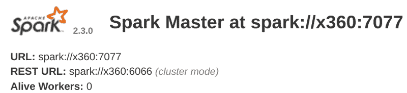
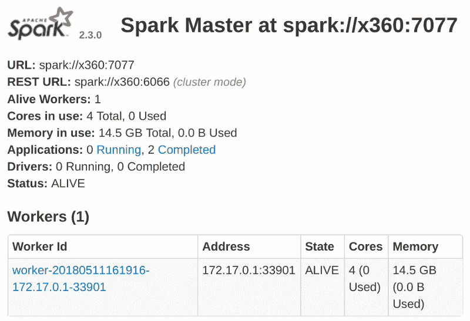

# 用 Apache Spark 处理维基百科的经验教训

> 原文：<https://www.freecodecamp.org/news/processing-wikipedia-with-spark-542213bd4365/>

by Siddhesh Rane

# 用 Apache Spark 处理维基百科的经验教训


Apache Spark 是一个开源的容错集群计算框架，它也支持 SQL 分析、机器学习和图形处理。

它的工作原理是将您的数据分成多个分区，然后在集群中的所有节点上并行处理这些分区。如果任何节点出现故障，它会将该节点的任务重新分配给另一个节点，从而提供容错能力。

比 Hadoop 快 100 倍的速度使得它在大数据处理方面大受欢迎。Spark 是用 Scala 编写的，在 JVM 上运行，但好消息是它也为 Python 和 R 以及 C#提供了 API。这是很好的[记录](http://spark.apache.org/docs/latest/)与[的例子](http://spark.apache.org/examples.html)，你应该检查一下。

当您准备尝试时，本文将指导您从下载和设置到性能调优。我的小 Spark 集群在不到两个小时的时间里对维基百科的所有文章进行了 1 亿次字符串匹配。

当你学完教程，做一些严肃的工作时，你会意识到你正在使用的技术栈的所有麻烦。从错误中学习是最好的学习方式。但有时你只是时间紧迫，希望你知道每一件可能出错的事情。

在这里，我描述了我在开始使用 Spark 时遇到的一些问题，以及如何避免这些问题。

### 如何开始

#### 下载打包的 Hadoop 依赖项附带的 Spark 二进制文件

如果您开始下载 Spark，您会注意到有不同的二进制文件可用于相同的版本。Spark 宣称它不需要 hadoop，所以你可以下载用户提供的尺寸更小的 Hadoop 版本。不要那样做。

虽然 Spark 不使用 Hadoop 的 MapReduce 框架，但它依赖于其他 Hadoop 库，如 HDFS 和 YARN。无 hadoop 版本适用于其他地方已经提供了 Hadoop 库的情况。

#### **使用独立集群模式，而不是 Mesos 或 YARN**

一旦您在`local`集群上测试了内置示例，并确保一切都已安装并正常工作，就可以继续设置您的集群了。

Spark 提供三种选择:Mesos、YARN 和 standalone。

前两个是控制复制节点的资源分配器。Spark 必须请求它们分配自己的实例。作为一个初学者，不要这样增加你的复杂性。

独立集群最容易设置。它带有明智的默认设置，比如使用你所有的内核作为执行者。它是 Spark 发行版本身的一部分，有一个`sbin/start-all.sh`脚本，可以使用 ssh 启动主服务器以及`conf/slaves`中列出的所有副本服务器。

Mesos/YARN 是单独的程序，当你的集群不仅仅是一个 spark 集群时使用。此外，它们没有合理的默认值:除非明确指定，否则执行器不会使用副本上的所有内核。

您还可以选择使用 Zookeeper 的高可用性模式，它会保留一个备份主服务器列表，以防任何主服务器出现故障。如果您是初学者，您可能不会处理一个有一千个节点的集群，因为节点故障的风险很大。你更有可能在亚马逊或谷歌的托管云平台上建立一个集群，这种平台已经可以处理节点故障。

#### 云基础架构或小型集群不需要高可用性

我将我的集群设置在一个恶劣的环境中，人为因素导致电源故障，节点脱离电网。(基本上就是我的大学机房，勤快的学生关机器，粗心的学生拔局域网线)。通过仔细选择主节点，我仍然可以实现高可用性。你不用担心这个。

#### 检查您用来运行 Spark 的 Java 版本

一个非常重要的方面是您用来运行 Spark 的 Java 版本。通常，较新版本的 Java 可以处理为旧版本编译的内容。

但是在 Jigsaw 项目中，模块化在 Java 9 中引入了更严格的隔离和边界，打破了某些使用反射的东西。在 Java 9 上运行的 Spark 2.3.0 上，我得到了非法的反射访问。Java 8 没有问题。

这在不久的将来肯定会改变，但在那之前请记住这一点。

#### 完全按原样指定主 URL。不要将域名解析为 IP 地址，反之亦然

独立群集对用于解析主节点和副本节点的 URL 非常敏感。假设您启动主节点，如下所示:

```
> sbin/start-master.sh 
```

你的初选在`localhost:8080`开始



默认情况下，您电脑的主机名被选为主要 URL 地址。`x360`解析为`localhost`，但是启动一个类似下面的副本将**不起作用。**

```
# does not work > sbin/start-slave.sh spark://localhost:7077 
```

```
# works > sbin/start-slave.sh spark://x360:7077
```

这是可行的，我们的副本已添加到群集:



我们的副本在 172.17.x.x 子域中有一个 IP 地址，其实就是 Docker 在我机器上设置的子域。

主服务器可以与该副本服务器通信，因为两者都在同一台计算机上。但是副本不能与网络上的其他副本或不同机器上的主服务器通信，因为它的 IP 地址不可路由。

与上面的主实例一样，没有主实例的计算机上的副本将占用该计算机的主机名。当您有相同的机器时，它们最终都使用相同的主机名作为它们的地址。这造成了一片混乱，没有人能与他人交流。

因此，上面的命令将变为:

```
# start master> sbin/start-master.sh -h $myIP # start slave > sbin/start-slave.sh -h $myIP spark://<masterIP>:7077 # submit a job > SPARK_LOCAL_IP=$myIP bin/spark-submit ...
```

其中`myIP`是可在集群节点之间路由的机器的 IP 地址。更有可能的是，所有节点都在同一个网络上，因此您可以编写一个脚本，在每台机器上设置`myIP`。

```
# assume all nodes in the 10.1.26.x subdomain siddhesh@master:~$ myIP=`hostname -I | tr " " "\n" | grep 10.1.26\. | head`
```

### 代码流

到目前为止，我们已经设置了我们的集群，并看到它正在运行。现在是编码的时候了。Spark 有很好的文档记录，并提供了许多示例，因此开始编码非常容易。不太明显的是整个事情是如何工作的，这会导致在运行时出现一些很难调试的错误。假设您编写了如下代码:

```
class SomeClass {  static SparkSession spark;  static LongAccumulator numSentences; 
```

```
 public static void main(String[] args) {    spark = SparkSession.builder()                        .appName("Sparkl")                       .getOrCreate(); (1)    numSentences = spark.sparkContext()                       .longAccumulator("sentences"); (2)    spark.read()        .textFile(args[0])        .foreach(SomeClass::countSentences); (3)  }  static void countSentences(String s) { numSentences.add(1); } (4) }
```

**1** 创建 spark 会话

创建一个长计数器来跟踪工作进度

逐行遍历一个文件，为每一行调用 countSentences

**4** 每句话在累加器上加 1

上面的代码在一个`local`集群上工作，但是在一个多节点集群上运行时会失败，并出现一个空指针异常。在复制机器上，`spark`和`numSentences`都将为空。

要解决这个问题，将所有初始化的状态封装在对象的非静态字段中。使用`main`创建对象，并推迟对其的进一步处理。

您需要理解的是，您编写的代码完全由驱动程序节点运行，但副本节点执行的是 spark 给它们的序列化作业。您的类将由副本上的 JVM 加载。

静态初始化器会像预期的那样运行，但是像`main`这样的函数不会，所以在驱动中初始化的静态值在副本中看不到。我不知道整件事是如何运作的，我只是根据经验来推断，所以对我的解释不要全信。因此，您的代码现在看起来像这样:

```
class SomeClass {  SparkSession spark; (1)  LongAccumulator numSentences;  String[] args;   SomeClass(String[] args) { this.args = args; }   public static void main(String[] args){    new SomeClass(args).process(); (2)  }   void process() {    spark = SparkSession.builder().appName("Sparkl").getOrCreate();   numSentences = spark.sparkContext().longAccumulator("sentences");   spark.read().textFile(args[0]).foreach(this::countSentences); (3) }  void countSentences(String s) { numSentences.add(1); }}
```

使字段非静态

创建类的实例，然后执行 spark 作业

**3**foreach lambda 中对`this`的引用将对象放入可访问对象的闭包中，从而被序列化并发送给所有副本。

用 Scala 编程的人可能会使用单独类的 Scala 对象，因此可能永远不会遇到这个问题。然而，这是你应该知道的事情。

### 提交应用程序和依赖项

上面的代码还有很多，但在此之前，您需要向集群提交您的应用程序。除非你的应用程序非常简单，否则你很有可能使用外部库。

当您提交您的 app jar 时，您还需要告诉 Spark 您正在使用的依赖库，这样它将使它们在所有节点上都可用。这很简单。语法是:

```
bin/spark-submit --packages groupId:artifactId:version,...
```

我对这个计划没有异议。它完美地工作。我通常在我的笔记本电脑上开发，然后从集群上的一个节点提交作业。所以我需要将应用程序及其依赖项转移到我 ssh 到的任何节点。

Spark 在本地 maven 回购中寻找依赖性，然后是中央回购和您使用`--repositories`选项指定的任何回购。在驱动程序上同步所有这些，然后在命令行上键入所有这些依赖项，这有点麻烦。所以我更喜欢将所有的依赖项打包在一个单独的 jar 中，称为超级 jar。

#### **使用 Maven shade 插件生成一个包含所有依赖项的 uber jar，这样作业提交变得更加容易**

只需在您的`pom.xml`中包含以下几行

```
<build> <plugins>  <plugin>   <groupId>org.apache.maven.plugins</groupId>   <artifactId>maven-shade-plugin</artifactId   <version>3.0.0</version>   <configuration>    <artifactSet>     <excludes>      <exclude>org.apache.spark:*</exclude>     </excludes>    </artifactSet>   </configuration>   <executions>    <execution>     <phase>package</phase&gt;     <goals>      <goal>shade</goal>     </goals>    </execution>   </executions>  </plugin> </plugins> </build>
```

当您构建并打包项目时，默认的发行版 jar 将包含所有的依赖项。

当您提交作业时，应用程序 jar 会累积在`work`目录中，并随着时间的推移而填满。

在`conf/spark-defaults.conf`中将`spark.worker.cleanup.enabled`设置为真

默认情况下，此选项为 false，适用于单机模式。

### 输入和输出文件

这是最令人困惑的部分，很难诊断。

当协议为`file://`或缺失时，Spark 支持读写系统上的`hdfs`、`ftp`、`jdbc`等各种源或本地文件。我的第一次尝试是从我的驱动程序中读取一个文件。我假设驱动程序会读取文件，将它转换成分区，然后在集群中分发这些分区。结果却不是这样。

当您从本地文件系统中选择一个文件时，请确保该文件存在于所有工作节点上完全相同的位置。Spark 不会隐式地将文件从驱动程序分发给工作人员。

所以我不得不把文件复制给同一地点的每个工人。文件的位置作为参数传递给了我的应用程序。因为文件位于父文件夹中，所以我将其路径指定为`../wikiArticles.txt`。这在工作节点上不起作用。

#### 总是传递绝对文件路径进行读取

这可能是我的一个错误，但是我知道 filepath 把它按原样放入了`textFile`函数，并导致了“文件未找到”的错误。

Spark 支持常见的压缩方案，因此大多数 gzipped 或 bzipped 文本文件在使用前都会被解压缩。看起来压缩文件会更有效率，但是不要落入那个陷阱。

#### 不要从压缩文本文件中读取，尤其是`gzip`。未压缩的文件处理起来更快。

Gzip 不能像 bzip2 一样并行解压缩，所以节点花费大部分时间解压缩大文件。

让所有工人都能得到输入文件是一件麻烦的事。您可以使用 Spark 的文件广播机制。提交作业时，使用`--files`选项指定逗号分隔的输入文件列表。访问这些文件需要`SparkFiles.get(filename)`。我找不到足够的关于这个特性的文档。

要读取使用`--files`选项广播的文件，使用`SparkFiles.get(<onlyFileNameNotFullPat` h >作为读取函数中的路径名。

因此，作为`--files /opt/data/wikiAbstracts.txt`提交的文件将作为`SparkFiles.get("WikiAbstracts.txt")`被接受。这将返回一个字符串，您可以在任何需要路径的读取函数中使用该字符串。同样，请记住指定绝对路径。

由于我的输入文件是 5GB gzipped，而我的网络速度相当慢，为 12MB/s，所以我尝试使用 Spark 的文件广播功能。但是解压缩本身花费了很长时间，所以我手动将文件复制给每个工人。如果您的网络足够快，您可以使用未压缩的文件。或者使用 HDFS 或 FTP 服务器。

写文件也遵循读的语义。我将我的数据帧保存到本地系统的 csv 文件中。我再次假设结果将被发送回驱动节点。对我没用。

#### 当数据帧保存到本地文件路径时，每个工作者将其计算的分区保存到自己的磁盘。没有数据发送回驱动程序

我只得到了我期望的结果的一小部分。最初，我将这个问题误诊为代码中的错误。后来我发现每个工人都将计算结果存储在自己的磁盘上。

### 划分

您创建的分区数量会影响性能。默认情况下，Spark 将创建与集群中核心数量一样多的分区。这并不总是最佳的。

密切关注有多少工作人员正在积极处理任务。如果太少，请增加分区的数量。

如果从一个 gzipped 文件中读取，Spark 只创建一个分区，这个分区只由一个 worker 处理。这也是 gzip 文件处理缓慢的一个原因。我观察到，与大量小分区相比，少量大分区的性能较低。

最好在读取数据时显式设置分区数量。

从 HDFS 读取时，您可能不必这样做，因为 Hadoop 文件已经分区。

### 维基百科和 DBpedia

这里没有 *gotchas* ，但是我认为让你知道其他选择是有好处的。整个 Wikipedia xml 转储是 14GB 压缩的，65 GB 未压缩的。大多数时候，您只需要文章的纯文本，但是转储是在 MediaWiki 标记中，所以需要一些预处理。在各种语言中，有许多工具可用于此目的。虽然我没有亲自使用过，但我很确定这是一项耗时的任务。但是还有其他选择。

如果您想要的只是维基百科文章的纯文本，主要用于 NLP，那么可以下载 DBpedia 提供的数据集。

我在 [DBpedia](http://wiki.dbpedia.org/downloads-2016-10) 上使用了完整的文章转储(`NIF Context`)(直接从[这里](http://downloads.dbpedia.org/2016-10/core-i18n/en/nif_context_en.ttl.bz2)下载)。这个数据集去掉了不需要的东西，比如表格、信息框和引用。压缩下载为 4.3GB 的`turtle`格式。你可以像这样把它转换成`tsv`

类似的数据集也可用于页面链接、锚文本等其他属性。请务必查看 [DBpedia](https://dbpedia.org) 。

### 关于数据库的一句话

我一直不太明白为什么会有这么多的数据库，都是如此相似，而且人们还会购买数据库许可证。直到这个项目，我没有认真使用任何。我只用过 MySQL 和 Apache Derby。

在我的项目中，我使用了 SPARQL 三重存储数据库 Apache Jena TDB，通过 Jena Fuseki 提供的 REST API 进行访问。这个数据库将为我提供本文中提到的所有资源的 RDF urls、标签和谓词。每个节点都会发出一个数据库调用，然后才会继续进行进一步的处理。

我的工作负载受到 IO 的限制，因为我可以看到工作节点上的 CPU 利用率接近 0%。数据的每个分区都会产生两个 SPARQL 查询。在最坏的情况下，两个查询中的一个需要 500-1000 秒来处理。幸运的是，TDB 数据库依赖于 Linux 的内存映射。我可以将整个数据库映射到 RAM 中，从而显著提高性能。

#### 如果您受到 IO 的限制，并且您的数据库可以放入 RAM，那么就在内存中运行它。

我找到了一个名为 [vmtouch](https://hoytech.com/vmtouch/) 的工具，它可以显示数据库目录被映射到内存中的百分比。这个工具还允许你显式地将任何文件/目录映射到内存中，并且可以选择锁定它，这样它就不会被换出。

我的 16GB 数据库可以轻松放入我的 32 GB RAM 服务器。这将查询性能提高了几个数量级，每个查询只需 1-2 秒。使用基于分区号的数据库负载平衡的基本形式，通过使用 2 个 SPARQL 服务器而不是 1 个，我可以将执行时间减少一半。

### 结论

我非常喜欢 Spark 上的分布式计算。没有它，我不可能完成我的项目。将我现有的应用程序放在 Spark 上运行非常容易。我肯定会推荐任何人去尝试一下。

*最初发布于 [siddheshrane.github.io](https://siddheshrane.github.io/processing-wikipedia-with-spark/index.html) 。*