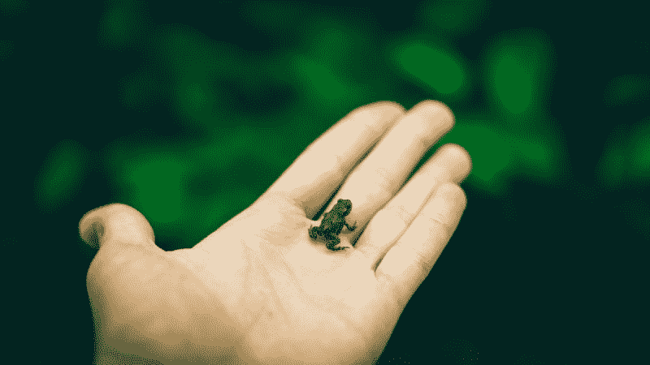

# 拖延很糟糕——所以这里有一个“吃掉那只青蛙”的方法来提高效率

> 原文：<https://www.freecodecamp.org/news/procrastination-sucks-so-heres-the-eat-that-frog-way-to-powerful-productivity-543b07ecf360/>

#### 把你最有价值的时间花在你最有价值的活动上，你会改变你生活的轨迹。

> “在我的职业生涯中，我发现并重新发现了一个简单的真理。一心一意专注于自己最重要的任务、把它做好并完成它的能力，是获得巨大成功、成就、尊重、地位和生活幸福的关键。”

> ——布莱恩·特雷西，[吃掉那只青蛙](https://www.amazon.com/That-Frog-Action-Workbook-Procrastinating/dp/1523084707)

编程的问题，以及创业和技术领域的大多数工作，是它需要大量的脑力劳动。因此，无论任务多么无意义或琐碎，我们仍然感到有效率。

虽然你的大脑可能会因为这一切的挑战而出汗，但这并不意味着你正在做的事情会自动地最好地利用你的时间。

你对时间的最佳利用永远是**增加价值**。有时候那是代码，有时候不是。

如果你是一名企业家或单身创始人，你的工作就是为你的客户增加价值。如果你被雇佣或者想要被雇佣，你的工作就是为你的公司和公司的客户增加价值。

在生活中，没有什么比坚持优先考虑那些为他人(和自己)增加最大价值的事情更能让你前进得更快。)

这就是将优秀员工与其他人、高薪员工与愤懑员工、高效员工与超负荷员工区分开来的原因。

不要被你在社交媒体上看到的东西所迷惑。答案是**而不是** 18 小时工作日和 100 小时工作周。*喧嚣从未停止！*

你死了会睡觉的，对吧？

嗯，我喜欢睡觉。我喜欢上班打卡，完成很多工作，获得丰厚的报酬，把工作**留在**工作。我喜欢有空闲时间写作和创作自己的东西。

我被赋予这些“奢侈品”(你知道，就像工作与生活的平衡)，因为我的公司信任我。我离世界级的开发者还很远。事实上，我是一个自学成才的程序员，直到 20 多岁才开始认真地编程。

但是我已经建立了一个记录，完成了那些为他人和组织增加价值的事情。我通过任何人都可以学习的系统和技术做到了这一点。

我们都有一个永无止境的清单，上面列有我们需要做的事情。

但它们只是提供最大价值和贡献的少数几个关键的东西，比你清单上的其他东西加起来还多。

我们每天都有几个小时，我们的能量水平和昼夜节律一致，我们真正投入(或者至少，*可以是*真正投入)。一天中的时间和长度会有所不同，但我们都有。

把你最有价值的时间花在你最有价值的活动上，你会改变你生活的轨迹。

你不必成为世界上最好的。

但是如果你在你的组织或城市中是前 10%的开发者，或者是前 10%的求职者，或者是前 10%的自由职业者，那么你会做得很好。

当你进入前 10%时，你会知道，因为回报会找上门来。奖励既有内部的(事业上的成就，家庭的自由时间)，也有外部的(认可，晋升和金钱奖励)。

### 早餐爱吃青蛙，事半功倍

> “马克·吐温曾经说过，如果你每天早上做的第一件事就是吃一只活青蛙，你就可以心满意足地度过这一天，因为你知道这可能是一整天中发生在你身上最糟糕的事情。”

> ——[吃那只青蛙](https://www.amazon.com/That-Frog-Action-Workbook-Procrastinating/dp/1523084707) p.2

[吃那只青蛙:21 种停止拖延并在更少的时间内完成更多工作的好方法](https://www.amazon.com/That-Frog-Action-Workbook-Procrastinating/dp/1523084707)是布莱恩·特雷西写的一本书，里面有很多简单实用的提高工作效率的建议。

它只有大约 120 页，但它充满了可操作的见解和智慧。布莱恩·特雷西几十年来一直是自我提升领域的一个支柱，74 岁了仍然很强壮。

有点过时了(嗯，至少我的那本是 07 年出版的。)

黑莓被提到了很多，它会变得俗气和重复。有些听起来有点老派和强硬，就像一个老爷爷对你大喊陈词滥调。

但是主要的想法是合理的。大多数对我来说都很有效。

所有的自助和生产力建议最终都归结为一件事:一点规划。优先排序。对困难的事情采取行动。在无关紧要的事情上拖延。正在整理。

就是这样。没必要比这更复杂。

### 青蛙是什么，我为什么要吃青蛙？

> “你的‘青蛙’是你最大、最重要的任务，如果你不做点什么，它是你最有可能拖延的任务。这也是目前能对你的生活和结果产生最大积极影响的一项任务。”

> ——[吃那只青蛙](https://www.amazon.com/That-Frog-Action-Workbook-Procrastinating/dp/1523084707) p.2

当你养成在做其他事情之前先做最困难的任务的习惯时，你就会成为一个行动和自律的人。

你的身份从轮子上的齿轮变成了推动船只前进的引擎。

不仅仅是任何困难的任务。有许多困难的事情可以填满我们的一天。困难并不总是等同于重要或最大的积极影响。

如果你不确定这是什么意思，关键词是*拖延*。

你可能会因为害怕而拖延。恐惧是一个很好的迹象，表明你要做的这件事是一只重要的青蛙。

它可能是对失败或看起来愚蠢的恐惧。

你没有开始在线计算机科学 101 课程，因为你害怕它会太复杂而难以理解。

作为一名初级开发人员，你不会接手那些*只是*稍微超出你的舒适区的项目。在你已经知道的基础上工作更安全。

也是对成功的恐惧。

如果你的事业真的起飞了，他们开始给你更多的责任和钱怎么办？谁想要那个？！

对成功的恐惧往往比对失败的恐惧更糟糕。这是阴险的，因为没有明显的迹象表明人们会害怕取得更多的成就。但是约拿情结是真实的，许多有才华的男人和女人因为它而失去了他们真正的优秀。

所以我们拖延了真正的贡献。我们拖延完成和展示我们的作品。

相反，我们一直忙于做“应该”完成的事情，以及我们被告知要做的事情，以避免面对一只丑陋的大青蛙。

### 把又大又丑的青蛙和蝌蚪分开

“Cute, but this former tadpole doesn’t scare anyone” by [Yoel Kamara](https://unsplash.com/@yoelkamara?utm_source=medium&utm_medium=referral) on [Unsplash](https://unsplash.com?utm_source=medium&utm_medium=referral)

蝌蚪是无助的婴儿，不是青蛙。他们很容易被杀死。杀蝌蚪是一项不用动脑的活动，不会打动任何人。

吃下你见过的最大最脏的青蛙，现在你有值得骄傲的东西了。

如果你正在学习编码，你的青蛙正在开始并完成一门在线课程。你的青蛙在重复你不懂的模块，直到你懂了。你的青蛙正在专注而有目的地完成你的代码营任务。

如果你想被雇用，那么你的青蛙正在建造东西。没有比简单明了地构建东西更好的学习编码和获得工作的方法了。

你的青蛙没有整理你的书签，也没有润色你的 Linkedin 个人资料。你的青蛙没有张贴到论坛，堆栈溢出，Reddit 和脸书组。这些是蝌蚪。这些东西不用动脑，很容易。

如果你想启动一个已经在你脑海中思考了一段时间的副业项目，那么写代码就是你的梦想。下水是你的青蛙。在明显没人感兴趣后关闭它？一只大青蛙。

你的青蛙不是永无止境的市场调查或阅读关于其他人如何开展他们的副业项目的文章。你的青蛙绝对不会发微博说你有多努力在“忙碌”

### 如何找到你最有价值的活动

你可能已经知道你的青蛙是什么，但还是花点时间做下面的练习吧。几分钟的思考比几个小时无意识的忙碌工作更有价值。

当你意识到决定、开始和完成对你的生活、职业和组织有最大影响的事情的重要性时，你会比 90%的人做得更好。

### 第一步——写下为达到目标你必须做的每一件事

如今，目标和目标设定已经失宠了。相反，我们都是关于系统、习惯和日常实践的。

我同意，因为目标可能是危险的。目标关注的是结果，这是我们无法控制的。

如果你没有达到目标，它会让你觉得自己是个彻底的失败者。或者，你可能最终会沉迷于结果，以至于忽略了为实现它而做的任何真正的工作。我想到了“wantrepreneur”这个词。

系统更好，因为我们可以控制我们的系统。我们可以用一个系统来衡量“成功”，因为每天我们要么做，要么不做。重点是每天的过程，而不是最终的结果。

吃青蛙是一个系统。当你把你必须做的事情按影响顺序组织起来，提前计划，然后专注于最重要的任务，直到它们完成，每天，这就是一个系统。

但是你需要一些想法来集中你的精力。如果没有一些明确性，我们投入到系统中的所有努力都将付之东流。

#### 写下你的目标

所以让我们暂时假装目标很酷。用现在时，语气要积极。具体点。你需要清晰，因为模糊、笼统的目标是没有帮助的。

不要写“学习编码”一个具体且可实现的目标是“我是一名经验丰富的前端开发人员，已经完成了 [freeCodeCamp](http://freecodecamp.org) 课程，并为我的投资组合构建了三个小型项目。”

“找份新工作”不是一个好目标。相反，“我在 X 公司做着我梦想中的工作，收入比现在多 50%。”

#### 列出你需要做的每一件事来实现这个目标

写下实现目标所需的每一件事，或大或小。加上你所有的义务，你无论如何都要做的事情。

这种列出所有东西的练习有几个好处。

首先，这给了你一个*主*列表。你遇到的每一件新事物，或者你想到的每一件新事物，都应该被添加到你的主列表中。这并不意味着你必须这样做。这只是意味着你把它从脑海中抹去，所以你不再担心它。

其次，根据清单工作也是提高效率的好方法。(第 2 章——提前计划好每一天)

当你有了一个大单子，你就可以挑掉大青蛙，马上开始了。当你不知道要做什么就开始新的一天时，拖延做任何事情都变得容易多了。

此外，将巨大的、势不可挡的任务分解成可操作的步骤是你开始执行它们的唯一方法。(第 18 章——分割任务)

最后，它给你清晰。

您可以“学习 React”，这对于任何初露头角的前端开发人员来说都是一项令人钦佩的成就。但是，如果它与你在人生这个阶段的目标无关，那么你的时间最好花在别的地方。

### 第二步——组织最大的青蛙到最小的蝌蚪

> “时间最糟糕的用途之一就是把根本不需要做的事情做得很好”

> ——[吃那只青蛙](https://www.amazon.com/That-Frog-Action-Workbook-Procrastinating/dp/1523084707) p.10

认识到高价值和低价值活动的区别是[吃那只青蛙](https://www.amazon.com/That-Frog-Action-Workbook-Procrastinating/dp/1523084707)的核心。这是大多数生产力建议的核心。

如果你从这篇文章中只学到一件事，我希望是把真正的贡献和价值与其他无关紧要的事情区分开来的能力。

#### 做更多有用的事情

这个建议如此重要，以至于我不得不把它放在第一位，尽管它不是来自《吃青蛙》。它来自[贾斯廷·杰克逊](https://www.freecodecamp.org/news/procrastination-sucks-so-heres-the-eat-that-frog-way-to-powerful-productivity-543b07ecf360/undefined)的[大帖](https://justinjackson.ca/risks/)。

如果你正在做的事情奏效了，那就多做一些。当你手上有一个安打时要识别出来。

> “我终于创造了人们想要的东西。就好像我写了一首热门歌曲。一旦你击中了，所有锁着的门都会大开。人们非常喜欢它，它似乎在宣传自己。不要坚持做没有用的事情。”

> —德里克·西弗斯关于 CDBaby

如果你的副业没有太多努力就在增长，那就继续努力吧。不要开始一些新的想法。

如果你正在为你的职业做一些得到认可的事情，比如在会议上演讲，那就多做一些。

如果人们喜欢你写的东西，那就多写点。

很少能挖到金子。所以，当你这样做的时候，把更多的时间和精力投入到挖掘那条宝贵的矿脉上，并消除一切对成功没有帮助的东西。

#### 用 ABCDE 方法组织你的清单

如果你还没有挖到金子，那也没关系。

在机会出现之前还有工作要做。当你从事高影响力的活动，而不是低价值的无聊工作时，你的机会会增加。

我们可以用 ABCDE 方法给每项活动加权。

想想每一项对你实现目标有多大帮助。想想做或不做清单上的每一件事的短期和长期后果。

*   **A 项**——你**必须**做的事情，如果你做或不做，将会产生严重的正面或负面后果。如果你有多个 A 项，把它们排列成 A-1，A-2，等等。
*   **B 项**——你**应该**做的事情。后果轻微的蝌蚪。如果你不做这些事情，可能会给某些人带来不便，但这并不是世界末日。当 A 任务没有完成时，千万不要做 B 任务。
*   C 项——做起来**很好**但做完后不会有任何实际后果的事情。当你完成你的 A 任务时，这些项目可以被组合在一起，一次完成。比如回复邮件。
*   **D 项** —将事情交给**委托**，这样你就可以腾出更多的时间去做 A 任务。
*   **E 项**—**消除**的事情。通常是出于习惯而做的事情，比如查看社交媒体或阅读新闻标题。

让我们坚持“找到你梦想的工作”的目标。

到处投递简历来申请工作看起来似乎是显而易见的活动，但是有更大的影响来实现这个目标。

花时间研究你愿意为之工作的公司。了解他们的一切，就好像你已经在那里工作了一样。与在那里工作的人联系。找到决策者。带招聘人员出去吃午饭。花时间写一封有思想的求职信。阅读关于求职的好书，比如“你的降落伞是什么颜色的？”在第一天花大量时间思考你如何能做出贡献和增加价值。

努力成为前 10%的候选人，停止做 90%的人做的事情。消除盲目上传简历到任何一个空缺职位的散弹枪策略。通过有意识的、聚焦激光的方法，你的机会要高得多。

#### 问自己一个伟大的问题

> “如果我以一种出色的方式发展并掌握了哪一项技能，它将对我的职业生涯产生最大的积极影响？”

> 审视自己寻找答案。问你老板这个问题。问问你的同事。问问你的朋友和家人。不管答案是什么，找出答案，然后努力提高你在这方面的表现。

> ——[吃那只青蛙](https://www.amazon.com/That-Frog-Action-Workbook-Procrastinating/dp/1523084707)第 45 页

找出如何增加价值的最好方法，尤其是如果你被雇佣或为某人工作，就是去问。就此展开对话。

### 第三步——选择你最喜欢的三种青蛙

> “你只能在停止低价值活动的程度上控制自己的时间和生活。”

> ——[吃那只青蛙](https://www.amazon.com/That-Frog-Action-Workbook-Procrastinating/dp/1523084707)第 34 页

如果你做了上面的练习，你应该有很多事情要做。

现在接受你永远也不会做完所有的事情。时间永远不够，将来也不会。但是你的目标不是成为最好的“清单检查者”

你 80%的结果来自你清单上 20%的项目，也许更少。在你所有的青蛙中，哪一只(最多三只)会对你的生活产生最大的影响？

### 第四步——创建你的日常系统

你无法控制雇佣你的公司。你无法控制加薪。你无法控制市场对你的创业或副业的反应。

你能控制的是一天能吃多少又大又丑的青蛙。

你可以控制那些不增加价值的事情的持续淘汰和授权。

日复一日，你可以控制自己的日常事务，成为一个行动的人。

我们不想一天忙 18 个小时。我们只想把宝贵的几个小时用在最重要和最困难的事情上，在这几个小时里，我们的注意力最集中。

对大多数人来说，这是在早晨，在一天的干扰占据你的时间之前。

学习编码对初学者来说是一座巨大的山峰，尤其是当你的时间有限的时候。但是当你把它分解成可操作的步骤，你就可以形成一个每日系统。

*   两个小时的讲师指导学习，如前端大师课程或 [freeCodeCamp](https://www.freecodecamp.org/) 练习。
*   下一小时学习工具和理论，如 Github 或 JavaScript 最佳实践。
*   最后一个小时用来构建东西和编写代码。对于初学者来说，最好的方法之一是扩展并构建你在课程开始的几个小时中所做的代码示例。

随着你越来越有经验，每个小时的内容会发生变化，但系统保持不变。

#### 我的青蛙进食系统

我的青蛙，就个人项目而言，正在媒体上写作，并推出[codetip.com](http://codetip.com)。

我想制作实用有用的内容，你可以实施，以帮助你的职业生涯。我担心我会花几天时间写一些没人会读或关心的东西。

所以我拖延。也就是说，直到我变得坚强起来吃掉青蛙。

我最好的写作是在早上，当我打开笔记本电脑开始写作的时候。我屏蔽掉所有让我分心的网站，把手机放在另一个房间，启动一个 [Pomodoro 定时器](https://medium.freecodecamp.org/focus-and-deep-work-your-secret-weapons-to-becoming-a-10x-developer-8e203a6ad291)，然后写作。

即使当我无话可说，或者思绪纷乱时，我也会开始写作。这些不是好文章。但是我一直咬这只又大又脏的青蛙，直到好东西被咬出来。

我在工作中写的最有效率的代码也是这样。

我早早进入办公室，关掉干扰，开始做清单上最难、最困难的事情。这件事对公司和其他利益相关者很重要，比如一个新特性、性能优化或修复一个主要缺陷。我通过帮助我上面的人看起来更好来增加价值。

大多数时候，我只有胃口吃几个小时这些青蛙才会累。

但是在那几个高度集中的小时里，如果我漫无目的地在一堆不重要的事情之间跳来跳去，我一天增加的价值比一周还多。

剩下的时间花在蝌蚪身上，比如回复 Slack 和电子邮件，修复小 bug，规划明天的工作。这些活动产生了一些影响，需要 T2 付出一些努力。

我在工作中绝对避免的事情是对我的公司或职业生涯没有任何影响的无脑活动，比如浏览黑客新闻、Reddit 或社交媒体。

如果我说我没有屈服于这些娱乐性的诱惑，那我是在撒谎。我只是尽我所能以最困难的任务开始我的一天，并尽我所能完成这些任务。

### 世界上最大、最丑的青蛙就要完成了

有创造力的人，尤其是那些具有企业家特质的人，因为开始了项目却没有完成而臭名昭著。下一个想法来了。它更新更闪亮，所以我们追逐它。

> “可悲的事实是，‘几乎完成’可能意味着‘还没有开始’。”不要让这种事发生在你身上。"

> ——[吃那只青蛙](https://www.amazon.com/That-Frog-Action-Workbook-Procrastinating/dp/1523084707)第 58 页

我们的硬盘上充斥着想法、文章和半成品应用，这些在当时看起来都是好机会。布莱恩，那部小说写得怎么样了？

当你没有完成一件事情，当你没有把它公之于众时，你永远也不会达到任何事情的前 10%。你还不如一开始就没有开始。

我知道有些想法和项目不值得完成。我明白了知道何时放弃是一门艺术。我明白人们对奋斗有一种痴迷。

但我认为，大多数时候，当我们离黄金只有几英尺之遥时，我们就放弃了。

你必须完成，因为这是你获得反馈的唯一途径，你需要这些反馈来决定你所做的事情是否有价值。

不要因为学习 JavaScript 太难而开始学习 Android 开发。不要因为 Android 开发太难就一头扎进机器学习，见鬼，这听起来像是热门的新事物，所以是的，我就这么做！

不要因为不知道如何连接两个数据库表而放弃你的兼职项目。

在你完成上一篇文章之前，不要开始写下一篇。不要开始下一个项目，除非你完成了你正在做的那个。

如果这是你，那么明天的青蛙就完蛋了。不是八个小时开始新的东西。

花三十分钟，或者一个小时，无论你需要什么来完成你的青蛙。

完成它，启动它，然后离开。

#### 在你走之前—

此外，如果你喜欢你所看到的，并希望我写更多，请给我一个关注 Medium ( [Bar Franek](https://www.freecodecamp.org/news/procrastination-sucks-so-heres-the-eat-that-frog-way-to-powerful-productivity-543b07ecf360/undefined) )。