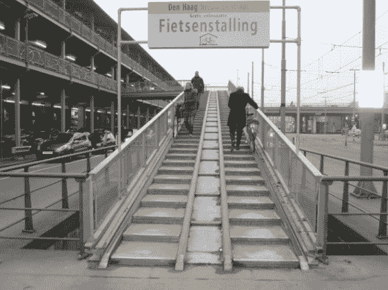
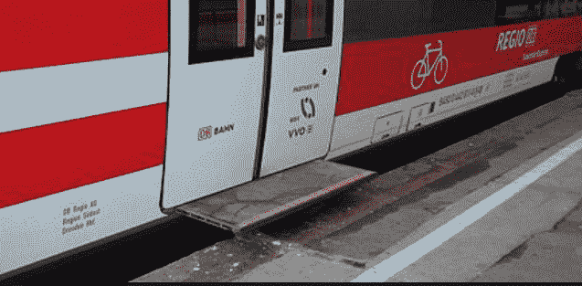
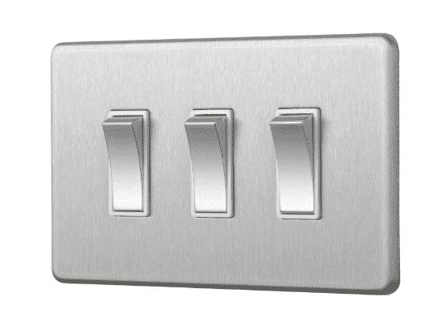
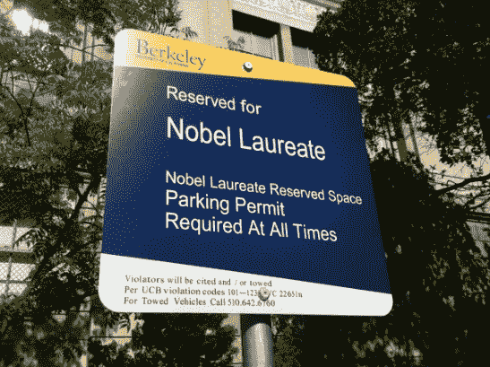
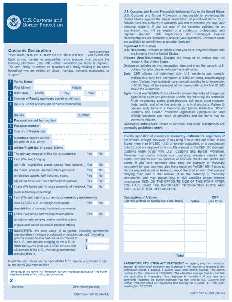
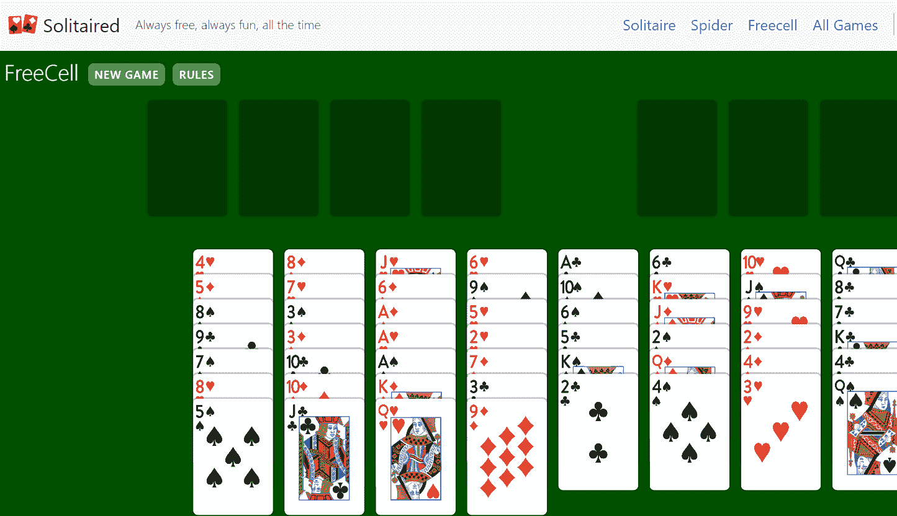
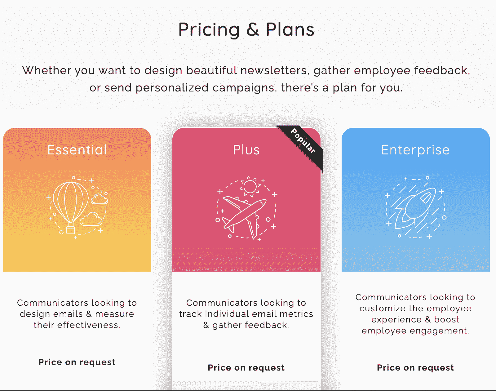

# 用简单的英语解释产品设计

> 原文：<https://www.freecodecamp.org/news/product-design-explained-in-plain-english/>

产品设计是你构思和制造产品时所经历的过程。

构建之路——硬件、软件甚至简单的原型——有不同的步骤和方法。

我在谷歌开发过产品，并为那些在网络开发和移动应用领域开发产品的公司提供建议。在我作为建筑工人的经历中，我犯过很多错误。我也做对了一些事情。

学习如何设计产品不仅对*建造者*有用。学会戴上“产品设计帽子”可以帮助有抱负的产品经理、工程师、销售专家和经理理解产品是如何制造的以及*为什么*。

产品设计专注于构建产品，帮助用户理解一个混乱、复杂、矛盾的世界。

通过产品发布、指导、观察和反复实验，我已经学会了产品设计的基本原则。希望你能避免一些我经历过的陷阱。

我想和你分享八个实用的步骤，希望这个框架能让你制造和设计更好的产品，并更快地将它们推向市场。

## 第一步:定义产品的远景

在设计的最初阶段，你应该关掉电脑。

放下你的铅笔。想想吧。

问问自己:“这个产品的目的是什么？”

你应该能够清楚地表达一个产品能做什么，谁会使用它，以及这个产品能解决什么问题。

不要沉溺于数字或研究。如果你非常清楚该产品将解决的问题，那么*很好*。如果你是问题空间的新手，想想为什么问题会存在。

定义一个产品的感觉，用户可能如何与它交互，以及为什么其他产品不能充分解决你今天发现的问题。

## 第二步:研究产品空间和市场

在第二阶段，你应该开始观察市场，确定谁在其中，以及*为什么*。

回答以下问题:谁制造类似的产品，这些产品如何使用，由谁使用，这些产品有什么影响？

这些现有产品是如何推向市场和销售的？

深思熟虑的研究始于最终用户。

有两种类型的产品:现有产品的增量改进和全新的发明。哪个是你的？

从客户开始逆向工作。尽管优秀的产品设计师可能会关注竞争对手，但伟大的研究人员会纠结于人们会如何使用产品本身。

## 第三步:获得反馈并产生更多想法

通过练习积极倾听来赢得用户未来的信任。

通过建立一个原型并获得真实的反馈来展示自己强大的判断力和良好的直觉。当得到最初的反馈时，一个强有力的产品设计师绝不会说“那不是我的工作。”

回答这些问题:你的产品如何让一个用户的生活变得更好？产品将如何构建，在什么时间框架内构建？谁会购买该产品？

要有外部意识。

从各个地方寻找新的想法。当得到反馈时，想想这个人到底在说什么。他们的话传达了什么？他们的行为(肢体语言或语调)暗示了什么？最重要的是，这些潜在用户*不*在交流什么？

获取和寻求不同的观点，并努力接受或否定反馈。

利用反馈来激发好奇心——你自己的和用户的——并将其转化为人们可以利用的东西。

产品设计就是永远不做。

## 第四步:构思

在构思阶段，坚持最高标准。

胸怀大志是一个自我实现的预言。通过环顾四周，产品设计师可以全面地思考产品将如何解决新的或不可预见的问题。

一个设计良好的产品为最终用户释放价值。不要忘记这一点。

如果一个设计决定是可逆的，可以很快做出，表现出对行动的偏好，并迅速构思。

接受有计划的冒险。

## 第五步:建设，不要放弃

在建造阶段，没有什么任务是不值得你去做的。以你所在领域的佼佼者为基准来衡量你的进步。

作为 Pennybox 的首席产品官，我花了两年时间指导公司完成筹资、开发和产品发布。

虽然我从执掌 Pennybox 的经历中学到了很多东西，但那段时间并非没有挑战——事后我意识到，其中一些挑战本来是可以避免的。

例如，Pennybox 在产品迭代之间浪费了太多时间。我经营公司的经历让我敏锐地意识到设计是艰难的。

如果你是一名建筑商，你永远无法完全避免挑战技术极限或创造新产品时不可避免的挫折。

建筑很难。继续自举。继续建设。

不要放弃。

## 第六步:获得认可并检查结果

设计师需要信念和脊梁。他们必须坚持不懈地追求设计和产品的卓越。

谷歌前高管维克·冈多特拉曾经讲述了一个他和乔布斯互动的故事。

冈多拉注意到史蒂夫打电话给他，说了以下的话:

> “维克，我们有一个紧急的问题，我需要马上解决。我已经从我的团队中指派了一个人来帮助你，我希望你明天能解决这个问题。我一直在看 iPhone 上的谷歌标志，我对这个图标不太满意。Google 中的第二个 O 没有合适的黄色渐变。这是错误的，我明天会让工作人员来修理它……”

这种对细节的狂热关注是史蒂夫·乔布斯作为传奇人物被铭记的众多原因之一。

您也可以在发布后测试和验证结果，以改进您的产品并获得更好的最终用户结果。没有一项任务是在设计师之下的，他连接并专注于每一个细节。

保持警惕。

少数用户的恭维并不意味着这个设计很棒。我父母喜欢 Pennybox。不幸的是，很少有其他父母这样做。

如果用户度量和轶事不同，产品设计师会问为什么。

## 第 7 步:设定关键绩效指标并衡量它们

你不能衡量你不能计算的东西。

知道你在乎它什么，衡量它。

对于网站来说，这可能意味着每月访客的数量或者用户在你的网站上停留的时间。

对于移动应用，这可能意味着下载量或活跃用户。

快速收集反馈。

通过测量和反馈，您可以进一步改进产品。

## 关于产品设计的结束语

这一过程将增加你的产品是相关的、经过深思熟虑的、能够帮助用户的可能性。但是你可以遵循这些步骤，仍然会迷路。

以下是我亲身经历的一些想法和概念的例子，让我思考好的和坏的设计原则。

用这些例子来全面思考你日常生活中使用的产品，以及你可能如何改变或改进它们。

### 案例研究#1:慕尼黑的自行车道

我过去住在慕尼黑。

骑自行车在德国城市很普遍。设计师们在楼梯附近修建了小型自行车道，让骑车人不用费力就能骑着自行车上下楼梯。

这是一个引人注目的设计，有利于用户。

### 案例研究#2:列车平台设计

在美国，国家残疾人管理局规定火车和站台之间的距离为 1.5 英寸。在欧洲并非如此。

在欧洲常见的近 4 英寸的差距对许多用户来说似乎是危险和困难的。

来自不同利益相关者的反馈——如孕妇、残疾人和骑自行车的人——可能会导致不同的设计标准。

伦敦发明“小心差距”是有原因的。

### 案例研究#3:无法识别的电灯开关

这是一张电灯开关的照片，和我厨房里的相似。哪个开关控制哪个灯？

哪个开关控制下水道的垃圾处理装置？这种设计经常会导致混乱，令人恼火(但可以理解)的是，我经常按错按钮。

### 案例研究#4:信息传递至关重要

有时候，好的设计和清晰的信息以及简单而有说服力的行动号召一样有效。这是一个很好的设计:一个有效且令人难忘的停车标志。

比较停车标志和美国海关和边境保护局的小册子。这张纸填写起来很麻烦，而且字体很小。

各部分在正面按顺序标注，但在背面不标注。这是一个不一致的设计。

许多长途飞行到美国的旅客(在美国需要这份表格)摘下眼镜或隐形眼镜。如果这个表格是数字的(在到达时完成)或者是用更大的字体做的不是很好吗？

### 案例研究#5:游戏设计

对于那些喜欢玩游戏的人来说，孤独是一个伟大设计的例子。这是我访问的唯一的游戏网站之一，可以立即开始玩游戏:没有弹出窗口，没有登录，没有干扰。

重点是用户与游戏的纯交互，他们简单的导航将相关玩家带到他们的其他流行游戏，如 Freecell 和 Spider。

### 案例研究#6:当设计发挥作用时

内部通信和电子邮件跟踪公司 Contact Monkey 使用优雅的设计来帮助客户查看定价示例。

Sample pricing plan for Contact Monkey

产品、行动号召和核心优势之间清晰的视觉描述是好的产品定价的例子。