# 如何使用 Express、Postgres、PM2 和 nginx 在 AWS 上将 React 应用程序部署到生产环境中

> 原文：<https://www.freecodecamp.org/news/production-fullstack-react-express/>

在本教程中，我将带您从头开始完成一个相当复杂的生产级 AWS 部署设置。我会假设你对 AWS 的了解很少，并且假设你是一个初学者。

我们将设置一个带有 PSQL 数据库的 React Express 全栈应用程序。我们将把应用程序部署到运行 Amazon Linux AMI 2 的 AWS EC2 实例上。该设置将使用 NGINX 作为反向代理，PM2 作为集群管理器。PSQL 数据库将被部署到 AWS RDS。

我们将留在免费层，所以跟随本教程将不会花费你任何东西。

**为什么要学 AWS？**
AWS 是目前最大的云计算平台。Wordpress 支持更多的小型网站，但是 AWS 被大多数高流量的商业网站所使用。这意味着具有 AWS 技能的人需求量很大。

你可以在这里观看这个教程的视频版本
[https://www.youtube.com/playlist?list = plmc 67 chet-yzxrbobcfhza 4 sboxnr 7 HD D5](https://www.youtube.com/playlist?list=PLMc67XEAt-yzxRboCFHza4SBOxNr7hDD5)

**有用的终端命令:**
[【https://github.com/iqbal125/terminal_commands_fullstack】](https://github.com/iqbal125/terminal_commands_fullstack)

**样品反应/表达项目:**【https://github.com/iqbal125/react-express-sample】

## 理论

*   **网络如何在 AWS 云计算中工作**
*   **AWS EC2 实例**
*   **公有与私有 IP 地址**
*   **IPv4 地址**
*   **从专用网络连接到公共互联网**
*   **AWS VPC 概念概述**
*   **AWS 中子网划分的工作原理**
*   **宋承宪**

## 实践

*   **简单的 EBS 部署**
*   **设置 VPC 和子网**
*   **互联网网关和路由表**
*   **安全组设置**
*   **使用 AWS EC2 启动云计算机**
*   **在 AWS 上设置数据库**
*   **为生产设置 React 构建**
*   **PM2 设置**
*   **Nginx setup**

## 理论

云计算极大地简化了 web 应用的部署。像 Digital Ocean 和 Heroku 这样的网站隐藏了所有的复杂性，让你只需几个简单的步骤就可以部署你的应用程序。

这些工具很好，但我们想要的是一个健壮、高度安全和高性能的云计算设置，这意味着我们将从头开始。

AWS 设置将主要涉及网络，这就是为什么本教程的大部分内容将侧重于网络概念和设置。

在 AWS 上，其他所有事情(如提供数据库和 Ec2 实例)都很容易完成，网络将是最大的挑战。

但是如果你没有任何网络经验也不用担心。我会给你所有你需要知道的信息。

### 网络如何在云计算中工作

它的工作方式基本上与网络和硬件的工作方式相同，只是所有硬件(路由器、交换机、互联网网关)都在云计算中虚拟化了。

云计算中的网络本质上决定了你的虚拟资源如何相互通信以及如何与更广泛的互联网通信。

VPC、IP 地址和子网是 AWS 中需要理解的最重要的概念。

这基本上是我们将要建立的。

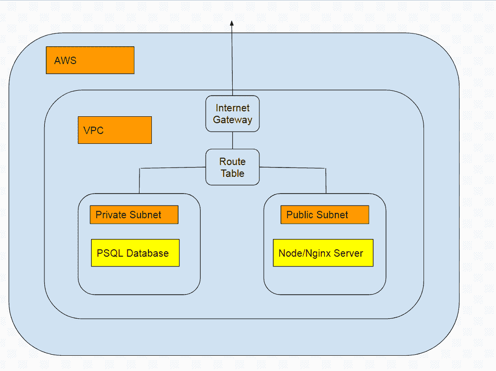

我们的 VPC 将有一个公共子网和一个私有子网。公共子网将包含我们的网络服务器，并可通过互联网访问。我们的私有子网将包含我们的数据库，但不能通过互联网访问。

我们的 web 服务器和数据库将能够通过路由表相互通信。

当我们在 AWS 控制台上设置我们的项目时，我们将看到这两个例子。

### 公共与私有 ip 地址

公共 IP 地址是您的计算机在更广阔的互联网中的位置。然而，我们所说的互联网只是众多网络中的一个。

同样，您可以在互联网上拥有一个 IP 地址，也可以在另一个不是互联网的网络中拥有一个 IP 地址。

IP 地址只是一种识别网络中单台计算机的方法。不管这个网络是不是互联网。

因此，私有 IP 地址只是我们在自己的网络上识别计算机的一种方式，而公共 IP 地址是我们在“互联网”网络上识别计算机的一种方式。

### IPv4

IPv4 是写入 IP 地址的格式。

IPv4 地址示例:10.12.15.22

称为 IPv4，因为有 4 个字节可以代表地址。每个字节包含 8 位，因此被称为**八位字节**。

由于每个二进制八位数包含 8 个比特，每个比特可以是 0 或 1，因此有 2 个^ 8 = 256 种不同的组合。但是我们从 0 开始，所以一个二进制八位数可以是 0-255 之间的数字。因为我们有 4 个二进制八位数，我们有 256 个^ 4 = 43 亿不同的组合，因此 IP 地址！

IPv4 地址通过 DNS 解析为人类可读的格式:“[https://google.com](https://google.com)”。

还有 IPv6，但为了简洁起见，我们将跳过这一步，我们只需要了解 IPv4 就可以了。

关于 IPv6 的更多信息可以在这里找到:
[https://search networking . techtarget . com/definition/IPv6-Internet-Protocol-Version-6](https://searchnetworking.techtarget.com/definition/IPv6-Internet-Protocol-Version-6)

### 从专用网络连接到公共网络

通过互联网网关完成

当专用网络中的计算机发出请求时，路由表会检查该请求的目的地是否是本地计算机。

如果不是，则请求被转发到因特网网关，因特网网关将请求转发出专用网络，并转发到因特网服务提供商，然后请求被发送到预期目的地。

互联网网关也接收来自互联网的请求。

互联网网关有自己的公共 ip 地址，所以一个网络可以有 1 个公共 ip 地址，即使它有 1000 个私有 IP 地址。

用于发送和接收数据的协议称为 TCP。这是确保数据完整性和可靠性的模式和蓝图。

### VPC 和子网划分

VPC 和子网划分是 AWS 中迄今为止最难理解和掌握的东西，这就是为什么我将用较长的一节来介绍它。

**虚拟私有云**。可以部署 AWS 资源的虚拟位置。您可以将 web 服务器、数据库、文件服务器和消息服务部署到一个 VPC 中，并将所有资源包含在一个虚拟位置中。

每个资源都有自己的私有 IP 地址。

一个**子网**是子网络或整个 VPC 的一小部分的简称。出于性能和安全原因，子网划分本质上是划分 VPC 的一种方式。

**示例:**在互联网无法访问的子网中部署数据库。而拥有 web 服务器的另一个子网需要可以通过互联网访问。尽管这两个子网是独立的，但它们仍然属于同一个 VPC。

AWS 中的子网划分是用 CIDR 符号完成的。

****示例子网 CIDR 符号:**** 10.11.12.0/24

**子网掩码**
子网掩码决定了子网可用的 ip 地址数量。/24 是子网掩码。

子网掩码用于将您的子网划分为大约数量的 IP 地址

**网络前缀**:标识唯一子网或 VPC 的不变起始八位字节。

**主机地址**:可用于子网中不同资源的 IP 地址。

/24 表示前 24 位将用作网络前缀，因此不可用。因为 IPv4 总共有 32 位，所以还剩 8 位是主机地址。这些是可用的 IP 地址。由于 8 位有 256 种组合，我们的子网可以有 10.11.12.0 和 10.11.12.255 之间的任何地址

1 代表网络前缀，0 代表主机地址

/24 = 255.255.255.0 = 11111111.11111111.11111111.00000000

**相同:**

10.11.12.0/24

10.11.12.0/255.255.255.0

10.11.12.0/11111111.11111111.11111111.00000000

子网也不必平均分成八位字节。

10.11.12.0 /19 表示子网掩码为 111111111111 . 11100000 . 000000

如果我们使用子网计算器，我们可以看到它是如何工作的。子网计算器给你一个子网中可用的 IP 地址的数量。它也给你最小和最大的 IP 地址。

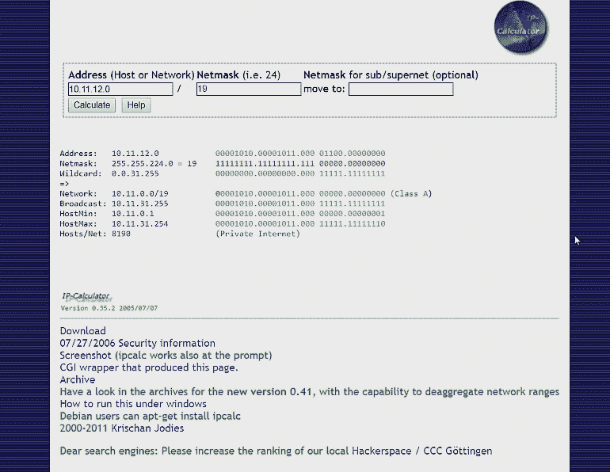

如您所见，该子网总共为我们提供了 8190 个可用的 ip 地址。

前两个二进制八位数都是 1，因此这两个二进制八位数都用作网络前缀，它们可以是 0-255 之间的任何数字。

但是我们的第三个二进制八位数只有部分网络前缀，我们只有 5 位用作我们的主机地址。这意味着第二个二进制八位数只能是 0-31 之间的数字，因为 2 ^ 5 = 32。

我们的最后一个二进制八位数都是 0，所以通常它可以是 0-255 之间的任何数字。

总之，这意味着我们的子网可以是以下地址之间的任何地址

10.11.0.0 - 10.11.31.255

* *注:第一个和最后一个 IP 地址用作网络和广播地址，它们是具有特殊功能的特殊 IP 地址。这就是为什么主机最小是第二个 IP 地址，主机最大是倒数第二个 IP 地址。

您可以在此了解有关网络和广播地址的更多信息:

[https://www . computernetworkingnotes . com/ccna-study-guide/network-address-basic-concepts-explained-with-examples . html](https://www.computernetworkingnotes.com/ccna-study-guide/network-address-basic-concepts-explained-with-examples.html)

为了避免上述所有的复杂性，最好坚持使用子网掩码/8 /16 /24。这样做将确保没有部分二进制八位数。

10.11.12.0/8 将最后 3 个二进制八位数全部用作 IP 地址

10.11.12.0/16 将最后 2 个二进制八位数全部用作 IP 地址

10.11.12.0/24 将最后 1 个二进制八位数全部用作 IP 地址

真实例子
**VPC:** 10.11.0.0/16

**公共子网 1:** 10.11.1.0/24，10.11.1.0 和 10.11.1.255 之间的任意 IP 地址
公共子网 2: 10.11.2.0/24，10.11.2.0 和 10.11.2.255 之间的任意 IP 地址

**私有子网 1:** 10.11.3.0/24，10.11.3.0 和 10.11.3.255 之间的任意 IP 地址**私有子网 2:** 10.11.4.0/24，10.11.4.0 和 10.11.4.255 之间的任意 IP 地址

* *注意:并非每个 IP 地址都可用于您的子网。AWS 将保留一些地址，如网络和广播地址，以及更多的实用程序地址。

### AWS EC2

就是云计算中的“计算”。本质上是一台虚拟计算机。拥有你家里电脑的所有功能:CPU、RAM、硬盘等。

这将是我们的网络服务器，我们将使用 Amazon Linux AMI 2 作为操作系统。

还有其他可用的 Linux 操作系统，如 Ubuntu 和 Red Hat。

也有基于 Windows 的操作系统可用，如 Windows Server。如果您不想使用命令行，Windows 系统允许您使用图形用户界面。

一台 Ec2 计算机被称为一个实例。

### 嘘

**安全外壳:**用于从我们的家庭计算机登录到我们的 Linux EC2 服务器。

如果您喜欢图形用户界面，可以使用 Putty for SSH。

我将使用 Git Bash。它使用起来更简单，但是没有图形用户界面。

我们将使用私有和公共密钥进行 SSH。这两个密钥都是由 AWS 生成的。

私钥将存储在您自己的计算机上，并将在登录过程中使用。

公钥将存储在亚马逊上，并允许登录。公钥不需要保密。私钥应该保存在你电脑上的一个安全的地方，如果你不小心删除了它，你会很倒霉，因为没有办法再得到一个。

## 实践

**简单的 EBS 部署**

在进行复杂的部署之前，我们可以先做一个简单的 EBS 部署来熟悉一下环境。

AWS Elastic Beanstalk 是一种将应用程序发布到云的方式，无需首先手动设置底层资源，如 VPC、web 服务器和数据库。在 AWS ELB 上获得一个运行的应用程序是非常容易和快速的，也是熟悉 AWS 的一个好方法。

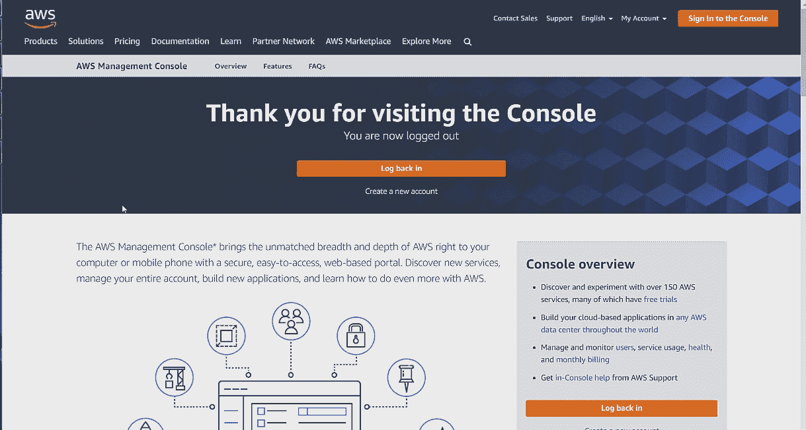

如果您还没有帐户，请访问 AWS 主页并创建一个新帐户。

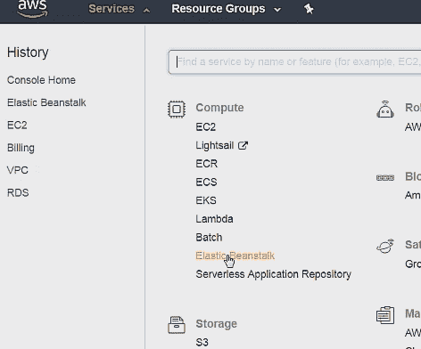

然后进入服务，然后进入计算下的 ElasticBeanStalk。

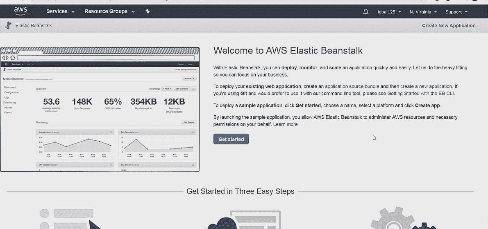

这将带您进入 EBS 主页。之后，继续点击创建新的应用程序，然后给它一个名称和描述。

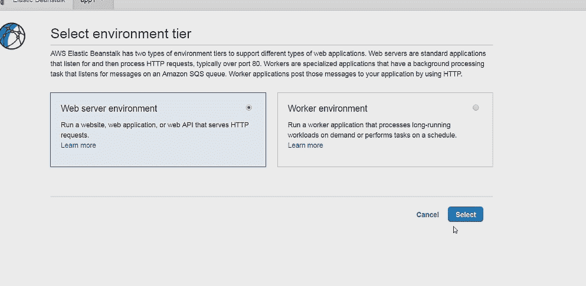

然后，您可以单击创建新环境，然后选择 Web 服务器环境。

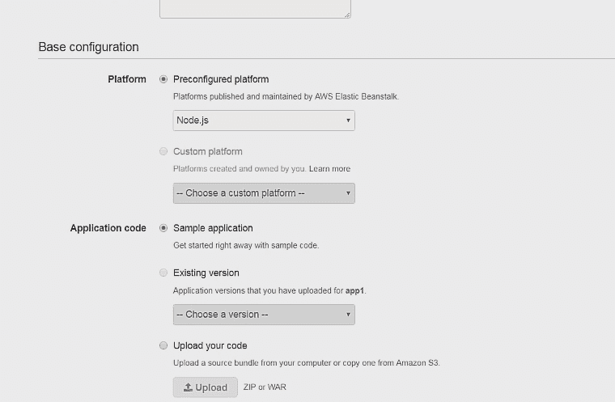

在这个页面上，选择 Node.js 作为平台，并使用示例应用程序代码，其他一切都可以保持默认。

我还没有从这里直接部署应用程序的运气，所以让我们点击配置更多的选项来设置项目更多。

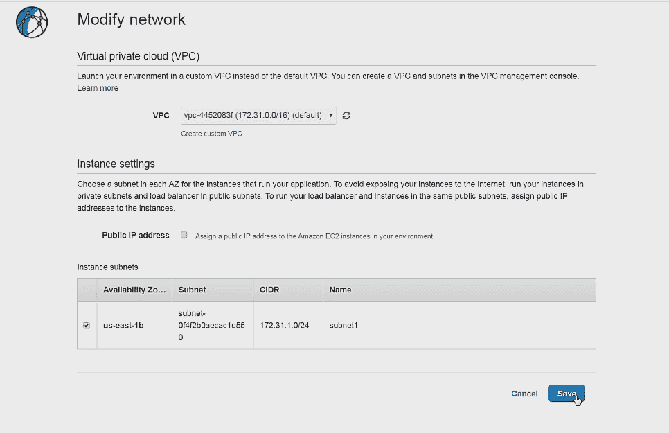

单击页面底部的网卡，并确保默认 VCP 与默认子网一起被选中。

然后单击实例卡，确保选中默认安全组框。

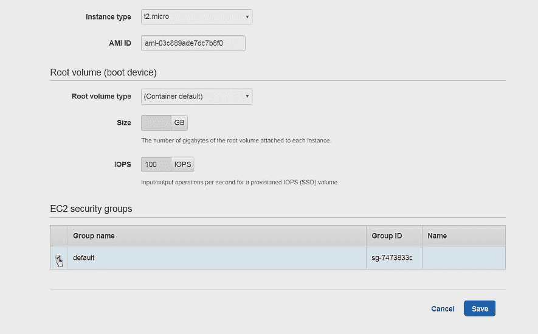

就这样，我们现在可以单击“创建环境”来启动我们的应用程序。

如果成功了，你应该会在屏幕上看到成功启动的环境。

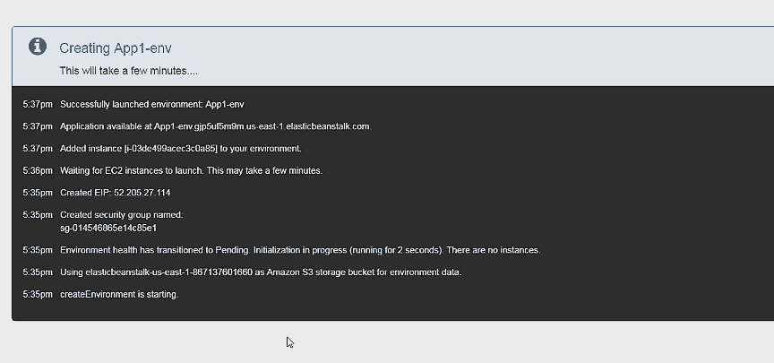

如果你点击网址，你可以看到你部署的应用程序

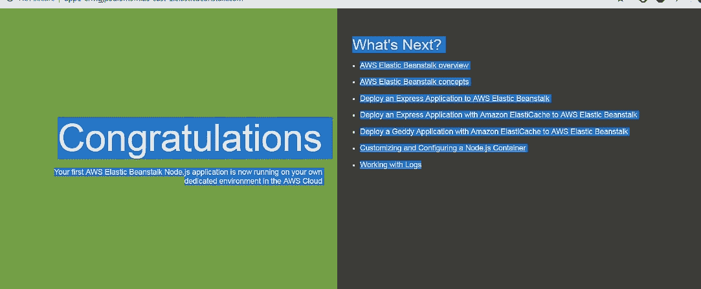

恭喜你将应用程序部署到 AWS 云！

* *重要提示:确保清理干净，以免因使用 AWS 而被收费。

要进行清理，只需单击操作下的终止环境，这将删除应用程序以及所有底层资源。

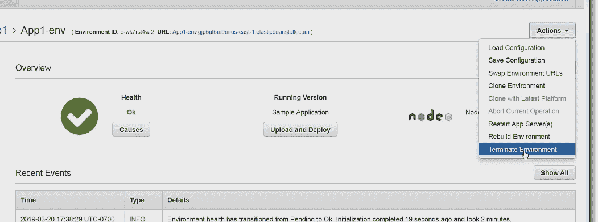

我们现在可以检查复杂的设置。

### VPC 设置

首先，我们可以转到 VPC 仪表板，它位于网络和内容交付部分。

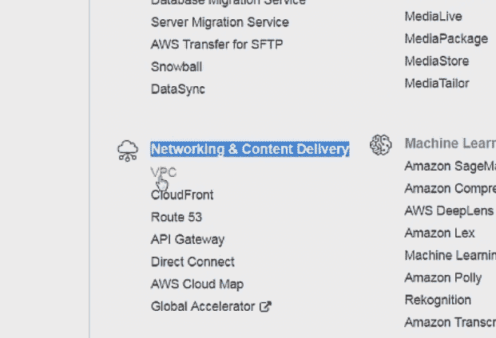

那么你现在应该在 VPC 仪表板上。您可以使用“启动 VPC 向导”按钮创建一个 VPC，这要简单一点，但我将展示如何从头开始设置它，这要困难一点，但会让您更好地理解 VPC 是如何工作的。

首先单击 VPCs 选项卡，然后单击“创建 VPC”按钮，这将带您进入如下所示的页面。

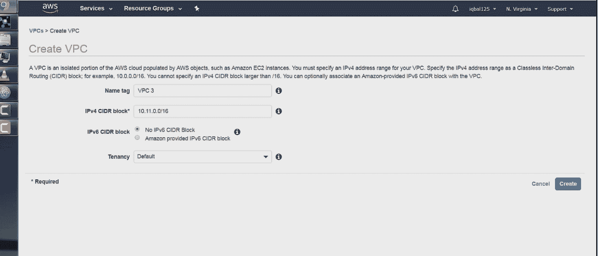

我们可以把 VPC 命名为 VPC 3 号

我们可以将 CIDR 区块设置为 10.11.0.0/16。如果您还记得 VPC 和子网理论部分，这意味着前 2 个二进制八位数是网络前缀，后 2 个二进制八位数是主机地址，可供我们使用。

租用是指 VPC 是否将在自己的专用硬件上运行。有一种观点认为专用租赁更安全或性能更好，但没有任何数据表明这一点。

默认租赁意味着您的 VPC 将与其他 AWS 用户共享底层硬件，但将通过软件与他们隔离。

之后，我们可以点击创建 VPC，这将完成我们的 VPC 设置。

### 子网设置

接下来，我们将设置子网。我们可以从单击子网选项卡开始，然后单击创建子网。

我们将首先像这样创建我们的公共子网

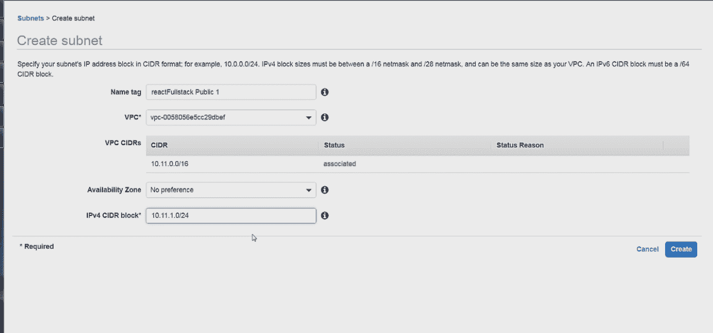

需要注意的主要内容是 IPv4 CIDR 地址块，即 10.11.1.0/24。

10.11 是我们不变的网络前缀，来自我们的 VPC。这使得. 1 也成为网络前缀的一部分，因为子网掩码是/24，而. 1 也是该子网的标识符。

最后一个二进制八位数用作主机地址，这意味着该子网可以有 10.11.1.0 - 10.11.1.255 之间的任何地址。

之后，我们可以单击“create ”,这将创建子网并将其列在子网下。

现在对于我们的私有子网

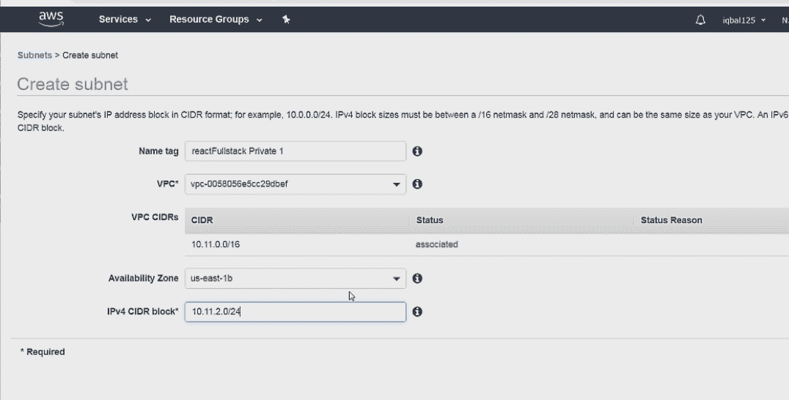

它的设置方式与公共子网相似，主要区别在于它的第三个二进制八位数是. 2，而不是. 1。此外，我们必须指定一个可用性区域，以使该子网与我们的数据库一起工作。

所以基本上 10.11 是我们从 VPC 得到的网络前缀。. 2 是第三个二进制八位数，是该子网的唯一标识符，最后一个二进制八位数是 0-255 之间的可用 IP 地址。

这意味着该子网可以拥有 10.11.2.0 - 10.11.2.255 范围内的任何 IP 地址。

如果您将其与我们的公共子网(IP 地址范围为 10.11.1.0 -10.11.1.255)进行比较，那么设置子网的模式应该更加清晰。

将数据库部署到 AWS 需要不同可用性区域中的两个子网，因此您可以像这样设置第二个子网。

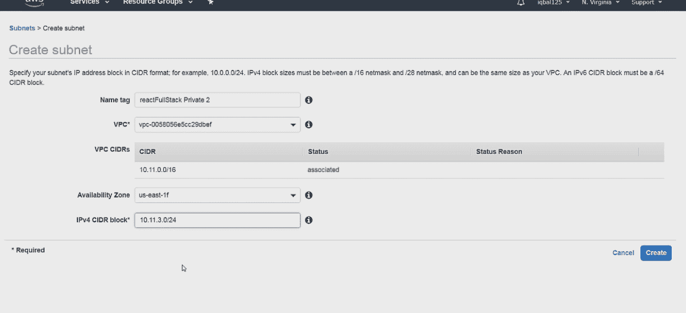

### 互联网网关和路由表

**路由表**本质上是路由器，决定流量如何定向以及定向到哪里。

现在，我们可以创建一个 internet 网关，并将其连接到我们的公共子网。

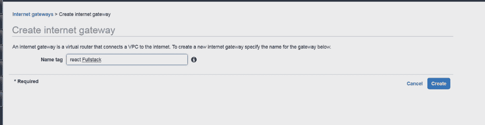

由于所有的互联网网关都以相同的方式运行，我们只需要设置名称。在将此互联网网关连接到我们的子网之前，我们首先必须设置路由表。

我们可以转到路由表选项卡，然后单击创建路由表

我们只需设置名称，并将其与 VPC 相关联。我们可以把它与 VPC 3 和点击创建联系起来。

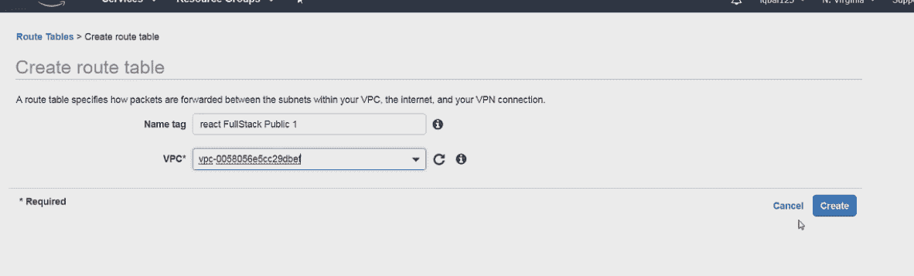

完成后，我们现在可以将我们的互联网网关连接到这个 VPC。让我们返回“internet gateway”选项卡，单击“actions”按钮，然后单击“attach to VPC”。

对于附加选项，只需选择 VPC 3。

接下来，我们可以回到我们设置的路由表，添加一条路由。我们可以像这样添加路线。

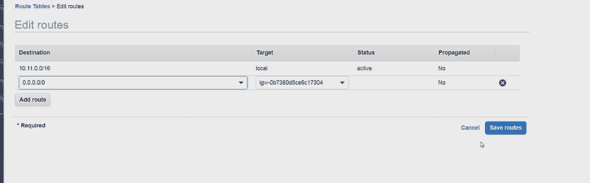

也就是说，如果发出请求，路由表首先检查该路由是否是本地 10.11.0.0/16 路由，如果不是，则我们将该请求转发到互联网网关，转发到由 0.0.0.0/0 表示的所有其他路由。

然后，我们可以单击子网关联选项卡，然后单击编辑子网关联按钮。

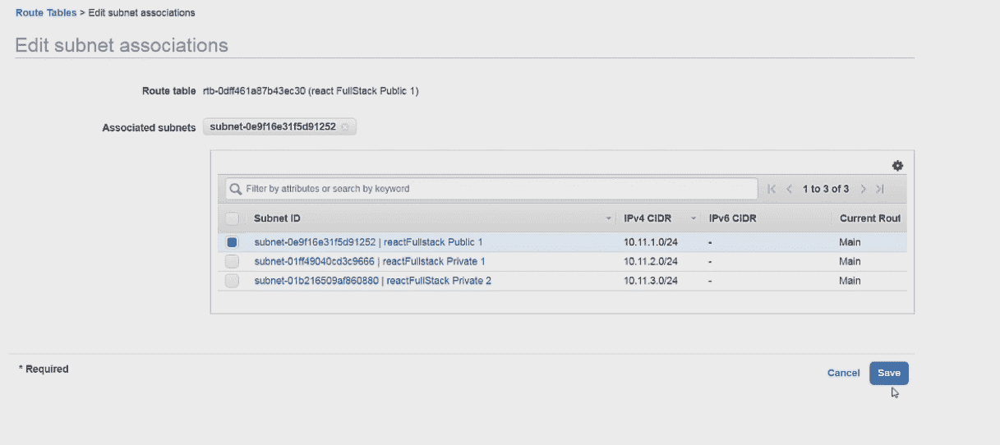

我们只需要与该路由表相关联的公共子网，因此我们只需检查那个子网，然后单击“save”。

我们不能忘记我们的私有子网。只需创建另一个路由表，并使用与公共子网相同的方式将私有子网与它们关联起来。不添加互联网网关，只保留本地目标的路由表。

### 安全组

**安全组**本质上是过滤进出流量的防火墙。

我们现在需要设置安全组来使用这个设置。单击安全组选项卡，然后单击创建安全组。

创建安全组非常简单，我们只需设置名称和描述，然后将其与我们的 VPC 3 相关联。

创建安全组后，单击编辑入站规则。

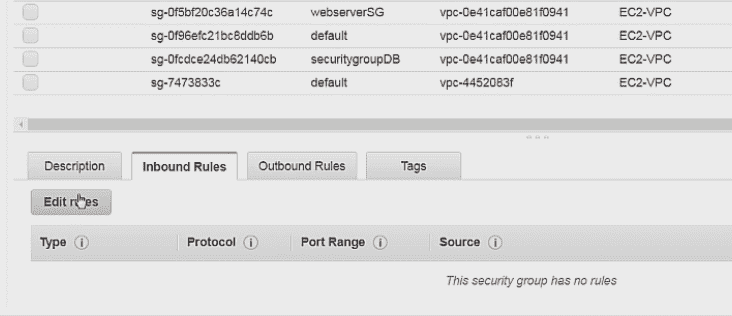

接下来，我们可以像这样设置安全规则

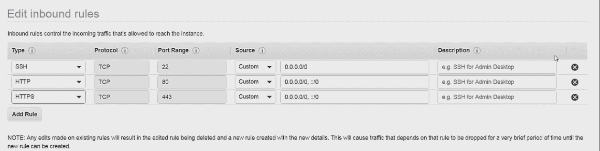

首先我们有 SSH，我们如何从我们的家庭计算机登录到我们的 Ec2 实例。我将源代码设为 0.0.0.0/0，因为我不想输入我的个人 ip 地址，但是在一个真实的应用程序中，你会希望在这里输入你自己的 IP 地址。

之后，我们有正常的端口 80 和端口 443，允许正常的流量通过互联网。::/0 允许所有 IPv6 流量和 IPv4 流量。

### 启动 EC2 实例云计算机

首先，让我们转到 ec2 仪表板，并单击启动实例。然后我们可以选择亚马逊 Linux AMI 作为操作系统。

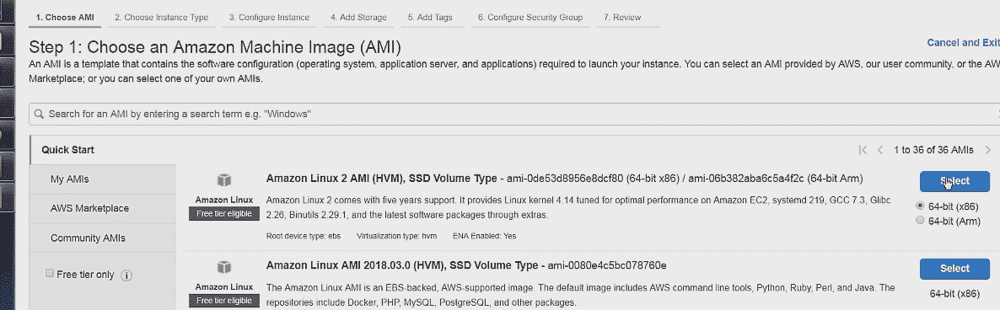

然后，要停留在自由层，请选择 t.2 微选项作为实例类型。

然后，在第 3 步中，我们必须配置实例详细信息，我们可以这样做。

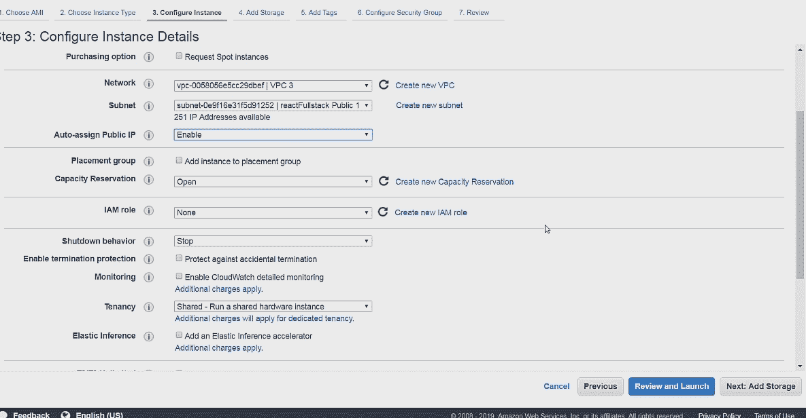

对于网络，我们可以选择 VPC 3，对于子网，我们可以选择公共子网。因为这是我们的网络服务器，我们希望它在我们的公共子网连接到一个互联网网关。

添加标签和添加存储可以保留默认设置。

为了安全起见，请确保添加我们在上一节中设置的 web 服务器安全组。

然后在最后一步，我们只需点击“launch”。

这将提示一个弹出窗口为我们提供一个密钥对。我们可以提前选择创建新的密钥对，然后下载密钥对。

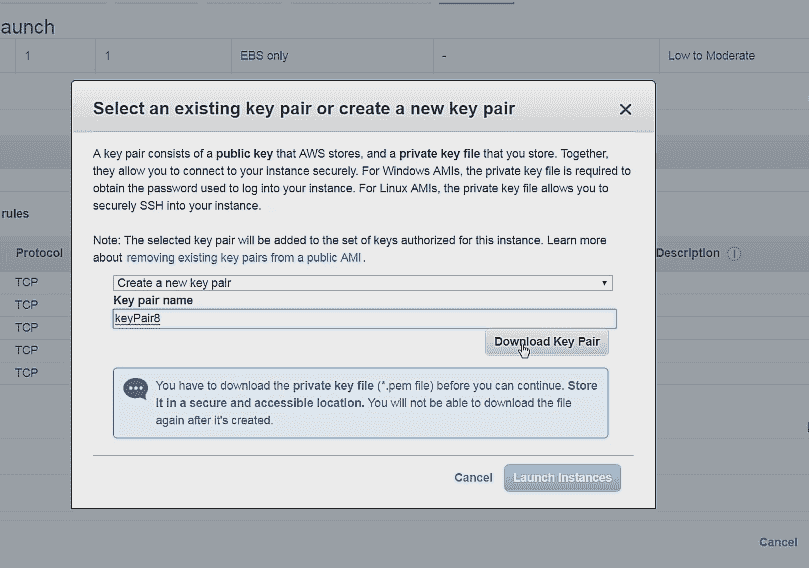

如果操作正确，您应该会在屏幕上看到这个。

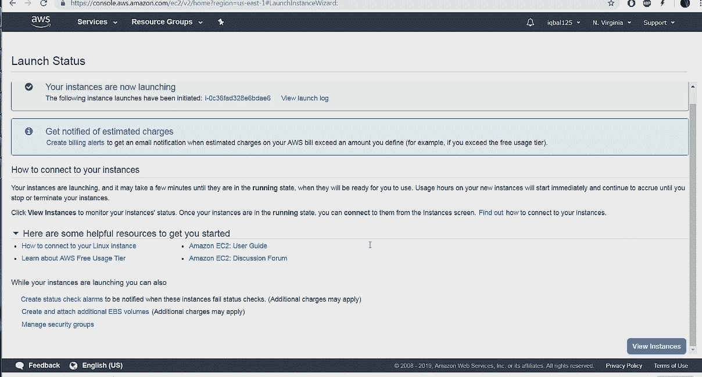

在这之后，我们的实例就启动了，我们可以通过 ssh 进入。我们可以使用以下命令 ssh 到我们的实例中:

`ssh i- “keypair.pem” ec2-user@public-ip-address`

### 数据库设置

现在让我们设置数据库。我们可以从服务下数据库部分的 RDS 选项卡开始。这将把我们带到 RDS 数据库仪表板。

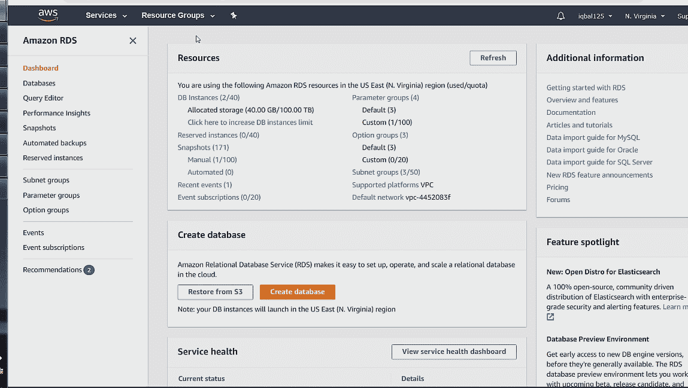

但是在创建数据库之前，我们必须先创建一个子网组。首先，我们可以转到 subnet groups 选项卡，然后单击 create db subnet group。

db 子网组可以防止任何类型的完全服务器故障或意外删除，这就是它扩展 2 个可用性区域的原因。虽然服务器在一个可用性区域完全失败的可能性很小，但您的数据库仍然会很好。两台服务器同时在两个不同的可用性区域完全失败的可能性极小。

我们首先设置名称和描述。然后，我们将 VPC 3 与子网组相关联。之后，我们可以添加子网。

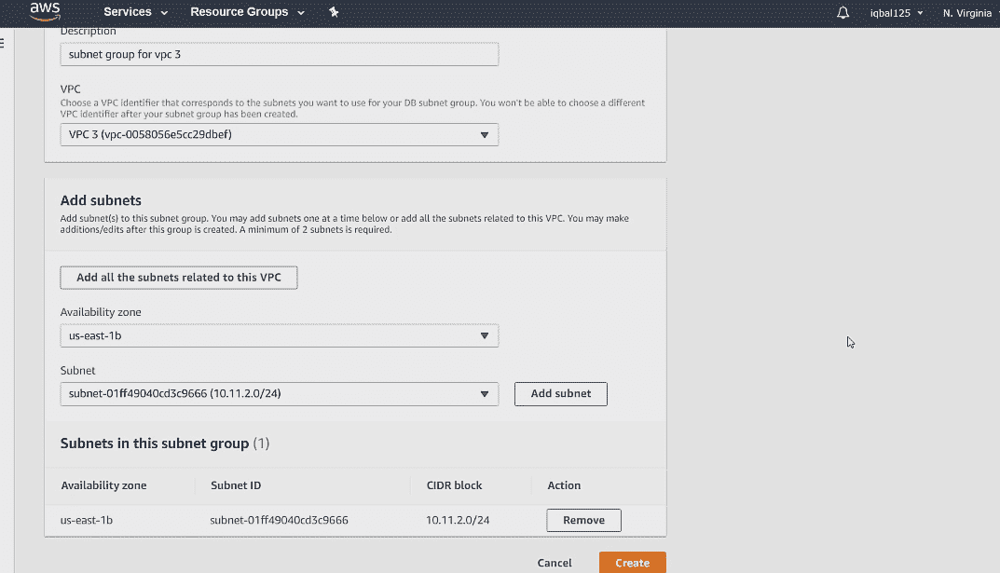

子网将列在我们在上一节中设置的可用性区域下。然后我们可以点击创建。

创建子网组后，我们就可以创建实际的数据库了。

我们可以首先在底部选择符合条件的自由层。

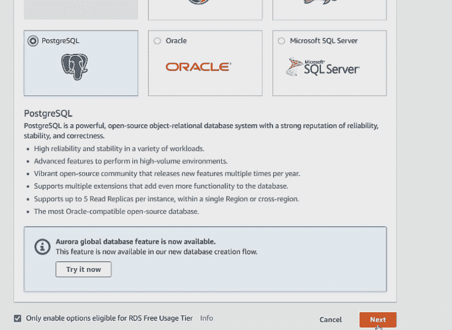

然后，我们可以单击下一步。我们可以将下一页的其他内容保留为默认设置。请务必记住您在此设置的用户名和密码。

在下一页，我们可以将 VPC 设置为我们的 VPC 3，将子网组设置为我们刚刚设置的那个。

确保也让公众访问不。出于明显的安全原因，我们不希望我们的应用程序在互联网上可用。

其他一切都可以默认。我们将马上设置我们的数据库安全组。

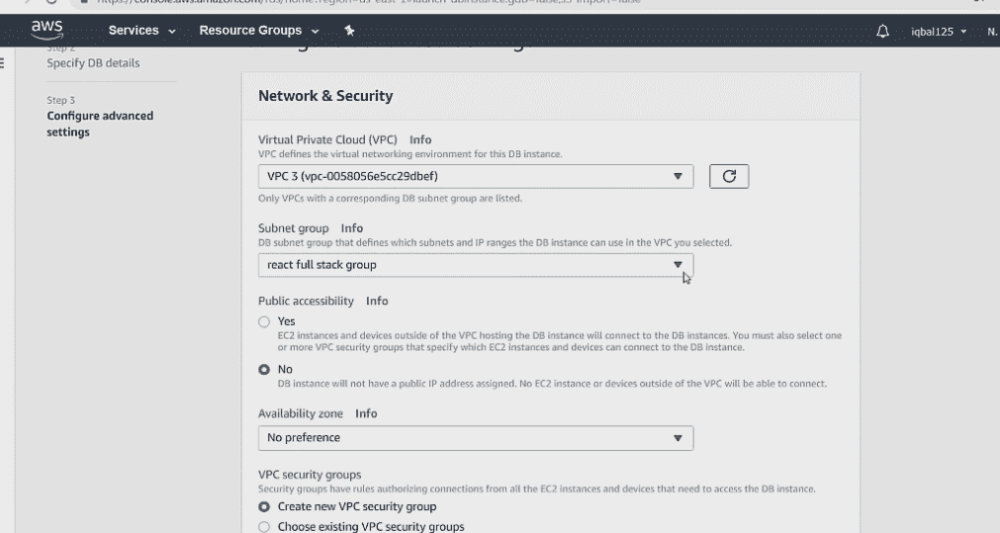

现在，我们可以单击 create database，在创建数据库的同时创建数据库安全组。

我们可以转到 VPC 控制面板中的“security groups”选项卡，像前面看到的那样创建一个新的安全组。对于入站规则，我们可以将其限制在 web 服务器的 CIDR 范围内。端口设置为 PSQL 的默认端口 5432。


单击 create，我们就可以将它添加到我们的数据库中了。

要添加这个新的安全组，我们可以从 database dashboard 转到数据库。然后单击修改按钮。

之后，我们可以选择刚刚在“网络和安全”部分设置的安全组。

你现在可能会有一个问题，如果我们的数据库不能通过互联网公开访问，你如何连接到我们的数据库。

我们这样做的方法是，首先 ssh 到我们的 linux 实例，然后通过路由表中设置的 PSQL TCP 端口从该实例连接到我们的数据库。

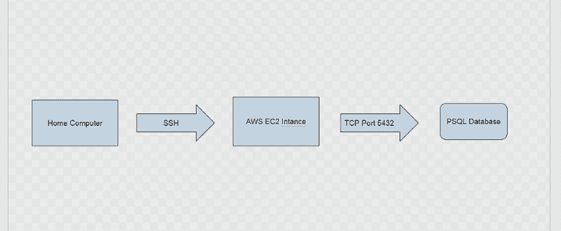

为了测试这一点，我们可以按照上面看到的相同方式 ssh 到我们的 ec2 实例中。然后我们可以用命令安装 psql。

`sudo amazon-linux-extras install postgresql9.6`

之后，我们可以用下面的命令连接到 psql 数据库。

`psql -d name-of-db -h host-name -p port -U username`

如果连接成功，您将看到数据库名称后面跟着一个箭头。


### React 和节点项目设置

在这里，我将使用 React 和 node/express 查看一个示例设置。要做的第一件事是运行`npm run build`命令，它将在一个名为 **build 的目录中输出应用程序的生产版本。**

* *注意:确保您的内部版本中的所有本地主机路由都更改为公共 IP。对于身份验证来说，这可能是真的。其他一切都可以保持原样。

将整个构建目录剪切并粘贴到 node/express 服务器中。然后如下所示设置一个路径。

```
....
//express server

app.use(express.static(path.join(__dirname, 'build')));

if(process.env.NODE_ENV === 'production') {
  app.get('/*', function (req, res) {
   	res.sendFile(path.join(__dirname, 'build', 'index.html'));
  });
}

....
```

第一个功能是我们如何提供来自 React 应用程序的静态文件(JS、CSS PWA 文件)。

第二个函数首先检查环境是否是生产环境，然后提供主要的 React HTML 文件。

这种方法使我们的客户端路由保持不变。例如，在我们的开发构建中，我们可以只使用诸如/post/22 这样的路由，它将被正确地路由到 http://localhost:3000/post/22。

但是因为我们的 React 应用程序现在是由 express 服务器提供服务的，所以 route /post/22 将指向 http://publicip/build/post/22。为了不重写整个路由，我们使用 path.join()和上面的代码来解决这个问题。

之后，只需将 React Express 项目部署到 Github repo。

就这样，接下来我们可以将 React Express 应用程序部署到 Linux 服务器上。

### 将项目部署到 AWS EC2 实例。

现在我们准备部署我们的项目。首先用 Gitbash 使用下面的命令 SSH 到您的 EC2 实例。

`ssh i- “keypair.pem” ec2-user@public-ip-address`

我们要做的下一件事是实际安装 git，使用命令:

`sudo yum install git`

然后我们可以用命令将项目克隆到服务器中

`sudo git clone link-to-repo`

这样做之后，你应该可以通过将 cd 放入目录中来查看你的项目文件。

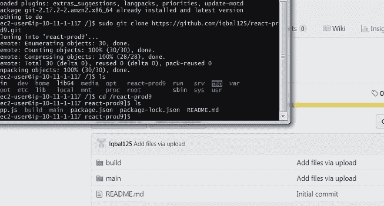

我们还没有完成，我们仍然需要安装 node 和 npm，因为我们需要安装项目的依赖项。我们必须首先安装节点版本管理器，这将允许我们安装节点和 npm。我们可以这样安装 nvm。

`sudo curl https://raw.githubusercontent.com/creationix/nvm/v0.34.0/install.sh | bash`

这将安装 nvm，然后我们可以使用它来安装节点和 npm。为此，只需列出可供下载的 node 版本并安装最新的稳定版本。

列出节点命令
的版本`nvm ls remote`

安装命令
`nvm install version-of-node`

但是在安装 npm 和节点之后，如果您在项目目录上运行 npm install，您将会得到一个权限被拒绝的错误。

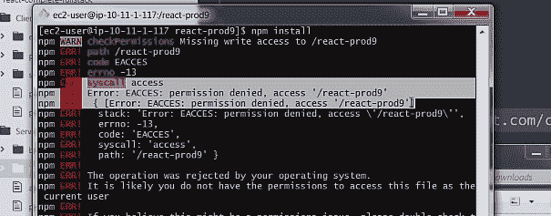

然后，您可以运行下面的命令来授予对该目录的写权限。下面的命令给出的不仅仅是写权限，但是配置 Linux 权限远远超出了本教程的范围。

`sudo chmod 777`上目录

如果你想了解更多关于 chmod 的知识，这里有一个教程的链接。
[https://www.computerhope.com/unix/uchmod.htm](https://www.computerhope.com/unix/uchmod.htm)

之后，您的 npm 模块应该可以使用常规的 npm install 命令正常安装。

然后，您只需使用 npm start 命令运行您的应用程序，该命令将启动您的节点服务器，并将您的 React 项目作为静态文件提供。

但问题是，该项目只能在非传统端口上运行，如 5000 或 3000，或者您在 localhost 上运行的任何端口。如果您试图采取简单的方法，仅仅将服务器上的端口改为端口 80，您将得到一个权限被拒绝的错误。

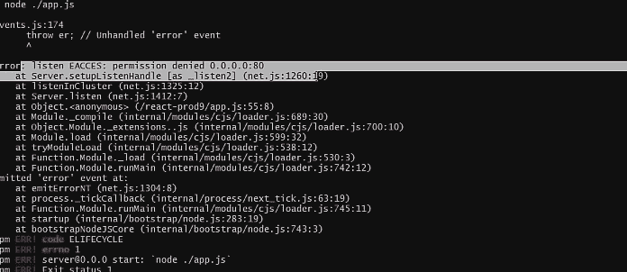

为了解决这个问题，我们将使用 nginx。

### nginx

你可能想知道，如果我们已经有了 node，为什么还要使用 ngnix。使用 nginx 作为 http 服务器是可能的，但是我们将使用 nginx 作为反向代理，这将保持 node 作为实际的 http 服务器。

设置如下所示。

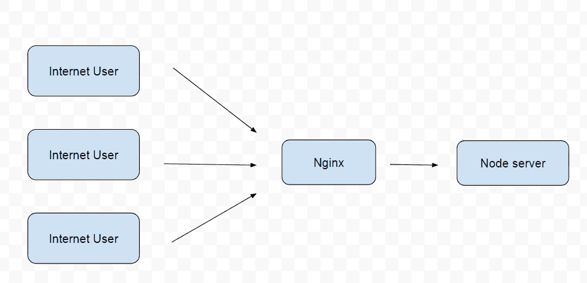

这样做的好处是:

*   nginx 充当应用程序级负载平衡器
*   帮助节点提高性能和可靠性
*   提高安全性
*   防止 DoS 攻击

这张图显示了常规代理与反向代理的对比。

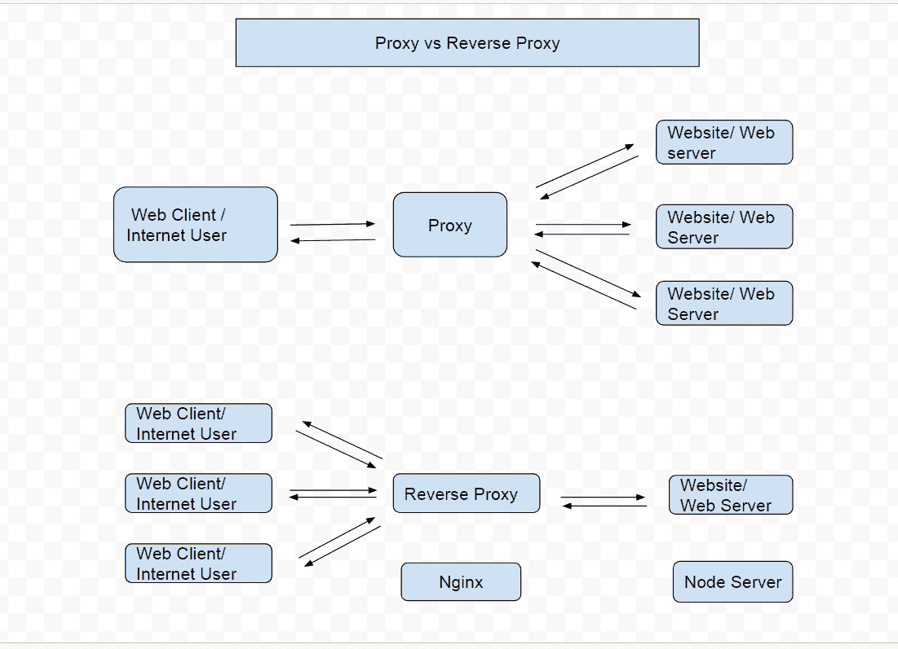

在常规代理中，web 客户端可以从多个 web 服务器发送和接收数据。在反向代理中，单个 web 服务器可以从多个 web 客户端发送和接收数据。

现在让我们转到我们的 Ec2 实例，并 ssh 到它。

我们需要做的第一件事就是安装 nginx。Amazon Linux AMI 2 已经带有 nginx，所以你可以像这样安装它

`sudo amazon-linux-extras install nginx1.12`

然后我们可以用 cd 进入 nginx 目录

`cd /etc/nginx`

然后我们可以用命令编辑 nginx 配置文件

`sudo nano nginx.conf`

这将在 sudo nano 编辑器中打开 nginx.conf 文件。

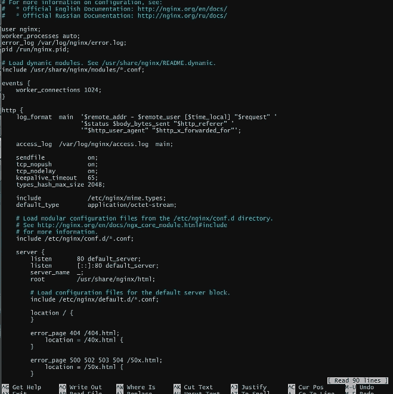

然后我们可以将这个代码添加到归属位置路由中

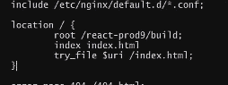

基本上，我们是说将 react 构建设置为根路由。然后将 index.html 文件设置为主索引，最后在每个后续请求上服务同一个 index.html 文件。

这是因为 React 是一个单页面应用程序，实际上是一个 html 文件。因此，为了能够在 React 应用程序中导航，我们必须再次提供相同的 html 文件，以防出现错误。

接下来，我们还可以设置 nginx 来处理我们的 API 路由。

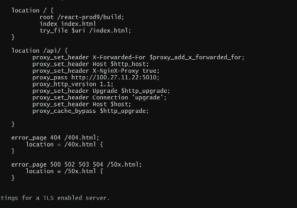

这主要是锅炉板代码，但需要注意的一个属性是 proxy_pass，它是我们的公共 IP 和非标准端口。

这个 ip 地址然后将被代理到常规端口 80，这将允许我们正常访问网站。

代码的副本和可粘贴版本:

```
 server {
        listen       80 default_server;
        listen       [::]:80 default_server;
        server_name  localhost;

        # Load configuration files for the default server block.
        include /etc/nginx/default.d/*.conf;

        location / {
                root /react-prod5/build;
                index index.html;                
                try_files $uri /index.html;

        }

        location /api/ {
                proxy_set_header X-Forwarded-For $proxy_add_x_forwarded_for;
                proxy_set_header Host $http_host;
                proxy_set_header X-NginX-Proxy true;
                proxy_pass http://10.0.1.187:3000;
                proxy_http_version 1.1;
                proxy_set_header Upgrade $http_upgrade;
                proxy_set_header Connection 'upgrade';
                proxy_set_header Host $host;
                proxy_cache_bypass $http_upgrade;

        }
```

之后，我们可以保存并退出编辑器。

现在，我们还必须重新启动 nginx，以反映这些变化。

`sudo systemctl restart nginx`

这就是让 nginx 作为反向代理所需要做的一切。您的应用程序现在可以在普通端口 80 上运行。

### PM2

PM2 是一个集群管理器，允许我们自动运行我们的应用程序，并且在它崩溃时自动重启。

所以让我们用 ssh 回到我们的实例，安装 PM2

`npm install pm2 -g`

g 标志非常重要，因为它会在全局范围内安装 PM2。这是至关重要的，因为这是让 PM2 做好自己工作的原因。

如果你想一想，如果 PM2 安装在本地，当我们的应用程序崩溃时，它也会崩溃，所以这不会工作。我们在全局范围内安装它，这样它就在我们的项目之外，如果它崩溃了，可以重新启动我们的项目。

然后你可以在你的项目中运行 PM2

`pm2 start app.js -i max`

这将启动具有最大数量内核的项目。这一点很重要，因为节点是单线程的，使用所有内核将最大限度地提高性能。

如果成功完成，您应该会看到如下所示的页面。

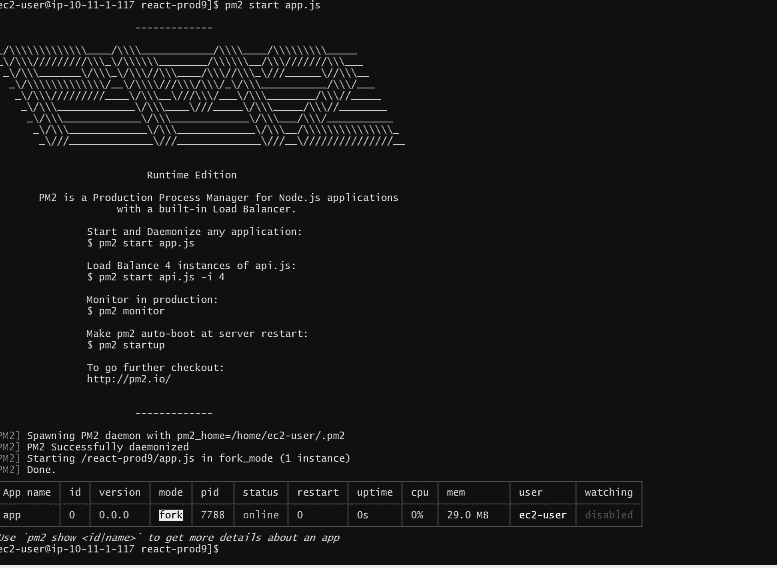

以下是其他几个对 PM2 有用的命令

`pm2 list`:列出所有正在运行的进程

`pm2 stop app 0`:停止 id 为 0 的应用

`pm2 delete app 0`:删除 id 为 0 的应用

`pm2 restart app 0`:重启 id 为 0 的应用

`pm2 start app.js -i max`:用最大可用线程数启动 app.js

这就是了！感谢你的阅读，如果你完成了整个教程，那么恭喜你——这并不容易。

> 在 Twitter 上与我联系，了解更多关于未来教程的更新:[https://twitter.com/iqbal125sf](https://twitter.com/iqbal125sf)