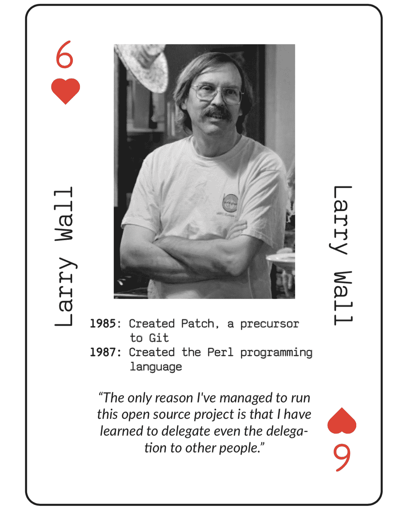
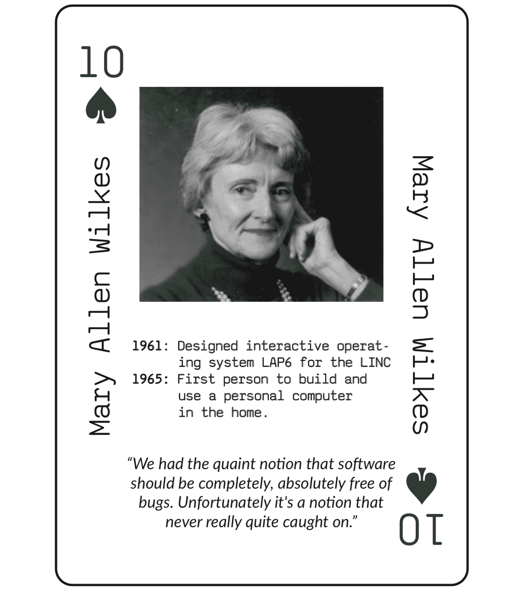
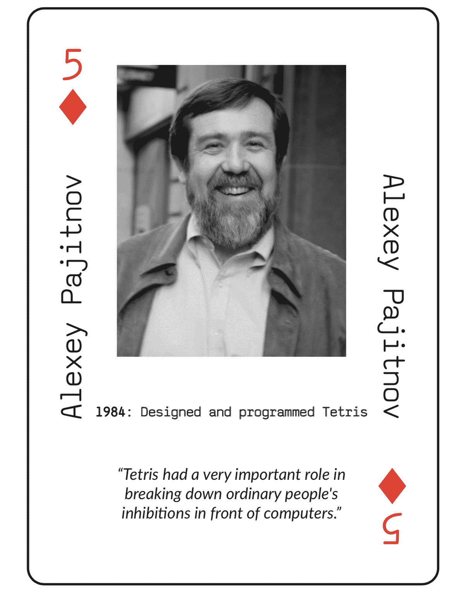
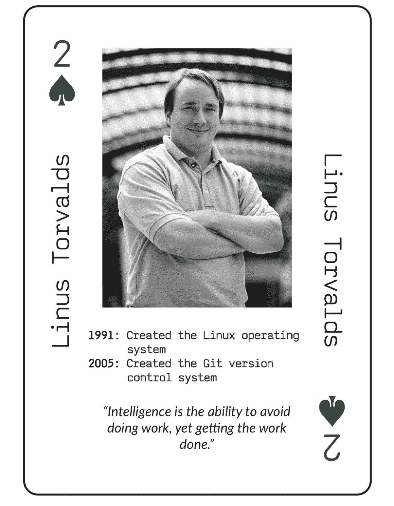
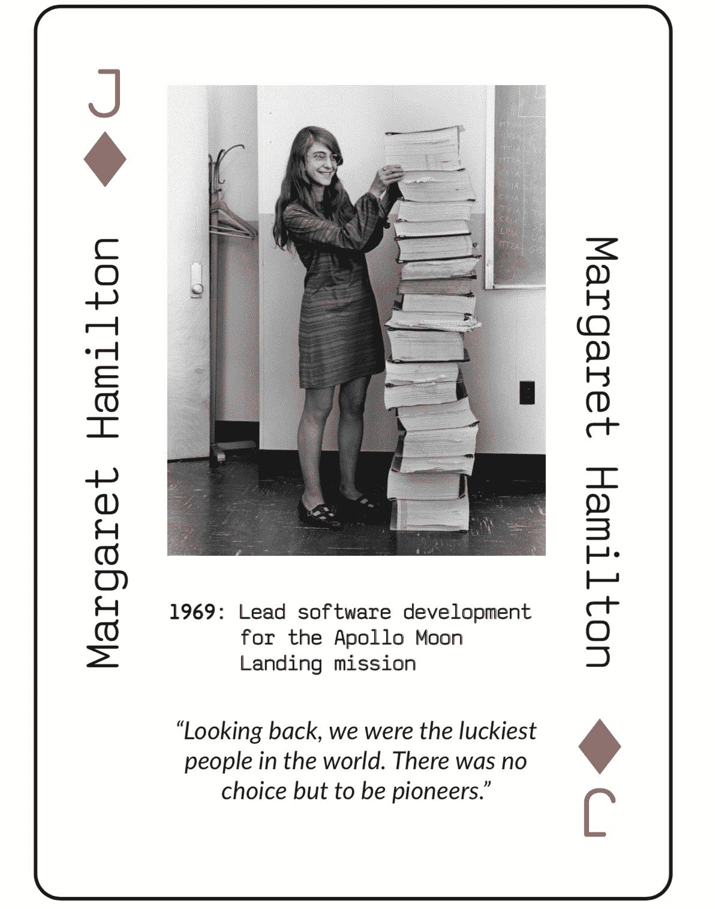

# 介绍程序员扑克牌

> 原文：<https://www.freecodecamp.org/news/programmer-playing-cards/>

## 在玩扑克、21 点和纸牌等经典纸牌游戏时，了解程序员的历史

我很激动地宣布，freeCodeCamp 的程序员扑克牌现已印刷完毕，准备发货！我们在 100% PVC 卡片材料上印制了 1000 套限量版卡片。

我们正在运送大约 200 个给社区支持者，他们在 12 月要求归还。你可以在这里购买剩余的一副牌。

这是一个 3 分钟的视频，我和 freeCodeCamp 研究小组组长 Chris Tse 一起演示了这些卡片:

[https://www.youtube.com/embed/OO2RlcvYRDc?feature=oembed](https://www.youtube.com/embed/OO2RlcvYRDc?feature=oembed)

## 程序员如何玩牌

这是一副超高质量的 54 张 100% PVC 扑克牌。

当你玩的时候，你会惊叹于这些程序员的成就，他们开创了现代程序员所依赖的技术。

每张卡片都有程序员的照片、他们主要成就的列表以及他们有趣的引语。

卡片按照程序员的出生日期排序，早期的程序员占据每种花色的 a 和 k，较新的程序员填写 3 和 2。

所有的伟人都在这里——从历史上第一位程序员阿达·洛芙莱斯，到更现代的程序员，比如区块链发明家中本聪。

历史上有这么多伟大的程序员，很难选出其中的 54 位。但是 freeCodeCamp 的编辑 Abigail Rennemeyer 和我整理了一份候选人名单。

我们选择了每个程序员的好的知识共享许可的照片，决定了我们想要突出的成就，然后通过采访挖掘找到他们精选的报价。

然后 freeCodeCamp 的贡献者 [Phoenix Abhishek](https://github.com/PhoeniXAbhisheK) 将这些卡片以干净、极简的设计和简洁的等宽字体展示出来。

当你使用程序员扑克牌时，你和你的朋友将会接触到大量的程序员大师。只要在你玩的时候一遍又一遍地看到他们的名字和面孔，你就会了解并欣赏编程历史上的许多亮点。

### 这些不是你爷爷的纸扑克牌。

这些不是普通的扑克牌——我们把它们印在 100%聚碳酸乙烯酯上，这是一种柔性聚合物，通常被称为 PVC。

许多职业纸牌玩家喜欢玩 PVC 牌，许多魔术师也喜欢。

为什么？因为 PVC 要重得多——54 副牌重 166 克(6 盎司)。

PVC 卡也更耐用。你可以把它们折成两半，或者如果沾到烤肉酱就在水槽里洗。

我甚至试图用打火机烧一个(没有成功)。

这是几个月前我展示这些卡的质量和耐用性的视频:

[https://www.youtube.com/embed/Hsg8-iQJ-E4?feature=oembed](https://www.youtube.com/embed/Hsg8-iQJ-E4?feature=oembed)

## 以下是如何让你自己的限量版程序员扑克牌直接送货上门。

这些限量版的程序员扑克牌现在已经印刷完毕，可以发货了。您可以在这里点您的[。](https://freecodecamp.typeform.com/to/a08zoC)