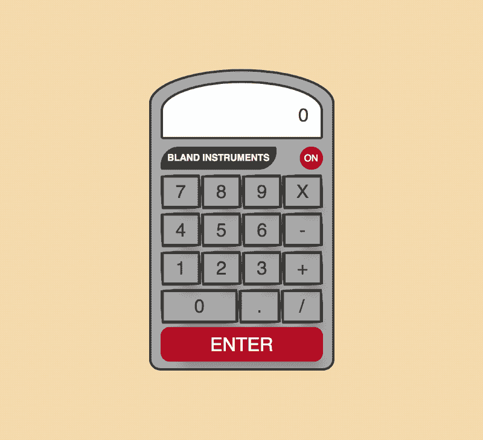

# 如何用 jQuery 编写计算器程序

> 原文：<https://www.freecodecamp.org/news/programming-a-calculator-8263966a8019/>

之前，我向您展示了如何使用 [CSS border-radius 属性来创建下面的计算器](https://medium.freecodecamp.org/learn-css-border-radius-property-by-building-a-calculator-53497cd8071d)。现在我将向您展示如何使用 jQuery 来实现计算器的功能。



Calculator using the CSS border-radius feature

#### 添加 jQuery

我们将在这个项目中使用 jQuery 来响应用户点击按钮时的事件。我们需要将 jQuery 库添加到应用程序中。我将使用 cdnjs CDN 库来添加 jQuery。

在我的 index.html 文件的底部，我将添加以下脚本标记:

```
<script src=”https://cdnjs.cloudflare.com/ajax/libs/jquery/3.3.1/jquery.min.js"></script>
```

#### 操作操作员对数字按钮

在写代码之前，我决定头脑风暴一下如何处理计算器背后的功能。我把计算器上的按钮分成两组:**操作者**和**数字**。

一个数字按钮对应于数字 0-9。所有其他按钮都是操作符。

#### 我们运营的全局变量

下一步是确定我们需要多少个全局变量。全局变量将包含我们的计算器的功能。例如，用户可以输入以下序列:

```
2 + 3 = 5
```

同样，用户可以输入更长的序列:

```
2 + 3 * 4 / 5 - 6 = -2
```

最初考虑全局变量时，我们可能会考虑在用户每次按键时创建一个新变量。这不是很有效。我们必须跟踪谁知道当用户按键时有多少变量。

为了改进这一点，我们可以将事情简化为只需要四个全局变量:

*   num1
*   num2
*   操作员
*   总数

让我告诉你这是如何工作的。用户按下的第一个数字存储在变量 num1 中。运算符(即+、—、*、/或 enter)存储在运算符中。输入的下一个数字存储在变量 2 中。一旦输入第二个运算符，就会计算总数。总数存储在变量 total 中。

一个合乎逻辑的问题是，如何处理用户输入的第三个或第四个数字？简单的答案是我们重用 num1 和 num2。

计算出总数后，我们可以用总数替换 num1 中的值。然后我们需要清空 operator 和 num2 变量。让我们看一下上面的第二个例子:

```
2 + 3 * 4 / 5 - 6 = -2// num1 is assigned value of 2// operator is assigned value of +// num2 is assigned value of 3// total is assigned the value of 5// num1 is assigned the value of 5// num2 and operator are cleared// operator is assigned value of *// num2 is assigned value of 4// total is assigned value of 20// num1 is assigned value of 20// num2 and operator are cleared// operator is stored value of /// num2 is assigned value of 5// total is assigned value of 4// num1 is assigned value of 4// num2 and operator are cleared// operator is assigned value of -// num2 is assigned value of 6// total is assigned value of -2// num1 is assigned value of -2// num2 and operator are cleared// operator is assigned value of =
```

现在你可以看到，我们可以通过使用这 4 个变量来处理用户按下的按钮的每一种可能的组合。

#### 获取用户按下的键

现在我们已经完成了我们的逻辑，我们需要开始处理用户按下的键的过程。在我的 index.html 文件的底部，我将创建一个脚本标签来保存我的代码。

第一步是获取用户按下的键。下面是我的 index.html 文件的一个片段，它显示了计算器的一行中的所有按钮:

```
<div class="flex-row">    <button class="calc-btn">1</button>    <button class="calc-btn">2</button>    <button class="calc-btn">3</button>    <button class="calc-btn">+</button></div>
```

每个按钮，不管是数字还是操作符，都用一个`<button><`定义；/button >元素。我们可以用它来捕捉用户点击按钮的时候。

在 jQuery 中，你可以有一个按钮点击功能。单击按钮时，会向该函数传递一个事件对象。`event.target`将包含被点击的按钮。我可以通过使用`innerHTML`属性获得按钮的值。

下面的代码将对用户单击的按钮进行 console.log。

```
<script>$(document).ready(function() {    $('button').on('click', function(e) {        console.log('e', e.target.innerHTML);    });});</script>
```

现在，如果您测试代码，您将看到您按下的键的值。这适用于计算器中的每个按钮。

#### 创建我们的全局变量

既然我们有能力确定哪个键被按下，我们需要开始将它们存储在我们的全局变量中。我将创建四个全局变量:

```
let num1 = '';let num2 = '';let operator = '';let total = '';
```

#### 单击时的处理按钮

当用户点击一个按钮时，他们将点击一个数字或一个操作符。因此，我将创建两个函数:

```
function handleNumber(num) {    // code goes here}
```

```
function handleOperator(oper) {    // code goes here}
```

在我前面的按钮单击函数中，我可以用对适当函数的调用来替换 console.log。为了确定按钮或操作符是否被点击，我可以比较`e.target.innerHTML`看它是否在 0 和 9 之间。如果是，用户单击了一个数字。如果没有，用户单击了一个运算符。

下面是我进行测试的第一步，以确保我可以分辨出哪个按钮被单击了:

```
$(document).ready(function() {    $('button').on('click', function(e) {        let btn = e.target.innerHTML;        if (btn >= '0' && btn <= '9') {            console.log('number');        } else {            console.log('operator');        }    });});
```

一旦我对识别每个单击的按钮感到满意，我就可以用对适当函数的调用来替换 console.log:

```
$(document).ready(function() {    $('button').on('click', function(e) {        let btn = e.target.innerHTML;        if (btn >= '0' && btn <= '9') {            handleNumber(btn);        } else {            handleOperator(btn);        }    });});
```

#### 处理数字按钮

当用户按下一个数字时，它将被分配给 num1 或 num2 变量。num1 被赋值为`''`。我们可以用这个来决定给哪个变量赋值。如果 num1 是空的，那么我们给它赋值。否则，我们将其分配给 num2。

下面是我的 handleNumber 函数的样子:

```
function handleNumber(num) {    if (num1 === '') {        num1 = num;    } else {        num2 = num;    }}
```

#### 操作操作员按钮

当操作按钮被按下时，我们处理的功能非常简单。我们需要做的就是将值赋给我们的操作变量。

下面是我的 handleOperator 函数的样子:

```
function handleOperator(oper) {    operator = oper;}
```

#### 显示按钮

下一步是向用户实际显示按下的按钮。如果你检查一下手机上计算器的功能，你会发现它只显示数字。如果用户按下`+`键，则不会显示。

在我们的 index.html 文件中，我们有一个显示输入的 div，它包含一个类`'calc-result-input'`。我们将用它向用户显示数字。

因为我们已经将计算器活动分成了函数，所以我们将创建一个函数来显示按钮。

下面是我的 displayButton 函数的样子:

```
function displayButton(btn) {    $('.calc-result-input').text(btn);}
```

因为我们只在用户按下一个数字时更新显示，所以我们可以从`handleNumber`函数中调用`displayButton`函数。

下面是我的 handleNumber 函数现在的样子:

```
function handleNumber(num) {    if (num1 === '') {        num1 = num;    } else {        num2 = num;    }    displayButton(num);}
```

#### **处理总数**

下一步是计算总数。只有在用户将数值分配给 num1 **和** num2 后，按下操作符后，才会计算总数。

例如，如果用户输入:

```
2 + 3 =
```

我们想对 num1 和 num2 求和并显示总数。

如果用户输入:

```
2 - 1 =
```

我们想从 num1 中减去 num2 并显示总数。

我们创建了一个`handleTotal`函数来处理这个问题。该功能将根据按下的操作符创建一个总数。由于可以按下多个操作符，我们将使用一个 case 语句来处理它们。

为了简单起见，我只展示当用户点击`+`操作按钮时要处理的代码。

下面是 handleTotal 函数:

```
function handleTotal() {    switch (operator) {        case '+':            total = +num1 + +num2;            displayButton(total);            break;    }}
```

#### 将字符串转换为数字进行计算

当我们得到被按下的按钮的`innerHTML`时，我们得到一个字符串值。要对两个变量求和，需要将它们转换成一个数字。JavaScript 中有一种简写符号，通过在变量前加上一个`+`符号，将字符串转换成数字。你可以看到我在这一行做了这个转换:

```
total = +num1 + +num2;
```

#### 何时调用 handleTotal 函数

现在我们有了一个计算总数的函数，我们需要在适当的时候调用它。我们只在用户输入第二个运算符后计算总数。

为了解决这个问题，我们需要对现有的`handleOperator`函数进行修改。之前，我们将用户点击的操作按钮的值赋给操作变量。现在我们需要知道这是否是用户点击的第一个操作符。当用户点击第一个操作符时，我们不计算总数。

为了说明这一点，我们可以检查操作符变量是否有值`''`。如果是，这是第一个运算符。如果操作符有一个值，那么我们将需要计算一个总数。

下面是 handleOperator()函数现在的样子:

```
function handleOperator(oper) {    if (operator === '') {        operator = oper;    } else {        handleTotal();        operator = oper;    }             }
```

#### 将脚本移动到 app.js 文件

目前，我们的 HTML 和 JavaScript 代码都包含在 index.html 文件中。我们希望将逻辑分离到一个单独的文件中。我创建了一个名为`app.js`的新文件。

我将`<scri` pt >标签的全部内容复制到这个文件中。我删除 op`ening &l`t；在我的 index.html 文件中脚本>标签`and closi`ng</脚本>标签。

我们需要做的最后一件事是告诉我们的 index.html 文件我们的脚本在哪里。为此，我们在 index.html 文件底部加载 jQuery 的`<scri` pt >标签下添加了这一行:

```
<script src="app.js"></script>
```

#### 最终文件

我现在有这三个文件:

*   index.html
*   app.js
*   style.css

**index.html**文件用于在网页上向用户显示计算器。

这个 **style.css** 用来设计我的计算器。请回顾我以前的一篇文章，这篇文章谈到了[使用 CSS border-radius 属性](https://medium.freecodecamp.org/learn-css-border-radius-property-by-building-a-calculator-53497cd8071d)来设计计算器的样式。

**app.js** 文件包含了计算器背后的逻辑。

下面是我的 app.js 文件的样子:

```
let num1 = '';let num2 = '';let operator = '';let total = '';
```

```
$(document).ready(function() {    $('button').on('click', function(e) {        let btn = e.target.innerHTML;        if (btn >= '0' && btn <= '9') {            handleNumber(btn);        } else {            handleOperator(btn);        }    });});
```

```
function handleNumber(num) {    if (num1 === '') {        num1 = num;    } else {        num2 = num;    }    displayButton(num);}
```

```
function handleOperator(oper) {    if (operator === '') {        operator = oper;    } else {        handleTotal();        operator = oper;    }}
```

```
function handleTotal() {    switch (operator) {        case '+':            total = +num1 + +num2;            displayButton(total);            break;        case '-':            total = +num1 - +num2;            displayButton(total);            break;        case '/':            total = +num1 / +num2;            displayButton(total);            break;        case 'X':            total = +num1 * +num2;            displayButton(total);            break;    }    updateVariables();}
```

```
function displayButton(btn) {    $('.calc-result-input').text(btn);}
```

```
function updateVariables() {    num1 = total;    num2 = '';}
```

#### 摘要

我们的计算器可以工作，但前提是用户点击`+`操作符。您可以在 handleTotal 函数中添加功能来考虑所有运算符。在我的回购协议中，我有所有的功能[，你可以在这里找到](https://github.com/ratracegrad/programming-a-calculator)。

#### 进一步阅读

[JavaScript 中的广度优先搜索](https://hackernoon.com/breadth-first-search-in-javascript-e655cd824fa4) —搜索图形或树的两种最常见的方法是深度优先搜索和广度优先搜索。这个故事向你展示了如何使用广度优先搜索一个图或一棵树。

JavaScript 中的实例化模式(Instantiation Patterns)—实例化模式是在 JavaScript 中创建一些东西的方法。JavaScript 提供了四种不同的方法来创建对象。在本文中学习如何创建这四个。

[使用 Node.js & Express.js 将数据保存到 MongoDB 数据库](https://codeburst.io/hitchhikers-guide-to-back-end-development-with-examples-3f97c70e0073)—MEAN stack 用于描述使用 MongoDB、Express.js、Angular.jS 和 Node.js 的开发。在本教程中，我将向您展示如何使用 Express.js、Node.js 和 MongoDB.js。我们将创建一个非常简单的节点应用程序，允许用户输入他们希望存储在 MongoDB 数据库中的数据。