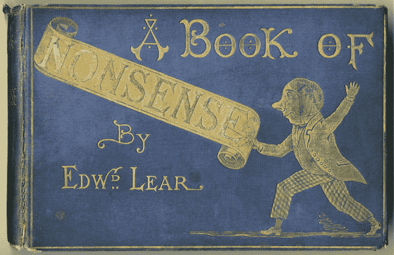

# 编程语言打油诗

> 原文：<https://www.freecodecamp.org/news/programming-language-limericks-a8fb3416e0e4/>

瑞安·麦克德莫特

# 编程语言打油诗

A book by Edward Lear, the English poet who popularized the limerick structure in 19th century England.

### 咬舌

曾经有一段时间，回到计算机时代的黎明。
语言是 Lisp，
它的功能是简洁的，
但是它的圆括号不停地出现。

### C

曾经有一种语言叫 C，是汤普森和里奇发明的。
但没花一个自作聪明，
搞砸了一个 malloc，
让所有人都塞格福特而逃。

### C++

接着在 C 语言之后出现了一种语言，这种语言本该让我们所有人都获得自由。
物极必反，
把这种语言称为 C++。
但这只是让你的电脑崩溃的一种更奇特的方式。

### Perl 语言

曾经有一种叫做 Perl 的语言，拉里·沃尔认为它会统治世界。
但是语法很简单，
而且通常只写，
阅读你的代码会让你呕吐。

### 计算机编程语言

Python 对你我来说都是一种语言，它简单明了，但我们都认为它很慢。
不过没关系，
我们还是喜欢它。
直到从版本 2 到版本 3。

### 服务器端编程语言（Professional Hypertext Preprocessor 的缩写）

曾经有一种语言没有任何方向，它缺乏思想、计划和感情。
PHP 是疯狂的，
为了把你从痛苦中拯救出来，
你的 SQL 注入里需要吗啡。

### Java 语言(一种计算机语言，尤用于创建网站)

当 Java 有了它的概念时，曾经有过一次盛大的招待会。
对于许多坠入爱河的人来说，
却没有一个能超越，
当他们遇到一个空指针异常时。

### Java Script 语言

JavaScript 是为大众设计的，它缺少类型、模块和类。
但它变得相当巨大，
因为它运行在服务器和客户端上，
直到它崩溃，尽管通过了 100 次测试。

### 红宝石

然后风吹向我们的帆，用一种每个潮人都欢呼的语言。
它的名字叫 Ruby，
它把一个菜鸟变成了专家，
直到它有了流量，它出轨了。

### 去

当露比翻过这座山时，戈开始追杀。
这似乎太快了，
但是哦，最后，
我们都厌倦了！=零。