# 伟大的编程行话大赛

> 原文：<https://www.freecodecamp.org/news/programming-mental-models-47ccc65eb334/>

作者:Preethi Kasireddy

# 伟大的编程行话大赛


命令式与陈述式。纯与不纯。静态与动态。

像这样的术语遍布编程博客帖子、会议演讲、论文和教科书。

但是不要被这种行话吓跑。让我们直入主题，打破其中的一些概念，这样你就能理解你周围的这些开发者在谈论什么。

### 静态与动态类型

这是关于何时获取类型信息——在编译时或运行时。

您可以使用此类型信息来检测类型错误。类型错误是指值不是预期的类型。

#### 静态类型检查

基于对程序源代码的分析来验证程序类型安全的过程。换句话说，类型检查发生在编译时，允许更快地检测到类型错误。

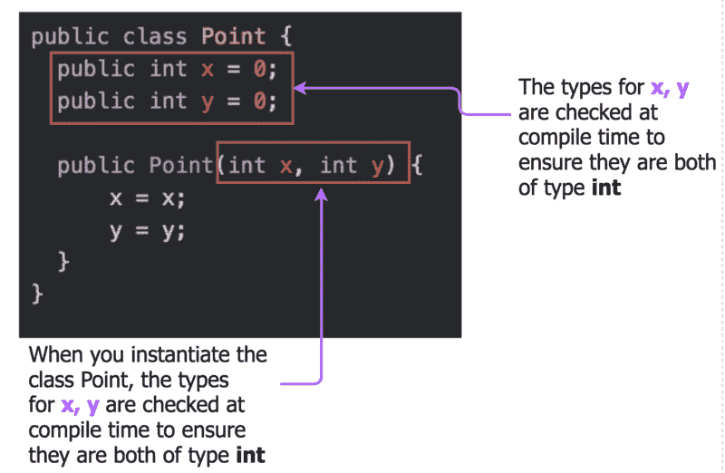

#### 动态类型检查

在运行时验证程序类型安全的过程。使用动态类型检查，类型错误会在运行时发生。


### 强类型与弱类型

需要注意的是，强类型和弱类型并没有一个普遍认同的技术含义。例如，尽管 Java 是静态类型的，但每次使用反射或强制转换时，都是将类型检查推迟到运行时。

类似地，大多数强类型语言仍然会自动在整数和浮点数之间转换。因此，您应该避免使用这些术语，因为称一个类型系统为“强”或“弱”本身并没有太多的交流。

#### 强类型

在强类型语言中，构造的类型不会改变——一个`int`总是一个`int`，试图将它用作一个`string`会导致错误。

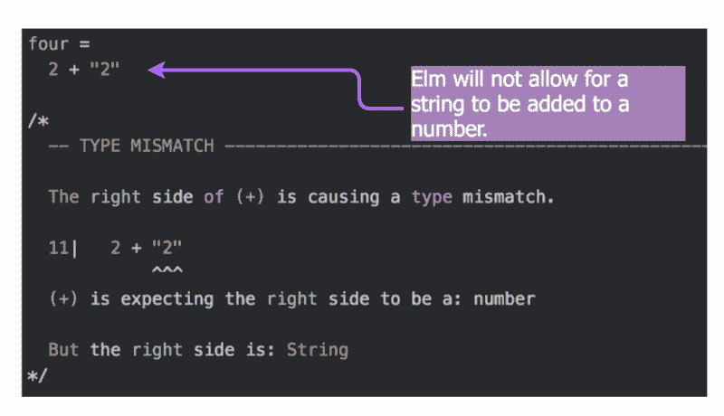

#### 弱类型化

弱类型意味着构造的类型可以根据上下文而改变。例如，在弱类型语言中，如果向字符串“123”添加另一个数字，则该字符串可能会被视为数字 123。

这通常意味着类型系统可能被破坏(使任何保证无效)，因为您可以将一种类型的值强制转换为另一种类型的值。

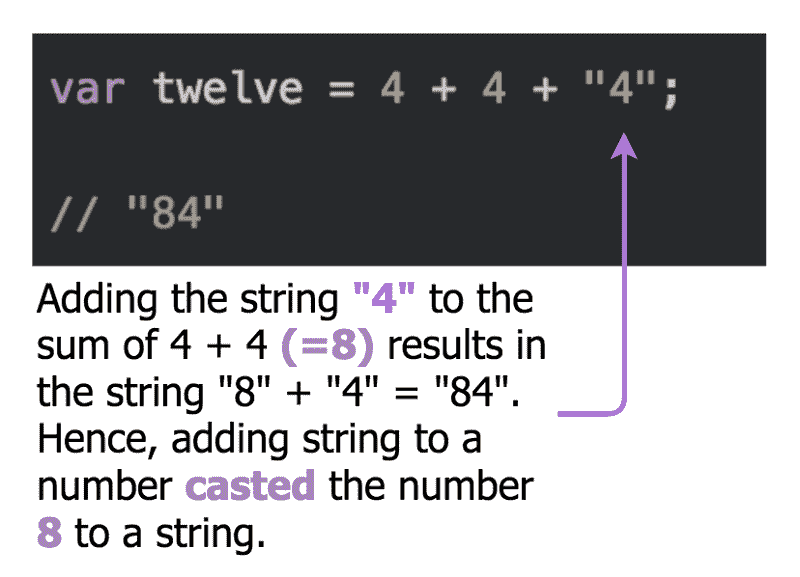

### 可变数据与不可变数据

#### 不可变数据

当一个对象在创建后不可修改时，你可以说它是“不可变的”，这是“不可改变的”的一种说法这意味着你将为每一个变化分配一个新的值。

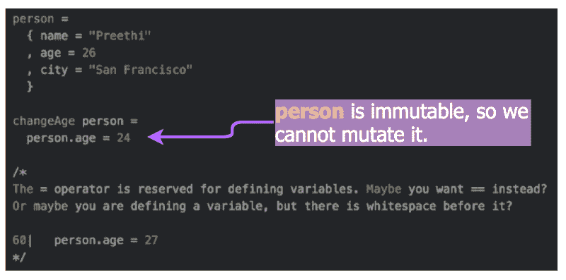

#### 可变数据

当您可以在对象创建后修改它时，它就是“可变的”例如，当引用一个可变对象时，该对象的内容可能会改变。

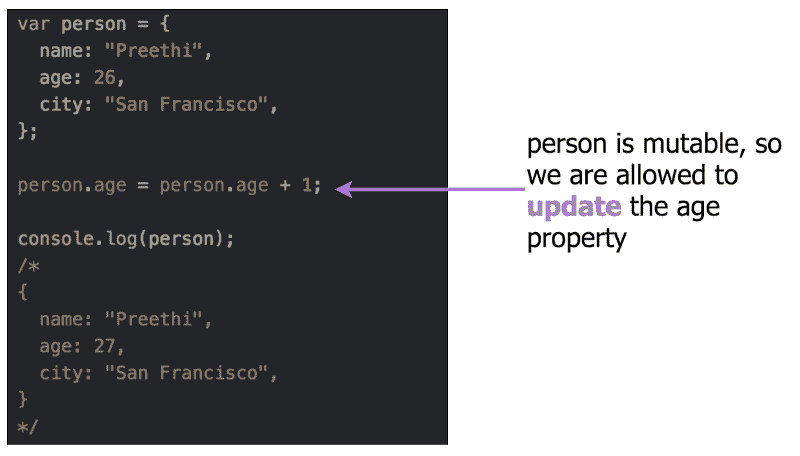

### 纯函数与不纯函数

#### 纯函数

一个纯函数有两个性质:

1.  它只依赖于所提供的输入，而不依赖于任何可能在其评估期间或调用之间改变的外部状态。
2.  它不会引起任何语义上可观察到的副作用，比如修改一个全局对象或通过引用传递的参数。


#### 不纯函数

任何不满足这两个纯函数要求的函数都是“不纯的”

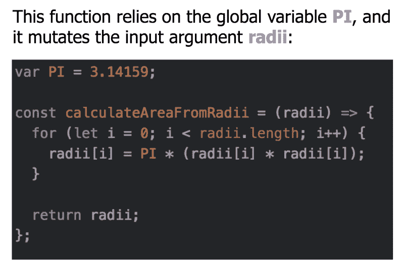

### 懒惰的评价与热切的评价

#### 懒惰评估

惰性计算不计算函数参数，除非需要它们的值来计算函数调用本身。

换句话说，表达式只有在评估依赖于当前表达式的另一个表达式时才会被评估。

懒惰允许程序计算潜在的无限的数据结构而不会崩溃。

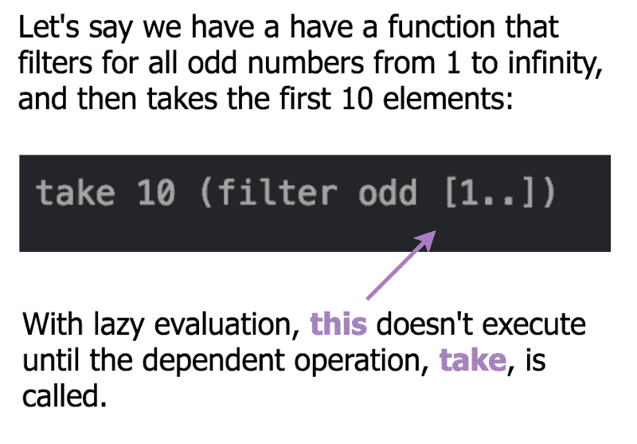

#### 热切的评价

急切求值—也称为严格求值—总是在调用函数之前完全求值函数参数。换句话说，表达式一绑定到变量就开始计算。

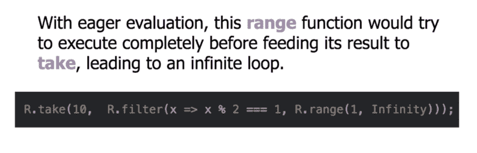

### 陈述性与命令性

#### 声明式编程

声明式程序表达了一组操作，但没有揭示它们是如何实现的，或者数据是如何通过它们流动的。他们关注的是程序应该完成“什么”(通过使用表达式来描述逻辑)，而不是程序应该“如何”实现结果。

声明式编程的一个例子是 SQL。SQL 查询由描述查询结果的语句组成，同时抽象出如何检索数据的内部过程:

```
SELECT EMP_ID, FIRST_NAME, LAST_NAMEFROM EMPLOYEESWHERE CITY = ‘SAN FRANCISCO’ORDER BY EMP_ID;
```

下面是一个声明性代码的示例:

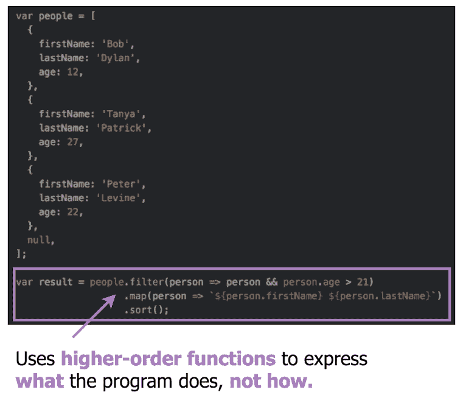

#### 命令式编程

命令式编程侧重于描述程序应该如何通过使用指定控制流或状态变化的语句来实现结果。它使用一系列语句来计算结果。

下面是命令式代码的一个例子:

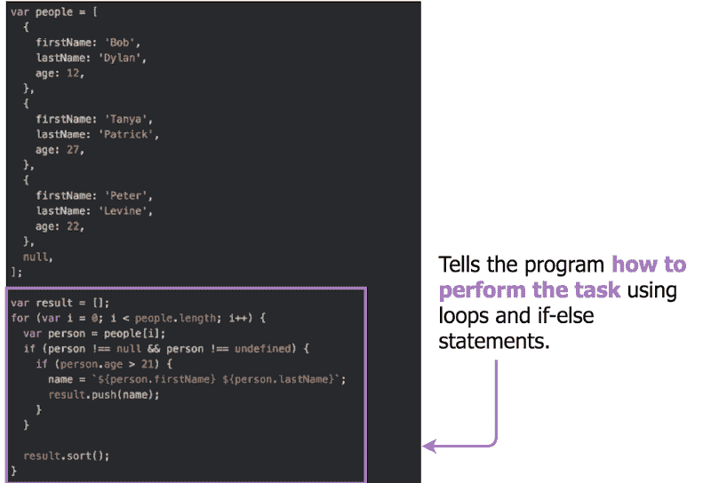

### 有状态与无状态

状态是渐进计算的值序列，它包含计算的中间结果。

#### 宏伟威严的

有状态程序有某种机制来跟踪和更新状态。他们对过去有一些记忆，并记得可能影响当前交易的以前的交易。

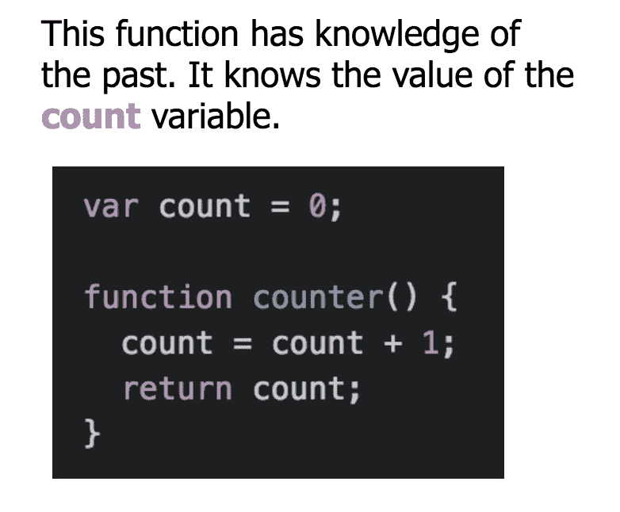

#### 无国籍的

另一方面，无状态程序不跟踪状态。没有过去的记忆。每笔交易都像是第一次做一样。无状态程序每次都会对相同的请求、函数或方法调用给出相同的响应。

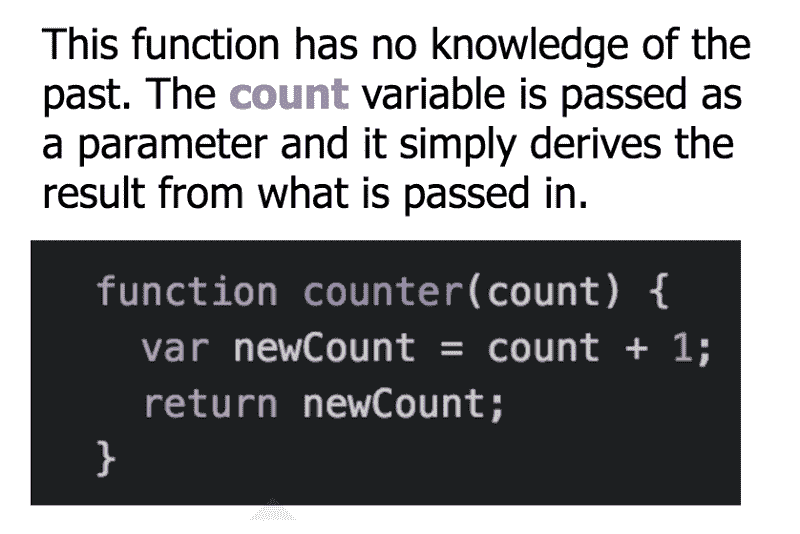

### 函数式与面向对象式

#### 功能的

函数式编程是一种强调函数使用的范式。函数式编程的目标是使用函数来抽象控制流和对数据的操作，并避免副作用。

所以函数式编程使用纯函数并避免可变数据，这反过来提供了*引用透明性。*

当您可以自由地用表达式的值替换它并且不改变程序的行为时，函数具有引用透明性。换一种说法:对于给定的输入，它总是返回相同的结果。

一些强调函数式编程的示例语言包括 Haskell、Lisp、Clojure 和 Elm。但是您可以在大多数语言中使用函数式编程概念，包括 JavaScript。

#### 面向对象的

面向对象的编程范式主要强调对象的使用。这导致程序是由相互交互的对象组成的。这些对象可以包含数据(以字段或属性的形式)和行为(以方法的形式)。

这是一种通过对象划分(或封装)程序状态的方式，使得分析变化的影响变得容易处理[1]。

此外，面向对象程序使用继承和/或组合作为代码重用的主要机制。继承意味着一个新的类可以根据现有的类来定义，只需要指定这个新类是如何不同的。它代表一种“是-是”的关系(例如，鸟类扩展了动物类)。另一方面，组合是指类包含实现所需功能的其他类的实例。它代表一种“有”的关系(例如，一个 Bird 类有一个 Wing 类的实例作为它的成员)。

多态性也是面向对象编程中代码重用的一个重要机制。这是指一种语言可以根据对象的数据类型或类来不同地处理对象。

强调面向对象编程的一些示例语言包括 Java、C++、Ruby。同样，您可以在大多数语言中应用这些概念，包括 JavaScript。

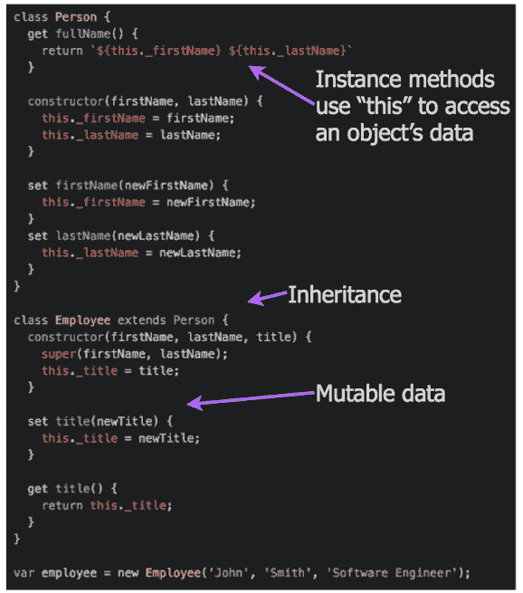

### 确定性与非确定性

#### 确定性的

无论何时用一组特定的输入值和相同的给定状态调用确定性程序，它们总是返回相同的结果。

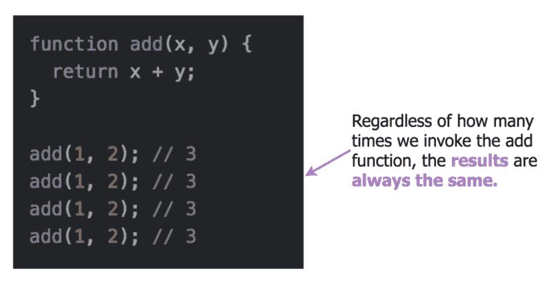

#### 非定常的

不确定性程序可能在每次被调用时返回不同的结果，即使具有相同的特定输入值和初始状态。

不确定性是任何并发系统的特性，也就是说，在任何系统中，通过在不同的线程上运行，多个任务可以同时发生。一个正在改变状态的并发算法可能每次都有不同的表现，这取决于调度器决定执行哪个线程。

例如:

```
declare Xthread X=1 endthread X=2 end
```

两个线程的执行顺序是不固定的。我们不知道 X 会绑定到 1 还是 2。系统会在程序执行过程中进行选择，可以自由选择先执行哪个线程。

另一个非决定论的例子:

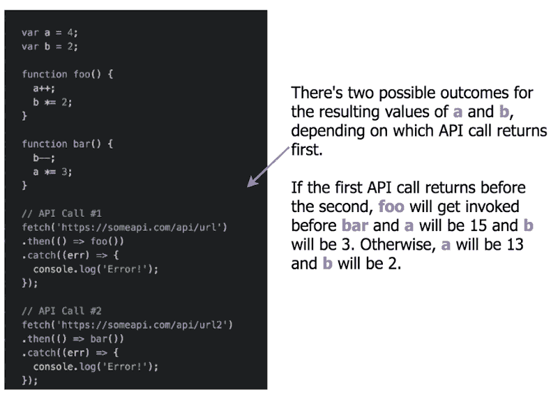

### 唷！我们完了。

一如既往，您的反馈和意见对我来说非常重要。我阅读并考虑每一条评论，所以请不要回避回应！

最后，您还可以查看我为本文构建的 Prezi 演示文稿。

[1]感谢 [Kent Beck](https://www.freecodecamp.org/news/programming-mental-models-47ccc65eb334/undefined) 在这方面的投入。