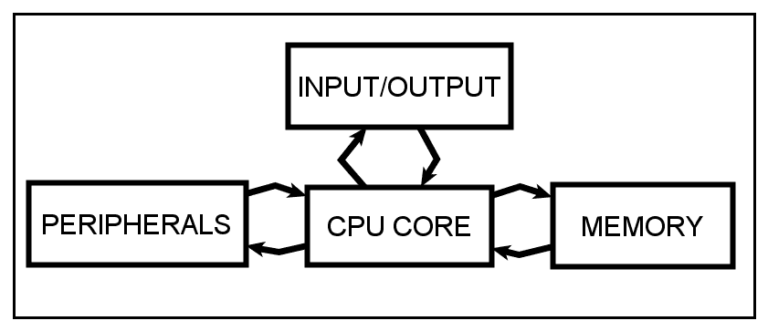
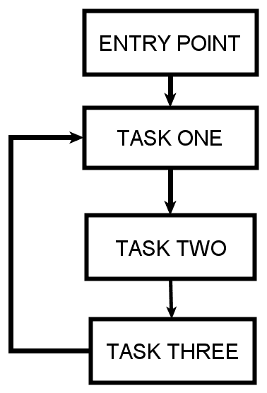
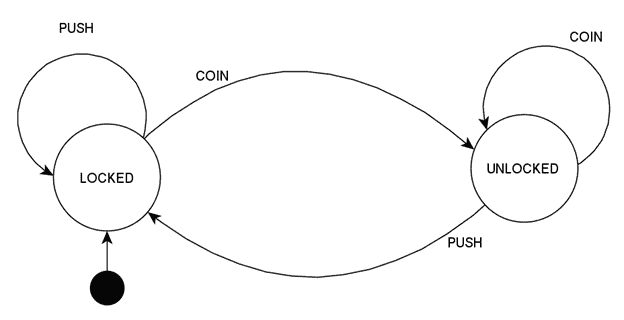

# 如何改进你的 Arduino 呼吸机:介绍 RTSs 和 SCSs 的临时新冠肺炎呼吸机设计

> 原文：<https://www.freecodecamp.org/news/programming-the-electronics-for-covid-19-ventilators/>

我们所知的世界最近被风暴席卷。那场风暴是新冠肺炎疫情的爆发。这反过来又造成了全球范围内通风机的短缺，导致许多人涉足通风机设计领域。

只有一个问题:许多人基于 Arduino 平台进行设计。虽然这可能是一个很好的概念证明，但除非绝对必要，否则你不会想把它用于实际的生命支持。

这是因为像 Arduino 这样的平台被设计成一个在学习环境中使用的平台。它们不是为制造呼吸机所需的实时、安全关键设计而设计的。

但是，如果没有应急呼吸机，您可以采用一些变通方法将该平台用于临时应急呼吸机。

在本帖中，我们将讨论实时系统和安全关键系统。希望你能在你自己的呼吸机控制系统设计中使用这些原则来提高它们的安全性和可靠性。

因为目标受众主要是尝试嵌入式设计的 web 开发人员，所以我会尽量让这篇文章自成一体。请和我一起从浏览器进入嵌入式系统设计领域，并接近硬件来设计我们的通风机。

## **嵌入式系统**

尽管呼吸机很有用，但它只是一个嵌入式系统。嵌入式系统是这样一种系统，它被设计成执行一种功能，并以高可靠性和最少的用户干预很好地执行这种功能。

为了实现这一点，嵌入式系统由两部分组成:硬件系统和运行硬件配置的软件部分。

典型的嵌入式系统通常由控制设备供电，该控制设备通常集成 RAM、ROM 以及大量板上嵌入式外围设备，以允许系统完成其任务。

现代嵌入式系统有时可以基于应用处理器，它可以集成 GPU、多个 CPU 内核、多媒体编解码器和其他设备。虽然应用处理器可以用于嵌入式系统，但它们主要用于通用计算系统，如智能手机。

运行在嵌入式系统上的软件称为固件。之所以称之为固件，是因为一旦写入 ROM，预计不会频繁更改。

Components of An Embedded System

想想呼吸机。它的主要目的是提供机械通气来维持病人的生命。它执行一个功能，并且高度可靠地执行，以至于它可以被用作生命支持系统。您很少会发现有人在部署后更改此类设备的固件。

## 硬件组件

如前所述，嵌入式系统的硬件组件将 RAM、ROM 和其他设备集成在一个封装中。这个装置叫做微控制器。

如今有几种流行的微控制器。微芯片技术公司的 PIC 和 AVR 以及意法半导体公司的 STM32 最受欢迎。经典的 Arduino 在其核心使用 AVR 微控制器。

不管制造商是谁，微控制器都将由一个处理器内核、存储器和一个提供输入输出的装置(也称为 I/O)组成。

微控制器也由存储器组成，存储器分为两类:数据存储器和程序存储器。

数据存储器是用于存储微控制器在运行时使用的数据的存储器。它通常是几十到几百千字节的 SRAM。数据存储器是易失性的，当设备断电时会丢失。

另一方面，程序存储器实际上存储微控制器将使用的存储器。它由闪存(想想你的 USB 闪存驱动器中的内存)或 FRAM(铁电 RAM)组成，并且不是易失性的。在现代系统中，程序内存的大小通常从几个字节到几兆字节不等。

微控制器上的输入和输出(I/O)引脚允许器件与传感器和其它芯片等外部器件通信，这些器件执行各种功能，如存储器扩展，甚至为器件添加额外的 I/O。

微控制器还将集成用于执行模拟到数字(A 到 D)和数字到模拟(D 到 A)功能的外设。

这是因为我们的世界本质上是模拟的，模数转换(ADC)会将真实世界的数据转换为微控制器可以处理的格式。如果你有一个录音机，一个麦克风传感器和一个微控制器将把你的声音转换成数字格式并存储起来。

微控制器也可以具有执行数模转换(DAC)的装置，由此可以将数字数据转换成我们可以在现实世界中使用的模拟格式。

在我们的录音机示例中，当您必须回放录制的声音时，这是适用的。存储的数字信息被转换成我们可以在模拟世界中检测到的声音。

当我们把所有这些结合起来，我们得到一个典型的微控制器硬件框图。

Crude Microcontroller Block Diagram

现在我们对硬件有了基本的了解，让我们看看软件组件。

## 软件组件

尽管你的硬件很棒，但如果没有软件来控制它，它就像一个镇纸一样没用。嵌入式系统中的软件通常分为三个基本类别:

*   循环执行系统，
*   基于有限状态机的系统，以及
*   使用实时操作系统构建系统。

这三种类型的软件系统之间的区别是基于它们处理任务的方式。当我们谈论任务时，我们谈论的是固件中最小的执行单元。

### 循环执行系统

循环执行系统通过将所有程序任务包含在一个无限循环中来工作。这些系统有一个主程序入口点，然后系统循环通过任务列表。这是最简单的固件设计类型，用于基本系统。

Cyclic Execution System

该系统将有一个程序入口点，通常用于配置硬件、设置系统时钟和基本的启动任务。一旦程序进入无限循环，它将执行任务一，然后任务二，最后任务三。

### 有限状态机

虽然基于循环的执行系统对于大多数任务来说是简单而有效的，但有时您需要对程序流进行更多的控制。当这种情况发生时，设计者可以使用所谓的有限状态机(FSM)系统。

在有限状态机中，我们可以把每一个任务想象成机器可能处于的一种状态。FSM 将有一个初始状态，之后每个状态将基于某个条件语句执行。硬币接收器十字转门通常用于(像状态机的 hello world 一样)解释状态机的概念。

"Coin Acceptor Turnstile FSM". (Source Codeless Data Structures and Algorithms by Armstrong Subero).

我们有一个黑点，代表初始状态以及两种状态，锁定和解锁。一旦你投入硬币，处于锁定状态的十字转门将会解锁。即使你推动机器，它也不会解锁，直到你插入一枚硬币。一旦您插入硬币，机器将进入解锁状态，并且只要有硬币存在，机器就会保持解锁状态。

如果您在解锁状态下推动十字转门，这种情况将导致机器转换到锁定状态，并保持锁定状态，直到再次投入硬币。

看起来很简单，这种将程序任务建模为基于条件转换的状态的方法是嵌入式系统固件设计的有力方法。这是我在设计自己的系统时最常使用的方法。

## 呼吸机是实时系统

实时系统或 RTS 是在响应时间方面必须满足严格要求的系统。在实时系统中，没有妥协的余地。

这种系统必须保证它们将在给定的时间周期内执行动作。未能在一定时间内采取行动可能会导致生命损失或严重的财产损失。

这是呼吸机所属的系统类别。

当患者需要呼吸机时，这是因为他们不能正常呼吸，需要机械辅助才能进行呼吸机所需的呼吸。呼吸机可以执行持续强制通气(CMV ),这意味着患者将需要从机器获得保证的最小呼吸次数。

未能提供所需的最小呼吸次数将导致患者死亡。这意味着控制电子设备必须能够无故障运行。

为了实现这一点，大多数实时系统将利用所谓的实时操作系统(RTOS ),以确保由设备执行的许多任务都可以无故障地执行。

RTOSs 使用调度器来管理任务，并限制每个任务如何利用资源。内核将根据优先级管理每个任务如何利用硬件资源。

想想现有的临时呼吸机设计。最有希望的是使用气囊式瓣膜复苏器制造的，该复苏器使用电机来驱动机械手臂，该机械手臂压在气囊式瓣膜复苏器上并执行呼吸机功能。

然而，如果马达发生故障，会发生什么呢？也许我们可以添加一个红外或超声波传感器，它将测量机械臂从某一点的距离，并确保它到达特定的距离。这些传感器也能保证它回到起点。

然而，读取这些传感器的主微控制器需要时间来处理信息。如果传感器出现故障怎么办？微控制器必须锁定以等待传感器数据吗？传感器故障会妨碍电机按时启动吗？

为了确保每个任务在特定的时间发生，调度程序将只分配处理时间给系统设计者指定的任务。

这样，如果一个传感器出现故障，一旦分配给读取该传感器的时间过去，微控制器将继续执行另一项任务，即驱动电机，使系统保持运行。

在您的设计中使用实时操作系统将保证您的设备能够在指定的时间内执行其功能。

## 通风机是安全关键系统

在上一节中，我们讨论了实时操作系统。我认为我们应该扩展一下我们的讨论，谈谈硬实时和软实时系统。

在硬实时系统中，操作的要求是无论如何都要在规定的时间内完成，不能在截止日期前完成是不可接受的。空中交通管制系统和通风系统就属于这一类。

硬实时系统不允许错过截止日期。

在软实时系统中，最好能满足截止日期。但是如果最后期限没有被遵守，这意味着最终用户可能会不高兴，但可能是可以接受的。想象一个在线游戏平台。我们希望我们的游戏有实时反应，但如果你错过了一些帧，它不会导致生命的损失。

软实时系统被允许错过截止日期。

现在，很多人把实时系统和安全关键系统混为一谈。并非所有的实时系统都是安全关键系统。想想上面的在线游戏或视频会议的例子——这类系统需要实时性能，但它们本质上不是安全关键型的。

安全关键系统(SCS)与常规实时系统的不同之处在于，在安全关键系统内未能满足最后期限将导致死亡或严重的财产损失。

在安全关键系统中，系统的停止是不可选择的。

例如，高可用性系统实时系统可以被指定为在 24 小时内有大约 99%的运行时间。

想象一个呼吸机系统。

一天中哪 1%的时间呼吸机不工作是可以接受的？既然我们一天有 1440 分钟，那么一天中的哪 14.4 分钟不应该让病人呼吸？

## Arduino 平台

在我们讨论的这个阶段，我认为我们最好谈谈用于安全关键系统的 Arduino 平台。

在我们关于嵌入式系统的讨论中，我们谈到了硬件和软件，但是您知道设计过程中还有开发工具这一部分吗？

你看，为了把你写的软件放到运行硬件的微控制器设备中，你需要使用开发工具，比如 IDE 和工具链来对设备编程。

根据您使用的设备，设置和使用工具链是一个痛苦的过程。许多微控制器供应商过去提供笨重的 ide，你必须是一个经验丰富的嵌入式设计人员才能使用(尽管这种情况近年来有所改变)。

此外，您还需要了解底层硬件，即使对于经验丰富的设计人员来说，配置寄存器和时钟也是令人望而生畏的。

即使你在软件方面克服了这些障碍，你也需要一个印刷电路板(PCB)或者有使用试验板的经验来让你的微控制器运行。

如果您不知道如何正确连接硬件，即使您的程序是正确的，设备也不会运行，并且排除硬件故障也需要一些经验。

为了解决这个问题，Arduino 平台作为一种在硬件、软件和开发工具之间提供协同作用的方式被引入，以允许学生轻松控制硬件。

The Components of the Arduino Platform

Arduino 提供了一个带有芯片的物理板，这种芯片的配置已知可以与一个简单的 IDE 一起工作，该 IDE 具有大量的库。这种无缝的集成对于希望进入硬件设计领域的初学者来说是一种不那么令人生畏的尝试。

## 在安全关键系统中使用 Arduino 的问题是

有一个问题:由于 Arduino 非常容易使用，这导致许多人使用 Arduino 远远超出了该平台最初的目的，包括在实时系统中的使用。

不建议将 Arduino 用于实时系统。为什么？有些人可能会争辩说，你可以在 Arduino 上使用 Amazon FreeRTOS 这样的操作系统，并使其实时化。这是真的。但是，尽管该平台确实变得实时，并且将使其高度可靠，但它不会使其成为安全关键平台。

什么使得 Arduino 不适合在安全关键系统中使用？答案在于抽象及其与平台测试和调试能力的关系。

Arduino 是一个很好的学习平台，因此它增加了许多软件抽象来简化事情。

抽象本身不一定是坏事。抽象允许代码重用，如果使用正确，可以帮助消除错误。经过适当测试的代码抽象出大量硬件，在合适的人手里可能是一个强大的工具。

然而，抽象并不能消除错误，这就是问题所在。即使代码是抽象的，如果它一开始就有错误的逻辑，那么抽象也救不了你。

如果你发现了一个 bug，通常你会依靠调试器和软件测试来帮助你找出问题的根源并提高系统的可靠性。

这就是问题所在。Arduino 平台没有调试功能。

没有调试会使错误难以跟踪。在安全关键设计中，拥有没有错误的软件是至关重要的。此外，在代码上运行测试并不容易，因为 IDE 对于安全关键系统设计所需的强大调试和测试来说过于简单。

如果你别无选择，你可以使用 Arduino 来设计呼吸机系统。但是缺少调试使得很难做到这一点，并增加了固件中出现错误的可能性，并增加了系统内部出现故障的风险。

## 我如何设计一个好的临时系统？

如果您必须设计呼吸机系统，您可以做两件具体的事情来改进基于 Arduino 的设计:您可以改进软件设计和改进硬件设计。

### 改进软件方面的设计

并非所有的希望都破灭了。要确保您的系统拥有可靠的软件，请考虑执行以下操作:

1.  考虑使用另一个 IDE——Atmel Studio 是一个很棒的 IDE，如果您使用外部调试器，如 Atmel ICE 或 ICD 4 调试器，它可以提供调试选项。此外，还可以使用 MPLAB X。这些 IDE 将有助于调试。
2.  坚持 C/C++编码标准——使用编码标准可以提高系统的可靠性，并使系统设计更加高效。考虑重写你正在使用的库，以符合 MISRA、JSF++甚至 Barr 集团的嵌入式 C 编码标准
3.  使用 RTOS——许多基于 Arduino 的呼吸机设计都使用平台，并在适当的位置安装了循环执行系统。考虑使用 Amazon FreeRTOS 让你的系统实时化。这将避免系统锁定，使您的系统更加可靠。
4.  考虑使用具有满足安全要求的库的平台——虽然对于没有经验的设计人员来说不太理想，但使用具有已经满足现有安全要求的库的设备将有助于使您的设计更加稳健。
    例如，尽管我们的设备是一种临时医疗设备，但使用 IEC 60730 B 级安全要求有助于使您的设计更加稳健。Microchip Technology(生产驱动 Arduino 的芯片的公司)拥有其他设备，这些设备具有符合 B 级安全要求的库，将有助于提高设备的安全性。
5.  实施传感器数据分析冗余-在设计您的设备时，考虑使用传感器来确保设备仍在运行，当您这样做时，考虑使用分析冗余方法来帮助获得更准确的传感器数据。
6.  考虑使用 SAFERTOS——虽然它可能需要您更换系统，但 safer tos 已经过预认证，可用于医疗系统，与 Arduino 平台的软件相比，其安全性更高。

### 改进硬件方面的设计

要改进硬件方面的设计:

1.  考虑使用看门狗定时器——如果你没有时间使用 RTOS，确保你的设备持续运行的一个简单方法是在你的设计中使用看门狗定时器。看门狗定时器确保在代码执行过程中出现问题时设备复位。
2.  使用已有安全认证和库的硬件设备——一些设备更适合呼吸机设计的任务。与其将安全关键设计委托给 Arduino，不如考虑使用控制设备，该控制设备可以使用已经获得医疗设备使用认证的软件或提供安全库。支持 SAFERTOS 的平台是一个很好的起点。B 级安全软件上的微芯片技术网页也是一个很好的起点。
3.  添加反馈系统——仅仅让你的设备启动并运行是不够的。您还需要反馈系统来确保设备正常运行。集成传感器，为易出现故障的机械零件提供反馈。
4.  考虑分布式硬件控制——尽管许多人将他们的设计建立在单个芯片上，但是考虑在你的设计中使用多个微控制器。考虑使用一个设备进行控制，另一个设备在组件出现故障时通知最终用户。
5.  实现系统冗余——对于这种设计来说，拥有一个带有适当传输系统的适当关闭系统是至关重要的。实施适当的关机程序以防系统出现故障，并建立适当的切换机制以确保系统 100%正常运行。

## 包扎

在这篇文章中，我们讨论了嵌入式系统，简要讨论了它们的硬件和软件组件，并谈到了固件设计范例。我们还讨论了与呼吸机设计相关的实时系统和安全关键系统。

最后，我们讨论了如何通过改进硬件和软件设计来提高基于 Arduino 的呼吸机设计的安全性和可靠性。

在这篇文章结束时，你应该对如何增强你的 Arduino 呼吸机系统有所了解。

如果你想了解更多关于微控制器的知识，拿起我的书“用 XC8 编程 PIC 微控制器”，在那里你将了解 PIC 微控制器以及如何编程。该微控制器也可用于设计您的通风机，与 Arduino 平台相比，它将为您提供更大程度的控制和调试能力。

在这里阅读这本书:

[https://www.apress.com/gp/book/9781484232729](https://www.apress.com/gp/book/9781484232729)