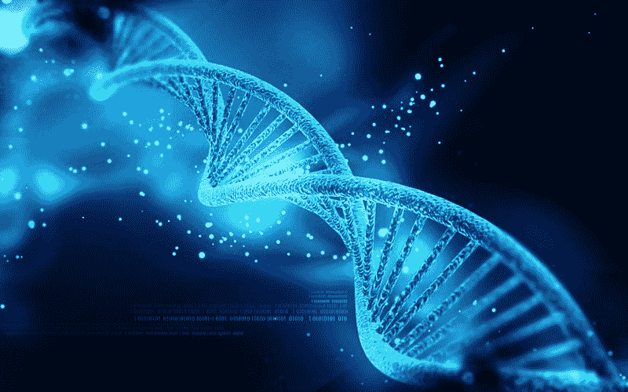
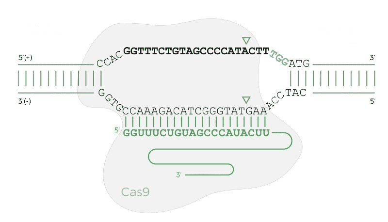
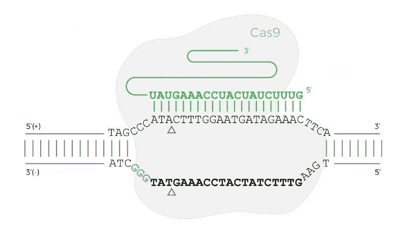

# 用 CRISPR 编程基因组

> 原文：<https://www.freecodecamp.org/news/programming-the-genome-with-crispr-bd567a214e2a/>

乔希·麦克梅内米

# 用 CRISPR 编程基因组

#### 科学家如何在计算机的帮助下编辑基因组



CRISPR(读作“crisper”)是细菌免疫系统的一部分，进化为“记忆”并清除入侵的病毒 DNA。

它的名字是“聚集的规则间隔的短回文重复序列”的缩写。尽管它有一个满嘴的首字母缩写词和复杂的生物起源，它的工程应用是简单明了的。首先，你只需要了解一种蛋白质——cas 9。

Cas9 搜索特定的 DNA 序列，并通过断裂 DNA 分子的两条链来切割它。这种蛋白质对研究人员很有用，因为他们可以“编程”它来靶向任何 DNA 序列。一个 sgRNA(“单向导”RNA)分子决定了 Cas9 结合的序列。RNA 是一种类似于 DNA 的生物分子，可以与蛋白质和 DNA 结合。

sgRNAs 是具有恒定区和可变区的短序列。恒定区将 sgRNA 连接到 Cas9 蛋白上。可变区导致 Cas9 与互补它的 DNA 序列结合(见下图)。



The Cas9 protein bound to the DNA when the PAM sequence is on the forward (top) strand. The bold sequence is the target sequence, the green sequence is the sgRNA, and the three blue characters are the PAM. The triangles show where Cas9 will cut the DNA.

制造 sgRNA 既便宜又快速。这使得研究人员可以快速建立一个切割任何 DNA 序列的 Cas9 实验。嗯，实际上不是任何序列。有一个小小的限制:目标序列的侧翼必须是正确的 PAM(原间隔区相邻基序)——一段短的 DNA 序列。

[](https://en.wikipedia.org/wiki/Streptococcus_pyogenes)*化脓性链球菌是一种传染性细菌。在它产生的 Cas9 版本中，PAM 基序是“NGG”，其中 N 是任何核苷酸(组成 DNA 的“字母”)。*

*幸运的是，人类基因组中大约每 42 个碱基对就会出现一次“NGG”序列。这意味着研究人员可以在几乎每个感兴趣序列附近找到靶位点。*

*根据实验设置，DNA 中的这些切割可以导致 DNA 序列的**随机变化**或**精确变化**(稍后将详细介绍)。*

*在开始编写这个程序之前，我建议研究一下下面的 Cas9 图。*

*

The Cas9 protein bound to a DNA sequence when the PAM sequence is on the reverse (bottom) strand.* 

*请注意，DNA 和 RNA 具有基于其化学结构的方向性。该分子的一端被称为 5 `(‘五’端)，另一端被称为 3 `(‘三’端)。这一点很重要，因为序列 5`— AGG — 3 `不同于 3` — AGG — 5 `。*

*按照惯例，除非另有标记，DNA 和 RNA 序列被认为是由 5’到 3’组成。以 5` — 3 '方向阅读的序列被称为“正向”序列。以另一种方式阅读的序列(3` — 5 `)被称为“反向”序列。这是一个武断的约定。*

*上图显示了当 PAM 在反向(底部)链上时 Cas9 结合的例子。*

### *你的第一个 CRISPR 程序*

#### *场景*

*一位科学家有一个感兴趣的 DNA 序列，并想要该序列中包含的所有 CRISPR 目标的列表。手动寻找每个目标既繁琐又容易出错。*

*科学家想要一个简单的程序，他们可以输入 DNA 序列，并返回所有可能的 Cas9 靶位点。科学家还想知道每个目标位置的切割位置和 PAM 序列。*

```
*`EXAMPLE INPUT (from Figure 1): 'CCACGGTTTCTGTAGCCCCATACTTTGGATG'`*
```

```
*`EXAMPLE OUTPUT: [{    'cut_pos': 6,    'pam_seq': 'TGG',    'target_seq': 'GTATGGGGCTACAGAAACCG',    'strand': 'reverse'  }, {    'cut_pos': 22,    'pam_seq': 'TGG',    'target_seq': 'GTTTCTGTAGCCCCATACTT',    'strand': 'forward'  }]`*
```

*首先，我们如何在序列中找到 CRISPR 目标？请记住，Cas9 蛋白可以结合任何有“NGG”基序的地方。*

*第一步是遍历序列寻找匹配。当程序找到一个“NGG”匹配时，我们想从 PAM 位点的开始减去三个位置，因为这是 Cas9 切割 DNA 的地方。*

*然后，我们要记录 PAM 之前的二十个碱基对作为目标序列。听起来不错？*

*嗯，上面描述的算法实际上会错过大约一半的 CRISPR 位点——因为 DNA 是双链的。这意味着如果“CCN”是正向链上的序列，那么“NGG”是反向链上的序列。*

*该程序还必须使用反向链的类似逻辑搜索“CCN”。*

#### *示例程序*

### *并非所有 CRISPR 目标都是相同的*

*当 CRISPR 第一次流行时，研究人员经常在他们的计算机上调出一个序列，并用手挑选目标。设计最佳的 sgRNA 现在变得更加复杂。下面是对这种复杂性的简要介绍。*

#### *偏离目标*

*研究人员很快意识到，Cas9 有时会在与靶序列不完全匹配的位点结合和切割。这些[偏离目标的削减](https://www.ncbi.nlm.nih.gov/pmc/articles/PMC4320661/)会导致研究人员的实验发生意想不到的变化(或者在治疗的情况下可能导致患者的基因组发生变化！)*

*为了设计一个好的指南，程序必须查看整个基因组(对人类来说大约是 30 亿个核苷酸)来计算脱靶分数。研究人员最近还对 Cas9 蛋白进行了改造，使其脱靶活性降低。*

#### *迷人的*

*当 Cas9 结合时，它通过使 DNA 分子双链断裂来产生切割。大多数时候，细胞可以通过生化途径修复这种断裂(称为非同源末端连接，或 NHEJ)。*

*这种途径并不总是完美的，有时当 Cas9 切割时，修复过程会在 DNA 序列中进行小的插入或缺失。在 DNA 的蛋白质编码区，这些小的插入和删除导致移码突变——这通常会破坏蛋白质的功能。*

*研究人员通常会敲除一个基因，以弄清楚蛋白质如何影响特定的细胞功能或表型。创建一个敲除编辑[给 sgRNA 设计](https://www.ncbi.nlm.nih.gov/pmc/articles/PMC4262738/)增加了额外的限制，因为现在指导必须落在基因的编码区。*

#### *编辑*

*很多时候，科学家想要进行精确的编辑，而不是敲除一个基因。这在试图纠正导致突变的疾病时尤其有用。最好的方法仍在研究中。大多数方法都包括添加额外的捐赠者 DNA 片段。*

#### *目标得分*

*一些 sgRNA 序列会导致 Cas9 比其他序列切割得更好。研究人员[比较了数千个 Cas9 靶的切割效率](https://www.ncbi.nlm.nih.gov/pmc/articles/PMC4744125/)以创建 sgRNA 切割效率的预测模型。*

*微软甚至支持一个用于“CRISPR/Cas9 指南效率的基于机器学习的预测建模”的[开源知识库](https://github.com/MicrosoftResearch/Azimuth)。*

#### *其他 CRISPR-Cas 系统*

*研究人员已经在其他细菌中发现了 CRISPR-Cas 系统。这些其他系统有不同的 PAM。*

### *最终注释*

*希望你学到了新的东西！如果你想了解更多关于 CRISPR-Cas 基因组工程的生物学、医学应用、商业应用或伦理含义，那么我推荐你阅读詹妮弗·杜德纳和塞缪尔·斯腾伯格的《创造的裂缝》。Jennifer Doudna 是 CRISPR 基础的原始发现之一。*

#### *关于作者*

*我以前是杜克大学格斯巴赫实验室的本科生研究员，现在是 T2 合成公司的软件工程师。*