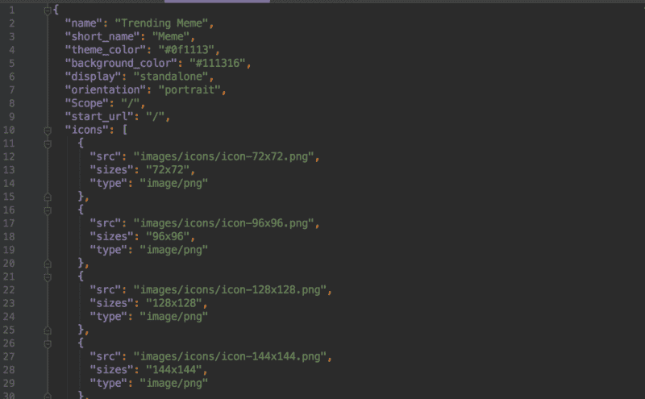
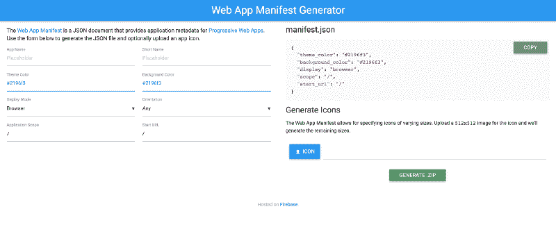

# 渐进式网络应用 101:什么，为什么和如何

> 原文：<https://www.freecodecamp.org/news/progressive-web-apps-101-the-what-why-and-how-4aa5e9065ac2/>

#### 什么是渐进式网络应用？为什么我们需要一个？我们如何建造一个？

在浏览网站时，你见过像上面这样的“添加到主屏幕”横幅吗？当你点击按钮时,“应用程序”会在后台自动安装。当你打开这个现在放在你的应用抽屉里的应用程序时，你可以在浏览器上浏览同样的体验，但现在是在你的手机上。

你现在拥有的是从网络应用程序下载的移动应用程序。所有这一切，甚至不用看到应用程序商店的脸。

获得应用程序是如此容易！但这还不是最精彩的部分。当您打开此应用程序时，即使没有互联网，您也可以浏览内容。您可以离线访问该应用程序！多酷啊。

你遇到的是一个渐进式网络应用程序(PWA)。PWA 允许您从浏览器窗口安装应用程序，可以像本机应用程序一样在手机上使用，也可以像本机应用程序一样离线工作。

但是对于一个 web 应用程序来说，进步到底意味着什么呢？让我们更深入地了解什么是渐进式 web 应用程序，为什么我认为它们比原生应用程序更好，以及它们与传统 web 应用程序的不同之处。

### 什么是渐进式网络应用程序(PWA)？

渐进式网络应用这个术语是由亚历克斯·罗素和弗朗西斯·贝里曼创造的。用亚历克斯的话说:

> 渐进式网络应用程序只是服用了所有正确维生素的网站。

它不是一个新的框架或技术。它是使 web 应用程序的功能类似于桌面或移动应用程序的一组最佳实践。他们的梦想是拥有如此统一和无缝的体验，以至于用户无法区分渐进式网络应用和原生移动应用。

渐进式 web 应用程序通过渐进式增强提供用户体验。这实质上意味着 PWA 将在新 iPhone 8 上执行与旧款 iPhone 相同的功能。当然，一些功能可能不可用，但应用程序会继续工作，并像它应该的那样执行。

### 为什么我们需要一个进步的网络应用？

在我们理解为什么我们需要一个进步的 web 应用程序之前，让我们来谈谈我们今天在本地和 web 应用程序方面面临的一些挑战。

**网速**:你可能没有意识到这一点，取决于你住在哪里，但世界上 60%的人口仍在使用 2G 互联网。甚至在美国，一些人不得不使用拨号上网。

**网站加载缓慢:**你知道如果一个网站太慢，用户要等多久才能点击“关闭 X”按钮吗？三秒钟！如果一个网站太慢，53%的用户会放弃它。

**高摩擦:**人们不想安装原生 app。普通用户一个月安装 0 个应用程序。

**用户参与度:**用户大部分时间花在原生应用上，但移动网络覆盖范围几乎是原生应用的三倍。因此，大多数用户并不积极参与。然而，用户 80%的时间只花在他们最喜欢的三款原生应用上。


User engagement on mobile web vs apps

艾滋病有助于解决这些问题。使用渐进式 web 应用程序有多种原因，但以下是它提供的一些顶级功能:

1.  ast: PWAs 提供持续快速的体验。从用户下载应用程序的那一刻到他们开始与之互动的那一刻，一切都发生得非常快。因为可以缓存数据，所以即使不打网络，再次启动 app 也是极快的。
2.  集成的用户体验:pwa 的感觉和行为就像本地应用。它们位于用户的主屏幕上，像本地应用程序一样发送推送通知，并像本地应用程序一样访问设备的功能。这种体验感觉天衣无缝，浑然一体。
3.  可靠的体验:在服务人员的帮助下，即使在网络出现故障的情况下，我们也能可靠地在用户的屏幕上绘制图像。
4.  参与:因为我们可以向用户发送通知，我们可以通过让用户得到通知并参与到应用中来，从而真正提高参与度。

总之就是**火。**


### 如何构建渐进式 Web 应用程序

谷歌为渐进式网络应用发布了一份项目清单。我将介绍成为 PWA 申请的四个最低要求:

#### 1.Web 应用程序清单



A sample manifest.json file

这只是一个`json`文件，给出了关于 web 应用程序的元信息。它包含应用程序图标(用户在应用程序抽屉中安装后会看到它)、应用程序背景颜色、应用程序名称、简称等信息。我们可以自己编写这个清单文件，也可以使用[工具](https://app-manifest.firebaseapp.com/)为我们生成一个。



You can auto-generate manifest file using Google’s tools.

#### 2.服务人员

服务工作器是事件驱动的工作器，在应用程序的后台运行，充当网络和应用程序之间的代理。他们能够拦截网络请求，并在后台为我们缓存信息。这可用于加载离线使用的数据。它们是一个`javascript`脚本，监听获取和安装等事件，并执行任务。

这里有一个例子`serviceworker.js`

```
self.addEventListener('fetch', event => {
    //caching for offline viewing
    const {request} = event;
    const url = new URL(request.url);
    if(url.origin === location.origin) {
        event.respondWith(cacheData(request));
    } else {
        event.respondWith(networkFirst(request));
    }
});
async function cacheData(request) {
    const cachedResponse = await caches.match(request);
    return cachedResponse || fetch(request);
}
```

#### 3.图标

当用户在他们的应用抽屉中安装 PWA 时，这用于提供应用图标。jpeg 图像就可以了。我在上面强调的 manifest 工具有助于为多种格式生成图标，我发现它非常有用。

#### 4.在 HTTPS 服役

为了成为 PWA，web 应用程序必须通过安全网络提供服务。有了 Cloudfare 和 LetsEncrypt 这样的服务，获得 SSL 证书真的很容易。成为一个安全的站点不仅是一个最佳实践，它还将您的 web 应用程序建立为一个可信的站点，向用户展示信任和可靠性，并避免中间人攻击。

注意:这是 2 部分系列的第 1 部分。在下一部分中，我们将使用骨架 index.html 从头开始创建一个渐进式 Web 应用程序。[点击此处查看第 2 部分。](https://medium.freecodecamp.org/progressive-web-apps-102-building-a-progressive-web-app-from-scratch-397b72168040)

你学到新东西了吗？有评论？知道一个笑话吗？[发微博给我@shrutikapoor08](https://twitter.com/shrutikapoor08)

> 为什么程序员会分不清万圣节和圣诞节？因为 10 月 31 日= 12 月 25 日[#发展笑话](https://twitter.com/hashtag/DevJokes?src=hash&ref_src=twsrc%5Etfw)#工作笑话
> 
> — Shruti Kapoor (@shrutikapoor08) [June 22, 2018](https://twitter.com/shrutikapoor08/status/1010257045566586880?ref_src=twsrc%5Etfw)