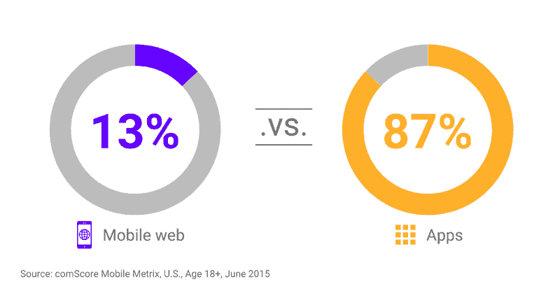
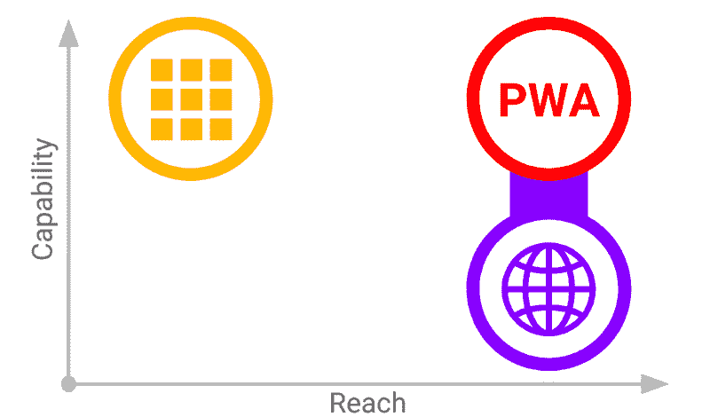
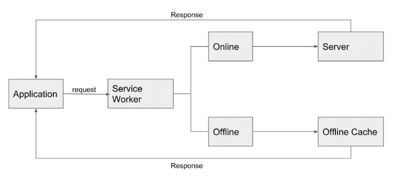
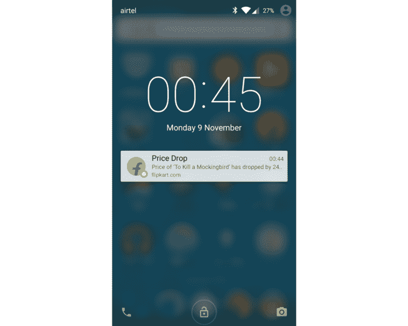
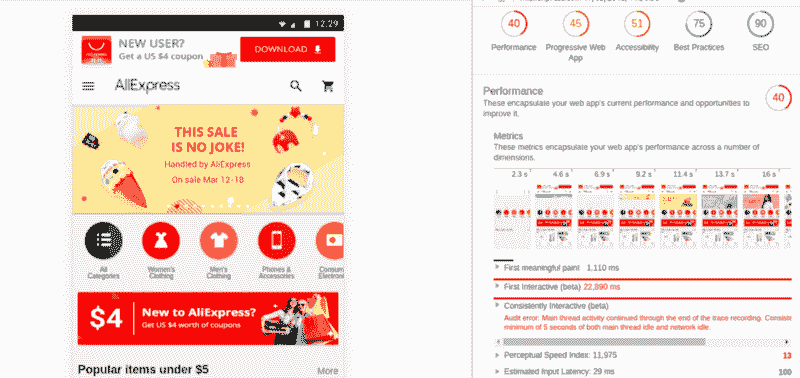
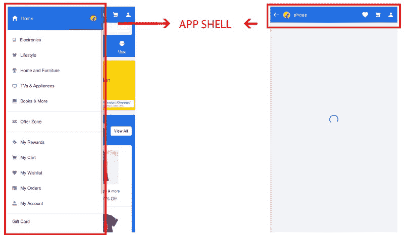
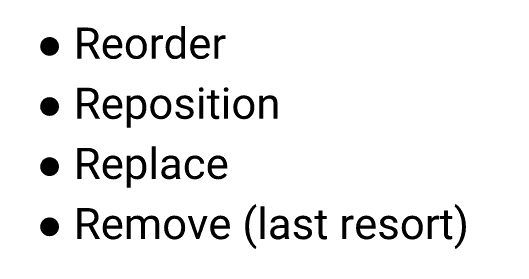
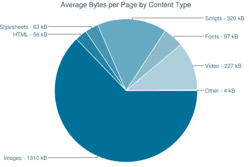
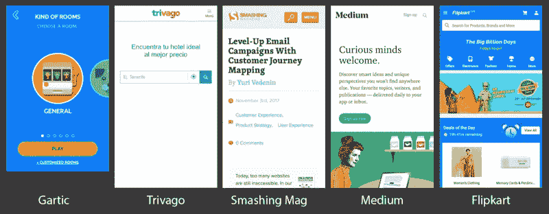

# 渐进式网络应用:弥合网络和移动应用之间的鸿沟

> 原文：<https://www.freecodecamp.org/news/progressive-web-apps-bridging-the-gap-between-web-and-mobile-apps-a08c76e3e768/>

作者 Ajay NS

# 渐进式网络应用:弥合网络和移动应用之间的鸿沟


除非你一直生活在岩石下，否则你可能听说过 PWAs 或渐进式网络应用。它现在是一个热门话题，因为它在多个平台上的支持正在增加，主要公司正决定开发他们的 web 应用程序的 PWA 版本，包括 Twitter，Lyft，Starbucks，NASA 等。

最近，当苹果宣布对 Safari 的服务工人和网络清单支持时，它获得了更多的关注。微软将 PWA 带到了 Windows 商店，Chrome 对所有平台都有实验性的 PWA 支持。

好的，这应该足以让你相信它们值得一试。

所以这篇文章总结了渐进式 Web 应用程序所遵循的概念和方法。我根据自己的经验写了这篇文章，并且在经历了[谷歌渐进式网络应用培训](https://developers.google.com/web/ilt/pwa/)之后，我概述了这篇文章。

该培训很好地解释了一切是如何协同工作的，并且直接带您进入代码。Udacity 的[移动网络专家课程](https://goo.gl/nvzoPG)在这方面也能有所帮助。

### 为什么是 PWA？



*Time spent by average users on Web vs Apps*

web 是独立于操作系统的，可广泛访问，是互联网上最大的平台。然而，我们看到用户花在本地应用上的时间比花在网络上的时间多得多。

为什么会这样呢？

主要原因是本地应用提供的流畅体验和参与度。我们把这些特性带到网络应用中怎么样？这意味着结合了网络的易用性和影响力(是原生应用的 3 倍)，以及原生应用的沉浸式体验。

根据创造了这个术语的亚历克斯·罗素的说法，艾滋病毒是:

> 只是一些网站提供了所有正确的维生素

这些维生素只是我们添加到 Web 应用程序中的本地应用程序的功能，以获得两个世界的最佳效果。你可以直接从网上访问的应用程序，工作起来更流畅更快，可以安装，甚至可以有通知。



Comparing web, native and progressive web apps, from Google’s PWA training

### 是什么造就了他们

根据[谷歌](https://developers.google.com/web/progressive-web-apps/)的关键特征:

1.  **可靠:**离线优先，这意味着即使在网络连接不良或没有网络连接的情况下，它也应该提供接口。但这也不意味着该应用程序应该能够在离线时工作，而是在所有网络条件下提供不间断的服务。
2.  **快速:**即时加载，甚至在加载内容上也有流畅的体验。
3.  **引人入胜:**应该提供一种身临其境的体验，相当于原生应用的体验。可以有推送通知、Web 支付或凭证管理等等。可安装性也是这里的一个关键特性。

但这些只是概念——我们如何从技术角度考虑实现？三星互联网的 [Peter O'Shaughnessy](https://medium.com/@poshaughnessy?source=post_header_lockup) 对此有一个很好的方法:


PWA Standards

所以让我们一个一个地来看看:

### 服务行业人员

它是一个 JavaScript 文件，在后台独立于主浏览器线程运行，拦截网络请求，缓存资源，并为包括推送通知、后台同步和缓存在内的多个 API 提供基础。



Flow diagram for Service Workers intercepting network requests

服务人员在后台单独运行的能力有助于为应用程序提供许多功能，即使在关闭时也是如此，从而提供更类似于原生应用程序的迷人体验。

它还有助于使应用程序离线，因为它充当服务器和应用程序之间的代理。

关于服务人员的介绍可以在这里找到，谷歌在他们的[服务人员工具箱里有一些开源的助手。](https://github.com/GoogleChromeLabs/sw-toolbox)

### HTTPS

超文本传输协议安全是对使用 SSL 或 TLS 加密的安全 HTTP 通信的改编。但是我们不要深入探讨这个问题，相反，我们要深入探讨它为什么重要的原因。

除了 pwa 被认为是高度安全的这一事实之外，它们所使用的服务人员可以拦截网络请求并修改响应。这很容易被利用来造成严重的攻击。有很多服务可以帮助你的网站获得 SSL 证书，比如 [LetsEncrypt](https://letsencrypt.org/) 和 [SSLforfree](https://www.sslforfree.com/) 。

### Web 应用程序清单

基本上，这是一个 JSON 文件，它给出了应用程序在主屏幕、网络上应该是什么样子的信息。它可以用来添加一个主题颜色，主屏幕的图标，闪屏等等。


一个简单的清单如下所示:

```
{  "name": "HackerWeb",  "short_name": "HackerWeb",  "start_url": ".",  "display": "standalone",  "background_color": "#fff",  "description": "A simply readable Hacker News app.",  "icons": [{    "src": "images/touch/homescreen48.png",    "sizes": "48x48",    "type": "image/png"  }, {    "src": "images/touch/homescreen72.png",    "sizes": "72x72",    "type": "image/png"  }, {    "src": "images/touch/homescreen96.png",    "sizes": "96x96",    "type": "image/png"  }, {    "src": "images/touch/homescreen192.png",    "sizes": "192x192",    "type": "image/png"  }],  "related_applications": [{    "platform": "play",    "url": "https://play.google.com/store/apps/details?id=cheeaun.hackerweb"  }]}
```

它使应用程序看起来更加友好，所有的图标，主题和闪屏都更加友好。它只需要一个 JSON 文件就可以安装。

在 Mozilla 的[网络文档](https://developer.mozilla.org/en-US/docs/Web/Manifest)中阅读更多关于它们的内容，并在这里生成一个。

对于不同大小的图标，你可以通过使用[图标生成器](https://www.favicon-generator.org/)和主题从一张高质量的图片中生成它们。背景颜色可以从应用程序的调色板中选择。

### 推送通知和后台同步

服务器将推送消息传递给服务工作者，服务工作者截取并更新本地状态，或者向用户显示通知。由于它们作为后台进程独立运行，即使应用程序关闭，这也是可能的。 [Push API](https://developer.mozilla.org/en-US/docs/Web/API/Push_API) 可以帮你实现这个功能。



[后台同步 API](https://www.chromestatus.com/feature/6170807885627392) 将定期更新推送到服务器，这样应用程序就可以在线更新。基本上，它可以确保在连接良好的情况下发送所有消息。

### 其他概念

下面是构建渐进式 Web 应用程序时需要遵循的一些方法和标准。

#### 灯塔和 PWA 清单



Lighthouse audit taken for AliExpress PWA

Lighthouse 是一个自动化的工具，通过对性能、最佳实践、可访问性、SEO 和渐进式 web 应用程序标准进行审计来检查网页质量。这是一个很好的方法来检查你的应用程序是否符合标准，并看看它是一个多么好的 PWA。

你可以通过使用 Lighthouse 审计的建议以及 Google 的这个 [PWA 清单](https://developers.google.com/web/progressive-web-apps/checklist)来找出你的 web 应用程序缺少什么，以及如何改进，这个清单列出了所有要遵循的一般准则，以及如何解决问题。最棒的是，现在，Lighthouse 内置在 Chrome DevTools 中！

#### 储存；储备

据 Addy Osmani(谷歌 Chrome 团队)称，PWAs 中应遵循的最佳存储实践是:

> 将 [**缓存 API**](https://davidwalsh.name/cache) 用于 **URL 可寻址资源**(属于[服务工作者](https://developers.google.com/web/fundamentals/primers/service-worker/))。对于所有其他数据，使用 **IndexedDB** (带有[承诺](http://www.html5rocks.com/en/tutorials/es6/promises/)包装器)。

这两者都是与 web/服务工作者一起工作的异步 API。这使得它们适合与 PWAs 一起使用，不像其他方法，比如 localStorage。

要快速了解什么是 IndexedDB，您可以参考[这个](https://developers.google.com/web/ilt/pwa/working-with-indexeddb)资源。

简而言之，这是一个大规模的 noSQL 存储系统，可以存储来自浏览器的任何内容。它也是一个高性能的 API。

#### 贮藏

可以在服务工作器中使用的缓存 API 允许您存储由请求键入的响应。这允许在网络不良的情况下直接从缓存中加载内容，并且还可以进一步配置为仅加载必要的数据，而其他一切都依赖于缓存。



Example for app shell in Flipkart Lite PWA

离线优先和类似原生应用程序的体验方法的流行模式之一是缓存应用程序外壳。这包括所有基本的 HTML、CSS 和 JavaScript，它们组成了导航/工具栏或整个布局中常见的任何东西。因此，应用程序外壳会立即加载，并在获取内容时显示加载屏幕，从而提供简化的体验。

#### 获取和承诺

对于获取资源，最新的和推荐的方法是使用带有承诺的获取 API。

```
// A basic fetch example with promisesfetch(‘examples/example.json’).then(function(response) {   // Do stuff with the response}).catch(function(error) {   console.log(‘Looks like there was a problem: \n’, error);});
```

XMLHttpRequest (XHR)请求是不必要的冗长，回调也是如此，当使用长回调链时，会导致代码片段化和混乱。

承诺是处理异步代码的一种更好的方式。

服务工作者、缓存 API 和网络请求广泛地使用这些来执行各种任务，并且在基础级别上是必需的，因此对这些有一个正确的概念是非常重要的。

#### 响应式设计

这不仅意味着使用响应宽度单位。内容块应该根据布局的需要进行处理。该应用程序需要看起来完全适合移动设备，总体来说，它应该看起来像一个设计良好的原生应用程序。



Steps for Manipulating content

现代的 CSS 布局系统，如 [CSS Grid](https://css-tricks.com/snippets/css/complete-guide-grid/) (通过 Wes Bos 的[免费课程](https://cssgrid.io/)学习)或 [Flexbox](https://css-tricks.com/snippets/css/a-guide-to-flexbox/) 可以为管理不同屏幕尺寸的不同布局和排列提供很大帮助。

#### 图像优化



Data distribution in web apps

PWAs 的一个关键特征是它们应该非常快，你可以看到图像没有帮助。只要有可能，就需要用 SVG 替换或删除它们。Web 优化格式应该尽可能使用最小的大小。

但同样重要的是，这些图像应该流畅，并且仍然适合不同的屏幕尺寸，因为 PWAs 的另一个重要功能是其类似应用程序的本机体验。

### 故事和例子



A few real-world examples of PWAs

### 结论

随着每个服务推出一个应用程序，人们经常发现实际去商店下载它很不方便。他们讨厌在设备上花费那么多时间、移动数据和空间。这通常会将他们引向网络，这需要更少的努力。但是，我们看到了很高的跳出率，因为网络体验不像本地应用那样流畅和最佳。

这两个问题的解决方案是渐进式 Web 应用程序，它结合了两个世界的优点，提供了最佳的用户体验。

如前所述，随着所有平台对 PWAs 的支持大大增加，现在是开始的最佳时机。

[BookMyShow 的渐进式网络应用推动转化率增长 80%](https://developers.google.com/web/showcase/2017/bookmyshow)

[构建 Flipkart Lite:一款渐进式网络应用](https://medium.com/progressive-web-apps/building-flipkart-lite-a-progressive-web-app-2c211e641883)

[在一个房间里的先进网络应用的伟大范例](https://www.progressivewebapproom.com/index.html)

### 进一步阅读

[**渐进式网络应用的 6 个神话**](https://medium.com/samsung-internet-dev/6-myths-of-progressive-web-apps-81e28ca9d2b1)
[*【渐进式网络应用】(PWAs)这样的术语有助于传播概念，但它们也有被误用的风险……*medium.com](https://medium.com/samsung-internet-dev/6-myths-of-progressive-web-apps-81e28ca9d2b1)[**一个 Tinder 渐进式网络应用性能案例研究**](https://medium.com/@addyosmani/a-tinder-progressive-web-app-performance-case-study-78919d98ece0)
[*Tinder 最近刚刚在网络上刷屏。他们新开发的响应式渐进式网络应用程序——Tinder Online——现已在…*medium.com](https://medium.com/@addyosmani/a-tinder-progressive-web-app-performance-case-study-78919d98ece0)上市

将 React 应用程序转换为 pwa:

[**React 渐进式网络应用——第一部分**](https://medium.com/progressive-web-apps/react-progressive-web-apps-part-1-1cf381421672)
[*渐进式网络应用(PWA)近来越来越受欢迎，随着今年(2017 年)的一次更新…*medium.com](https://medium.com/progressive-web-apps/react-progressive-web-apps-part-1-1cf381421672)

将 Angular 应用程序转换为 pwa:

[**一个新的 Angular 服务工作者——创建自动渐进式 web 应用。第一部分:理论**](https://medium.com/progressive-web-apps/a-new-angular-service-worker-creating-automatic-progressive-web-apps-part-1-theory-37d7d7647cc7)
[*公告:有这篇文章的“第二部分:实践”可用。*medium.com](https://medium.com/progressive-web-apps/a-new-angular-service-worker-creating-automatic-progressive-web-apps-part-1-theory-37d7d7647cc7)

希望你喜欢这篇文章，并发现它是一篇好文章！你可以在 [Github](http://github.com/ajayns/) 上查看我所有的项目，不要犹豫，在 [Twitte](https://twitter.com/ajayns08) r 上联系我！