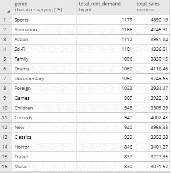
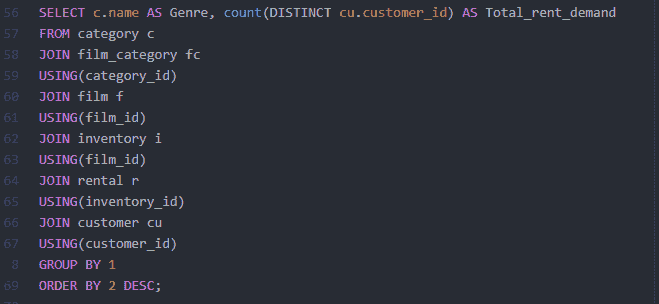
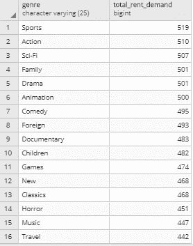
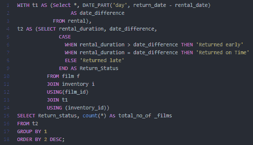
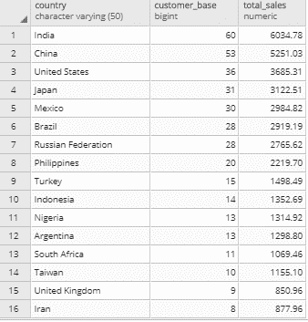
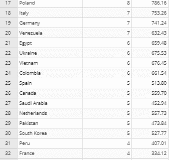
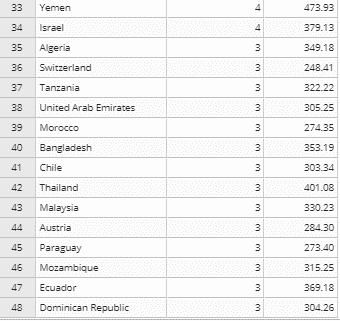
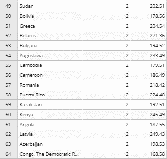
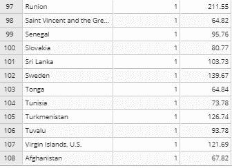

# 我如何用 SQL 分析 DVD 租赁数据

> 原文：<https://www.freecodecamp.org/news/project-1-analyzing-dvd-rentals-with-sql-fd12dd674a64/>

作者奥科·安妮塔

# 我如何用 SQL 分析 DVD 租赁数据

#### 介绍

我最近完成了一些由贝塔斯曼数据科学学院(与 Udacity 合作)提供的数据基础培训。对于一个个人项目，我决定为一家 DVD 租赁公司分析数据库，我们称之为**租一部电影**。让我们来看一个详细描述我的过程和输出的案例研究。

#### 数据集

我从查看数据库开始。数据库 **DvdRental** 有 15 个表。下面是不同的表格及其简要说明。

*   参与者—包含参与者数据，包括名字和姓氏。
*   电影—包含电影数据，如标题、发行年份、长度、分级等。
*   film_actor —包含电影和演员之间的关系。
*   类别—包含电影的类别数据。
*   film_category —包含电影和类别之间的关系。
*   商店—包含商店数据，包括经理人员和地址。
*   库存—存储库存数据。
*   租赁-存储租赁数据。
*   付款—存储客户的付款。
*   人员—存储人员数据。
*   客户—存储客户的数据。
*   地址—存储员工和客户的地址数据
*   城市—存储城市名称。
*   国家—存储国家名称。

注意:我使用 PostgreSQL 分析了这个数据库。你可以在这里获得安装 PostgreSQL [的详细信息，在这里](http://www.postgresqltutorial.com/install-postgresql/)下载 DVD 租赁数据库[。](http://www.postgresqltutorial.com/postgresql-sample-database/)

#### 目标和目的

在这个项目中，我的目标是回答以下问题:

1.  什么是最热门和最少租用(需求)的类型，它们的总销售额是多少？
2.  我们能知道有多少不同的用户租用了每个流派吗？
3.  每种类型的平均租金是多少？(从最高到最低)
4.  有多少租借的电影被晚还、早还、准时还？
5.  **租赁电影**在哪些国家有业务，每个国家的客户群是什么？每个国家的总销售额是多少？(从最多到最少)
6.  谁是总销售额的前 5 名客户，我们能得到他们的详细信息吗，以防**租电影**想要奖励他们？

在开始分析之前，我首先试图理解这个数据库的 ERM(实体关系模型),也称为 Schema。以下是模式:

[DVD RENTAL SCHEMA](http://www.postgresqltutorial.com/postgresql-sample-database/)

你可以在我的 GitHub 档案上查看我的代码。

#### 分析

要回答第一个问题***“*最热门和最少租用(需求)的流派是什么，它们的总销售额是多少？”**，我首先确定了我需要连接的表，它们是:

> **类别>电影 _ 类别>电影>库存>租金> cu** 客户>付款

下面是我用来回答这个问题的查询:

**见解**

从上表中，我们可以得出 3 个主要观点:

*   **租一部电影**有 16 种类型
*   从被租用的次数来看，体育类似乎是被租用次数最多的类别，从钱的角度来看，它的总销售额也最高。
*   就被租用的次数而言，音乐类别是最少被租用的类型，就金钱而言，其总销售额也是最低的

**问题 2:我们能知道每个流派有多少不同的用户租用过吗？简而言之，是的，我们可以。**

要连接的表如下:

> **类别>电影 _ 类别>电影>库存>租塔** l >客户

以下是我对这个问题的疑问:

**见解**

我想知道每种类型有多少不同的客户租用。查询中一个有趣的事情是，尽管音乐流派的总租借记录最少，但租借该流派的不同客户数量却最少。旅游类保持着这一记录。

后退一步，将问题 1 和问题 2 中的观点联系起来，我们可以说旅游类比音乐类被再次租赁的次数更多。

当然，体育类有最多的独特客户租用该类型。

**问题 3:每个流派的平均租金是多少？**(从最高到最低)

要连接的表如下:

> **类别>电影 _ 类别>T1；电影**

以下是我对这个问题的疑问:

**见解**

我想看看某个类别被租借的次数是否与每个流派的平均租借率有关。从上表中，我们可以很容易地得出结论，平均租金可能不是一个因素。

虽然游戏类型的平均租赁率最低，但它是五大租赁类型之一。令人惊讶的是，音乐类型并不是最贵的——动作才是，尽管动作类型是租用最多的类型之一。

我们可以有把握地说，大多数顾客是体育相关电影的爱好者，对音乐电影最不感兴趣。

**问题 4:有多少租来的片子是晚还、早还、准时还的？**

要连接的表如下:

> **电影>库存>出租**

**见解**

电影的归还状态可以说是 DVD 租赁业务中最重要的监控方面之一。根据上面的查询，48%的电影在到期日之前被归还，而 41%的电影被延迟归还，11%的电影按时到达。

可能有很多因素导致这种情况发生，比如这些电影从商店的运输距离可能完全超出顾客的控制等等。我们需要更深入地研究数据，以获得问题的要点。

然而，值得注意的是，有很大一部分电影被延迟归还。对迟到收取罚款可能是一种额外的收入来源，反过来也会阻碍迟到的回报。

但是，只有当我们知道为什么这个问题会发生时，这样的决定才有意义。

问题 5:电影租赁在哪些国家有业务，每个国家的客户群是什么？每个国家的总销售额是多少？(从最多到最少)

要连接的表如下:

> **国家>城市>地址>客户** >付款

请参见下面的查询:

**见解**

**租一部电影**在 108 个国家开展业务，其中印度拥有最多的客户群(60 个客户)和最大的销售额。尽管阿富汗不是唯一一个客户群最小的国家，但其销售额却是最小的

问题 6:销售额最高的 5 个客户是谁？我们能得到他们的详细信息吗？以防万一电影租赁公司想要奖励他们？

要连接的表如下:

> **国家>城市>地址>客户** >付款

请参见下面的查询:

**见解**

假设我们希望向顶级客户奖励或发送实物礼物，上表显示了他们的全名、地址、电子邮件等。

这些信息可以发送给公司的营销团队，以便使用他们的领域知识来决定如何奖励他们。

### 结论

在这个项目中，我们分析了一家 DVD 租赁公司的数据，我们决定称之为**“租一部电影”**，以了解客户及其偏好。我们得到了 3 个主要结论:

1.  该公司拥有热爱体育的客户，他们建议库存更多与体育相关的电影，以增加音乐相关电影的总销售额。这将是一个好主意，提高体育类型电影的平均租赁率，因为它不是客户租赁的主要因素。这反过来增加了总收入。然而，需要做进一步的分析才能得出结论。
2.  通过对后期电影的收费，有可能获得额外的收入来源。
3.  《电影租赁》在 108 个国家开展业务，其中印度是人员和收入最大的市场。此外，他们所在的 20%的国家贡献了 80%的总客户群。

像我一样，任何人都可以学习成为一名数据分析师，如果你想了解我的下一个项目或我学习的最新进展，请随时注册我的[简讯](https://goo.gl/forms/aEbTwhSXRDAUa5tr1)