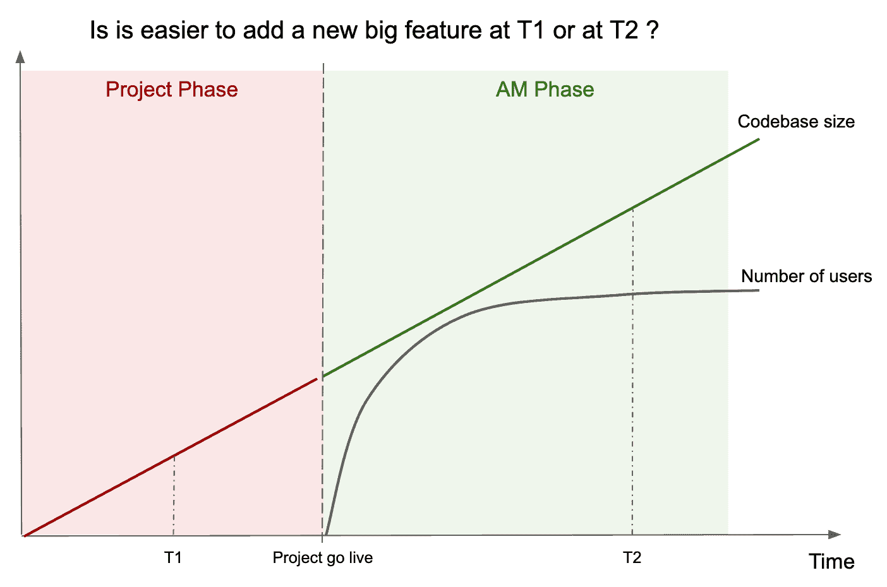

# 基于项目的团队和基于产品的团队——哪个更适合构建软件？

> 原文：<https://www.freecodecamp.org/news/project-based-to-product-based-teams-in-software-development/>

假设你要给一个应用添加一个**新的主要特性**。

一个**相对较小的 app** ，还在建设中，还没有投产，是不是更容易加入这个主要功能？或者是在一个随着时间的推移而增长的**大应用**上更容易，它的整体质量是有问题的，并且已经在生产中运行，为几个客户服务？

嗯，毫无疑问。第二项任务更具挑战性。

那么，为什么我们通常会发现最有经验的开发人员、架构师——即“酷孩子”——主要参与开发那些较小的应用程序，而其他人却经常埋头于大型项目呢？

## 我的故事

很多年前，我加入了开发团队，负责一家大公司的核心系统。我得到的第一个职位是应用程序维护(AM)团队，负责应用程序的遗留部分。

原因很简单，我也知道:我刚到这个地方，新项目进展很快。他们使用的是没有多少经验的前沿技术。所以 AM 是一个适合我成长的地方，没有太多的压力。

他们告诉我，一旦我积累了足够的知识和经验，我就会加入项目团队。这是一个用新技术开发新特性的团队，一个由经验丰富的开发人员组成的团队。

大约一年后，这真的发生了，但我永远不会忘记那段据说不那么紧张的 AM 时期。

## 项目团队和 am 团队

所有这些都是多年前的事了，但从那以后，我看到同样的模式重复了很多次，而且往往是以更极端的形式。

当你有一个新的计划时，你从项目团队开始。项目团队开发架构和特性。项目团队相对于一个非常乐观的初始计划累积延迟，然后他们开始加班加点，一路上偷工减料。

质量经常被牺牲在计划的祭坛上，测试被遗忘，补丁被添加到补丁之上。开发人员开始添加注释，“一旦我们有时间，就进行重构”。技术债务已经存在，而且只会越来越多。

最终，产品投入生产，然后，在产品投入使用后，项目团队立即开始向 am 团队过渡。

经过一段重叠时间后，AM 团队独自航行。AM 团队通常更年轻，经验更少，被认为不如项目团队强大。

但是最困难的部分已经过去了，这个项目现在已经上线了。现在是 AM 时代——更容易，成本更低，而且公司可以负担得起一个新的初级团队。

## 上线一年后

快速前进，这是紧张工作的一年。修正了 bug，改了小东西，加了小东西。

该系统最终准备好支持实际生产负载，代码库也有所增长。此时，AM 团队收到一个添加新的大特性的请求。

我们又回到了最初的问题。现在添加新功能更容易，还是在项目模式下添加新功能更容易？

答案很清楚:AM 团队的任务要困难得多。诚然，AM 团队正坐在他们长期积累的经验上。但与此同时，AM 团队需要处理不太稳定的代码库，避免在没有合适的测试安全网的情况下引入回归，并设计一种方法来部署新的主要版本而不造成中断。

说吧。AM 团队经常面临比项目团队更艰难的工作。那么，如果 AM 团队的任务更艰巨，为什么所有有经验的开发人员都在项目团队中工作(并且现在在其他地方，可能在做其他很酷的事情)？

## 一个可能的答案是:项目团队需要打下正确的基础

让最有经验的人开始一个项目的一个原因是，在开始时，我们需要为将要发生的事情打下基础。我们需要定义架构，并对解决方案的设计做出一些基本决定，因此需要正确的体验。

但同时，在一个项目的开始，我们通常对需要解决的问题只有有限的了解。

在任何重大项目的开始，都有许多已知的未知，也有许多未知的未知。由于这个原因，系统的架构总是被认为是进化的。我们需要意识到，许多关键的决定不能在一开始就做出，而必须在未知开始显露出来时做出。

在项目开始时，架构决策很少能够一劳永逸。在软件系统的生命周期中，关键的架构问题可能会随时出现。在项目开始时做出的那些关键决策可能不得不在以后进行彻底检查——也许是因为新的需求，也许是因为像云这样的新技术，也许是因为它们对于要解决的问题来说是错误的。

所以，是的，这是真的，项目团队必须做出架构决策。但是 AM 团队必须做出架构决策，并且必须在更复杂的环境中做出这些决策。

### 你不能反过来做

虽然一个强大的项目团队后面跟着一个更初级的 am 团队的经典模式在中期内不是最有效的，但相反也不是一个答案。

大多数公司无法想象让一个初级团队开始一个项目，然后过渡到一个更高级的团队进行维护。这不是一个选项。

## 潜意识的例子

也许更多的资深人士用很酷的新技术开始新项目的一个深刻原因是，他们喜欢开始新的东西，玩新技术。但是随着时间的推移，当工作变得越来越重复时，他们就想去迎接其他的挑战。

这对他们的技术好奇心有好处，对他们的简历也有好处。但是这可能对他们正在建造的软件系统的长期健康不利。

## 从项目团队到产品团队

2006 年，亚马逊首席技术官沃纳·威格尔创造了著名的[“你建立它，你运行它”](https://queue.acm.org/detail.cfm?id=1142065)格言。它传达了这样一种思想，负责一个产品的团队需要从它的开始到它的运行阶段照顾它(其中运行涵盖了 Ops 方面以及演进方面)。

简而言之，同一个团队负责产品成功所需的所有阶段:设计、构建、运行、演进。

这是过去十年涌现的数字巨头所采用的模式，从亚马逊到脸书到 AirB&B。他们无可争议的成功证明了这种模式在数字时代是正确的。

如今，越来越多的人强调需要从面向项目的工作组织方式转向更加面向产品的模式。

这是一个复杂的转变，涉及组织的许多方面。但是对于我们在这里讨论的主题，这无疑意味着我们需要放弃分离项目和 AM 团队的想法，并创建更稳定的产品团队。

产品团队需要有经验丰富的人和更多需要成长的初级人员的适当组合。与有经验的开发人员一起工作，三年级学生自己也逐渐变得有经验。在不影响团队质量的情况下，有控制的轮换是可能的。

## 结论

在我们生活的时代，数字时代，当我们听到类似*“当项目结束时，我们将过渡到 AM”*的时候，我们应该持怀疑态度。

这并不是说不再有 AM 的空间了。仍然有旧的遗留系统，通常服务于后台办公室，非常稳定，只需要一些维护。

但是，当需要开发新的差异化数字能力时，我们需要摆脱项目/AM 模式，采用面向产品的模式。

在这个模型中，团队被设计成不仅负责构建产品的第一个版本，还负责运行它。他们从运行它的过程中学习，同时随着时间的推移对它进行改进，以确保它对最终用户保持相关性。