# 如何解决 Rust 中的工程欧拉问题

> 原文：<https://www.freecodecamp.org/news/project-euler-problems-in-rust/>

现在，您可以使用 Rust 语言解决经典的 Project Euler 编程问题。每个问题都有一个用户友好的测试套件。

这里是完整的[项目 Euler Rust GitHub 库](https://github.com/freeCodeCamp/euler-rust)。

如果你不知道 Rust，并且想学习它，你可以从 [freeCodeCamp 的交互式 Rust 课程](https://www.freecodecamp.org/news/rust-in-replit/)开始。

好吧。让我们看看如何通过 Rust 中的 Project Euler 开始工作。

## 如何在 VSCode 中本地运行项目欧拉问题

首先，你需要下载并安装 [freeCodeCamp 课程 VSCode 扩展](https://marketplace.visualstudio.com/items?itemName=freeCodeCamp.freecodecamp-courses)。

另外，确保你有微软[开发容器 VSCode 扩展](https://marketplace.visualstudio.com/items?itemName=ms-vscode-remote.remote-containers)。

然后，在一个空的工作区中，用`Ctrl/Cmd + Shift + P`打开 VSCode 命令面板。

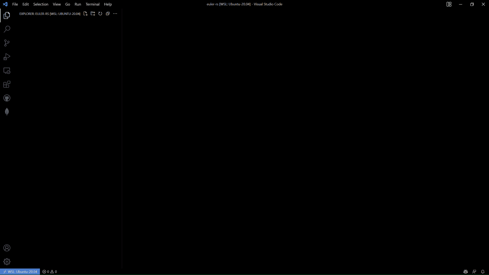

选择命令`freeCodeCamp: Open Course`。

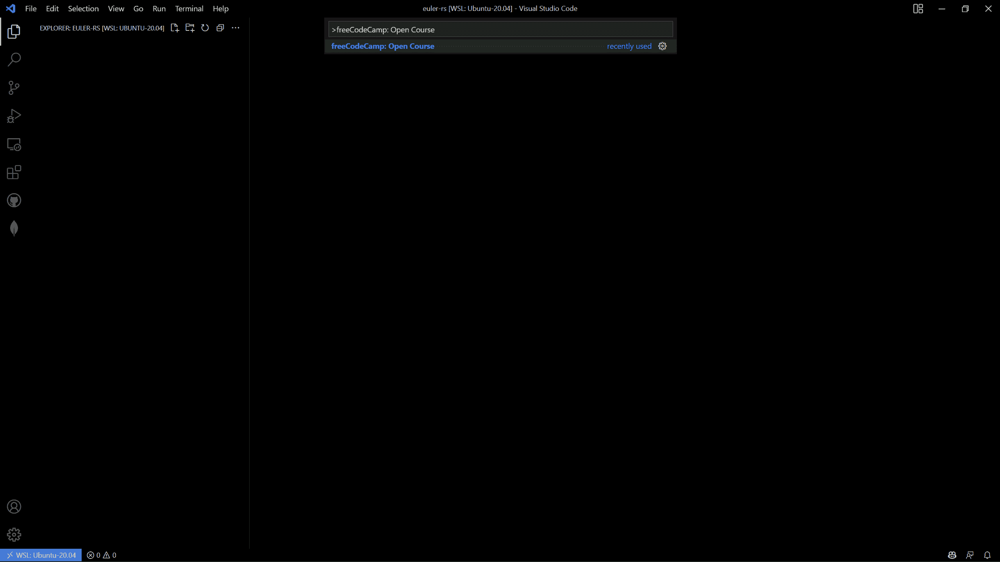

接下来，选择`Project Euler: Rust`选项。

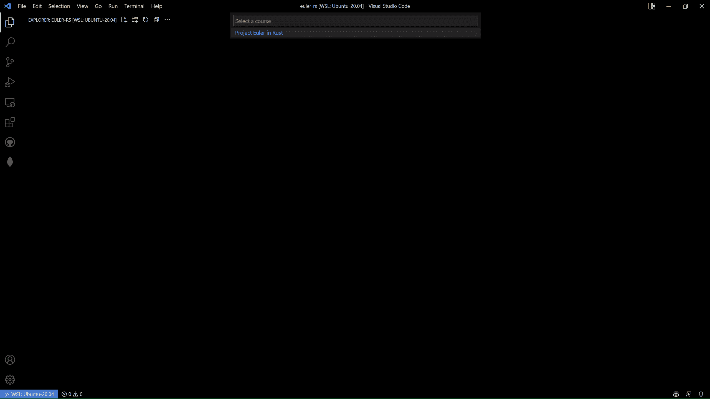

一旦课程被克隆，再次打开命令面板并选择`Dev Containers: Rebuild and Reopen in Container`。

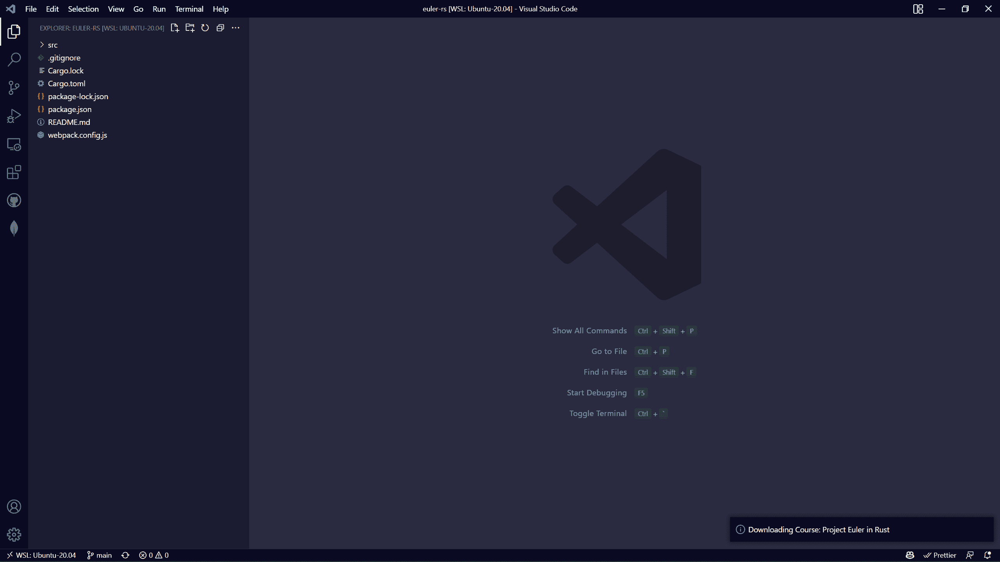

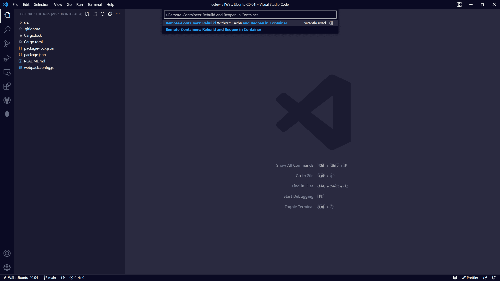

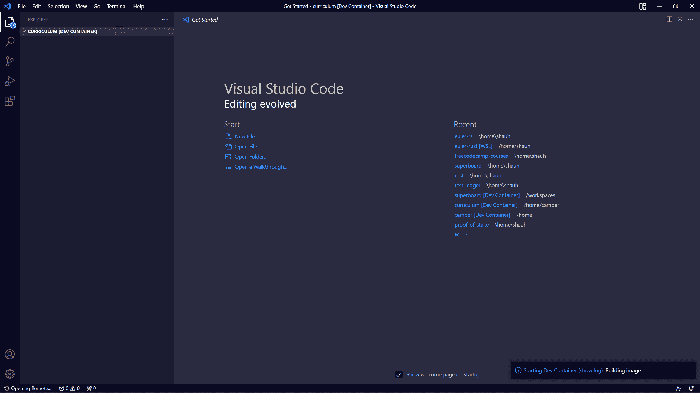

一旦构建了容器，再次打开命令面板并选择`freeCodeCamp: Run Course`。

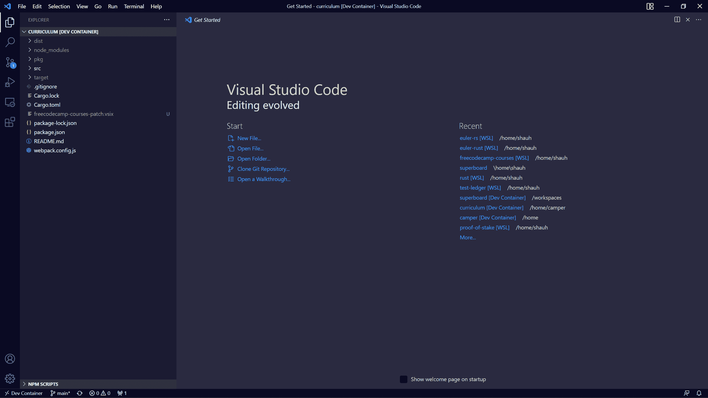

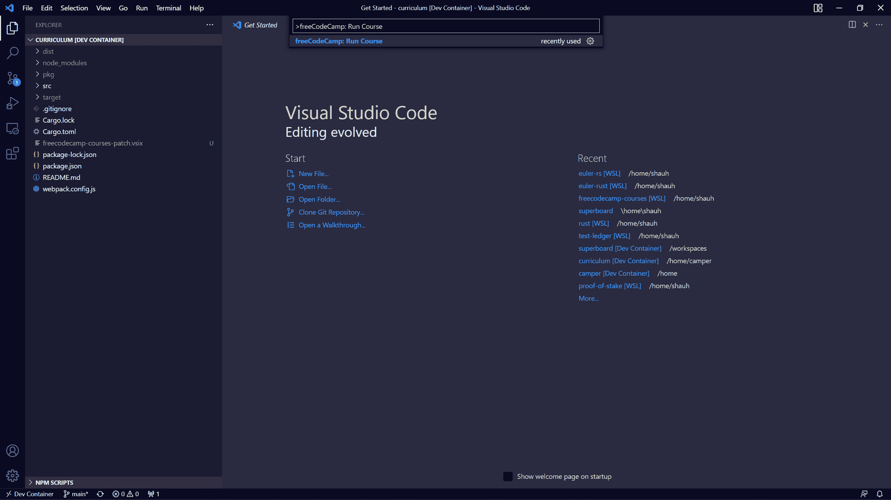


## 如何在没有扩展的情况下在本地运行项目欧拉问题

如果您更喜欢在没有 VS 代码扩展的情况下运行这些代码，您将需要派生存储库:

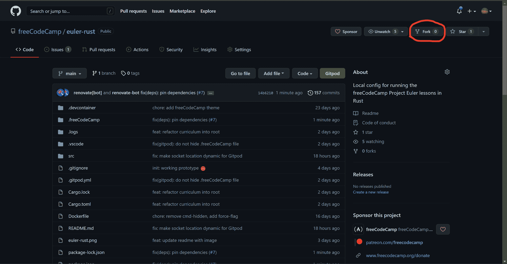

然后将您的 fork 克隆到本地机器上。

```
git clone https://github.com/<your_username>/euler-rust.git
cd euler-rust 
```

像这样构建并打开 Docker 容器:

```
docker build -f Dockerfile -t euler-rust . 
```

然后开始课程:

```
cd .freeCodeCamp && cp sample.env .env && npm run dev:curriculum && npm run start 
```

或者，您也可以用 Docker 克隆和构建容器，如下所示:

```
docker build github.com/<your_username>/euler-rust 
```

## 如何使用 Gitpod 运行项目欧拉问题

GitPod 是在浏览器中运行 VM 的流行工具，也是解决这些项目欧拉问题的另一种方法。首先，分叉存储库:


然后在 Gitpod 中打开你的叉子:`https://gitpod.io/#https://github.com/<your_user_name>/euler-rust`

或者，如果您安装了 Gitpod 浏览器扩展，您可以单击它添加到 GitHub 的`Gitpod`按钮:

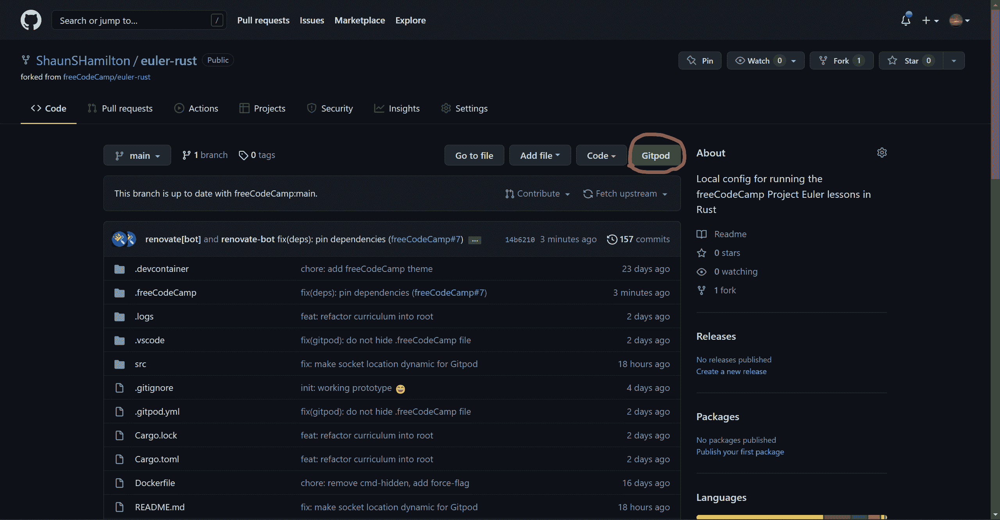

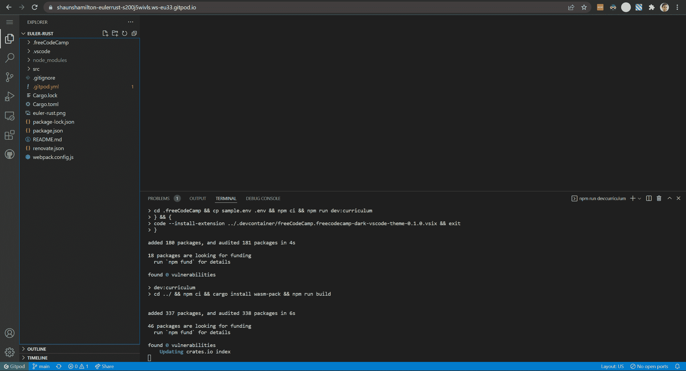

一旦设置完成，用`Ctrl/Cmd + Shift + P`打开命令面板:

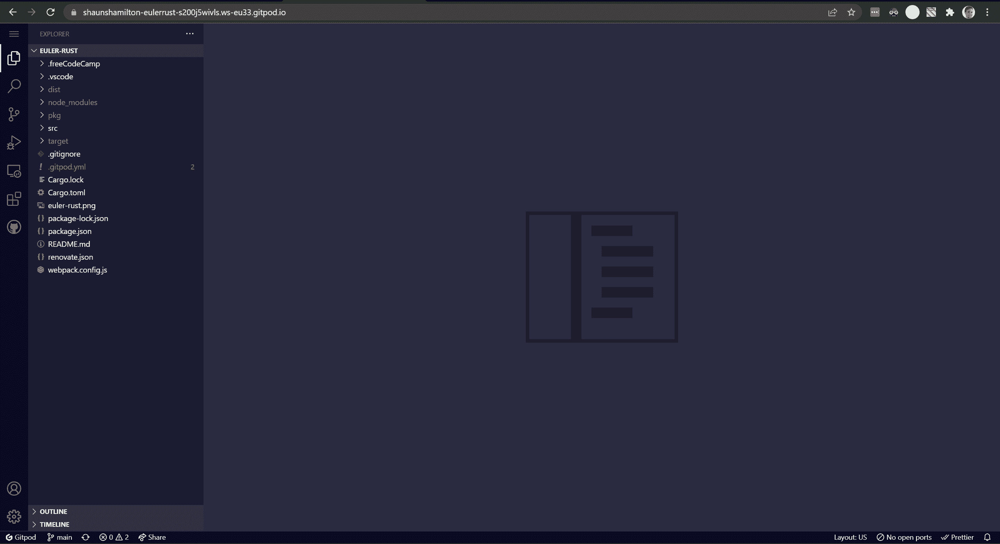

选择命令`freeCodeCamp: Run Course`。

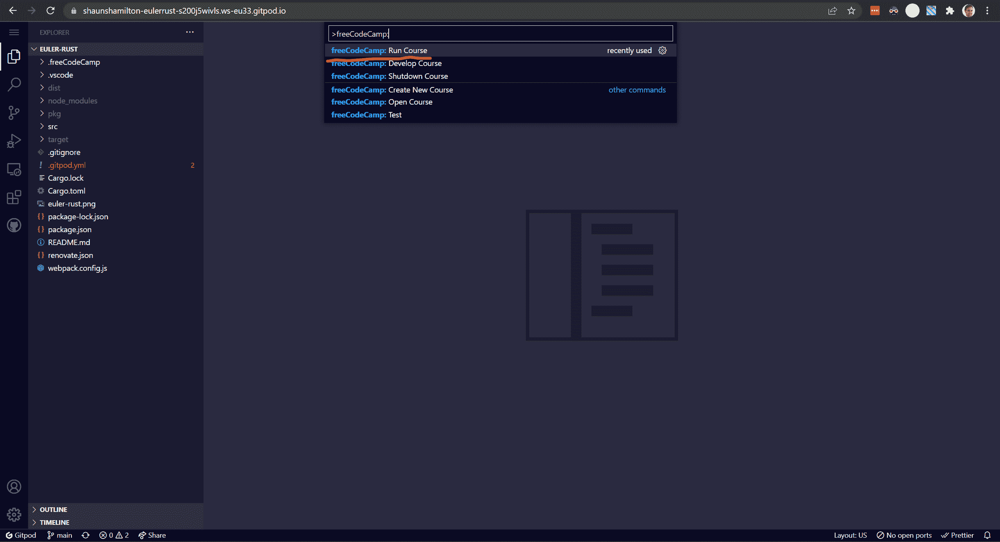

## 有用信息

*注意:*如果你在 Docker 上使用上述任何一种方法，你需要在你的机器上安装 Docker，并运行守护进程。

您应该只需要编辑`src/lib.rs`文件，并且您可以按照那里的示例代码开始。

要编译您的代码，在运行测试之前，运行:

```
npm run build 
```

如果你在任何时候遇到困难，我建议你去 WASM 那里查看更多关于 [Rust 的信息。否则，您可以在](https://www.rust-lang.org/what/wasm)[免费代码营论坛](https://forum.freecodecamp.org/)上随意打开一个新话题。

## 项目如何运作

首先，在`src/lib.rs`中输入您的 Rust 代码:

```
use wasm_bindgen::prelude::*;

// Example format to write functions:
#[wasm_bindgen(js_name = camelCaseName)] // js_name must equal function name tested on client
pub fn snake_case_name(num: i32) -> i32 { // Function must be public
    // All numbers in JS are 32-bit
    num
} 
```

使用`wasm-pack`将铁锈转化为 JavaScript 代码:

```
import * as wasm from "./curriculum_bg.wasm";

/**
 * @param {number} n
 * @returns {number}
 */
export function camelCaseName(num) {
  var ret = wasm.camelCaseName(num);
  return ret;
} 
```

然后，Webpack 再次将 JavaScript 转换成 ES5-valid 包，因为测试是在 Node.js 中运行的。

## 常见问题(FAQ)

> 这些工程欧拉问题会在其他编程语言中可用吗？

我们欢迎所有对 freeCodeCamp 社区的善意贡献。所以，如果你有兴趣在资源库的一个分支上开发，请这样做！

> 我可以在我的 freeCodeCamp.org 帐户上保存我的进度吗？

还没有，但这是我们可以进一步研究的事情。

> 停靠步骤需要很长时间。有没有更快上手的方法？

好吧，如果您有毅力在本地机器上安装所有必要的工具，您可以在项目中简单地运行以下命令:

```
cd .freeCodeCamp
npm ci
cp sample.env .env
npm run dev:curriculum 
```

```
cd ..
npm run build 
```

现在，您应该能够打开浏览器并导航到`http://localhost:8080/`，然后开始。