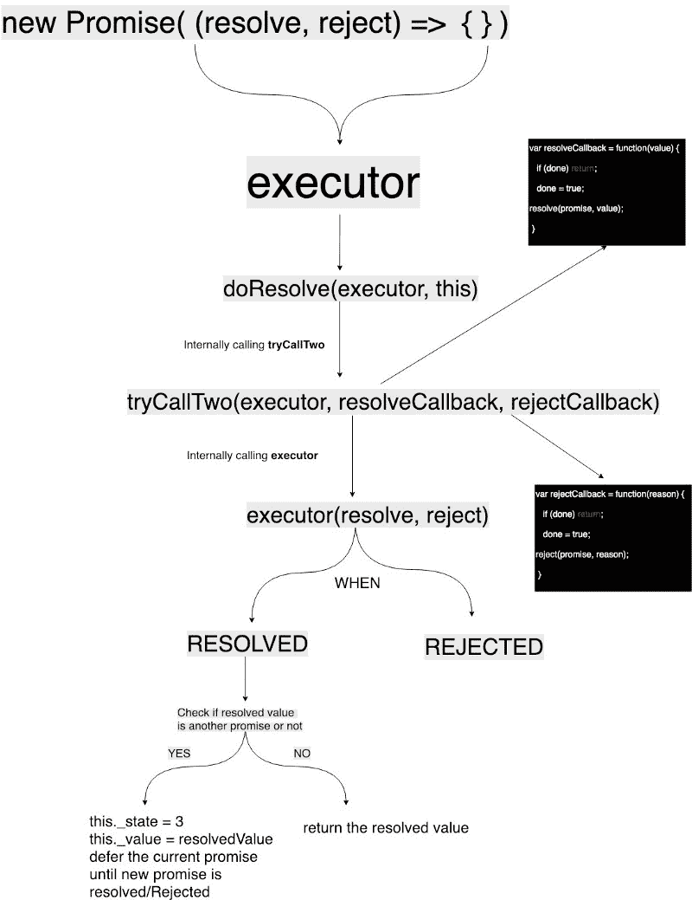

# JavaScript 承诺是如何从内到外发挥作用的

> 原文：<https://www.freecodecamp.org/news/promises-in-javascript-explained-277b98850de/>

我在面试中面临的最重要的问题之一是承诺是如何实现的。由于 async/await 变得越来越流行，您需要理解承诺。

### 什么是承诺？

promise 是一个对象，它表示一个异步操作的结果，该操作要么被解决，要么被拒绝(有原因)。

有三种状态

*   **应验了:** `onFulfilled()`将被调用(如`resolve()`被调用)
*   **被拒绝:** `onRejected()`将被调用(如`reject()`被调用)
*   **待定:**尚未履行或拒绝

让我们看看它是如何实现的:

[https://github.com/then/promise/blob/master/src/core.js](https://github.com/then/promise/blob/master/src/core.js)

根据 Mozilla 在[的定义:它接受一个*执行器*函数作为参数。](https://developer.mozilla.org/en-US/docs/Web/JavaScript/Reference/Global_Objects/Promise#Parameters)

```
function noop() {} 

function Promise(executor) {
  if (typeof this !== 'object') {
    throw new TypeError('Promises must be constructed via new');
  }
 if (typeof executor !== 'function') {
   throw new TypeError('Promise constructor\'s argument is not a function');
 }
  this._deferredState = 0;
  this._state = 0;
  this._value = null;
  this._deferreds = null;
  if (executor === noop) return;
  doResolve(executor, this);
}
```

看起来像一个简单的函数，一些属性被初始化为`0`或`null`。以下是一些需要注意的事项:

`**this._state**` 属性可以有三种可能的值，如上所述:

```
0 - pending

1 - fulfilled with _value

2 - rejected with _value

3 - adopted the state of another promise, _value
```

它的值是`0` ( ***【待定】)*** 当你创建一个新的 ***承诺时。***

后来`doResolve(executor, this)`被`executor and promise`对象调用。

让我们继续讨论`doResolve`的定义，看看它是如何实现的。

```
/**
* Take a potentially misbehaving resolver function and make sure
* onFulfilled and onRejected are only called once.
*
* Makes no guarantees about asynchrony.
*/

function doResolve(fn, promise) {
  var done = false;
  var resolveCallback = function(value) {
      if (done) return;
      done = true;
      resolve(promise, value);
 };
 var rejectCallback = function(reason) {
   if (done) return;
   done = true;
   reject(promise, reason);
};

var res = tryCallTwo(fn, resolveCallback, rejectCallback);
  if (!done && res === IS_ERROR) {
    done = true;
    reject(promise, LAST_ERROR);
 }
}
```

这里，它再次用执行器和 2 个回调函数调用`tryCallTwo`函数。回调再次调用`resolve`和`reject`

这里使用了`done`变量来确保承诺只被解决或拒绝一次，因此如果您尝试多次拒绝或解决承诺，那么它将返回，因为`done = true`。

```
function tryCallTwo(fn, a, b) {
   try {
    fn(a, b);
   } catch (ex) {
     LAST_ERROR = ex;
     return IS_ERROR;
  }
}
```

这个函数用两个参数间接调用主`executor`回调。这些参数包含如何调用`resolve`或`reject`的逻辑。您可以在*上方的`doResolve`函数中检查 *resolveCallback* 和 *rejectCallback* 。*

如果在执行过程中出现错误，它会将错误存储在`LAST_ERROR`中并返回错误。

在我们跳到`resolve`函数定义之前，让我们先看看`.then`函数:

```
Promise.prototype.then = function(onFulfilled, onRejected) {
   if (this.constructor !== Promise) {
     return safeThen(this, onFulfilled, onRejected);
   }
   var res = new Promise(noop);
   handle(this, new Handler(onFulfilled, onRejected, res));
   return res;
};

function Handler(onFulfilled, onRejected, promise) {
   this.onFulfilled = typeof onFulfilled === "function" ? onFulfilled  : null;
   this.onRejected = typeof onRejected === "function" ? onRejected :  null;
   this.promise = promise;
}
```

所以在上面的函数中，创建了新的`promise`，并将其作为属性分配给一个名为`Handler`的新函数。`Handler`函数有参数*on completed*和 *onRejected。*稍后，它将使用该承诺来解决或拒绝有价值/原因的问题。

如您所见，`.then`函数再次调用了另一个函数:

```
handle(this, new Handler(onFulfilled, onRejected, res));
```

#### 实施:

```
function handle(self, deferred) {
  while (self._state === 3) {
    self = self._value;
  }
  if (Promise._onHandle) {
    Promise._onHandle(self);
  }
  if (self._state === 0) {
     if (self._deferredState === 0) {
         self._deferredState = 1;
         self._deferreds = deferred;
         return;
    }
    if (self._deferredState === 1) {
       self._deferredState = 2;
       self._deferreds = [self._deferreds, deferred];
       return;
    }
    self._deferreds.push(deferred);
    return;
 }
   handleResolved(self, deferred);
}
```

*   有一个 while 循环，它将继续将解析的承诺对象分配给当前承诺，该承诺也是对`_state === 3`的承诺
*   如果`_state = 0(pending)`和承诺状态已经被推迟，直到另一个嵌套承诺被解析，其回调被存储在`self._deferreds`中

```
function handleResolved(self, deferred) {
   asap(function() { // asap is external lib used to execute cb immediately
   var cb = self._state === 1 ? deferred.onFulfilled :     deferred.onRejected;
   if (cb === null) {
       if (self._state === 1) {
           resolve(deferred.promise, self._value);
       } else {
         reject(deferred.promise, self._value);
       }
      return;
  }
  var ret = tryCallOne(cb, self._value);
    if (ret === IS_ERROR) {
       reject(deferred.promise, LAST_ERROR);
    } else {
      resolve(deferred.promise, ret);
    }
  });
}
```

发生了什么:

*   如果状态为 1 `(fulfilled)`则调用*解决*否则*拒绝*
*   如果`onFulfilled`或`onRejected`是`null`或如果我们使用了一个空的`.then()` *已解决*或*拒绝*将被分别调用
*   如果`cb`不为空，那么它正在调用另一个函数`tryCallOne(cb, self._value)`

```
function tryCallOne(fn, a) {
   try {
     return fn(a);
   } catch (ex) {
      LAST_ERROR = ex;
     return IS_ERROR;
   }
} a) {
```

`**tryCallOne**` **:** 这个函数只调用传入参数`self._value`的回调。如果没有错误，它将解析承诺，否则它将拒绝承诺。

每个承诺必须提供一个带有以下签名的`.then()`方法:

```
promise.then(
  onFulfilled?: Function,
  onRejected?: Function
) => Promise
```

*   `onFulfilled()`和`onRejected()`都是可选的。
*   如果提供的参数不是函数，则必须忽略它们。
*   `onFulfilled()`将在承诺兑现后调用，以承诺的值作为第一个参数。
*   `onRejected()`在承诺被拒绝后会被调用，拒绝的原因作为第一个参数。
*   `onFulfilled()`和`onRejected()`都不能被调用一次以上。
*   同一个承诺可能被多次兑现。换句话说，承诺可以用来聚集回调。
*   `.then()`必须回报新的承诺。

### 承诺链

`.then`应该回报承诺。这就是为什么我们可以创造一系列这样的承诺:

```
Promise
.then(() => 
  Promise.then(() => 
   Promise.then(result => result) 
)).catch(err)
```

#### 履行诺言

让我们在继续讨论`.then()`之前，先看看我们之前留下的`resolve`函数定义:

```
function resolve(self, newValue) {
// Promise Resolution Procedure: https://github.com/promises-aplus/promises-spec#the-promise-resolution-procedure
   if (newValue === self) {
      return reject(
        self,
        new TypeError("A promise cannot be resolved with itself.")
     );
   }
   if (
      newValue &&
     (typeof newValue === "object" || typeof newValue === "function")
   ) {
    var then = getThen(newValue);
    if (then === IS_ERROR) {
      return reject(self, LAST_ERROR);
   }
   if (then === self.then && newValue instanceof Promise) {
      self._state = 3;
     self._value = newValue;
     finale(self);
      return;
   } else if (typeof then === "function") {
      doResolve(then.bind(newValue), self);
      return;
   }
}
   self._state = 1;
   self._value = newValue;
   finale(self);
}
```

*   我们检查结果是否是一个承诺。如果是一个函数，那么使用`doResolve()`用值调用那个函数。
*   如果结果是一个承诺，那么它将被推送到`deferreds`数组。你可以在`finale`函数中找到这个逻辑。

#### 拒绝承诺:

```
Promise.prototype['catch'] = function (onRejected) {
   return this.then(null, onRejected);
};
```

以上功能可以在`./es6-extensions.js`中找到。

每当我们拒绝一个承诺时，`.catch`回电就会被调用，这是`then(null, onRejected)`的糖衣。

这是我创建的基本草图，是内部情况的鸟瞰图:



让我们再次看看一切是如何工作的:

例如，我们有这样的承诺:

```
new Promise((resolve, reject) => {
   setTimeout(() => {
    resolve("Time is out");
  }, 3000)
})
.then(console.log.bind(null, 'Promise is fulfilled'))
.catch(console.error.bind(null, 'Something bad happened: '))
```

1.  调用 Promise `constructor`并用`new Promise`创建一个实例
2.  `executor`函数被传递给`doResolve(executor, this)`，我们定义了`setTimeout`的回调将被`tryCallTwo(executor, resolveCallback, rejectCallback)`调用，因此需要 3 秒钟才能完成
3.  我们通过 promise 实例调用`.then()`，所以在我们的`timeout`完成或任何异步`api`返回之前，`Promise.prototype.then`将被调用为`.then(cb, null)`
4.  `.then`创建一个新的`promise`，并将其作为参数传递给`new Handler(onFulfilled, onRejected, promise)`
5.  用最初的`promise`实例和我们在第 4 点创建的`handler`实例调用`handle`函数。
6.  在`handle`函数中，当前的`self._state = 0`和`self._deferredState = 0`因此`self_deferredState`将变成`1`，而`handler`实例将被分配给`self.deferreds`，之后控制权将从那里返回
7.  在`.then()`之后，我们调用`.catch()`,它将内部调用`.then(null, errorCallback)`——同样的步骤从**点 4 重复到点 6，并且跳过点 7** ,因为我们曾经调用过`.catch`
8.  当前的`promise`状态是**待定**，它将等待直到它被解决或拒绝。所以在这个例子中，3 秒钟后，`setTimeout`回调被调用，我们正在明确地解决这个问题，它将调用`resolve(value)`。
9.  将用值`Time is out`:)调用`resolveCallback`，它将调用主`resolve`函数，该函数将检查`value !== null && value == 'object' && value === 'function'`
10.  在我们的例子中它将失败，因为我们通过了`string`和`self._state`将变成`1`和`self._value = 'Time is out'`，后来`finale(self)`被调用。
11.  `finale`会因为`self._deferredState = 1`而调用`handle(self, self.deferreds)`一次，对于承诺链，它会为每个`deferred`函数调用`handle()`。
12.  在`handle`函数中，由于`promise`已经被解析，它将调用`handleResolved(self, deferred)`
13.  `handleResolved`函数将检查`_state === 1`并分配`cb = deferred.onFulfilled`，这是我们的`then`回调。稍后`tryCallOne(cb, self._value)`将调用回调，我们得到最终结果。执行此操作时，如果出现任何错误，则`promise`将被拒绝。

#### 当承诺被拒绝时

在这种情况下，所有的步骤都将保持不变——但是在**点 8** 我们称之为`reject(reason)`。这将间接调用`doResolve()` 中定义的`rejectCallback`，`self._state`将成为`2`。在`finale`函数中`cb`将等于`deferred.onRejected`，稍后`tryCallOne`将调用该函数。这就是调用`.catch`回调的方式。

暂时就这样吧！我希望你喜欢这篇文章，它对你下次的 JavaScript 面试有帮助。

如果您遇到任何问题，请随时与[](https://twitter.com/thatshailesh)**联系或在下面评论。我很乐意帮忙？**

*如果你认为这是一本值得一读的书，请不要犹豫鼓掌！*

**最初发布于[101 node . io](https://101node.io/blog/how-promises-actually-work-inside-out)2019 . 02 . 05。**