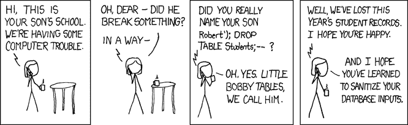
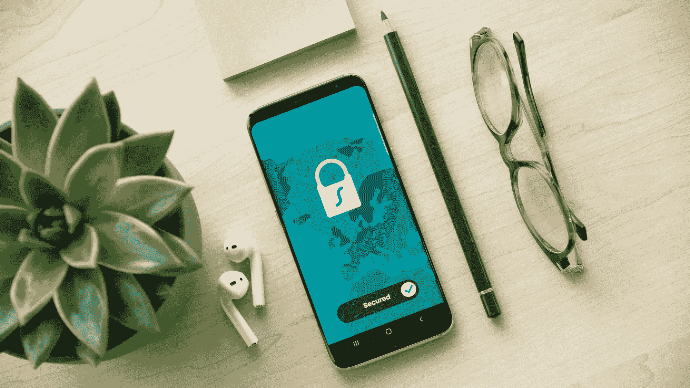
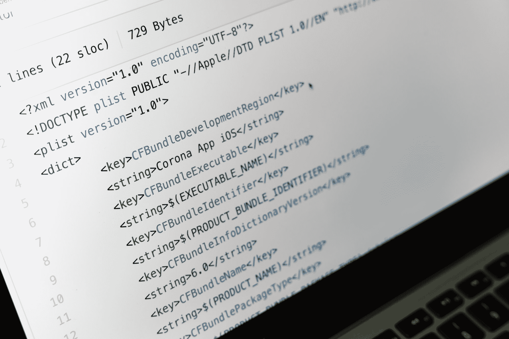

# 如何保护您的 Laravel Web 应用程序免受 OWASP 十大安全风险

> 原文：<https://www.freecodecamp.org/news/protect-your-laravel-app-against-the-owasp-top-10-security-risks/>

我记得第一次我的网站被黑。

客户发邮件说他们的网站需要很长时间才能加载。我从大学一回家就跳到网上，注意到有人利用 SQL 注入在所有产品名称中插入了一个`<script>`标签。

该脚本试图将访问者重定向到恶意网站。我崩溃了。

那是在 2004 年，我刚刚自学了 ASP 和 SQL Server。这是一个发人深省的时刻，也是一个让人们意识到任何网站都可能成为攻击目标的时刻，不管它有多小。

它还教会了我 web 安全的重要性，从那以后它一直处于我开发过程的最前沿。

没有一个网站是绝对安全的——大量引人注目的违规事件就是最好的证明。但是您可以遵循一些最佳实践，使您的站点不那么容易成为偶然的恶意参与者或自动化脚本的目标。

## 奥瓦斯普-拉勒韦尔公司

开放 web 应用程序安全项目(OWASP)是一个国际非盈利组织，致力于提高人们对 Web 应用程序安全的认识。

OWASP 十大威胁是关于 web 应用程序安全的标准意识指南，包括 web 应用程序面临的最严重的安全风险。

Laravel 是我最喜欢的 PHP 开发框架之一。这些年来，从小型商业网站到大型金融科技和电子商务应用程序，我都广泛地使用过它，这些应用程序都要求以安全性为核心。

最棒的是，Laravel 解决了许多开箱即用的安全特性。

我将浏览 OWASP 十大应用，并注意如何用一些基本的安全最佳实践来强化您的 Laravel web 应用程序。

## 1.注射

Source: [https://xkcd.com/327/](https://xkcd.com/327/)

> “当不可信数据作为命令或查询的一部分被发送到解释器时，会出现注入缺陷，如 SQL、NoSQL、操作系统和 LDAP 注入。攻击者的恶意数据可以欺骗解释器执行非预期的命令或在没有适当授权的情况下访问数据。”— [OWASP 前 10 名](https://owasp.org/www-project-top-ten/OWASP_Top_Ten_2017/Top_10-2017_A1-Injection)

Laravel 查询生成器使用 PDO 参数绑定来保护应用程序免受 SQL 注入攻击。这意味着您不必清理作为绑定传递的值。

请注意，Laravel 还允许您运行原始 SQL 查询。如果可能，您应该避免这种情况。坚持[雄辩](https://laravel.com/docs/7.x/eloquent)代替。

请记住，PDO 不支持绑定列名。您不应该使用用户的输入来指定表的列名，包括在`ORDER BY`语句中使用的列。

如果您确实需要一些灵活性，请确保对照白名单检查列名。

## 2.身份验证被破坏

Photo by [Dan Nelson](https://unsplash.com/@danny144?utm_source=ghost&utm_medium=referral&utm_campaign=api-credit) / [Unsplash](https://unsplash.com/?utm_source=ghost&utm_medium=referral&utm_campaign=api-credit)

> “与身份验证和会话管理相关的应用程序功能通常实施不当，使得攻击者能够泄露密码、密钥或会话令牌，或者利用其他实施缺陷来临时或永久冒充其他用户的身份。“— [OWASP 前 10 名](https://owasp.org/www-project-top-ten/OWASP_Top_Ten_2017/Top_10-2017_A2-Broken_Authentication)

有几种策略可以用来保护您的应用程序免受这种类型的攻击。

*   对任何可能被暴力攻击的端点使用 CAPTCHA。这包括登录、注册和忘记密码表单。验证码将停止大多数自动攻击。使用 Google 的 reCAPTCHA，而不是开发自己的实现。
*   限速登录尝试。如果与验证码一起使用，它允许一个伟大的纵深防御战略。Laravel 有一个[中间件](https://laravel.com/docs/7.x/routing#rate-limiting)，可以直接在你的路由或控制器中使用，以抑制请求。
*   为您的会员和管理员帐户构建多因素身份验证。有很棒的[软件包](https://github.com/antonioribeiro/google2fa)可供您用来生成二维码，并在登录时验证一次性密码。避免通过其他方式发送代码，如电子邮件或短信。仅仅是[不够安全](https://blog.sucuri.net/2020/01/why-2fa-sms-is-a-bad-idea.html)。
*   永远不要将任何默认的登录细节或敏感的 API 凭证提交到您的代码库中。在项目根目录的`.env`文件中维护这些设置。
*   安全地配置会话:它们应该只通过 HTTPS 发送，决不会显示在您的应用程序中。可以在 Laravel 应用程序的`session.php`配置文件中启用`secure`设置。

## 3.敏感数据暴露

Photo by [Tim Evans](https://unsplash.com/@tjevans?utm_source=ghost&utm_medium=referral&utm_campaign=api-credit) / [Unsplash](https://unsplash.com/?utm_source=ghost&utm_medium=referral&utm_campaign=api-credit)

> “许多 web 应用程序和 API 不能很好地保护敏感数据，如金融、医疗保健和 PII。攻击者可能窃取或修改这种保护薄弱的数据，以进行信用卡欺诈、身份盗窃或其他犯罪。敏感数据可能会在没有额外保护(如静态或传输中的加密)的情况下遭到破坏，在与浏览器交换时需要采取特殊的预防措施。”— [OWASP 前 10 名](https://owasp.org/www-project-top-ten/OWASP_Top_Ten_2017/Top_10-2017_A3-Sensitive_Data_Exposure)

没有一个星期没有关于另一个引人注目的数据泄露的新闻。最令人担忧的是，这些漏洞有时会暴露出该公司是如何使用薄弱的安全措施的。弱密码哈希和不安全的 S3 桶是常见的现象。

这里有一些方法可以解决这个问题:

*   确保您在 HTTPS 使用 TLS 证书提供整个应用程序。如果用户试图访问 HTTP 对等项，则将他们重定向到安全路由，并利用 [HSTS](https://cheatsheetseries.owasp.org/cheatsheets/HTTP_Strict_Transport_Security_Cheat_Sheet.html) 报头。
*   使用自适应 salted 散列函数散列所有密码。这些是散列函数，其中工作因子可以随着时间的推移随着处理器能力的增加而增加。Laravel 默认支持 Bcrypt 和 Argon2。
*   加密所有静态存储的敏感数据。千万不要使用自己开发的加密功能。相反，使用 Laravel 的内置[加密函数](https://laravel.com/docs/7.x/encryption)，它使用 OpenSSL 来提供 AES-256 和 AES-128 加密。
*   如果对文件或主键使用枚举来标识记录，您可能会无意中暴露有关系统的信息。使用类似于`/member-profile/23`的 URL 会显示你的系统上有(至少)23 个成员。如果你上传了像`/user-images/45.jpg` **，**这样的文件，你可能会遭受枚举攻击，恶意行为者可能会尝试所有的数字组合，并从你的网站中提取所有的用户图片。要解决这一问题，请使用不同的方案(如 UUIDv4)来标识公开的、可能需要保护的记录。对于文件，使用自动生成的文件名或哈希文件夹结构来防止枚举。

永远不要相信用户上传的文件。如果这些上传的文件未经验证或处理不当，它们可能会允许访问您的整个系统。OWASP [无限制文件上传](https://owasp.org/www-community/vulnerabilities/Unrestricted_File_Upload)页面包括一些需要采取的预防措施。您可以使用 Laravel 的验证功能来实现其中的大部分:

*   设置最小和最大[文件上传大小](https://laravel.com/docs/7.x/validation#rule-size)。
*   限制同时上传文件的数量。
*   通过检查特定文件类型的 [MIME](https://laravel.com/docs/7.x/validation#rule-mimes) ，仅允许特定文件类型。
*   上传时重命名所有文件。
*   将文件上传到非公共目录或第三方对象存储，如 AWS S3。你不希望有人上传 PHP shell 脚本，允许他们直接在你的服务器上运行命令。

最棒的是，您可以将所有这些打包到一个 Laravel [规则](https://laravel.com/docs/7.x/validation#custom-validation-rules)中，并简单地将该规则作为验证流程的一部分。

## 4.XML 外部实体(XXE)

Photo by [Markus Winkler](https://unsplash.com/@markuswinkler?utm_source=ghost&utm_medium=referral&utm_campaign=api-credit) / [Unsplash](https://unsplash.com/?utm_source=ghost&utm_medium=referral&utm_campaign=api-credit)

> 许多旧的或配置不良的 XML 处理器评估 XML 文档中的外部实体引用。外部实体可通过文件 URI 处理程序、内部文件共享、内部端口扫描、远程代码执行和拒绝服务攻击来泄露内部文件。”— [OWASP 前 10 名](https://owasp.org/www-project-top-ten/OWASP_Top_Ten_2017/Top_10-2017_A4-XML_External_Entities_%28XXE%29)

该漏洞适用于任何解析 XML 的系统。几年前，一名安全研究人员在脸书发现了这个漏洞。这篇 [SensePost 文章](https://sensepost.com/blog/2014/revisting-xxe-and-abusing-protocols/)更详细地介绍了这是如何实现的。

防止这种攻击的最快方法是在使用默认的 [PHP XML 解析器](https://www.php.net/manual/en/ref.libxml.php)时禁用外部实体解析。这通过将`libxml_disable_entity_loader`设置为`true`来完成。

如果您不能禁用这个功能，请确保您的 XML 解析器已经更新，并且您使用的至少是 SOAP v1.2 或更高版本(如果适用)。当涉及到用户上传或第三方 XML 时，总是要保持警惕。

## 5.中断的访问控制

Photo by [Collin Armstrong](https://unsplash.com/@brazofuerte?utm_source=ghost&utm_medium=referral&utm_campaign=api-credit) / [Unsplash](https://unsplash.com/?utm_source=ghost&utm_medium=referral&utm_campaign=api-credit)

> “对经过身份验证的用户可以做什么的限制通常没有得到适当的执行。攻击者可以利用这些缺陷来访问未经授权的功能和/或数据，例如访问其他用户的帐户、查看敏感文件、修改其他用户的数据、更改访问权限等。”— [OWASP 前 10 名](https://owasp.org/www-project-top-ten/OWASP_Top_Ten_2017/Top_10-2017_A5-Broken_Access_Control)

在 2011 年的[中，攻击者在发现他们处理客户账号的方式被利用后，窃取了超过 20 万花旗集团客户的详细信息。一旦他们登录到一个帐户，他们所要做的就是改变 URL 中的客户号，以跳转到另一个客户的记录。](https://www.nytimes.com/2011/06/14/technology/14security.html)

这使得他们能够创建一个自动流程，循环遍历所有可能的号码并捕获所有机密数据。

该系统没有任何授权检查来确保被访问的账号属于登录用户。

*   始终对仅适用于登录用户的任何操作执行授权检查。这包括页面(例如，允许您更新细节)，以及表单提交的目的地。
*   有流行的 RBAC(基于角色的访问控制)[包](https://laravel-news.com/two-best-roles-permissions-packages)可以和 Laravel 一起使用，允许你管理用户权限和角色。你也可以使用 Laravel 的[内置授权服务](https://laravel.com/docs/7.x/authorization)。

## 6.安全错误配置

Photo by [Philipp Katzenberger](https://unsplash.com/@fantasyflip?utm_source=ghost&utm_medium=referral&utm_campaign=api-credit) / [Unsplash](https://unsplash.com/?utm_source=ghost&utm_medium=referral&utm_campaign=api-credit)

> “安全配置错误是最常见的问题。这通常是由不安全的默认配置、不完整或临时配置、开放式云存储、错误配置的 HTTP 头以及包含敏感信息的详细错误消息造成的。不仅必须安全配置所有操作系统、框架、库和应用程序，还必须及时修补/升级它们。”— [OWASP 前 10 名](https://owasp.org/www-project-top-ten/OWASP_Top_Ten_2017/Top_10-2017_A6-Security_Misconfiguration)

在配置 web 应用程序时，总是要考虑最小功能的原则。通过删除或禁用所有不需要的服务来强化您的安装。

早在 2001 年，Nimda 蠕虫通过利用几个 IIS(互联网信息服务器)漏洞在全球范围内造成了严重破坏。

许多系统默认安装了 IIS，尽管它们根本不使用微软的 web 服务器。其结果是高感染率，本可以通过强化系统和卸载系统或网络不需要的任何服务来防止。

*   让您的 web 应用程序中的所有服务器软件和任何依赖项保持最新。
*   禁用您的 web 服务器的目录列表。
*   禁用生产服务器上的调试。即使在临时服务器上，调试也可以通过输出所有环境变量来暴露敏感的服务器信息。利用 Laravel 中的`debug_hide` app [配置选项](https://laravel.com/docs/7.x/configuration#hiding-environment-variables-from-debug)来防止这种情况。

## 7.跨站点脚本(XSS)

> 每当应用程序在没有适当验证或转义的情况下在新网页中包含不受信任的数据，或者使用可以创建 HTML 或 JavaScript 的浏览器 API 用用户提供的数据更新现有网页时，就会出现 XSS 缺陷。XSS 允许攻击者在受害者的浏览器中执行脚本，这可以劫持用户会话，破坏网站，或将用户重定向到恶意网站。”— [OWASP 前 10 名](https://owasp.org/www-project-top-ten/OWASP_Top_Ten_2017/Top_10-2017_A7-Cross-Site_Scripting_%28XSS%29)

不转义数据就不要显示用户提供的输入。Laravel 的模板引擎 Blade 自动转义使用默认`{{ $var }}`语法呈现的内容。这通过 PHPs `htmlspecialchars`函数发送。

以这种方式逃避所有的输出将减少你的网站访问者暴露于 XSS 和 CSRF(跨站点请求伪造)攻击。

不幸的是，事情并不总是这么简单。如果您曾经在应用程序中使用过所见即所得的 HTML 编辑器，比如 TinyMCE 或 CKEditor，那么您应该知道这会带来风险(特别是因为对输出进行转义会产生一堆 HTML 标记，而不是格式化的内容)。

在这些情况下，使用像 [HTMLPurifier](https://github.com/mewebstudio/Purifier) 这样的包来删除任何潜在的恶意代码。

## 8.不安全的去军事化

Photo by [Micah Williams](https://unsplash.com/@mr_williams_photography?utm_source=ghost&utm_medium=referral&utm_campaign=api-credit) / [Unsplash](https://unsplash.com/?utm_source=ghost&utm_medium=referral&utm_campaign=api-credit)

> “不安全的反序列化通常会导致远程代码执行。即使反序列化缺陷不会导致远程代码执行，它们也可用于执行攻击，包括重放攻击、注入攻击和权限提升攻击。”— [OWASP 前 10 名](https://owasp.org/www-project-top-ten/OWASP_Top_Ten_2017/Top_10-2017_A8-Insecure_Deserialization)

警惕不可信来源的任何内容。这包括您的应用程序可能创建的 cookies。恶意用户可以在他们的浏览器中编辑该 cookie，并将其用作针对您的应用程序的攻击媒介。

默认情况下，Laravel 创建的所有 cookies 都经过加密和签名。这意味着如果客户篡改它们，它们将是无效的。

## 9.使用具有已知漏洞的组件

Photo by [Diego Gennaro](https://unsplash.com/@_nnaro_?utm_source=ghost&utm_medium=referral&utm_campaign=api-credit) / [Unsplash](https://unsplash.com/?utm_source=ghost&utm_medium=referral&utm_campaign=api-credit)

> 诸如库、框架和其他软件模块等组件以与应用程序相同的特权运行。如果易受攻击的组件被利用，这种攻击会导致严重的数据丢失或服务器接管。使用具有已知漏洞的组件的应用程序和 API 可能会破坏应用程序防御，并导致各种攻击和影响。”— [OWASP 前 10 名](https://owasp.org/www-project-top-ten/OWASP_Top_Ten_2017/Top_10-2017_A9-Using_Components_with_Known_Vulnerabilities)

因为你可能在 Laravel 中使用的大多数依赖项都是开源的，它允许恶意用户分析包并找到利用漏洞的方法。缓解这个问题的一些想法:

*   确保您保持所有依赖关系是最新的。
*   删除任何不使用的依赖项。这将减少潜在的攻击入口点数量。
*   订阅安全公告，并将安全扫描器(如 [Snyk](https://snyk.io/) )作为 CI/CD 管道的一部分。
*   考虑使用 Laravel 的 LTS(长期支持)版本，而不是最新版本。LTS 版本获得三年的安全修复，而不是非 LTS 版本的一年。

## 10.记录和监控不足

Photo by [Chris Nguyen](https://unsplash.com/@cspek?utm_source=unsplash&utm_medium=referral&utm_content=creditCopyText) on [Unsplash](https://unsplash.com/@cspek?utm_source=unsplash&utm_medium=referral&utm_content=creditCopyText)

> “日志记录和监控不足，加上与事件响应的集成缺失或无效，使得攻击者能够进一步攻击系统、保持持久性、转向更多系统，以及篡改、提取或销毁数据。大多数违规研究显示，检测违规的时间超过 200 天，通常是由外部方检测到的，而不是内部流程或监控。”— [OWASP 前 10 名](https://owasp.org/www-project-top-ten/OWASP_Top_Ten_2017/Top_10-2017_A10-Insufficient_Logging%252526Monitoring)

对于您的应用程序和服务器，记录一切，包括失败的登录尝试和密码重置。

Laravel 自带[独白](https://github.com/Seldaek/monolog)开箱。您甚至可以将它与第三方日志服务(如 [Papertrail](https://www.papertrail.com/) )集成，并接收特定日志事件的警报。

## 结论

感谢您的阅读，我希望这已被证明是有用的！[注册我的时事通讯](https://webdev.chowles.com/)或[访问我的博客](https://www.chowles.com/)，在那里我会分享有见地的网络开发文章来增强你的技能。

## 资源

OWASP 网站是一个极好的信息来源，它提供了一些关于上面提到的许多安全问题的深入指南。

*   查看 [OWASP 十大](https://owasp.org/www-project-top-ten/) ( [PDF 下载](https://github.com/OWASP/Top10/raw/master/2017/OWASP%20Top%2010-2017%20%28en%29.pdf))。
*   查看并下载 [OWASP 备忘单](https://cheatsheetseries.owasp.org/)。
*   最新 [Laravel 文档](https://laravel.com/docs/7.x)。