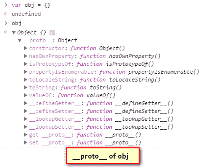
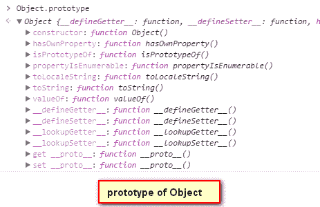
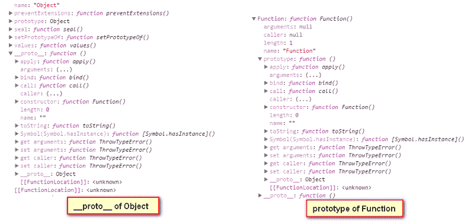
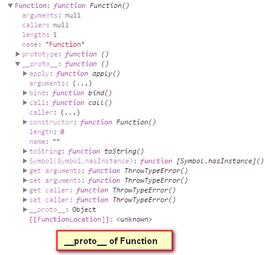
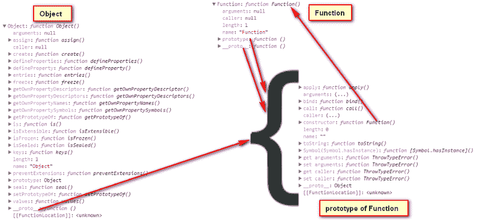
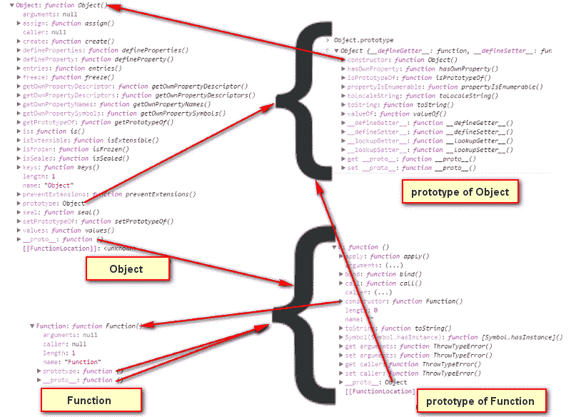
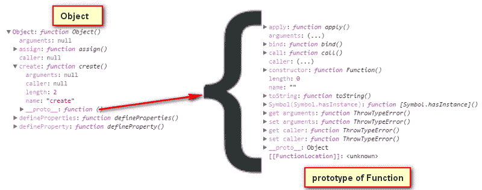

# JavaScript 中的原型:这很奇怪，但它是这样工作的

> 原文：<https://www.freecodecamp.org/news/prototype-in-js-busted-5547ec68872/>

作者普拉纳夫·金达尔

# JavaScript 中的原型:这很奇怪，但它是这样工作的


以下四行足以让大多数 JavaScript 开发人员感到困惑:

```
Object instanceof Function//true
```

```
Object instanceof Object//true
```

```
Function instanceof Object//true
```

```
Function instanceof Function//true
```

JavaScript 中的原型是最令人难以置信的概念之一，但你无法避免它。无论你如何忽视它，你都会在你的 JavaScript 生活中遇到原型难题。

所以让我们直面它。

从基础开始，JavaScript 中有以下数据类型:

1.  不明确的
2.  空
3.  数字
4.  线
5.  布尔型
6.  目标

前五种是原始数据类型。它们存储一个类型的值，比如布尔值，可以是真或假*。*

最后一个“对象”是一个引用类型，我们可以把它描述为一个键-值对的集合(但它远不止于此)。

在 JavaScript 中，使用**对象构造器** **函数**(或对象字面量`{}`)生成新对象，该函数提供了类似`toString()`和`valueOf()`的通用方法。

JavaScript 中的函数是特殊的对象，可以被“**称为“**”T2。我们通过使用**函数构造函数**(或函数字面量)来制作它们。这些**构造函数**既是对象又是函数的事实一直让我困惑，就像鸡和蛋的谜语让每个人困惑一样。

在开始讨论原型之前，我想澄清一下 JavaScript 中有两种原型:

1.  **原型**:这是一个特殊的对象，它被指定为你在 JavaScript 中创建的任何函数的属性。让我在这里说明一下，它已经存在于您创建的任何函数中，但对于 JavaScript 提供的内部函数(以及由`bind`返回的函数)不是强制性的。这个`prototype`与从那个函数(使用`new`关键字)新创建的对象的`[[Prototype]]`(见下文)所指向的是同一个对象。
2.  **[[Prototype]]:** 如果对象上正在读取的某个属性不可用，这是运行上下文访问的每个对象上的一个隐藏属性。这个属性仅仅是对创建对象的函数的`prototype` 的引用。可以在脚本中使用名为`__proto__` *的特殊 **getter-setter** (另一天的主题)来访问它。*还有其他访问这个原型的新方法，但是为了简洁起见，我将使用 **`__proto__`来引用`**[[Prototype]]**` 。**

```
var obj = {}var obj1 = new Object()
```

当用来创建一个新的对象时，上面的两个语句是相等的，但是当我们执行这些语句中的任何一个时，会发生很多事情。

当我创建一个新对象时，它是空的。实际上它不是空的，因为它是一个`Object` 构造函数的实例，它固有地得到一个由新创建对象的`__proto__` 指向的`Object,` 的`prototype` 的引用。



如果我们看一下`Object`构造函数的`prototype`，它看起来和`obj.` 的`__proto__`一样实际上，它们是指向同一个对象的两个指针。



```
obj.__proto__ === Object.prototype//true
```

函数的每一个`prototype` 都有一个固有的属性叫做`constructor`，是指向函数本身的指针。在`Object`功能*的情况下，*的`prototype`有`constructor` 指向`Object`。

```
Object.prototype.constructor === Object//true
```


上图中，左侧是`Object`构造器的展开图。你一定想知道它的其他功能是什么。函数是对象***，所以它们可以像其他对象一样拥有属性。***

***如果你仔细观察，`Object` *(左边)*本身有一个`__proto__` ，这意味着`Object` 一定是由其他一些有`prototype.` 的构造函数构成的，因为`Object` 是一个函数对象，它一定是由`Function` 构造函数构成的。***

******

***`Object` 的`__proto__`*T5 与`Function` *的`prototype`长相相同。当我检查两者是否相等时，发现它们是相同的对象。*****

```
*`Object.__proto__ === Function.prototype//true`*
```

***如果你仔细观察，你会看到`Function` 本身有一个`__proto__` ，这意味着`Function` 构造函数一定是由某个有`prototype`的构造函数构成的。由于`Function` 本身就是一个**函数**，它一定是用`Function` 构造函数，也就是它本身做的。我知道这听起来很奇怪，但当你检查它时，它被证明是真的。***

******

***`Function`中的`__proto__` 和`Function` 中的实际上是指同一对象的两个指针。***

```
*`Function.prototype === Function.__proto__\\true`*
```

***如前所述，任何`prototype` 的`constructor`都应该指向拥有那个`prototype.` 的函数，`prototype`*`Function`*的`constructor` 指向回`Function`本身。*****

```
**`Function.prototype.constructor === Function\\true`**
```

********

****再次，`**Function**` 的`**prototype**` 有一个`__proto__` 。嗯，这不奇怪……`prototype`是一个对象，它可以有一个。但是还要注意，它指向了`Object` *的`prototype` 。*****

```
*`Function.prototype.__proto__ == Object.prototype\\true`*
```

***所以我们可以在这里有一个主地图:***

******

```
*`instanceof Operatora instanceof b`*
```

***`instanceof` 运算符查找`a` *上*`__proto__`*的`constructor`【s】*中的任意一个指向的对象。再读一遍！如果找到任何这样的引用，它将返回`true` 否则返回`false` *。******

***现在我们先回到我们的四个`instanceof` 语句。我写了相应的语句，使得`instanceof` 返回`true` 为如下:***

```
*`Object instanceof FunctionObject.__proto__.constructor === Function`*
```

```
*`Object instanceof ObjectObject.__proto__.__proto__.constructor === Object`*
```

```
*`Function instanceof FunctionFunction.__proto__.constructor === Function`*
```

```
*`Function instanceof ObjectFunction.__proto__.__proto__.constructor === Object`*
```

***唷！！就连意大利面也没那么纠结了，但我希望现在事情更清楚了。***

***这里我有一点我之前没有指出的是`Object` 的`prototype`没有`__proto__` *。****

***其实它有一个`__proto__` 但那等于`**null**`。链条必须在某个地方结束，它在这里结束。***

```
*`Object.prototype.__proto__\\null`*
```

***我们的`Object`*`Function`*`Object.prototype`*`Function.prototype`*也有属性，也就是函数，比如`Object.assign`*`Object.prototype.hasOwnProperty`和`Function.prototype.call` *。*这些是没有`prototype`的内部函数，也是`Function`的实例，有一个`__proto__` ，是指向`Function.prototype` *的指针。*********

********

```
**`Object.create.__proto__ === Function.prototype\\true`**
```

****您可以探索其他构造函数，如`Array`和`Date`，或者获取它们的对象并寻找`prototype` 和`__proto__`。我相信你会明白所有的事情是如何联系在一起的。****

#### ****额外查询:****

****还有一个问题困扰了我一段时间:为什么`Object`的`prototype`是**对象**而`Function`的`prototype`是**功能对象**？****

****[**这里的**](https://stackoverflow.com/a/32929083/1934798) 就是很好的解释，如果你也是这么想的话。****

****另一个到目前为止对你来说可能还是个谜的问题是:原始数据类型是如何获得`toString()` *、* `substr()`和`toFixed()`这样的函数的？这个很好解释 [**这里**](https://javascript.info/native-prototypes#primitives) **。******

****使用`prototype`，我们可以让继承与 JavaScript 中的自定义对象一起工作。但那是另一天的话题。****

****感谢阅读！****