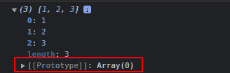
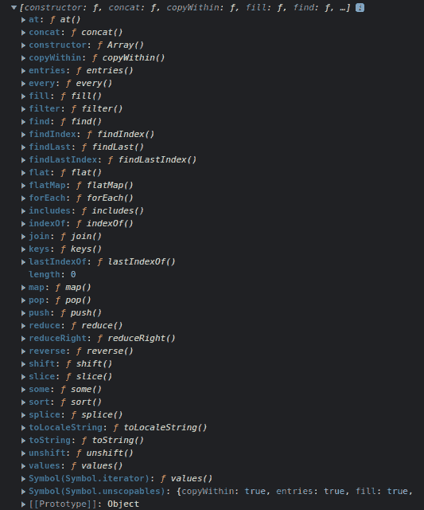
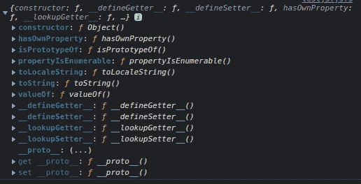
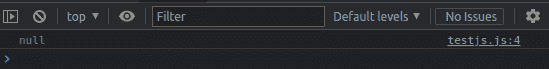

# JavaScript 原型和继承——以及为什么他们说 JS 中的一切都是对象

> 原文：<https://www.freecodecamp.org/news/prototypes-and-inheritance-in-javascript/>

大家好！在这篇短文中，我们将讨论 JavaScript 中的**原型继承**，以及它的含义。

## 目录

*   [简介](#intro)
*   [如何用 JavaScript 访问原型的属性和方法](#how-to-access-a-prototype-s-properties-and-methods-in-javascript)
*   [原型链](#the-prototype-chain)
*   基于原型的语言
*   [Javascript 类](#javascript-classes)
*   [综述](#roundup)

# 介绍

你有没有想过字符串、数组或对象是如何“知道”它们各自拥有的方法的？一个字符串如何知道它可以`.toUpperCase()`或者一个数组如何知道它可以`.sort()`？我们从来没有手工定义过这些方法，对吗？

答案是这些方法内置在每种数据结构中，这要归功于一种叫做**原型继承**的东西。

在 JavaScript 中，一个对象可以继承另一个对象的属性。从中继承属性的对象称为原型。简而言之，对象可以从其他对象——原型——继承属性。

您可能想知道:为什么首先需要继承？继承解决了数据和逻辑重复的问题。通过继承，对象可以共享属性和方法，而无需在每个对象上手动设置这些属性和方法。

## ****如何在 JavaScript** 中** A **访问** a P **rototype 的** P **属性和** M **方法**

当我们试图访问一个对象的属性时，不仅在对象本身中搜索该属性。它还在对象的原型中搜索，在原型的原型中搜索，依此类推——直到找到与名称匹配的属性或到达**原型链**的结尾。

如果在原型链的任何地方都找不到属性或方法，那么 JavaScript 将返回`undefined`。

JavaScript 中的每个对象都有一个名为`[[Prototype]]`的内部属性。

如果我们创建一个数组并将其记录到控制台，如下所示:

```
const arr = [1,2,3]
console.log(arr)
```

我们将看到这一点:



包围`[[Prototype]]`的双方括号表示它是一个内部属性，不能在代码中直接访问。

为了找到一个对象的`[[Prototype]]`，我们将使用`Object.getPrototypeOf()`方法。

```
const arr = [1,2,3]
console.log(Object.getPrototypeOf(arr)) 
```

输出将由几个内置属性和方法组成:



请记住，原型也可以通过不同的方法进行更改和修改。

## ****P**roto type**C**hain******

**原型链的末端是`Object.prototype`。所有对象都继承了`Object`的属性和方法。任何超出链末端的搜索都会导致`null`。**

**如果你寻找一个数组，一个函数，或者一个字符串的原型，你会看到它是一个对象。这是因为在 JavaScript 中，所有对象都是`Object.prototype`的后代或实例，T0 是一个为所有其他 JavaScript 数据类型设置属性和方法的对象。**

```
`const arr = [1,2,3]
const arrProto = Object.getPrototypeOf(arr)
console.log(Object.getPrototypeOf(arrProto))`
```

****

**每种类型的原型(例如数组原型)都定义了自己的方法和属性，并且在某些情况下会覆盖`Object.prototype`方法和属性(这就是为什么数组有对象没有的方法)。**

**但是在引擎盖下和原型链的阶梯上，**JavaScript 中的一切都是建立在`Object.prototype`之上的。****

**如果我们试图探究 **`Object.prototype`** 的原型，我们得到`null`。**

```
`const arr = [1,2,3]
const arrProto = Object.getPrototypeOf(arr)
const objectProto = Object.getPrototypeOf(arrProto)
console.log(Object.getPrototypeOf(objectProto))`
```

****

## **基于原型的语言**

**JavaScript 是一种**基于原型的语言**，这意味着对象属性和方法可以通过具有克隆和扩展能力的通用对象来共享。**

**谈到继承，JavaScript 只有一个结构:对象。**

**每个对象都有一个私有属性(称为它的`[[Prototype]]`),用来维护到另一个对象(称为它的原型)的链接。那个原型对象有自己的原型，依此类推，直到到达一个原型为`null`的对象。**

**根据定义，`null`没有原型，在这个原型链中充当最后一环。**

**这被称为原型继承，不同于类继承。在流行的面向对象编程语言中，JavaScript 是相对独特的，因为其他著名的语言如 PHP、Python 和 Java 都是基于类的语言，它们将类定义为对象的蓝图。**

**此时你可能会想“但是我们可以在 JavaScript 上实现类！”。是的，我们可以，但作为句法糖。🤫🤔**

## **Javascript 类**

**类是一种设置蓝图的方式，用来创建具有预定义属性和方法的对象。通过创建具有特定属性和方法的类，您可以在以后实例化该类中的对象，这些对象将继承该类的所有属性和方法。**

**在 JavaScript 中，我们可以通过以下方式创建类:**

```
`class Alien {
    constructor (name, phrase) {
        this.name = name
        this.phrase = phrase
        this.species = "alien"
    }
    fly = () => console.log("Zzzzzziiiiiinnnnnggggg!!")
    sayPhrase = () => console.log(this.phrase)
}`
```

**然后我们可以从该类中实例化一个对象，如下所示:**

```
`const alien1 = new Alien("Ali", "I'm Ali the alien!")
console.log(alien1.name) // output: "Ali"`
```

**类被用作一种使代码更加模块化、更有组织、更容易理解的方法，在 OOP 编程中被大量使用。**

**但是请记住，JavaScript 并不像其他语言那样真正支持类。关键字`class`是 ES6 引入的语法糖，有助于这种组织代码的方式。**

**为了形象化这一点，可以看到我们之前通过定义`class`所做的事情，我们可以通过定义一个函数并以如下方式编辑原型来做到这一点:**

```
`function Alien(name, phrase) {
    this.name = name
    this.phrase = phrase
    this.species = "alien"
}

Alien.prototype.fly = () => console.log("Zzzzzziiiiiinnnnnggggg!!")
Alien.prototype.sayPhrase = () => console.log(this.phrase)

const alien1 = new Alien("Ali", "I'm Ali the alien!")

console.log(alien1.name) // output "Ali"
console.log(alien1.phrase) // output "I'm Ali the alien!"
alien1.fly() // output "Zzzzzziiiiiinnnnnggggg"`
```

**任何函数都可以用关键字`new`作为构造函数调用，该函数的 prototype 属性用于对象继承方法。在 JavaScript 中，“类”只是在概念上用来描述上述实践——从技术上讲，它们只是函数。😑**

**虽然这不一定会有很大的不同(我们仍然可以像在大多数其他编程语言中一样完美地实现 OOP 和使用类)，但重要的是要记住 JavaScript 是以原型继承为核心构建的。**

# **综述**

**就是这样，各位！一如既往，我希望你喜欢这篇文章，并学到一些新东西。如果你愿意，你也可以在 [LinkedIn](https://www.linkedin.com/in/germancocca/) 或 [Twitter](https://twitter.com/CoccaGerman) 上关注我。**

**干杯，下期再见！=D**

****