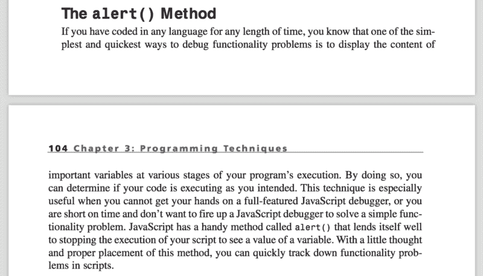
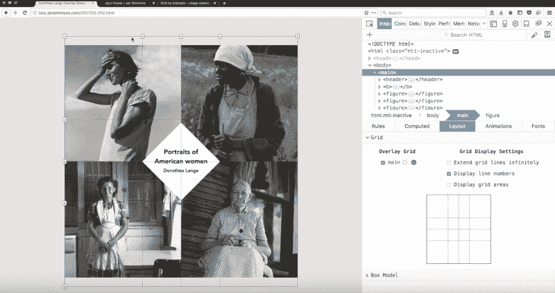
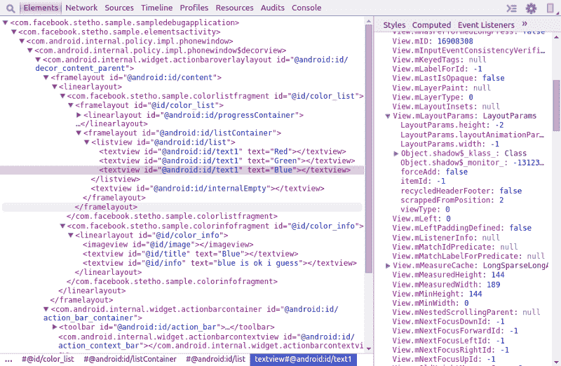
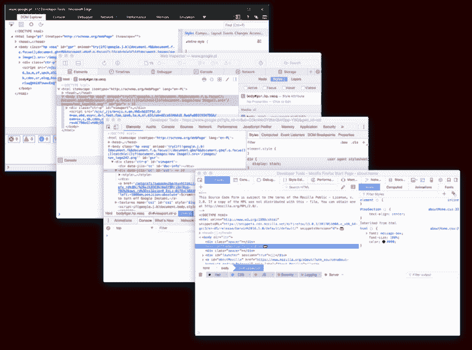
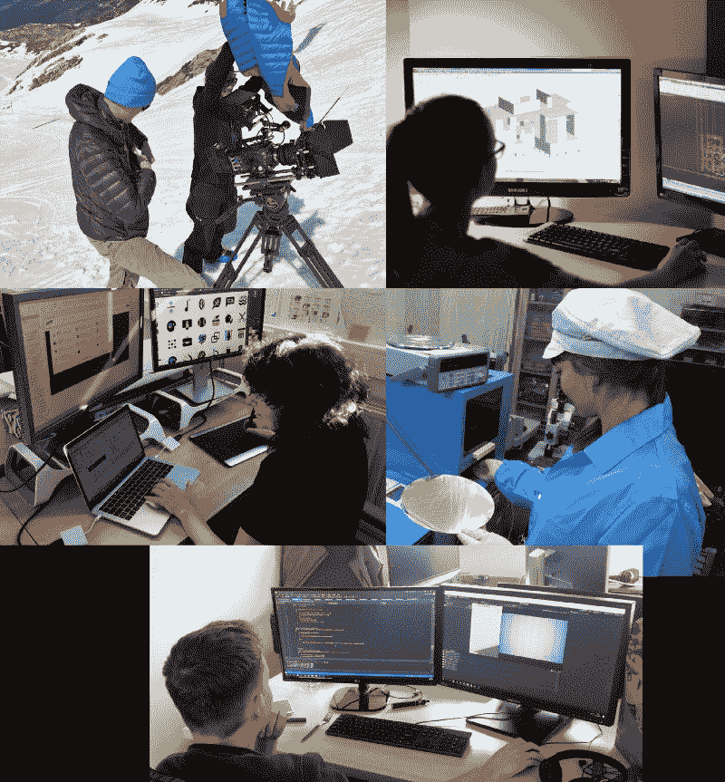

# 原型开发工具的未来

> 原文：<https://www.freecodecamp.org/news/prototyping-the-future-of-devtools-f54ba4d51891/>

康拉德·德怀恩尔

# 原型开发工具的未来

12 年前，web 开发几乎没有工具。没有简单的方法来检查 DOM、监控网络甚至是其他事情。

Web development in 2002 — debugging with alerts. From “Pure JavaScript” (ISBN 0672321416)

这段黑暗时期可以用 Firebug 和控制台 API 的创造者 Joe Hewitt 的话来总结:

> “听到人们称 FireBug 为‘创新’，我总是很惊讶。”它显示了 web 开发者的工具箱已经变得多么薄弱，以至于像控制台这样老派的东西会被认为是新颖的。"

2006 年 [Firebug](https://getfirebug.com/) 的诞生标志着现代 web 开发工具的开始。今天，每个主流浏览器都为 web 开发人员提供了出色的内置工具。在每个 DevTools 的背后，都有一个专门的开发人员、设计人员和产品经理团队在推动它前进。

随着 DevTools 变得越来越重要，它们开始相互竞争，并获得大量新功能，同时努力跟上平台的发展。

Firefox DevTools were first to feature a grid inspector — [https://youtu.be/dU7xtnzfqxQ](https://youtu.be/dU7xtnzfqxQ)

### 萤火虫的遗产

我相信，如今，我们有幸拥有业内最好的工具之一。事实上，我们的工具变得如此之好，以至于它不断地被分叉并适应与其他平台一起工作。

Stetho — Chrome DevTools fork for debugging Android applications — [https://facebook.github.io/stetho/](https://facebook.github.io/stetho/)

有一件事一直让我震惊，那就是 Joe 在 Firebug 中引入的原始概念在今天的 DevTools 中仍然存在，几乎没有变化。

Elements panel in Edge, Safari, Chrome, and Firefox DevTools.

当我们在浏览器之间切换时，这些相似之处确实让我们的生活变得更加容易，但是我总是想知道——这些概念曾经受到挑战吗？或者他们只是简单的复制了一下？如果是的话，我能自己挑战他们吗？

### 获得灵感

受到邀请在前沿趋势会议上发言的激励，我决定构建几个原型，展示我们的工具在未来可以遵循的一些替代路径。在寻找灵感的过程中，我考虑去了解其他职业中使用的应用。我希望找出一些值得借鉴的模式和想法。

在不了解上下文的情况下浏览随机工具的手册，听起来并不是一个好计划。谢天谢地，我有几个不是 web 开发人员的好朋友，他们同意向我介绍他们的工具。因此，我会见了:Kasia——结构工程师，Bolko——摄影师和电影制片人，Ola——科学家和测量与控制系统设计师，Kuba——游戏设计师和程序员，以及 Patrycja 平面设计师。我请他们向我介绍他们通常的工作流程，谈论他们喜欢和不喜欢他们的工具，以及他们如何了解新特性。

My friends at work.

这些采访带来了一些关于其他人如何工作的有趣见解。以下是我收集的一些想法，可以应用到浏览器开发工具中。

### 想象未来

#### 灵活性

我接触的所有应用程序(DaVinci Resolve、Autocad、Sketch、LabView、Unity)的布局都比我们的 DevTools 灵活得多。每个面板、标签和窗口都可以移动、关闭和调整大小。这有助于个性化工具并使其符合您的需求。Unity 甚至允许您轻松保存和管理多个布局。同时，在我们的 DevTools 中，不可能将性能和源代码面板并排显示。

为了展示灵活布局在 Chrome DevTools 中的样子，我基于[黄金布局](http://golden-layout.com/)构建了一个原型:

#### 用积木搭建

我喜欢 Sketch 和 LabView 的一点是它们允许你用小积木搭建大积木。在 Sketch 中，您可以创建一个符号库(如按钮、标签、输入),然后根据该符号库构建一个完整的网页设计。如果您决定要更改按钮的外观，您可以快速从“网页”视图切换到编辑特定的“符号”。完成后，设计中的所有按钮都会相应更新。

如果你有机会使用现代框架构建一个应用程序或网站，所有这些关于“符号”的讨论可能会让你想起一些事情。有了这么多基于 web/react/等构建的新应用。我相信我们可以通过让他们更好地理解这些概念来极大地改进我们的开发工具。

为了展示与组件更好的集成是什么样子，我创建了一个原型，允许开发人员在处理特定页面/屏幕和单个组件之间无缝切换:

#### 上下文感知检查器

Unity 有一个非常简洁的检查工具，根据被检查的元素(3d 模型、声音文件、场景)提供不同的选项。无论何时从修改 3d 模型切换到修改声音文件，您都不必更改工具——“检查器”会根据上下文自动调整。

在我们的 DevTools 中，无论我们当前检查的是 DOM 树中的哪个节点，我们都会得到相同的“Styles”面板。对于一些东西，像元标签，SVG 路径，脚本标签等。“样式”面板不是很有用，所以在我的下一个原型中，我试图解决这个问题:

#### 时间表

编辑视频时，例如使用 DaVinci Resolve，您可以在时间轴上操作，从而轻松地在项目的各个部分之间切换。这种来回切换的便利性让我开始思考这个特性在我们的工具中会有多么的有用。

动画在你检查之前就完成了？你在调试器中点击“下一步”太多次，错过了你想要调试的代码？现在，您必须重新加载页面并重试，但使用时间线工具将轻而易举:

如果这个原型对你来说似乎有点太超前，你应该知道我们已经迈出了使它成为可能的一步——Edge 的 JavaScript 引擎支持[时间旅行调试](https://github.com/nodejs/node-chakracore#time-travel-debugging)。

#### 无限画布

几乎我接触的每一个工具都实现了“无限画布”的概念。这个想法是给你一个空间，你可以自由地安排你的图纸，设计，组件等。如果你想专注于这些事情中的任何一件，一切都只是滚动和缩放。

一个在网站上工作的开发者肯定不会像普通用户那样与网站互动。也许是时候重新考虑如何改进主浏览器窗口，以更好地满足开发人员的需求了。我相信“无限画布”的想法非常适合这里。如果你能把多种设备、浏览器和屏幕尺寸都放在同一块画布上，会怎么样？能够快速预览应用程序的所有页面该有多好？将浏览器标签全部转储并完全切换到滚动和缩放导航怎么样？

### 将想法变成现实

希望你喜欢上面提出的一些想法，并同意我的观点，它们会使我们的工具变得更好。我相信你也有自己的好主意。但是现在呢？我们应该只是等待和希望这些想法得到实施吗？

如果你不想等，我有好消息。Firefox 和 T2 ChromeDevTools 可以通过浏览器扩展轻松扩展。也可以直接贡献给 [Firefox DevTools](https://github.com/devtools-html/debugger.html) 、 [Chrome DevTools](https://docs.google.com/document/d/1WNF-KqRSzPLUUfZqQG5AFeU_Ll8TfWYcJasa_XGf7ro/) 或 [Safari Web Inspector](https://webkit.org/blog/2518/state-of-web-inspector/#contributing) ，因为它们都是开源的。最后，如果你想创建一个与浏览器集成但又独立的工具(就像 [VS 代码](https://code.visualstudio.com/blogs/2016/02/23/introducing-chrome-debugger-for-vs-code)，你可以在 [DevTools 协议](https://chromedevtools.github.io/devtools-protocol/)之上构建它。为了获得更多的灵感和可能的例子，我建议查看[awesome-chrome-dev tools](https://github.com/ChromeDevTools/awesome-chrome-devtools)。

*(非常感谢[肯尼斯](https://twitter.com/auchenberg)* [奥亨伯格](https://twitter.com/auchenberg)*[乔纳森·加比](https://twitter.com/JonGarbee)[乌马尔·汉萨](https://twitter.com/umaar)和[杰森·林泓](https://twitter.com/jasonlaster11)以及对这篇文章的评论)*