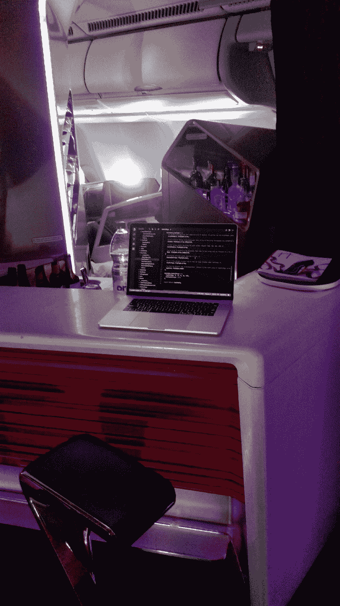
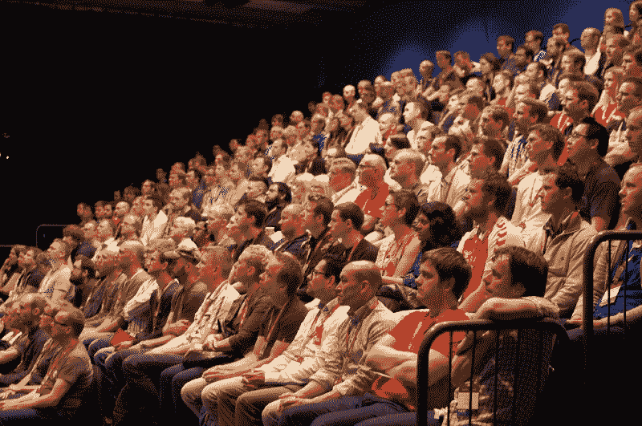
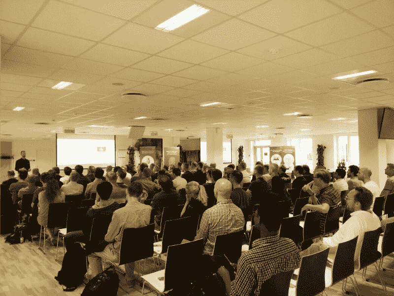
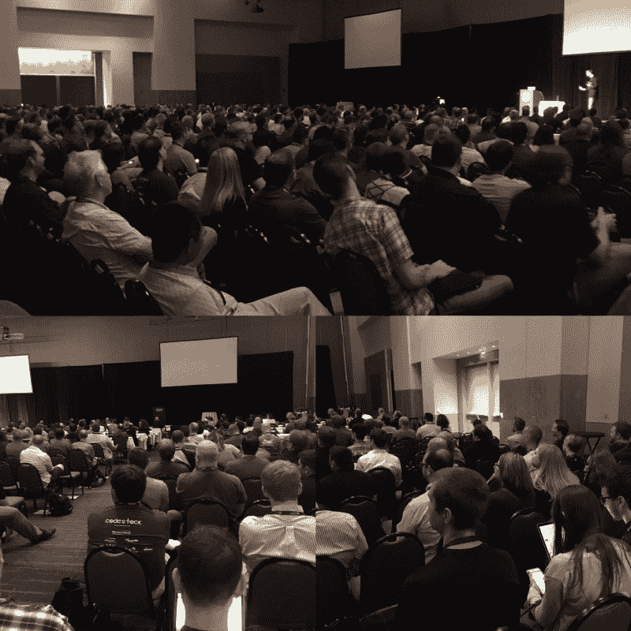
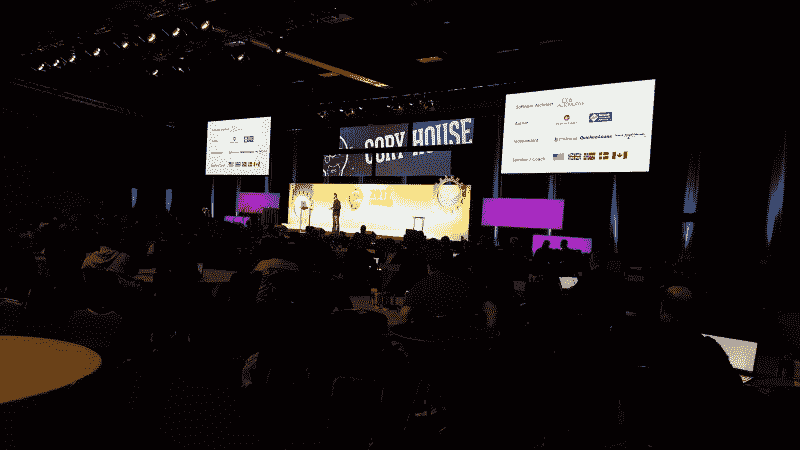

# 公开演讲改变了我的生活…也能改变你的生活

> 原文：<https://www.freecodecamp.org/news/public-speaking-transformed-my-life-and-can-change-yours-too-ca8acdbcc188/>

#### 从 40，000 英尺的高空呼唤扬声器

我在一个漂浮在格陵兰某处的酒吧里写下这些。我刚刚享用了一顿免费的三道菜餐，还有葡萄酒、芝士蛋糕、茶和百利甜酒。午饭后，我在伦敦一个会议结束后回家的路上，在大西洋上空以每小时 500 英里的速度飞驰时，完成了我新的 Pluralsight 课程的编辑。

我坐在这里写了这篇文章:

Coding from the bar on a Virgin Atlantic intercontinental flight — so cool!

享受这样的生活，我感到说不出的幸运。尤其是考虑到我没有为这次经历付出一毛钱。怎么会？

我在一个软件会议上讲了几个小时。

我写这个不是为了吹牛。我写这封信是邀请你。

任何人都有这个机会。五年前，我从未在会议上发言。事实上，我从来没有对任何规模的团体说过话。像大多数人一样，我发现对着一群人讲话的前景令人恐惧…

[https://www.youtube.com/embed/yQ6giVKp9ec?feature=oembed](https://www.youtube.com/embed/yQ6giVKp9ec?feature=oembed)

但是我不仅仅被公开演讲吓倒。那时，我正与普遍的社交焦虑作斗争。我觉得在会议上和陌生人闲聊的想法很可怕。奇怪吧。总之，我经常避免社交场合。我在一个贝壳里。我被卡住了。

#### 追逐恐惧。选你自己。

我是怎么到这里的？我追逐我的恐惧。我为我的团队安排了一次午餐和学习。你也可以这样做。没什么大不了的。点些披萨。要求你的老板支付它。如果他/她不愿意，扔掉这 40 美元，自己去买。

不要坐以待毙。选你自己。

这一简单、低风险的步骤开启了一段旅程。走向恐惧的那一小步就是我在国际航班上的一个酒吧写下这篇文章的原因。谁预见到了？！

当然，我忽略了中间的许多步骤。在我的工作岗位上演讲之后，我开始在当地的用户群中演讲，然后是地区会议。在我鼓起勇气去海外演讲之前，我在全美十几个会议上做了演讲。但是第一顿午餐和学习就完全不同了。

我意识到两件事:

1.  我没死。
2.  事实上，我很喜欢演讲，因为我非常关心这个话题。

令人惊讶的是，我被迷住了。从那以后，我已经在全球的软件会议上发表了超过 100 场的演讲

Crowd at my “Becoming an Outlier” talk at NDC Oslo, Norway 2014

NNIT, Copenhagen, Denmark 2016

Codestock 2016 keynote

Codemash 2017

#### 改善沟通=良性循环

你能做出的最强有力的改变之一:将你最大的弱点转化为你最大的优势。沟通不是你的强项？这正是你需要开始说话的原因。

公开演讲不仅能从根本上提高沟通技巧。它提高了自信。这让我成为一个更好的作家。更深刻的思考者。更好的老师。更好的经理。更好的丈夫。一个更好的父亲。

交流是你人生经历的基础。我用公开演讲来征服我不合逻辑的恐惧，打破我的外壳。说得太多的奇怪后果是:我现在对着数百人讲话就像 1:1 喝啤酒一样舒服。

> 如果某件事很难，那就多做几次。

哦，相信我，一旦你习惯了向一屋子 100 个持怀疑态度的开发人员推销你的想法，那么向几个高管推销你的想法压力会小得惊人。:)

#### 放弃冒名顶替综合症

我对这条信息经常得到相同的回应感到沮丧:

> “我不会说话。我不是专家。我还在学习。”

我们都还在学习。

过度的谦逊是一种恶习。这是一个借口——一种隐藏的形式。你不需要成为最好的帮助别人的人。你只需要知道一些他们不知道的事情。就是这样。

刚刚开始？教授你想更好了解的介绍性话题。

在利基市场有深度。传授你的力量。

> 在一个专业化的世界里，有无数人在你有深度的地方很浅。

#### 我对你的挑战

如果你从未说过话，那就迈出第一步，在工作午餐时进行简短的交谈。要得到你从未拥有的，你必须做你从未做过的。

下面是我的入门秘诀。

是的，很吓人。是的，值得。

> “恐惧的背后是什么？没什么。”—杰米·福克斯

[Cory House](https://twitter.com/housecor) 是关于 JavaScript、React、clean code、[多门课程的作者。NET，以及 Pluralsight](http://pluralsight.com/author/cory-house) 上的更多内容。他是 reactjsconsulting.com[公司的首席顾问，微软 MVP 公司 VinSolutions 的软件架构师，在国际上培训软件开发人员，如前端开发和干净编码。Cory 在 Twitter 上以](http://www.reactjsconsulting.com) [@housecor](http://www.twitter.com/housecor) 的身份发关于 JavaScript 和前端开发的推文。