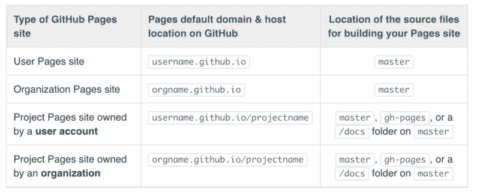
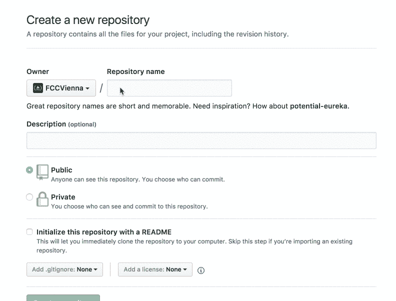
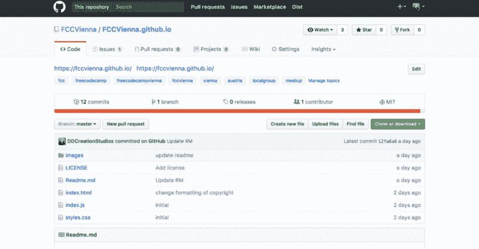
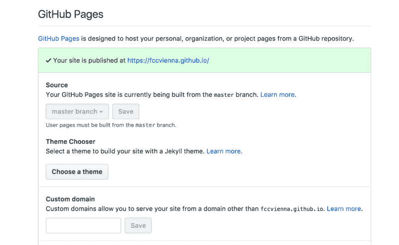
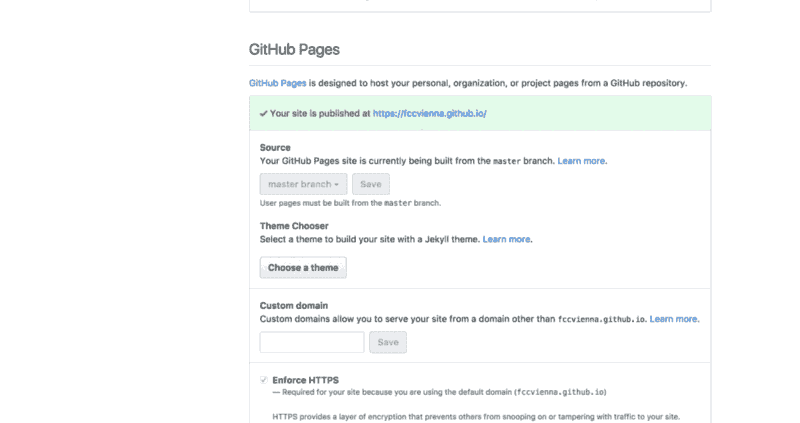

# 在 GitHub 页面上发布组织主页

> 原文：<https://www.freecodecamp.org/news/publishing-an-organization-homepage-on-github-pages-347dbd700f4e/>

丹尼尔·多伊奇

# 在 GitHub 页面上发布组织主页

[https://fccvienna.github.io/](https://fccvienna.github.io/)

我正在组织一个叫做[自由代码营](https://www.meetup.com/Free-Code-Camp-Vienna/)的自由代码营的当地团体聚会。几个月前，我们决定创建一个简单的主页来代表该小组及其在线进展。但是我们似乎从来没有找到时间去做这件事。

遵循“快速主页比没有主页好”的想法，我决定创建一个主页并发布在 GitHub 页面上。它允许我们托管我们的静态页面，也是一个完美的例子，说明在网上发布东西是多么容易。

> *“机会不会来敲门。当你敲门的时候，他们就出现了！”*

> *—格雷格·普利特*

### 命名您的存储库

发布到 GitHub 页面时，选择正确的存储库名称至关重要。

[GitHub 的这一页](https://help.github.com/articles/user-organization-and-project-pages/)完美地解释了这一点:

您需要像组织一样以“. github.io”结尾来命名存储库:

### 建立你的主页

创建存储库后，用 HTML、CSS 和 JavaScript 创建你的主页。

**提示**:我在开发的时候用的是 [CodePen](https://codepen.io/ddcreationstudios/pen/yogdXX) 。它就是 [REPL](https://stackoverflow.com/questions/13603021/what-is-a-repl-in-javascript) (读取-评估-打印循环)。这允许您从正在编写的代码中获得即时反馈。

为了加快布局过程和添加酷的功能，我使用了[物化](http://materializecss.com/getting-started.html)。我过去用过它，对结果一直很满意。

### 把你的代码放到 Github 上

接下来，按照说明把你的文件放到 GitHub 上。

**确保你的“主”分支上有文件**

并为主分支选择 GitHub 页面的来源。

### 设置 GitHub 页面的来源

您的设置应该如下所示:

### 在提供的链接上看到你令人惊叹的主页

遵循提供的链接，或者在地址栏中键入您的组织名称和“. github.io”。

### 查看维也纳自由代码营的结果

[https://fccvienna.github.io/](https://fccvienna.github.io/)

### 在 YouTube 上查看构建过程

[此处可用的 github rest](https://github.com/DDCreationStudios/fccvienna.github.io)

感谢阅读我的文章！欢迎留下任何反馈！